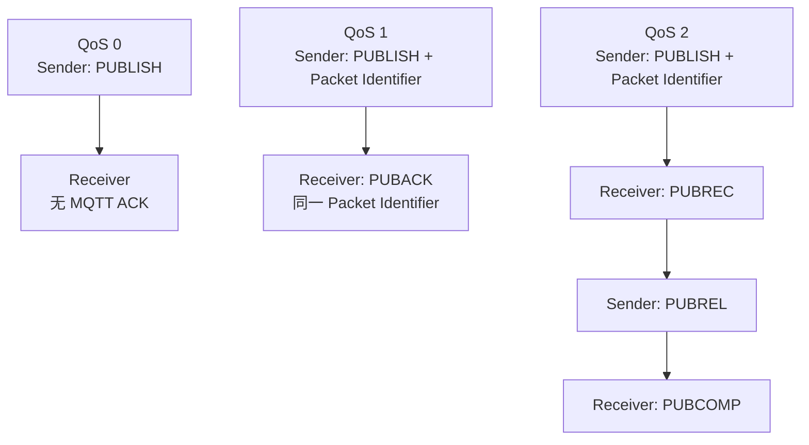
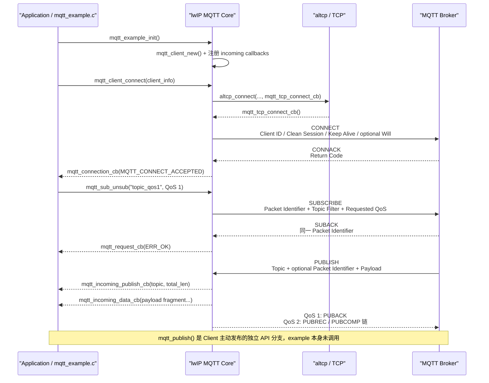
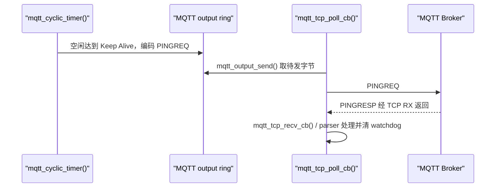
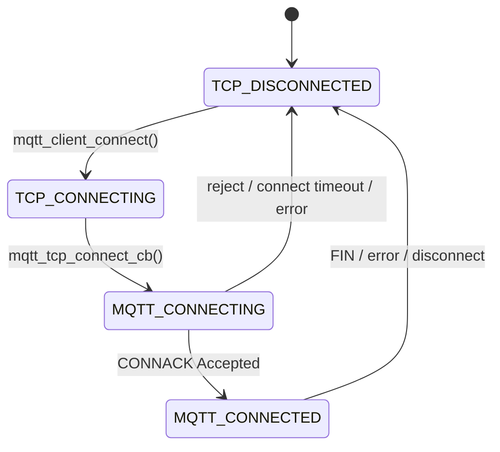
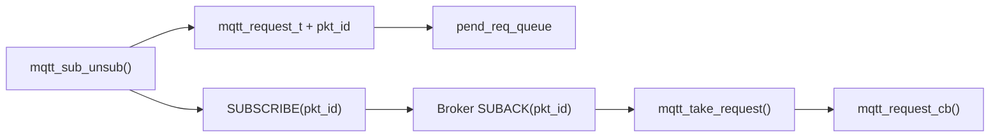
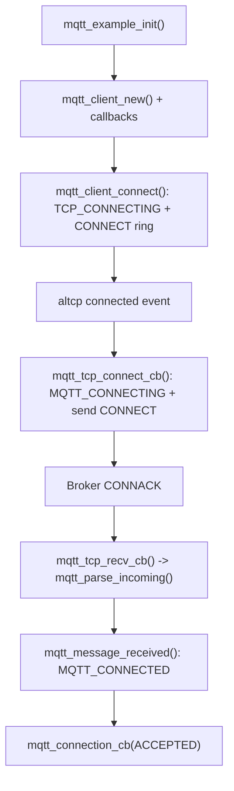
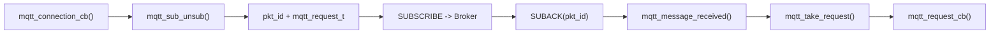
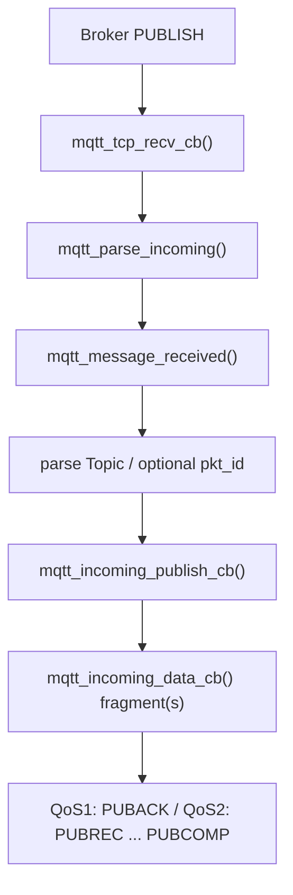

<meta name="referrer" content="no-referrer" />

# 教程 34：MQTT 从协议流程到 lwIP 源码——连接、订阅、发布与回调链

> 摘要：从 MQTT 的发布订阅模型、会话建立、消息确认与异常掉线机制入门，再把每个协议动作逐步映射到 lwIP MQTT 的真实源码与回调链。

[TOC]

MQTT（Message Queuing Telemetry Transport，消息队列遥测传输协议）是一种面向发布/订阅模型的应用层消息协议。连接到消息系统的程序或设备称为 **Client（客户端）**，负责集中接收、匹配和转发消息的服务称为 **Broker（消息代理服务器）**，消息使用 **Topic（主题）** 作为路由名称。Client 通常通过 TCP 这类可靠字节流连接 Broker，而不是直接寻找另一个订阅者建立点对点消息通道。[S5](#source-s5)[S8](#source-s8)

本篇面向第一次接触 MQTT 的读者：先把发布/订阅关系、控制报文、消息确认、连接保活和异常掉线通知这些机制讲清楚，再沿一次真实会话把协议动作映射到 lwIP 源码。目标源码是项目固定的 lwIP 2.2.2 development snapshot；其 `mqtt_client_connect()` 写入 Protocol Level `4`，对应 MQTT 3.1.1，因此正文以 MQTT 3.1.1 为协议基线。[S2](#source-s2)[S5](#source-s5)

本文还会说明连接保活与异常掉线通知机制**是什么、何时写入协议、在 lwIP 源码中的入口在哪里**；更深入的定时器异常处理、TLS、断线清理与 reconnect/resubscribe 生命周期继续放在 Stage 35 深挖。

正文源码均来自项目固定的 lwIP 2.2.2 development snapshot。为避免大段 Doxygen 注释打断调用链，部分代码块会删除原注释或调试输出，但不使用 `...`、`/* ... */` 等占位符伪装成连续源码；凡是只截取函数中部的连续片段，正文会先明确当前函数和截取范围。

## 0. 建议提前阅读的资料

下面几份资料建议在阅读源码前先浏览。它们不是理解本文的强制前置——正文仍会把当前调用链需要的协议语义讲完整——但先看一遍可以更快建立全局概念。

| 建议顺序 | 资料 | 建议重点 | 作用 |
| --- | --- | --- | --- |
| 1 | [Introducing the MQTT Protocol – MQTT Essentials: Part 1](https://www.hivemq.com/blog/mqtt-essentials-part-1-introducing-mqtt/) | Client（客户端）、Broker（消息代理）、发布/订阅（Publish/Subscribe）、Topic（主题）的基本关系 | 面向初学者，先建立“MQTT 为什么不是点对点发消息”的直觉 [S8](#source-s8) |
| 2 | [MQTT Essentials – All The Core Concepts & Basics Explained](https://www.hivemq.com/mqtt/) | QoS（服务质量等级）、Persistent Session（持久会话）、Retained Message（保留消息）、Last Will（遗嘱消息）等专题入口 | 遇到某个概念想进一步展开时，适合作为索引 [S9](#source-s9) |
| 3 | [MQTT Version 3.1.1 – OASIS Standard](https://docs.oasis-open.org/mqtt/mqtt/v3.1.1/os/mqtt-v3.1.1-os.html) | Control Packet（控制报文）格式，以及连接、订阅、发布和 QoS（服务质量等级）相关报文 | 当前 lwIP 实现对应的权威协议依据；适合查字段与规范语义 [S5](#source-s5) |
| 4 | [lwIP 2.1.x MQTT client API](https://www.nongnu.org/lwip/2_1_x/group__mqtt.html) | `mqtt_client_connect()`、`mqtt_subscribe()`、`mqtt_publish()` 与回调（callback） | 先从公开 API 看“应用能做什么”，再下钻项目固定源码 [S10](#source-s10) |

阅读顺序上，**先读概念型资料，再把 OASIS 标准当字典查**，通常比从规范第一页顺序读到最后更适合第一次学习。本文后面每遇到一个真正影响控制流的协议对象，仍会在源码旁重新解释其作用，避免“看过链接才读得懂源码”。

## 1. 先把 MQTT 协议讲明白：后面的源码到底在实现什么

### 1.1 Client 与 Broker：MQTT 不是“设备 A 直接发给设备 B”

MQTT 的基本参与者只有两类：

- **Client（客户端）**：连接到 Broker 的程序或设备。一个 Client 可以同时发布和订阅，因此 **Publisher（发布者）** / **Subscriber（订阅者）** 不是固定设备身份，而是某一次操作中的角色。
- **Broker（消息代理服务器）**：所有 Client 都与 Broker 建立连接。Broker 接收 Client 的 PUBLISH，再根据订阅关系把消息转发给匹配的 Client。[S5](#source-s5)[S8](#source-s8)

假设温度传感器发布 `factory/line1/temp`，上位机订阅同一主题，真实关系是：


这里有三个第一次必须区分的名词：

- **Topic Name（主题名）**：PUBLISH 携带的路由名称，例如 `factory/line1/temp`。
- **Topic Filter（主题过滤器）**：SUBSCRIBE 使用的匹配表达式，可以是具体主题，也可以包含通配符。当前 lwIP example 使用具体字符串，因此本文不展开通配符规则。
- **Payload（应用负载）**：真正要传输的应用数据。MQTT 本身不要求 payload 必须是 JSON 或字符串；对协议而言它只是字节序列。[S5](#source-s5)

因此 MQTT 的核心不是“发送一个字符串”，而是 **Client 与 Broker 先建立会话，再通过 Topic 建立发布/订阅路由关系**。

### 1.2 Control Packet：CONNECT、SUBSCRIBE、PUBLISH 都是 MQTT 控制报文

MQTT 在线路上传输的基本协议单位叫 **MQTT Control Packet（MQTT 控制报文）**。例如 **CONNECT（连接请求）**、**CONNACK（连接确认）**、**SUBSCRIBE（订阅请求）**、**SUBACK（订阅确认）**、**PUBLISH（发布消息）**、**PUBACK（QoS 1 发布确认）**、**PINGREQ（保活请求）** 都属于 Control Packet。[S5](#source-s5)

MQTT 3.1.1 的 Control Packet 可以先抽象成三部分：

```text
+----------------------+-----------------------------------+
| Fixed Header         | 所有 MQTT Control Packet 都有      |
+----------------------+-----------------------------------+
| Variable Header      | 是否存在、字段内容取决于报文类型   |
+----------------------+-----------------------------------+
| Payload              | 是否存在、内容取决于报文类型       |
+----------------------+-----------------------------------+
```

**Fixed Header（固定报头）**至少包含两类信息：第一字节给出 Control Packet Type，并为 PUBLISH 等报文携带 **DUP（重复发送标志）**、**QoS（服务质量等级）**、**RETAIN（保留消息标志）**；随后是 **Remaining Length（剩余长度）**，表示 Fixed Header 之后还有多少字节。Remaining Length 使用 MQTT 自己的变长编码，因此 TCP 收到几个字节不能直接等价为“收到一整个 MQTT 报文”。这正是后文 `mqtt_parse_incoming()` 必须存在的原因。[S5](#source-s5)

**Variable Header（可变报头）**和 **Payload（负载）**随报文类型变化。例如：

| Control Packet | Variable Header / Payload 中当前最重要的内容 |
| --- | --- |
| CONNECT | Protocol Name/Level、Connect Flags、Keep Alive（保活秒数）；Payload 中有 Client Identifier（客户端标识），并可带 Will（遗嘱消息）、用户名、密码 |
| CONNACK | Session Present（Broker 是否存在旧会话状态的标志）与 Connect Return Code（连接返回码） |
| SUBSCRIBE | Packet Identifier（用于关联请求与响应的报文标识符）+ Topic Filter + 请求的 QoS |
| SUBACK | 与 SUBSCRIBE 相同的 Packet Identifier + 每个订阅项的返回结果 |
| PUBLISH | Topic Name；QoS 1/2 时再带 Packet Identifier；后面是应用 Payload |

后面读 lwIP 源码时，`mqtt_output_append_fixed_header()`、`mqtt_output_append_string()`、`mqtt_parse_incoming()` 其实就是在把这些协议字段与内存中的 C 结构互相转换。

### 1.3 QoS：它描述“这条 PUBLISH 用什么确认流程”，不是 TCP 的可靠性等级

**QoS（Quality of Service，服务质量等级）**是 MQTT 为消息交付定义的协议级确认语义。它和 TCP 重传不是同一个概念：TCP 负责字节流可靠到达对端主机，MQTT QoS 负责一条 PUBLISH 在 Client/Broker 协议层是否需要确认、确认到哪一步。[S5](#source-s5)[S9](#source-s9)

MQTT 3.1.1 有三个 QoS 等级：

| QoS | 协议语义 | PUBLISH 后的 MQTT 确认 | Packet Identifier |
| ---: | --- | --- | --- |
| 0 | At most once，至多一次 | 无 MQTT ACK | PUBLISH 中没有 |
| 1 | At least once，至少一次 | `PUBLISH -> PUBACK` | 有 |
| 2 | Exactly once，恰好一次 | `PUBLISH -> PUBREC -> PUBREL -> PUBCOMP` | 有 |

三条流程放在一起看最清楚：



这里第一次出现的 **Packet Identifier（报文标识符）** 是一个 16-bit、非 0 的协议编号，用来把异步请求和响应关联起来。它不是 Topic ID，也不是 TCP Sequence Number。对于当前文章最重要的两类场景：

- SUBSCRIBE 带 Packet Identifier，Broker 的 SUBACK 回同一个编号；
- QoS 1/2 PUBLISH 带 Packet Identifier，PUBACK 或 QoS 2 的 PUBREC/PUBREL/PUBCOMP 沿同一编号推进。[S5](#source-s5)

后文会看到 lwIP 用 `msg_generate_packet_id()` 生成它，再用 `mqtt_request_t` 与 `pend_req_queue` 把 `pkt_id -> callback` 保存下来。也就是说，**Packet Identifier 是协议概念，request queue 是 lwIP 对这个协议概念的内存实现。**

### 1.4 Keep Alive：不是 TCP Keepalive，而是 MQTT 会话的空闲检测约定

**Keep Alive（保活时间）**是 Client 在 CONNECT 中告诉 Broker 的一个秒数。MQTT 3.1.1 要求 Client 在没有其他 Control Packet 可发送时，不能让连续两次发送 Control Packet 的间隔超过 Keep Alive；因此空闲时 Client 会发送 PINGREQ，Broker 返回 PINGRESP。Broker 在超过约 1.5 倍 Keep Alive 仍没有收到 Client 的 Control Packet 时，可以判定连接失活并断开。[S5](#source-s5)

它与 TCP keepalive 不是一回事：TCP keepalive 属于传输层；MQTT Keep Alive 属于应用层协议，会产生明确的 PINGREQ/PINGRESP Control Packet。

当前 example 把 `keep_alive` 配成 `100` 秒。后文 `mqtt_client_connect()` 会把 `00 64` 写入 CONNECT，`mqtt_cyclic_timer()` 则是 lwIP 后续发送 PINGREQ 与检测 server watchdog 的实现入口。[S1](#source-s1)[S2](#source-s2)

### 1.5 Will：不是 Client 断线时自己再发一条消息，而是提前托管给 Broker

**Will（遗嘱消息，常称 Last Will and Testament / LWT）**用于处理 Client 异常掉线。Client 在 CONNECT 时把 Will Topic、Will Payload、Will QoS、Will Retain 交给 Broker；如果连接后来异常终止，Broker 按约定代替该 Client 发布 Will。正常发送 DISCONNECT 的场景不应把 Will 当成普通“下线通知”自动发布。[S5](#source-s5)[S9](#source-s9)

这点非常重要：Will 的数据是在 **CONNECT 阶段预先注册**，不是网络已经断了之后设备再尝试发送。因此后文 `mqtt_client_connect()` 在真正连接前就要根据 `will_topic` / `will_msg` 计算 CONNECT 长度和 Connect Flags。

当前 upstream example 的 `will_topic` 与 `will_msg` 都是 `NULL`，所以这条分支不会进入；文章仍会在源码第一次看到这些字段时指出它们如何映射到 CONNECT。

### 1.6 Clean Session：决定 Broker 是否把旧会话状态继续留给这个 Client

**Clean Session（清理会话）**是 MQTT 3.1.1 CONNECT Flags 中的会话状态选择。设置为 1 时，Client 要求从新的会话开始，Broker 不应依赖此前保存的该 Client 会话状态；设置为 0 时，协议允许围绕 Client Identifier 保留会话相关状态。[S5](#source-s5)

当前 lwIP `mqtt_client_connect()` 直接设置 `MQTT_CONNECT_FLAG_CLEAN_SESSION`，因此这份实现的正常使用方式不能假设断线重连后 Broker 仍保留旧订阅。Stage 35 讨论 reconnect/resubscribe 时会再次用到这个结论。[S2](#source-s2)

### 1.7 Retain：它控制 Broker 是否保存“最后一条发布值”，与 QoS 是两个维度

**Retain（保留消息标志）**是 PUBLISH Fixed Header 的一个标志。发布方设置 Retain 后，Broker 可以为该 Topic 保存一条 retained message，使后续新订阅者建立订阅时能够立即得到该保留值。[S5](#source-s5)[S9](#source-s9)

Retain 与 QoS 不应混淆：QoS 解决当前 PUBLISH 的确认流程；Retain 解决 Broker 是否保留这条消息供未来订阅者使用。后文 `mqtt_publish(..., qos, retain, ...)` 会同时出现这两个参数。

## 2. 一次完整 MQTT 会话：先看协议流程，再看每一步落在哪个 lwIP 函数

前面的名词现在可以串成一条真实会话。当前 lwIP example 的实际配置是：Client ID=`"test"`、Keep Alive=`100 s`、无 username/password、无 Will、使用未套 TLS 的普通 MQTT/TCP 传输；CONNACK Accepted 后订阅 `topic_qos1` 和 `topic_qos0`。example 本身没有主动调用 `mqtt_publish()`，因此“Client 主动发布”会作为同一 MQTT Core 的独立 API 分支说明。[S1](#source-s1)

这里还会出现 `altcp`。它是 lwIP 在 TCP 之上提供的可叠加传输抽象，使 MQTT Core 可以通过同一组接口承载普通 TCP，或在后续 Stage 35 中套上 TLS；当前 example 走普通 TCP。

下面这张时序图是全文的协议导航图。左侧是应用与 lwIP 源码入口，右侧是线上真正出现的 MQTT Control Packet：



如果只看源码函数名，很容易失去“当前到底在处理哪个协议动作”。因此后文固定使用下面这张映射表：

| 协议阶段 | 线上 Control Packet | lwIP 主要函数 | 关键状态/对象 | 应用可见结果 |
| --- | --- | --- | --- | --- |
| 准备连接 | 还没有 MQTT 报文 | `mqtt_example_init()`、`mqtt_client_new()`、`mqtt_set_inpub_callback()` | 创建 `mqtt_client_t`、保存 callback | 无 |
| 建立会话 | Client→Broker `CONNECT` | `mqtt_client_connect()`、`mqtt_output_append_fixed_header()`、`mqtt_tcp_connect_cb()` | `TCP_CONNECTING -> MQTT_CONNECTING` | 等待连接结果 |
| Broker 接受/拒绝 | Broker→Client `CONNACK` | `mqtt_tcp_recv_cb()`、`mqtt_parse_incoming()`、`mqtt_message_received()` | Accepted 时进入 `MQTT_CONNECTED` | `mqtt_connection_cb()` |
| 建立订阅 | `SUBSCRIBE -> SUBACK` | `mqtt_sub_unsub()`、`msg_generate_packet_id()`、request queue、`mqtt_message_received()` | `pkt_id` 关联 request | `mqtt_request_cb()` |
| Client 主动发布 | `PUBLISH` + QoS ACK 链 | `mqtt_publish()`、`mqtt_message_received()` | QoS>0 时保存 pending request（等待协议确认的请求记录） | publish request callback |
| Broker 下发消息 | Broker→Client `PUBLISH` | `mqtt_parse_incoming()`、`mqtt_message_received()` | Topic、`inpub_pkt_id`、payload fragments | `mqtt_incoming_publish_cb()` + `mqtt_incoming_data_cb()` |
| 空闲保活 | `PINGREQ -> PINGRESP` | `mqtt_cyclic_timer()`、`mqtt_message_received()` | Keep Alive counter/watchdog | 通常无业务 callback |

从下一节开始，正文按这张表的顺序进入真实源码。每一个协议报文第一次真正影响源码控制流时，再就地解释它的字段如何落到 C 变量和状态对象中。

## 3. 源码入口：`mqtt_example_init()` 如何把应用接到 MQTT Core

upstream example 的真实入口是 `mqtt_example_init()`。它没有创建单独的 MQTT 线程，而是在调用它的 lwIP Core context（lwIP 核心执行上下文）中完成三件事：分配 `mqtt_client_t`、绑定 Broker→Client PUBLISH 的两个回调、调用 `mqtt_client_connect()` 发起连接。[S1](#source-s1)

```c
void
mqtt_example_init(void)
{
#if LWIP_TCP
  mqtt_client = mqtt_client_new();

  mqtt_set_inpub_callback(mqtt_client,
          mqtt_incoming_publish_cb,
          mqtt_incoming_data_cb,
          LWIP_CONST_CAST(void*, &mqtt_client_info));

  mqtt_client_connect(mqtt_client,
          &mqtt_ip, MQTT_PORT,
          mqtt_connection_cb, LWIP_CONST_CAST(void*, &mqtt_client_info),
          &mqtt_client_info);
#endif /* LWIP_TCP */
}
```

这里已经出现两组不同职责的 callback，后文不能混在一起：

- `mqtt_connection_cb`：连接结果与后续断线通知；它通过 `mqtt_client_connect()` 注册。
- `mqtt_incoming_publish_cb` + `mqtt_incoming_data_cb`：Broker 发来的 PUBLISH 的 Topic 与 payload；它们通过 `mqtt_set_inpub_callback()` 注册。[S1](#source-s1)[S3](#source-s3)

先进入 `mqtt_client_new()`。它只分配并清零一个 `mqtt_client_t`：[S2](#source-s2)

```c
mqtt_client_t *
mqtt_client_new(void)
{
  LWIP_ASSERT_CORE_LOCKED();
  return (mqtt_client_t *)mem_calloc(1, sizeof(mqtt_client_t));
}
```

返回 `mqtt_example_init()` 后，下一条语句进入 `mqtt_set_inpub_callback()`，把两个入站回调及应用参数写入 client：[S2](#source-s2)

```c
void
mqtt_set_inpub_callback(mqtt_client_t *client, mqtt_incoming_publish_cb_t pub_cb,
                        mqtt_incoming_data_cb_t data_cb, void *arg)
{
  LWIP_ASSERT_CORE_LOCKED();
  LWIP_ASSERT("mqtt_set_inpub_callback: client != NULL", client != NULL);
  client->data_cb = data_cb;
  client->pub_cb = pub_cb;
  client->inpub_arg = arg;
}
```

`mqtt_client_t` 不是一个只保存 socket/PCB 的薄 handle。它同时保存连接状态、Packet Identifier 生成器、pending request（等待响应的请求记录）、入站 parser（流式解析器）、出站 ring buffer（循环缓冲区）和应用回调，因此后文看到的 MQTT 会话状态都汇聚在同一个对象中：[S4](#source-s4)

```c
struct mqtt_client_s
{
  u16_t cyclic_tick;
  u16_t keep_alive;
  u16_t server_watchdog;
  u16_t pkt_id_seq;
  u16_t inpub_pkt_id;
  u8_t conn_state;
  struct altcp_pcb *conn;
  void *connect_arg;
  mqtt_connection_cb_t connect_cb;
  struct mqtt_request_t *pend_req_queue;
  struct mqtt_request_t req_list[MQTT_REQ_MAX_IN_FLIGHT];
  void *inpub_arg;
  mqtt_incoming_data_cb_t data_cb;
  mqtt_incoming_publish_cb_t pub_cb;
  u32_t msg_idx;
  u8_t rx_buffer[MQTT_VAR_HEADER_BUFFER_LEN];
  struct mqtt_ringbuf_t output;
};
```

至此仍没有任何 MQTT 字节发到网络。`mqtt_example_init()` 最后一条调用才进入真正的连接入口 `mqtt_client_connect()`。

## 4. 协议步骤 1：`mqtt_client_connect()` 构造 CONNECT 所需的会话参数

### 4.1 先看调用方传进来的 `mqtt_client_info`：协议概念先落到配置字段

在进入 `mqtt_client_connect()` 之前，先看 upstream example 实际传入的连接参数。这样后面看到 `client_info->keep_alive`、`will_topic` 或 `client_id` 时，不需要再猜这些字段来自哪里。[S1](#source-s1)

```c
static const struct mqtt_connect_client_info_t mqtt_client_info =
{
  "test",
  NULL, /* user */
  NULL, /* pass */
  100,  /* keep alive */
  NULL, /* will_topic */
  NULL, /* will_msg */
  0,    /* will_msg_len */
  0,    /* will_qos */
  0     /* will_retain */
#if LWIP_ALTCP && LWIP_ALTCP_TLS
  , NULL
#endif
};
```

这组字段与前面的协议概念是一一对应的：

| `mqtt_connect_client_info_t` 字段 | 当前值 | 协议意义 |
| --- | --- | --- |
| `client_id` | `"test"` | Client Identifier，用于让 Broker 识别当前 MQTT Client |
| `client_user` / `client_pass` | `NULL` | 当前 example 不在 CONNECT 中携带用户名和密码 |
| `keep_alive` | `100` | Keep Alive=100 秒，会编码到 CONNECT 的 Variable Header |
| `will_topic` / `will_msg` | `NULL` | 当前 example 不注册 Will，因此 Connect Flags 中 Will Flag=0 |
| `will_qos` / `will_retain` | `0` | 只有启用 Will 时才有意义 |
| `tls_config` | `NULL` | 当前 example 使用普通 TCP；TLS 留到 Stage 35 |

这张表先把“协议参数 → C 字段”固定下来。下面进入 `mqtt_client_connect()`，观察这些字段如何进一步变成 Connect Flags、Remaining Length 和最终 CONNECT 字节。

`mqtt_client_connect()` 的第一段先验证 client 处于 `TCP_DISCONNECTED`。随后它暂存入站 PUBLISH 回调，清零整个 `mqtt_client_t`，再恢复这三个字段；connection callback、Keep Alive、request pool 则按这次连接重新初始化。[S2](#source-s2)

```c
err_t
mqtt_client_connect(mqtt_client_t *client, const ip_addr_t *ip_addr, u16_t port, mqtt_connection_cb_t cb, void *arg,
                    const struct mqtt_connect_client_info_t *client_info)
{
  err_t err;
  size_t len;
  u16_t client_id_length;
  u16_t remaining_length = 2 + 4 + 1 + 1 + 2;
  u8_t flags = 0, will_topic_len = 0, will_msg_len = 0;
  u16_t client_user_len = 0, client_pass_len = 0;
  mqtt_incoming_data_cb_t data_cb;
  mqtt_incoming_publish_cb_t pub_cb;
  void *inpub_arg;

  LWIP_ASSERT_CORE_LOCKED();
  LWIP_ASSERT("mqtt_client_connect: client != NULL", client != NULL);
  LWIP_ASSERT("mqtt_client_connect: ip_addr != NULL", ip_addr != NULL);
  LWIP_ASSERT("mqtt_client_connect: client_info != NULL", client_info != NULL);
  LWIP_ASSERT("mqtt_client_connect: client_info->client_id != NULL", client_info->client_id != NULL);

  if (client->conn_state != TCP_DISCONNECTED) {
    LWIP_DEBUGF(MQTT_DEBUG_WARN, ("mqtt_client_connect: Already connected\n"));
    return ERR_ISCONN;
  }

  data_cb = client->data_cb;
  pub_cb = client->pub_cb;
  inpub_arg = client->inpub_arg;
  memset(client, 0, sizeof(mqtt_client_t));
  client->data_cb = data_cb;
  client->pub_cb = pub_cb;
  client->inpub_arg = inpub_arg;

  client->connect_arg = arg;
  client->connect_cb = cb;
  client->keep_alive = client_info->keep_alive;
  mqtt_init_requests(client->req_list, LWIP_ARRAYSIZE(client->req_list));
```

这段源码建立了两个不同生命周期：`pub_cb/data_cb/inpub_arg` 属于 client 级入站处理配置，connect 前后保留；`connect_cb`、request pool、parser/TX 状态属于本次 connection，重新开始。[S2](#source-s2)[S4](#source-s4)

### 4.2 Will 如何进入 CONNECT：协议里的“提前托管”在源码中就是 flags + payload

当前 example 没有启用 Will，但 `mqtt_client_connect()` 的真实实现必须处理它。继续阅读函数中的 Will 分支：[S2](#source-s2)[S5](#source-s5)

```c
  if (client_info->will_topic != NULL && client_info->will_msg != NULL) {
    flags |= MQTT_CONNECT_FLAG_WILL;
    flags |= (client_info->will_qos & 3) << 3;
    if (client_info->will_retain) {
      flags |= MQTT_CONNECT_FLAG_WILL_RETAIN;
    }
    len = strlen(client_info->will_topic);
    LWIP_ERROR("mqtt_client_connect: client_info->will_topic length overflow", len <= 0xFF, return ERR_VAL);
    LWIP_ERROR("mqtt_client_connect: client_info->will_topic length must be > 0", len > 0, return ERR_VAL);
    will_topic_len = (u8_t)len;
    if (client_info->will_msg_len == 0)
    {
        len = strlen(client_info->will_msg);
        LWIP_ERROR("mqtt_client_connect: client_info->will_msg length overflow", len <= 0xFF, return ERR_VAL);
        will_msg_len = (u8_t)len;
    }
    else
    {
        will_msg_len = client_info->will_msg_len;
    }
    len = remaining_length + 2 + will_topic_len + 2 + will_msg_len;
    LWIP_ERROR("mqtt_client_connect: remaining_length overflow", len <= 0xFFFF, return ERR_VAL);
    remaining_length = (u16_t)len;
  }
```

这段代码正好把第 1.5 节的协议语义落到实现：

1. `MQTT_CONNECT_FLAG_WILL` 告诉 Broker 这次 CONNECT 携带 Will；
2. `will_qos` 和 `will_retain` 被编码进 Connect Flags，决定 Broker 将来代发 Will 时采用的 QoS 与 Retain 语义；
3. `will_topic` 与 `will_msg` 本身进入 CONNECT Payload，因此函数必须提前把两者长度计入 `remaining_length`；
4. 当前 example 两个指针都是 `NULL`，所以这一分支完全跳过，最终 CONNECT 不含 Will。

这也说明为什么“Will 是掉线后设备自己再发送一条消息”的理解是错误的：真正的设备源码是在 **连接建立之前** 就把 Will 信息放进 CONNECT，后续由 Broker 保存并在异常断线条件满足时发布。[S5](#source-s5)

username、password 分支使用相同模式：设置 Connect Flags、增加 Remaining Length、稍后把字段追加到 CONNECT Payload。当前 example 同样不进入这两个分支。

### 4.3 CONNECT 到底要让 Broker 知道什么

CONNECT 是 Client 在 TCP/altcp transport 建立后发送给 Broker 的第一类 MQTT Control Packet。当前主链只依赖下面几个字段：[S5](#source-s5)

| 字段 | 当前路径中的作用 | lwIP 映射 |
| --- | --- | --- |
| Protocol Name + Level | 声明使用 MQTT 3.1.1 | `"MQTT"` + `4` |
| Connect Flags | Clean Session、Will、username/password 是否存在 | `flags` |
| Keep Alive | 会话空闲检测参数 | `client_info->keep_alive` |
| Client Identifier | Broker 识别这个 client 的标识 | `client_info->client_id` |
| Will / user / pass | 仅配置时进入 CONNECT payload | `mqtt_connect_client_info_t` 对应字段 |

当前实现无条件设置 Clean Session：[S2](#source-s2)

```c
  /* Don't complicate things, always connect using clean session */
  flags |= MQTT_CONNECT_FLAG_CLEAN_SESSION;

  len = strlen(client_info->client_id);
  LWIP_ERROR("mqtt_client_connect: client_info->client_id length overflow", len <= 0xFFFF, return ERR_VAL);
  client_id_length = (u16_t)len;
  len = remaining_length + 2 + client_id_length;
  LWIP_ERROR("mqtt_client_connect: remaining_length overflow", len <= 0xFFFF, return ERR_VAL);
  remaining_length = (u16_t)len;

  if (mqtt_output_check_space(&client->output, remaining_length) == 0) {
    return ERR_MEM;
  }
```

这是 lwIP 当前实现策略，不是 MQTT 3.1.1 要求所有 Client 必须使用 Clean Session。其直接后果是 Stage 35 的 reconnect 不能把 Broker 端旧订阅/旧 in-flight（尚未完成协议确认）状态当作可依赖状态。[S2](#source-s2)[S5](#source-s5)

## 5. 协议步骤 1：CONNECT 如何从结构体变成 wire bytes

继续阅读同一个 `mqtt_client_connect()`。在真正构造 CONNECT 字节前，它先创建 transport、绑定本地地址并注册 `mqtt_tcp_connect_cb()`：[S2](#source-s2)

```c
#if LWIP_ALTCP && LWIP_ALTCP_TLS
  if (client_info->tls_config) {
    client->conn = altcp_tls_new(client_info->tls_config, IP_GET_TYPE(ip_addr));
  } else
#endif
  {
    client->conn = altcp_tcp_new_ip_type(IP_GET_TYPE(ip_addr));
  }
  if (client->conn == NULL) {
    return ERR_MEM;
  }

  altcp_arg(client->conn, client);
  err = altcp_bind(client->conn, IP_ADDR_ANY, 0);
  if (err != ERR_OK) {
    goto tcp_fail;
  }

  err = altcp_connect(client->conn, ip_addr, port, mqtt_tcp_connect_cb);
  if (err != ERR_OK) {
    goto tcp_fail;
  }
  altcp_err(client->conn, mqtt_tcp_err_cb);
  client->conn_state = TCP_CONNECTING;
```

`altcp_connect()` 返回 `ERR_OK` 表示 active open 已经启动；此时 MQTT session 尚未建立。函数随后继续执行，把 CONNECT 放进 `client->output`，等待 lower connection callback 到达后发送。[S2](#source-s2)

```c
  mqtt_output_append_fixed_header(&client->output, MQTT_MSG_TYPE_CONNECT, 0, 0, 0, remaining_length);
  mqtt_output_append_string(&client->output, "MQTT", 4);
  mqtt_output_append_u8(&client->output, 4);
  mqtt_output_append_u8(&client->output, flags);
  mqtt_output_append_u16(&client->output, client_info->keep_alive);
  mqtt_output_append_string(&client->output, client_info->client_id, client_id_length);
  if ((flags & MQTT_CONNECT_FLAG_WILL) != 0) {
    mqtt_output_append_string(&client->output, client_info->will_topic, will_topic_len);
    mqtt_output_append_string(&client->output, client_info->will_msg, will_msg_len);
  }
  if ((flags & MQTT_CONNECT_FLAG_USERNAME) != 0) {
    mqtt_output_append_string(&client->output, client_info->client_user, client_user_len);
  }
  if ((flags & MQTT_CONNECT_FLAG_PASSWORD) != 0) {
    mqtt_output_append_string(&client->output, client_info->client_pass, client_pass_len);
  }
  return ERR_OK;
```

这里可以直接看出 CONNECT Payload 的字段顺序：Client Identifier 先写；启用 Will 时再写 Will Topic 与 Will Message；最后才是可选用户名和密码。当前 example 只有 Client Identifier，因此实际 wire bytes 不包含后面三组可选字段。[S2](#source-s2)[S5](#source-s5)

`mqtt_client_connect()` 返回到 `mqtt_example_init()` 后，主流程转为异步：等待 `mqtt_tcp_connect_cb()`。

### 5.1 进入 `mqtt_output_append_fixed_header()`：Control Packet 第一字节与 Remaining Length 如何落到 ring

前面的调用如果只停在函数名，仍看不到 MQTT wire format 怎样形成。继续进入 `mqtt_output_append_fixed_header()`：[S2](#source-s2)[S5](#source-s5)

```c
static void
mqtt_output_append_fixed_header(struct mqtt_ringbuf_t *rb, u8_t msg_type, u8_t fdup,
                                u8_t fqos, u8_t fretain, u16_t r_length)
{
  mqtt_output_append_u8(rb, (((msg_type & 0x0f) << 4) | ((fdup & 1) << 3) | ((fqos & 3) << 1) | (fretain & 1)));
  do {
    mqtt_output_append_u8(rb, (r_length & 0x7f) | (r_length >= 128 ? 0x80 : 0));
    r_length >>= 7;
  } while (r_length > 0);
}
```

第一个字节把 Control Packet Type、DUP、QoS、RETAIN 拼到一起；后续字节按 MQTT Remaining Length 的 7-bit 分组格式编码。对 CONNECT，`msg_type=CONNECT` 且其固定头标志位为 0，因此第一个字节是 CONNECT 类型本身；Variable Header 与 Payload 再由后续 `mqtt_output_append_*()` 依次写入。[S2](#source-s2)[S5](#source-s5)

upstream example 的 `mqtt_client_info` 为：Client ID=`"test"`、Keep Alive=100、无 Will、无 user/pass。由目标源码可直接推出该 CONNECT 的完整字节布局：[S1](#source-s1)[S2](#source-s2)[S5](#source-s5)

```text
10 10                         # Fixed Header: CONNECT, Remaining Length = 16
00 04 4D 51 54 54             # Protocol Name = "MQTT"
04                            # Protocol Level = 4 (MQTT 3.1.1)
02                            # Connect Flags: Clean Session
00 64                         # Keep Alive = 100 s
00 04 74 65 73 74             # Client Identifier = "test"
```

这组字节不是额外“模拟协议”，而是把当前 example 的结构体字段、`mqtt_client_connect()` 的编码顺序和 MQTT 3.1.1 wire format 对齐。至此发送侧第一次形成完整协议对象：CONNECT 已经存在于 MQTT output ring，但尚未写入 TCP。

## 6. 协议步骤 1：TCP 建立后，`mqtt_tcp_connect_cb()` 才真正发送 CONNECT

TCP/altcp active open 完成后，第 5 节注册的 `mqtt_tcp_connect_cb()` 得到执行。这个 callback 是连接阶段第一个异步桥：调用者不再是 `mqtt_example_init()`，而是下层 altcp/TCP 的 connected event。[S2](#source-s2)

```c
static err_t
mqtt_tcp_connect_cb(void *arg, struct altcp_pcb *tpcb, err_t err)
{
  mqtt_client_t *client = (mqtt_client_t *)arg;

  if (err != ERR_OK) {
    LWIP_DEBUGF(MQTT_DEBUG_WARN, ("mqtt_tcp_connect_cb: TCP connect error %d\n", err));
    return err;
  }

  client->msg_idx = 0;

  altcp_recv(tpcb, mqtt_tcp_recv_cb);
  altcp_sent(tpcb, mqtt_tcp_sent_cb);
  altcp_poll(tpcb, mqtt_tcp_poll_cb, 2);

  LWIP_DEBUGF(MQTT_DEBUG_TRACE, ("mqtt_tcp_connect_cb: TCP connection established to server\n"));
  client->conn_state = MQTT_CONNECTING;

  sys_timeout(MQTT_CYCLIC_TIMER_INTERVAL * 1000, mqtt_cyclic_timer, client);
  client->cyclic_tick = 0;

  mqtt_output_send(&client->output, client->conn);

  return ERR_OK;
}
```

这里发生四个关键变化：

1. RX parser 的 `msg_idx` 从 0 开始；
2. `recv/sent/poll` 三个 altcp callback 被绑定到当前 connection；
3. `conn_state` 从 `TCP_CONNECTING` 变为 `MQTT_CONNECTING`；
4. 之前已经排入 output ring 的 CONNECT 现在才交给 `mqtt_output_send()`。[S2](#source-s2)

因此 **TCP connected 不等于 MQTT connected**。TCP 只完成了 transport 建立；MQTT 仍在等待 Broker 对 CONNECT 的 CONNACK。


### 6.1 进入 `mqtt_output_send()`：MQTT ring 与 TCP send buffer 的背压边界

`mqtt_tcp_connect_cb()` 直接调用 `mqtt_output_send()`。这个函数决定当前能从 MQTT output ring 搬多少字节到 altcp/TCP：[S2](#source-s2)

```c
static void
mqtt_output_send(struct mqtt_ringbuf_t *rb, struct altcp_pcb *tpcb)
{
  err_t err;
  u8_t wrap = 0;
  u16_t ringbuf_lin_len = mqtt_ringbuf_linear_read_length(rb);
  u16_t send_len = altcp_sndbuf(tpcb);
  LWIP_ASSERT("mqtt_output_send: tpcb != NULL", tpcb != NULL);

  if (send_len == 0 || ringbuf_lin_len == 0) {
    return;
  }

  if (send_len > ringbuf_lin_len) {
    send_len = ringbuf_lin_len;
    wrap = (mqtt_ringbuf_len(rb) > ringbuf_lin_len);
  }
  err = altcp_write(tpcb, mqtt_ringbuf_get_ptr(rb), send_len, TCP_WRITE_FLAG_COPY | (wrap ? TCP_WRITE_FLAG_MORE : 0));
  if ((err == ERR_OK) && wrap) {
    mqtt_ringbuf_advance_get_idx(rb, send_len);
    send_len = LWIP_MIN(altcp_sndbuf(tpcb), mqtt_ringbuf_linear_read_length(rb));
    err = altcp_write(tpcb, mqtt_ringbuf_get_ptr(rb), send_len, TCP_WRITE_FLAG_COPY);
  }

  if (err == ERR_OK) {
    mqtt_ringbuf_advance_get_idx(rb, send_len);
    altcp_output(tpcb);
  } else {
    LWIP_DEBUGF(MQTT_DEBUG_WARN, ("mqtt_output_send: Send failed with err %d (\"%s\")\n", err, lwip_strerr(err)));
  }
}
```

`send_len` 同时受到两个资源约束：MQTT ring 当前连续可读长度，以及 `altcp_sndbuf()` 暴露的下层可写空间。ring 在物理末尾 wrap 时最多分两次 `altcp_write()`；成功写入后推进 `get`，未写出的字节继续留在 ring。后续 `mqtt_tcp_sent_cb()` 或 poll callback 会再次尝试 `mqtt_output_send()`。[S2](#source-s2)

这建立了明确的所有权/背压边界：**MQTT Control Packet 先完整编码到 client 自己的静态 ring，再分批 COPY 到 TCP send queue；TCP 暂时没有空间不会让 MQTT packet 消失。** `altcp_sndbuf()`、`altcp_write()` 和 `altcp_output()` 构成 MQTT Core 与底层 TCP/TLS transport 的统一接口边界。[S6](#source-s6)

### 6.2 Keep Alive 如何从 CONNECT 字段继续变成 PINGREQ/PINGRESP

第 4 节已经看到 `client->keep_alive = client_info->keep_alive`，第 5 节又看到该值被编码进 CONNECT。TCP 建立后，`mqtt_tcp_connect_cb()` 还通过 `sys_timeout()` 启动 `mqtt_cyclic_timer()`。也就是说，**同一个 Keep Alive 参数既是发给 Broker 的协议字段，也是 lwIP 本地定时行为的输入。**[S2](#source-s2)[S5](#source-s5)

下面完整阅读 `mqtt_cyclic_timer()`。这里只解释 Keep Alive 与 PINGREQ 的直接映射；request timeout 和断线恢复策略仍留给 Stage 35。

```c
static void
mqtt_cyclic_timer(void *arg)
{
  u8_t restart_timer = 1;
  mqtt_client_t *client = (mqtt_client_t *)arg;
  LWIP_ASSERT("mqtt_cyclic_timer: client != NULL", client != NULL);

  if (client->conn_state == MQTT_CONNECTING) {
    client->cyclic_tick++;
    if ((client->cyclic_tick * MQTT_CYCLIC_TIMER_INTERVAL) >= MQTT_CONNECT_TIMOUT) {
      LWIP_DEBUGF(MQTT_DEBUG_TRACE, ("mqtt_cyclic_timer: CONNECT attempt to server timed out\n"));
      mqtt_close(client, MQTT_CONNECT_TIMEOUT);
      restart_timer = 0;
    }
  } else if (client->conn_state == MQTT_CONNECTED) {
    mqtt_request_time_elapsed(&client->pend_req_queue, MQTT_CYCLIC_TIMER_INTERVAL);

    if (client->keep_alive > 0) {
      client->server_watchdog++;
      if ((client->server_watchdog * MQTT_CYCLIC_TIMER_INTERVAL) > (client->keep_alive + client->keep_alive / 2)) {
        LWIP_DEBUGF(MQTT_DEBUG_WARN, ("mqtt_cyclic_timer: Server incoming keep-alive timeout\n"));
        mqtt_close(client, MQTT_CONNECT_TIMEOUT);
        restart_timer = 0;
      }

      client->cyclic_tick++;
      if ((client->cyclic_tick * MQTT_CYCLIC_TIMER_INTERVAL) >= client->keep_alive) {
        LWIP_DEBUGF(MQTT_DEBUG_TRACE, ("mqtt_cyclic_timer: Sending keep-alive message to server\n"));
        if (mqtt_output_check_space(&client->output, 0) != 0) {
          mqtt_output_append_fixed_header(&client->output, MQTT_MSG_TYPE_PINGREQ, 0, 0, 0, 0);
          client->cyclic_tick = 0;
        }
      }
    }
  } else {
    LWIP_DEBUGF(MQTT_DEBUG_WARN, ("mqtt_cyclic_timer: Timer should not be running in state %d\n", client->conn_state));
    restart_timer = 0;
  }
  if (restart_timer) {
    sys_timeout(MQTT_CYCLIC_TIMER_INTERVAL * 1000, mqtt_cyclic_timer, arg);
  }
}
```

注意上面的 `mqtt_cyclic_timer()` 只调用 `mqtt_output_append_fixed_header()`，也就是把 PINGREQ **排进 MQTT output ring**；它没有在这一行直接调用 `mqtt_output_send()`。真正把 ring 中剩余字节继续刷进 altcp/TCP 的一个入口是前面已经注册的 `mqtt_tcp_poll_cb()`：[S2](#source-s2)

```c
static err_t
mqtt_tcp_poll_cb(void *arg, struct altcp_pcb *tpcb)
{
  mqtt_client_t *client = (mqtt_client_t *)arg;
  if (client->conn_state == MQTT_CONNECTED) {
    mqtt_output_send(&client->output, tpcb);
  }
  return ERR_OK;
}
```

因此协议动作与源码执行的真实对应关系是：



`mqtt_message_received()` 对 PINGRESP 本身不需要复杂状态推进，只识别报文类型；接收路径中的 `mqtt_tcp_recv_cb()` 会在成功收包后把 `server_watchdog` 清零。MQTT 3.1.1 规定 Server 在非零 Keep Alive 下，若 1.5× Keep Alive 时间内没有收到 Client Control Packet，必须断开连接；lwIP 同时用约 1.5× Keep Alive 的“没有收到 Broker 数据”作为本地 server-watchdog 边界，这是实现侧的对称失活检测策略。[S2](#source-s2)[S5](#source-s5)

因此 Keep Alive 不是一个“配置了但源码看不见”的数字，它沿着 **CONNECT 字段 → `client->keep_alive` → `mqtt_cyclic_timer()` 排入 PINGREQ → poll/sent callback 刷出 → PINGRESP/RX → watchdog** 形成完整实现链。

## 7. 协议步骤 2：Broker 返回 CONNACK，TCP 字节流进入 MQTT parser

CONNECT 发出后，Broker 的响应到达 lwIP 时仍然只是 TCP byte stream（TCP 字节流）。lwIP 用 `pbuf`（packet buffer，协议栈数据缓冲对象）把收到的字节交给上层；收到数据时，第 6 节注册的 `mqtt_tcp_recv_cb()` 被调用：[S2](#source-s2)

```c
static err_t
mqtt_tcp_recv_cb(void *arg, struct altcp_pcb *pcb, struct pbuf *p, err_t err)
{
  mqtt_client_t *client = (mqtt_client_t *)arg;
  LWIP_ASSERT("mqtt_tcp_recv_cb: client != NULL", client != NULL);
  LWIP_ASSERT("mqtt_tcp_recv_cb: client->conn == pcb", client->conn == pcb);

  if (p == NULL) {
    LWIP_DEBUGF(MQTT_DEBUG_TRACE, ("mqtt_tcp_recv_cb: Recv pbuf=NULL, remote has closed connection\n"));
    mqtt_close(client, MQTT_CONNECT_DISCONNECTED);
  } else {
    mqtt_connection_status_t res;
    if (err != ERR_OK) {
      LWIP_DEBUGF(MQTT_DEBUG_WARN, ("mqtt_tcp_recv_cb: Recv err=%d\n", err));
      pbuf_free(p);
      return err;
    }

    altcp_recved(pcb, p->tot_len);
    res = mqtt_parse_incoming(client, p);
    pbuf_free(p);

    if (res != MQTT_CONNECT_ACCEPTED) {
      mqtt_close(client, res);
    }
    if (client->keep_alive != 0) {
      client->server_watchdog = 0;
    }
  }
  return ERR_OK;
}
```

这段 callback 同时给出 pbuf 生命周期：本次 RX pbuf 由 recv callback 持有，`mqtt_parse_incoming()` 只借用其数据视图；parser 返回后立即 `pbuf_free(p)`。应用层 callback 若需要长期保存数据，必须自行复制，不能持有 parser 暴露的临时指针。[S2](#source-s2)[S3](#source-s3)

### 7.1 Encounter Gate：CONNACK 表示什么

CONNACK 是 Broker 对 CONNECT 的会话级响应。MQTT 3.1.1 中它包含 Connect Acknowledge Flags 与 Return Code；只有 Return Code=0 才表示连接被接受。由于当前 lwIP 固定使用 Clean Session，当前成功路径只依赖“Broker 接受该 CONNECT”这一结果；源码读取 `var_hdr_payload[1]` 作为 `mqtt_connection_status_t`。[S2](#source-s2)[S5](#source-s5)

在进入 CONNACK 分支之前，TCP 分片边界还必须先被 MQTT parser 消除。

## 8. 协议步骤 2：`mqtt_parse_incoming()` 如何从 TCP 字节流恢复 MQTT Control Packet

TCP 可以把一个 MQTT Control Packet 拆进多个 pbuf，也可以让一个 pbuf 包含多个 packet。`mqtt_parse_incoming()` 因此先解析 Fixed Header 和 Remaining Length，再把当前已经连续可用的 Variable Header/Payload 片段交给 `mqtt_message_received()`。[S2](#source-s2)[S5](#source-s5)

继续阅读 `mqtt_parse_incoming()` 的 Fixed Header 部分：[S2](#source-s2)

```c
static mqtt_connection_status_t
mqtt_parse_incoming(mqtt_client_t *client, struct pbuf *p)
{
  u16_t in_offset = 0;
  u32_t msg_rem_len = 0;
  u8_t fixed_hdr_len = 0;
  u8_t b = 0;

  while (p->tot_len > in_offset) {
    if ((fixed_hdr_len < 2) || ((b & 0x80) != 0)) {
      if (fixed_hdr_len < client->msg_idx) {
        b = client->rx_buffer[fixed_hdr_len];
      } else {
        b = pbuf_get_at(p, in_offset++);
        if (client->msg_idx < MQTT_VAR_HEADER_BUFFER_LEN) {
          client->rx_buffer[client->msg_idx++] = b;
        } else {
          return MQTT_CONNECT_DISCONNECTED;
        }
      }
      fixed_hdr_len++;

      if (fixed_hdr_len >= 2) {
        msg_rem_len |= (u32_t)(b & 0x7f) << ((fixed_hdr_len - 2) * 7);
        if ((b & 0x80) == 0) {
          if (msg_rem_len == 0) {
            mqtt_message_received(client, fixed_hdr_len, 0, 0, NULL);
            client->msg_idx = 0;
            fixed_hdr_len = 0;
          } else {
            msg_rem_len = (msg_rem_len + fixed_hdr_len) - client->msg_idx;
          }
        }
      }
```

`client->msg_idx` 是跨 pbuf 的 parser 进度。Fixed Header 尚未收完时，已经收到的字节留在 `rx_buffer`；Remaining Length 的 continuation bit 决定还要不要继续读长度字段。[S2](#source-s2)[S5](#source-s5)

Fixed Header 完成后，继续阅读同一个 `mqtt_parse_incoming()`。它尝试从 pbuf 获得连续视图，更新 `msg_idx` 和剩余长度，再调用消息分发函数：[S2](#source-s2)

```c
      var_hdr_payload = (u8_t*)pbuf_get_contiguous(p, client->rx_buffer + fixed_hdr_len,
                                                   buffer_space, cpy_len, in_offset);

      client->msg_idx += cpy_len;
      in_offset += cpy_len;
      msg_rem_len -= cpy_len;

      res = mqtt_message_received(client, fixed_hdr_len, cpy_len, msg_rem_len, var_hdr_payload);
      if (res != MQTT_CONNECT_ACCEPTED) {
        return res;
      }
      if (msg_rem_len == 0) {
        client->msg_idx = 0;
        fixed_hdr_len = 0;
      }
```

因此 `mqtt_parse_incoming()` 的职责很窄但很关键：**从任意 TCP/pbuf 切分恢复 MQTT packet boundary，并把“packet type + 当前连续 payload + 还剩多少字节”交给上层分发。** 它本身不决定 CONNACK、SUBACK 或 PUBLISH 的业务语义。

## 9. 协议步骤 2：`mqtt_message_received()` 解析 CONNACK 并进入 `MQTT_CONNECTED`

`mqtt_parse_incoming()` 调用 `mqtt_message_received()` 后，Control Packet Type 从 `client->rx_buffer[0]` 的高 4 位恢复。CONNACK 分支要求 client 当前处于 `MQTT_CONNECTING`，并读取 Return Code：[S2](#source-s2)

```c
static mqtt_connection_status_t
mqtt_message_received(mqtt_client_t *client, u8_t fixed_hdr_len, u16_t length, u32_t remaining_length,
                      u8_t *var_hdr_payload)
{
  mqtt_connection_status_t res = MQTT_CONNECT_ACCEPTED;
  u8_t pkt_type = MQTT_CTL_PACKET_TYPE(client->rx_buffer[0]);
  u16_t pkt_id = 0;

  LWIP_ASSERT("fixed_hdr_len <= client->msg_idx", fixed_hdr_len <= client->msg_idx);
  LWIP_ERROR("buffer length mismatch", fixed_hdr_len + length <= MQTT_VAR_HEADER_BUFFER_LEN,
             return MQTT_CONNECT_DISCONNECTED);

  if (pkt_type == MQTT_MSG_TYPE_CONNACK) {
    if (client->conn_state == MQTT_CONNECTING) {
      if (length < 2) {
        LWIP_DEBUGF(MQTT_DEBUG_WARN,( "mqtt_message_received: Received short CONNACK message\n"));
        goto out_disconnect;
      }
      res = (mqtt_connection_status_t)var_hdr_payload[1];
      LWIP_DEBUGF(MQTT_DEBUG_TRACE, ("mqtt_message_received: Connect response code %d\n", res));
      if (res == MQTT_CONNECT_ACCEPTED) {
        client->cyclic_tick = 0;
        client->conn_state = MQTT_CONNECTED;
        if (client->connect_cb != NULL) {
          client->connect_cb(client, client->connect_arg, res);
        }
      }
    } else {
      LWIP_DEBUGF(MQTT_DEBUG_WARN, ("mqtt_message_received: Received CONNACK in connected state\n"));
    }
```

这里才出现真正的 MQTT session 状态跃迁：`MQTT_CONNECTING -> MQTT_CONNECTED`。状态写入发生在 `connect_cb()` 之前，所以应用 callback 进入时看到的 client 已经是 MQTT connected。[S2](#source-s2)



CONNACK 处理结束后，`mqtt_message_received()` 返回 `MQTT_CONNECT_ACCEPTED`，再回到 `mqtt_parse_incoming()`；parser 在当前 packet 收完时把 `msg_idx` 归零，随后返回 `mqtt_tcp_recv_cb()`，recv callback 最终释放 pbuf。连接主链到这里形成第一个闭环：**应用发起连接 → transport 建立 → CONNECT 发出 → Broker CONNACK → client 状态改变 → 应用得到连接结果 callback。**

## 10. 协议步骤 3：CONNACK Accepted 后才发送 SUBSCRIBE，并等待 SUBACK

第 9 节的 CONNACK 分支调用 `client->connect_cb()`，因此控制流回到 example 注册的 `mqtt_connection_cb()`。这个 callback 没有在 TCP connected 时提前订阅，而是明确等待 `status == MQTT_CONNECT_ACCEPTED`：[S1](#source-s1)

```c
static void
mqtt_connection_cb(mqtt_client_t *client, void *arg, mqtt_connection_status_t status)
{
  const struct mqtt_connect_client_info_t* client_info = (const struct mqtt_connect_client_info_t*)arg;
  LWIP_UNUSED_ARG(client);

  LWIP_PLATFORM_DIAG(("MQTT client \"%s\" connection cb: status %d\n", client_info->client_id, (int)status));

  if (status == MQTT_CONNECT_ACCEPTED) {
    mqtt_sub_unsub(client,
            "topic_qos1", 1,
            mqtt_request_cb, LWIP_CONST_CAST(void*, client_info),
            1);
    mqtt_sub_unsub(client,
            "topic_qos0", 0,
            mqtt_request_cb, LWIP_CONST_CAST(void*, client_info),
            1);
  }
}
```

### 10.1 Encounter Gate：SUBSCRIBE、SUBACK 与 Packet Identifier

SUBSCRIBE 是 Client 请求 Broker 建立 Topic filter 的 Control Packet；SUBACK 是 Broker 对该订阅请求的确认。它们不是靠 TCP 连接顺序隐式配对，而是使用非零 Packet Identifier 做请求关联。SUBACK payload 还返回每个 Topic filter 的结果/QoS；当前 example 每个 SUBSCRIBE 只带一个 Topic，因此 lwIP 只读取第一个结果字节。[S2](#source-s2)[S5](#source-s5)

对 MQTT 3.1.1 来说，SUBACK 的单个返回码可以先按下面理解：

| SUBACK 返回码 | 含义 | lwIP 当前处理 |
| ---: | --- | --- |
| `0x00` | 订阅成功，Broker 授予最大 QoS 0 | `ERR_OK` |
| `0x01` | 订阅成功，Broker 授予最大 QoS 1 | `ERR_OK` |
| `0x02` | 订阅成功，Broker 授予最大 QoS 2 | `ERR_OK` |
| `0x80` | 该订阅失败 | `ERR_ABRT` |

因此应用传给 SUBSCRIBE 的 requested QoS 是“希望的最高等级”，最终 Broker 可以在 SUBACK 中返回不高于请求值的授予结果。[S5](#source-s5)

进入 `mqtt_sub_unsub()`。第一步调用 `msg_generate_packet_id()`。这个函数直接实现了前面协议层“Packet Identifier 必须非 0”的约束：16-bit 计数器递增，如果自然回绕到 0，就再加 1。[S2](#source-s2)[S5](#source-s5)

```c
static u16_t
msg_generate_packet_id(mqtt_client_t *client)
{
  client->pkt_id_seq++;
  if (client->pkt_id_seq == 0) {
    client->pkt_id_seq++;
  }
  return client->pkt_id_seq;
}
```

返回 `mqtt_sub_unsub()` 后，函数用这个 Packet Identifier 从固定 request pool 分配 `mqtt_request_t`，再确认 output ring 有足够空间：[S2](#source-s2)

```c
  pkt_id = msg_generate_packet_id(client);
  r = mqtt_create_request(client->req_list, LWIP_ARRAYSIZE(client->req_list), pkt_id, cb, arg);
  if (r == NULL) {
    return ERR_MEM;
  }

  if (mqtt_output_check_space(&client->output, remaining_length) == 0) {
    mqtt_delete_request(r);
    return ERR_MEM;
  }
```

继续阅读同一个 `mqtt_sub_unsub()`。SUBSCRIBE 的固定头、Packet Identifier、Topic 与 requested QoS 依次写入 ring；随后 request 挂入 `pend_req_queue`，最后调用 `mqtt_output_send()`：[S2](#source-s2)

```c
  mqtt_output_append_fixed_header(&client->output, sub ? MQTT_MSG_TYPE_SUBSCRIBE : MQTT_MSG_TYPE_UNSUBSCRIBE, 0, 1, 0, remaining_length);
  mqtt_output_append_u16(&client->output, pkt_id);
  mqtt_output_append_string(&client->output, topic, topic_len);
  if (sub != 0) {
    mqtt_output_append_u8(&client->output, LWIP_MIN(qos, 2));
  }

  mqtt_append_request(&client->pend_req_queue, r);
  mqtt_output_send(&client->output, client->conn);
  return ERR_OK;
```

这里的 `fqos=1` 不是“订阅请求希望 QoS 1”，而是 MQTT 3.1.1 对 SUBSCRIBE Fixed Header 标志位的要求；真正 requested QoS 是 payload 里 `mqtt_output_append_u8(..., LWIP_MIN(qos, 2))` 写入的最后一个字节。[S2](#source-s2)[S5](#source-s5)

对于这个 example，第一次调用订阅 `topic_qos1`，`pkt_id_seq` 从 0 增加到 1，因此第一帧 SUBSCRIBE 可以直接映射为：[S1](#source-s1)[S2](#source-s2)[S5](#source-s5)

```text
82 0F                         # SUBSCRIBE, Remaining Length = 15
00 01                         # Packet Identifier = 1
00 0A 74 6F 70 69 63 5F 71 6F 73 31
                              # Topic = "topic_qos1"
01                            # Requested QoS = 1
```

第二次订阅 `topic_qos0` 会继续生成下一个非零 Packet Identifier，并把 requested QoS 写成 0。

### 10.2 SUBACK 返回时，`pkt_id` 把响应找回原 request callback

Broker 的 SUBACK 仍沿同一 RX 主链回来：

```text
altcp/TCP RX
  -> mqtt_tcp_recv_cb()
  -> mqtt_parse_incoming()
  -> mqtt_message_received()
```

进入 `mqtt_message_received()` 的通用响应分支后，源码先从 Variable Header 取两字节 Packet Identifier，再用 `mqtt_take_request()` 从 pending queue 中找到原 request：[S2](#source-s2)

```c
    } else if (pkt_type == MQTT_MSG_TYPE_SUBACK || pkt_type == MQTT_MSG_TYPE_UNSUBACK ||
               pkt_type == MQTT_MSG_TYPE_PUBCOMP || pkt_type == MQTT_MSG_TYPE_PUBACK) {
      struct mqtt_request_t *r = mqtt_take_request(&client->pend_req_queue, pkt_id);
      if (r != NULL) {
        LWIP_DEBUGF(MQTT_DEBUG_TRACE, ("mqtt_message_received: %s response with id %d\n", mqtt_msg_type_to_str(pkt_type), pkt_id));
        if (pkt_type == MQTT_MSG_TYPE_SUBACK) {
          if (length < 3) {
            LWIP_DEBUGF(MQTT_DEBUG_WARN, ("mqtt_message_received: To small SUBACK packet\n"));
            goto out_disconnect;
          } else {
            mqtt_incoming_suback(r, var_hdr_payload[2]);
          }
        } else if (r->cb != NULL) {
          r->cb(r->arg, ERR_OK);
        }
        mqtt_delete_request(r);
```

`mqtt_incoming_suback()` 再把 SUBACK result 映射成 request callback 的 `ERR_OK` 或 `ERR_ABRT`：[S2](#source-s2)

```c
static void
mqtt_incoming_suback(struct mqtt_request_t *r, u8_t result)
{
  if (r->cb != NULL) {
    r->cb(r->arg, result < 3 ? ERR_OK : ERR_ABRT);
  }
}
```

因此 pending request 的核心作用不是“存一个等待列表”，而是保存 `pkt_id -> callback/arg` 的异步关联。timeout 的差分计时机制属于 Stage 35；本篇只保留 request correlation 这条当前主链必须理解的语义。



## 11. 协议步骤 4A：Client 主动 PUBLISH，QoS 决定确认链

upstream `mqtt_example.c` 只展示连接、订阅和接收 Broker PUBLISH，并没有主动调用 `mqtt_publish()`。本节因此从 example 主链暂时切到公共 API 分支，目的是解释标题中的 PUBLISH 发送路径；完成后再回到 Broker→Client 的入站 PUBLISH 主链。[S1](#source-s1)[S3](#source-s3)

### 11.1 Encounter Gate：PUBLISH 的 Topic、QoS 与 Packet Identifier

PUBLISH 携带 Topic Name 和 application payload。QoS 0 不带用于确认流程的 Packet Identifier；QoS 1/2 需要非零 Packet Identifier，以便 PUBACK 或 PUBREC/PUBREL/PUBCOMP 把响应关联回原发送请求。RETAIN 是 PUBLISH Fixed Header 的独立标志，不改变 lwIP request pool 的基本关联方式。[S5](#source-s5)

进入 `mqtt_publish()`。它先根据 QoS 决定 `pkt_id`：QoS 1/2 调用 `msg_generate_packet_id()`；QoS 0 在 lwIP 内部使用保留值 0 作为 request handle key。[S2](#source-s2)

```c
  if (qos > 0) {
    total_len += 2;
    pkt_id = msg_generate_packet_id(client);
  } else {
    pkt_id = 0;
  }
  LWIP_ERROR("mqtt_publish: total length overflow", (total_len <= 0xFFFF), return ERR_ARG);
  remaining_length = (u16_t)total_len;

  r = mqtt_create_request(client->req_list, LWIP_ARRAYSIZE(client->req_list), pkt_id, cb, arg);
  if (r == NULL) {
    return ERR_MEM;
  }
```

继续阅读 `mqtt_publish()` 的 packet 构造：[S2](#source-s2)

```c
  mqtt_output_append_fixed_header(&client->output, MQTT_MSG_TYPE_PUBLISH, 0, qos, retain, remaining_length);
  mqtt_output_append_string(&client->output, topic, topic_len);
  if (qos > 0) {
    mqtt_output_append_u16(&client->output, pkt_id);
  }
  if ((payload != NULL) && (payload_length > 0)) {
    mqtt_output_append_buf(&client->output, payload, payload_length);
  }

  mqtt_append_request(&client->pend_req_queue, r);
  mqtt_output_send(&client->output, client->conn);
  return ERR_OK;
```

这条发送链与 SUBSCRIBE 共享同一个 `output ring + pending request` 框架，但完成条件不同：

| 操作 | `pkt_id` | MQTT 层完成事件 | lwIP callback 触发位置 |
| --- | ---: | --- | --- |
| PUBLISH QoS 0 | 0（lwIP 内部 key） | 无 Broker MQTT ACK | `mqtt_tcp_sent_cb()` 在下层发送进度后完成 |
| PUBLISH QoS 1 | 1..65535 | PUBACK | `mqtt_message_received()` 找到 request 后完成 |
| PUBLISH QoS 2 | 1..65535 | PUBREC → PUBREL → PUBCOMP | PUBCOMP 到达后完成 request |
| SUBSCRIBE | 1..65535 | SUBACK | `mqtt_incoming_suback()` |

QoS 0 的 request callback 在 `mqtt_tcp_sent_cb()` 中处理：[S2](#source-s2)

```c
static err_t
mqtt_tcp_sent_cb(void *arg, struct altcp_pcb *tpcb, u16_t len)
{
  mqtt_client_t *client = (mqtt_client_t *)arg;

  LWIP_UNUSED_ARG(tpcb);
  LWIP_UNUSED_ARG(len);

  if (client->conn_state == MQTT_CONNECTED) {
    struct mqtt_request_t *r;

    client->cyclic_tick = 0;
    client->server_watchdog = 0;
    while ((r = mqtt_take_request(&client->pend_req_queue, 0)) != NULL) {
      LWIP_DEBUGF(MQTT_DEBUG_TRACE, ("mqtt_tcp_sent_cb: Calling QoS 0 publish complete callback\n"));
      if (r->cb != NULL) {
        r->cb(r->arg, ERR_OK);
      }
      mqtt_delete_request(r);
    }
    mqtt_output_send(&client->output, client->conn);
  }
  return ERR_OK;
}
```

这个 callback 只能解释为 **lwIP 的 QoS 0 发送完成语义**：下层 TCP 已经推进发送并产生 sent callback。它不是 Broker 的 MQTT 应用层确认，因为 QoS 0 本来就没有 PUBACK。[S2](#source-s2)[S5](#source-s5)

QoS 1 的 PUBACK 以及 QoS 2 最终 PUBCOMP 都回到 `mqtt_message_received()`。为了把第 1.3 节的 QoS 流程真正和源码对齐，继续看这里的响应分支：[S2](#source-s2)[S5](#source-s5)

```c
    if (pkt_type == MQTT_MSG_TYPE_PUBREC) {
      LWIP_DEBUGF(MQTT_DEBUG_TRACE, ("mqtt_message_received: PUBREC, sending PUBREL with pkt_id: %d\n", pkt_id));
      pub_ack_rec_rel_response(client, MQTT_MSG_TYPE_PUBREL, pkt_id, 1);

    } else if (pkt_type == MQTT_MSG_TYPE_PUBREL) {
      LWIP_DEBUGF(MQTT_DEBUG_TRACE, ("mqtt_message_received: PUBREL, sending PUBCOMP response with pkt_id: %d\n", pkt_id));
      pub_ack_rec_rel_response(client, MQTT_MSG_TYPE_PUBCOMP, pkt_id, 0);

    } else if (pkt_type == MQTT_MSG_TYPE_SUBACK || pkt_type == MQTT_MSG_TYPE_UNSUBACK ||
               pkt_type == MQTT_MSG_TYPE_PUBCOMP || pkt_type == MQTT_MSG_TYPE_PUBACK) {
      struct mqtt_request_t *r = mqtt_take_request(&client->pend_req_queue, pkt_id);
      if (r != NULL) {
        if (pkt_type == MQTT_MSG_TYPE_SUBACK) {
          if (length < 3) {
            goto out_disconnect;
          } else {
            mqtt_incoming_suback(r, var_hdr_payload[2]);
          }
        } else if (r->cb != NULL) {
          r->cb(r->arg, ERR_OK);
        }
        mqtt_delete_request(r);
      }
```

这段源码对应的协议含义是：

- 收到 **PUBACK**：QoS 1 发送完成，按同一 Packet Identifier 取出原 request 并回调应用；
- 收到 **PUBREC**：QoS 2 只走到第一阶段，lwIP 发送 PUBREL，原 publish request 仍然保留；
- 收到 **PUBCOMP**：QoS 2 四步握手真正结束，此时才取出并删除原 request；
- 收到 **PUBREL**：这是 lwIP 作为 PUBLISH 接收方时的 QoS 2 后半程，响应 PUBCOMP。

因此 QoS 2 不是“多发几个固定报文”这么简单，而是同一个 Packet Identifier 在发送方和接收方状态之间连续推进，直到 PUBCOMP 才闭环。

## 12. 协议步骤 4B：Broker 下发 PUBLISH，Topic 与 payload 如何进入应用回调

当 Broker 向已订阅 Topic 发布消息时，数据仍从 `mqtt_tcp_recv_cb()` → `mqtt_parse_incoming()` → `mqtt_message_received()` 到达。PUBLISH 和 CONNACK/SUBACK 的主要区别是 payload 可能很大，可能跨多个 TCP/pbuf 片段，因此 lwIP 不能要求一次 callback 就拿到完整 payload。[S2](#source-s2)

### 12.1 Encounter Gate：入站 PUBLISH 的 Variable Header 与 payload 边界

当前路径需要理解的 PUBLISH 布局只有三部分：[S5](#source-s5)

```text
Fixed Header
  -> Topic Name（2-byte length + UTF-8 bytes）
  -> Packet Identifier（仅 QoS 1/2）
  -> Application Payload
```

第一次处理该 PUBLISH 时，`mqtt_message_received()` 从 Topic 长度开始解析，并在 QoS>0 时保存 `client->inpub_pkt_id`：[S2](#source-s2)

```c
      topic_len = var_hdr_payload[0];
      topic_len = (topic_len << 8) + (u16_t)(var_hdr_payload[1]);
      if ((topic_len > length - (2 + qos_len)) ||
          (topic_len > var_hdr_payload_bufsize - (2 + qos_len))) {
        LWIP_DEBUGF(MQTT_DEBUG_WARN,( "mqtt_message_received: Received short PUBLISH packet (topic)\n"));
        goto out_disconnect;
      }

      topic = var_hdr_payload + 2;
      after_topic = 2 + topic_len;

      if (qos > 0) {
        if (length < after_topic + 2U) {
          LWIP_DEBUGF(MQTT_DEBUG_WARN,( "mqtt_message_received: Received short PUBLISH packet (after_topic)\n"));
          goto out_disconnect;
        }
        client->inpub_pkt_id = ((u16_t)var_hdr_payload[after_topic] << 8) + (u16_t)var_hdr_payload[after_topic + 1];
        after_topic += 2;
      } else {
        client->inpub_pkt_id = 0;
      }
```

随后同一函数临时把 Topic 尾部改成 `\0`，调用 `pub_cb()`，再恢复原字节；payload 则可以分段进入 `data_cb()`：[S2](#source-s2)

```c
      bkp = topic[topic_len];
      topic[topic_len] = 0;
      payload_length = length - after_topic;
      payload_offset = after_topic;

      LWIP_DEBUGF(MQTT_DEBUG_TRACE, ("mqtt_incoming_publish: Received message with QoS %d at topic: %s, payload length %"U32_F"\n",
                                     qos, topic, remaining_length + payload_length));
      if (client->pub_cb != NULL) {
        client->pub_cb(client->inpub_arg, (const char *)topic, remaining_length + payload_length);
      }
      topic[topic_len] = bkp;
    }
    if (payload_length > 0 || remaining_length == 0) {
      if (length < (size_t)(payload_offset + payload_length)) {
        LWIP_DEBUGF(MQTT_DEBUG_WARN,( "mqtt_message_received: Received short packet (payload)\n"));
        goto out_disconnect;
      }
      if (client->data_cb != NULL) {
        client->data_cb(client->inpub_arg, var_hdr_payload + payload_offset, payload_length,
                        remaining_length == 0 ? MQTT_DATA_FLAG_LAST : 0);
      }
```

这解释了 public API 为什么分成两个 callback：

- `pub_cb(arg, topic, total_payload_length)` 只在新 PUBLISH 开始时提供 Topic 与总 payload 长度；
- `data_cb(arg, data, len, flags)` 随 parser 可用数据多次调用，最后一片带 `MQTT_DATA_FLAG_LAST`。[S2](#source-s2)[S3](#source-s3)

`topic` 和 `data` 都指向当前 parser/pbuf 的临时视图。`mqtt.h` 明确说明 callback 返回后不能继续引用这些指针；需要异步处理时必须在 callback 内复制到应用自己的存储。[S3](#source-s3)

### 12.2 入站 QoS 1/2：最后一片 payload 到达后才发送确认

如果 PUBLISH 的 QoS>0，lwIP 不会在刚看到 Topic 时就确认。只有 `remaining_length == 0`，也就是当前 PUBLISH 的最后一片 payload 已经交给应用后，才选择 PUBACK 或 PUBREC：[S2](#source-s2)[S5](#source-s5)

```c
      if (remaining_length == 0 && qos > 0) {
        u8_t resp_msg = (qos == 1) ? MQTT_MSG_TYPE_PUBACK : MQTT_MSG_TYPE_PUBREC;
        LWIP_DEBUGF(MQTT_DEBUG_TRACE, ("mqtt_incoming_publish: Sending publish response: %s with pkt_id: %d\n",
                                       mqtt_msg_type_to_str(resp_msg), client->inpub_pkt_id));
        pub_ack_rec_rel_response(client, resp_msg, client->inpub_pkt_id, 0);
      }
```

对 QoS 2，后续 Broker 发来 PUBREL 时，`mqtt_message_received()` 继续用相同 Packet Identifier 发送 PUBCOMP；对 Client→Broker 的 QoS 2 publish，收到 PUBREC 时则先发 PUBREL，直到 PUBCOMP 才完成原 request。[S2](#source-s2)[S5](#source-s5)

因此同一个 `mqtt_message_received()` 同时承担两类 Packet Identifier 状态：

- `pend_req_queue`：Client 主动发出的 SUBSCRIBE/UNSUBSCRIBE/PUBLISH 的关联对象；
- `client->inpub_pkt_id`：当前 Broker→Client 入站 PUBLISH 的确认编号。[S2](#source-s2)[S4](#source-s4)

## 13. 协议状态如何落到 MCU 内存：`mqtt_client_t`、ring buffer 与 request queue

主调用链闭环后，可以把前面反复出现的状态收敛成三个对象，而不是继续把 MQTT 理解成一组独立函数：

| 对象 | 保存什么 | 何时产生/更新 | 解决的问题 |
| --- | --- | --- | --- |
| `mqtt_client_t` | connection state、parser 进度、callbacks、Packet Identifier 序列 | `mqtt_client_new()` 创建，连接/收包时持续更新 | 保存一个 MQTT client 的会话运行时状态 |
| `mqtt_ringbuf_t output` | 尚未搬入 TCP send queue 的已编码 MQTT 字节 | CONNECT/SUBSCRIBE/PUBLISH/ACK 构造时写入，`mqtt_output_send()` 消费 | 解耦 MQTT packet 构造与 TCP send buffer 背压 |
| `mqtt_request_t req_list[]` + `pend_req_queue` | `pkt_id`、callback、arg、timeout 差值 | SUB/UNSUB/PUBLISH 创建，响应/超时/断线时回收 | 把异步 MQTT acknowledgment 找回原应用请求 |

第 10 节已经在 Packet Identifier 第一次真正进入订阅控制流时展开了 `msg_generate_packet_id()`：主动请求使用 1..65535，16-bit 回绕时跳过 0。这里再补一个容易混淆的实现细节：QoS 0 PUBLISH 在 lwIP 内部使用 `pkt_id=0` 只是 request-pool 的实现标记，不能误解为 wire packet 携带了 Packet Identifier 0；QoS 0 的 PUBLISH Variable Header 根本不编码该字段。[S2](#source-s2)[S5](#source-s5)

## 14. MCU 资源与线程上下文：哪些是 lwIP 实现约束，哪些不是 MQTT 规范

`mqtt_opts.h` 给出当前默认的静态资源上限：[S4](#source-s4)

| 配置 | 当前默认 | 当前 Stage 34 直接影响 |
| --- | ---: | --- |
| `MQTT_OUTPUT_RINGBUF_SIZE` | 256 | 单个待编码输出 packet 必须能整体放入 MQTT output ring |
| `MQTT_VAR_HEADER_BUFFER_LEN` | 128 | Fixed/Variable Header、Topic 及必要连续视图的 parser 空间 |
| `MQTT_REQ_MAX_IN_FLIGHT` | 4 | 同时存在的 subscribe/unsubscribe/publish request 数 |
| `MQTT_CYCLIC_TIMER_INTERVAL` | 5 s | Stage 35 的 timeout/keepalive 调度粒度 |
| `MQTT_REQ_TIMEOUT` | 30 s | Stage 35 的 request timeout |
| `MQTT_CONNECT_TIMOUT` | 100 s | Stage 35 的 CONNACK 等待超时 |

这些数值是目标 lwIP 配置默认值，不是 MQTT 3.1.1 规定。增大 ring、RX buffer 或 request pool 会直接增加每个 `mqtt_client_t` 或相关静态对象的 RAM 占用；具体产品应按最大 Topic/payload、并发请求数和 RAM 预算决定。[S4](#source-s4)

另外，`mqtt_client_new()`、`mqtt_client_connect()`、`mqtt_publish()`、`mqtt_sub_unsub()`、`mqtt_set_inpub_callback()` 都使用 `LWIP_ASSERT_CORE_LOCKED()`。因此在 `NO_SYS=0` 的 RTOS Port 中，它们属于 lwIP callback/core API：调用必须发生在 TCPIP thread（lwIP 的核心协议栈线程）或符合当前 Port core-locking contract 的上下文，不能把普通任务直接调用视为天然线程安全。[S2](#source-s2)[S7](#source-s7)

这也是为什么 Stage 34 只讨论 MQTT Core 的状态和 callback；应用线程如何把请求安全送入 TCPIP thread，属于具体 Port/OS 集成问题。

## 15. 从协议图回看源码：CONNECT、SUBSCRIBE、PUBLISH 三条闭环

### 15.1 建立 MQTT session



### 15.2 发起订阅并关联异步响应



### 15.3 Broker 主动发布消息



这三条链共享同一个核心：**`mqtt_client_t` 保存 session，`mqtt_ringbuf_t` 保存待发 wire bytes，`mqtt_request_t` 把 Packet Identifier 与应用 callback 关联，`mqtt_parse_incoming()` 把 TCP byte stream 恢复成 MQTT packet，`mqtt_message_received()` 再按 Control Packet Type 推进状态。**

Stage 35 将从这里继续展开 transport/lifecycle 问题：`tls_config` 如何把普通 altcp/TCP 换成 TLS wrapper、request timeout 如何推进、`mqtt_close()` 如何清理 pending request，以及应用为何需要自行 reconnect/resubscribe。Keep Alive 的协议语义与 PINGREQ/PINGRESP 源码入口已经在本篇建立，Stage 35 只继续讨论它与断线恢复的组合行为。

## 资料来源

<a id="source-s1"></a>
### [S1] 项目固定的 lwIP MQTT example
- 类型：项目固定源码快照
- 版本：lwIP 2.2.2 development snapshot（以项目固定源码 `src/include/lwip/init.h` 为准）
- 定位：`contrib/examples/mqtt/mqtt_example.c`：`mqtt_example_init()`、`mqtt_connection_cb()`、`mqtt_incoming_publish_cb()`、`mqtt_incoming_data_cb()`、`mqtt_request_cb()`
- 使用位置：真实入口、Client ID/Keep Alive 示例值、callback 注册、CONNACK Accepted 后的两个 SUBSCRIBE
- 支撑内容：区分 upstream example 的实际行为与 MQTT Core 通用能力；确认 example 本身没有主动调用 `mqtt_publish()`

<a id="source-s2"></a>
### [S2] 项目固定的 lwIP MQTT client implementation
- 类型：项目固定源码快照
- 版本：lwIP 2.2.2 development snapshot（以项目固定源码 `src/include/lwip/init.h` 为准）
- 定位：`src/apps/mqtt/mqtt.c`：`mqtt_client_connect()`、`mqtt_output_append_fixed_header()`、`mqtt_output_send()`、`mqtt_tcp_connect_cb()`、`mqtt_tcp_recv_cb()`、`mqtt_parse_incoming()`、`mqtt_message_received()`、`mqtt_sub_unsub()`、`mqtt_publish()`、request queue helpers
- 使用位置：Stage 34 协议流程到源码实现映射的完整主链
- 支撑内容：CONNECT 编码、连接状态迁移、stream parser、SUBACK/PUBLISH 分发、Packet Identifier correlation 与 QoS 回调实现

<a id="source-s3"></a>
### [S3] lwIP MQTT public API
- 类型：项目固定源码快照中的 public header
- 版本：lwIP 2.2.2 development snapshot（以项目固定源码 `src/include/lwip/init.h` 为准）
- 定位：`src/include/lwip/apps/mqtt.h`：`mqtt_connect_client_info_t`、connection/request/incoming callback、`mqtt_client_connect()`、`mqtt_subscribe()`、`mqtt_publish()`
- 使用位置：API contract、incoming pointer lifetime、connection/request callback 语义
- 支撑内容：限定应用可以配置和观察的 MQTT client interface

<a id="source-s4"></a>
### [S4] lwIP MQTT private state 与 compile-time options
- 类型：项目固定源码快照中的 private/config headers
- 版本：lwIP 2.2.2 development snapshot（以项目固定源码 `src/include/lwip/init.h` 为准）
- 定位：`src/include/lwip/apps/mqtt_priv.h`、`src/include/lwip/apps/mqtt_opts.h`
- 使用位置：`mqtt_client_t`、ring buffer、request pool、默认资源上限
- 支撑内容：解释 client 的内存状态模型以及 MCU 资源边界

<a id="source-s5"></a>
### [S5] OASIS MQTT Version 3.1.1
- 类型：协议标准
- 版本：MQTT 3.1.1
- URL/文档：[MQTT Version 3.1.1 – OASIS Standard](https://docs.oasis-open.org/mqtt/mqtt/v3.1.1/os/mqtt-v3.1.1-os.html)
- 使用位置：Control Packet、Remaining Length、CONNECT/CONNACK、SUBSCRIBE/SUBACK、PUBLISH、Packet Identifier 与 QoS 1/2 acknowledgment
- 支撑内容：提供 wire protocol 语义；lwIP 的 ring buffer、callback、request pool 与固定 Clean Session 策略仍以目标源码为准

<a id="source-s6"></a>
### [S6] lwIP altcp transport interface
- 类型：项目固定源码快照中的上游源码
- 版本：lwIP 2.2.2 development snapshot（以项目固定源码 `src/include/lwip/init.h` 为准）
- 定位：`src/core/altcp.c`、`src/core/altcp_tcp.c`
- 使用位置：`altcp_connect()`、`altcp_sndbuf()`、`altcp_write()` 与 MQTT transport boundary
- 支撑内容：说明 MQTT Core 面向 `struct altcp_pcb`，plain TCP 与 Stage 35 TLS wrapper 可以共享同一上层 parser/callback

<a id="source-s7"></a>
### [S7] lwIP Multithreading / Common pitfalls
- 类型：项目固定源码快照中的 Doxygen 文档
- 版本：lwIP 2.2.2 development snapshot（以项目固定源码 `src/include/lwip/init.h` 为准）
- 定位：`doc/doxygen/main_page.h`：Multithreading / Common pitfalls
- 使用位置：MQTT public API 的 RTOS execution-context 约束
- 支撑内容：说明 callback-style API 在 OS mode 下应从 TCPIP thread 或正确的 core-lock context 调用


<a id="source-s8"></a>
### [S8] HiveMQ MQTT Essentials：协议入门
- 类型：高质量协议入门资料
- 版本：访问日期 2026-10-03
- URL/文档：[Introducing the MQTT Protocol – MQTT Essentials: Part 1](https://www.hivemq.com/blog/mqtt-essentials-part-1-introducing-mqtt/)
- 使用位置：“建议提前阅读”“Client 与 Broker”“Publish/Subscribe 心智模型”
- 支撑内容：提供面向初学者的 MQTT Client/Broker、Publish/Subscribe、Topic 概念入口；协议规范事实仍以 OASIS MQTT 3.1.1 为准

<a id="source-s9"></a>
### [S9] HiveMQ MQTT Essentials：核心概念索引
- 类型：高质量协议专题资料
- 版本：访问日期 2026-10-03
- URL/文档：[MQTT Essentials – All The Core Concepts & Basics Explained](https://www.hivemq.com/mqtt/)
- 使用位置：“建议提前阅读”“QoS”“Will”“Retain”
- 支撑内容：作为 QoS、Last Will、Retained Message 等概念的延伸阅读入口；本文的字段和控制报文语义以 OASIS 标准为依据

<a id="source-s10"></a>
### [S10] lwIP MQTT client API 在线文档
- 类型：lwIP 官方生成 API 文档
- 版本：lwIP 2.1.x 在线文档；项目行为最终以项目固定 2.2.2 development snapshot 为准
- URL/文档：[lwIP MQTT client](https://www.nongnu.org/lwip/2_1_x/group__mqtt.html)
- 使用位置：“建议提前阅读”、公开 API 入口对照
- 支撑内容：提供 `mqtt_client_connect()`、`mqtt_subscribe()`、`mqtt_publish()` 与回调（callback）的快速 API 导航；源码细节以 [S1]～[S4] 为准
