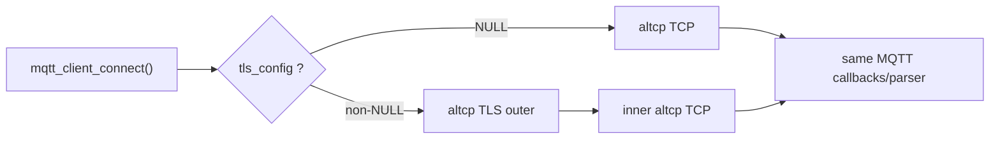
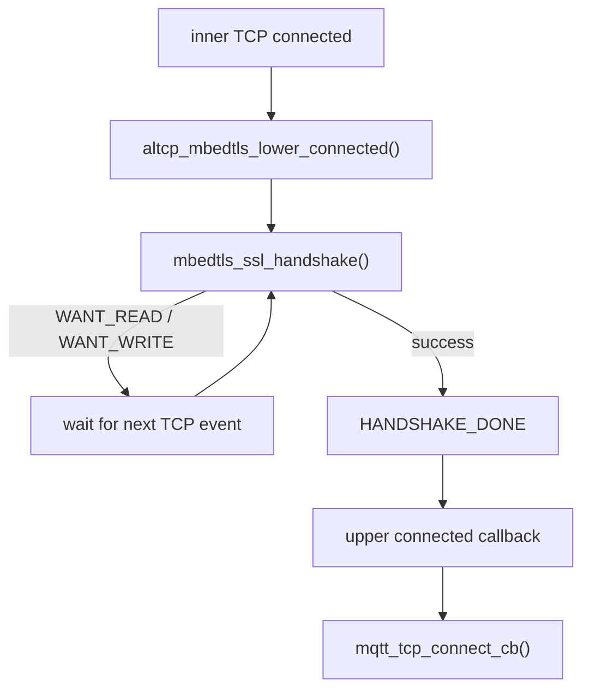
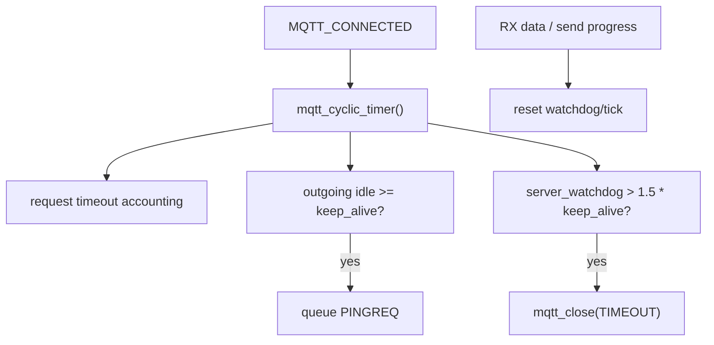
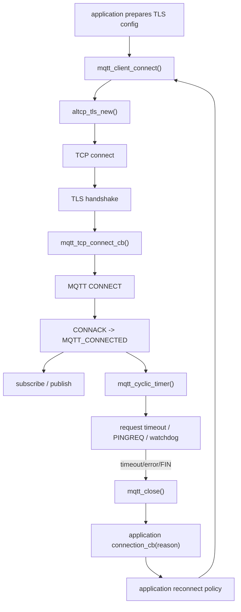

<meta name="referrer" content="no-referrer" />

# 教程 35：从 `tls_config` 到 `mqtt_cyclic_timer()`——MQTT over TLS、Keep Alive、Timeout 与应用侧 Reconnect

> 摘要：沿 mqtt_client_connect() 的 TLS 分支追踪握手、Keep Alive、timeout 与断线清理，明确 lwIP 与应用侧 reconnect/resubscribe 的责任边界。

[TOC]

Stage 34 已经从 `mqtt_example_init()` 追到 CONNECT/CONNACK、SUBSCRIBE、PUBLISH 与 incoming callback。Stage 35 不重复 MQTT parser，而是从同一个公共入口 `mqtt_client_connect()` 的 `tls_config` 分支继续，回答 MCU 上云最容易混淆的三个问题：**TLS 在 MQTT connect 的什么位置完成、Keep Alive 实际由哪些 timer/callback 推进、网络断开后 lwIP 到底会不会自动重连。** [S1](#source-s1)[S2](#source-s2)

当前源码基线仍为 upstream `master` commit `d08f4773edd0182b7910fc8f046eed82ffcd67c9`。

## 1. `mqtt_connect_client_info_t::tls_config` 是 MQTT 与 TLS 的连接点

`src/include/lwip/apps/mqtt.h` 中的 `mqtt_connect_client_info_t` 在同时启用 `LWIP_ALTCP` 与 `LWIP_ALTCP_TLS` 时包含：

```text
struct altcp_tls_config *tls_config
```

同时 public header 定义普通 MQTT port 与 secure MQTT port：`MQTT_PORT` 和 `MQTT_TLS_PORT`。[S2](#source-s2)

upstream `mqtt_example.c` 当前把 `tls_config` 留为 `NULL`，所以没有一段可以直接照抄的 MQTT-TLS example 初始化代码。[S3](#source-s3) 产品集成通常需要先创建 **client-side** TLS config，再把 pointer 放进 `mqtt_connect_client_info_t`，最终仍调用同一个 `mqtt_client_connect()`。

下面只是产品集成关系示意，不是 upstream example 原文：

```c
/* 集成示意：TLS config 的创建和生命周期由产品负责 */
client_info.tls_config = client_tls_config;
mqtt_client_connect(client, broker_ip, MQTT_TLS_PORT,
                    connection_cb, app_arg, &client_info);
```

client TLS config 可通过 `altcp_tls_create_config_client()` 等 API 创建。当前 mbedTLS port 的源码说明 CA certificate 为可选配置，但生产环境不提供 CA 会失去可信 CA chain 校验，容易受到中间人攻击。[S4](#source-s4)

## 2. 再次进入 `mqtt_client_connect()`：`tls_config != NULL` 时只替换 transport allocator

Stage 34 已经展开了 `mqtt_client_connect()` 如何编码 CONNECT。Stage 35 只看其中的 transport 分支：[S1](#source-s1)

```text
if (client_info->tls_config)
    client->conn = altcp_tls_new(...)
else
    client->conn = altcp_tcp_new_ip_type(...)
```

后续仍然执行同一组代码：

```text
altcp_arg()
  -> altcp_bind()
  -> altcp_connect(..., mqtt_tcp_connect_cb)
  -> altcp_err(..., mqtt_tcp_err_cb)
  -> TCP_CONNECTING
```

因此 MQTT over TLS 不是另一套 MQTT client。变化发生在 `client->conn` 下面：



CONNECT packet、request queue、incoming parser 和 application callback 都继续使用 Stage 34 的实现。[S1](#source-s1)

## 3. 进入 `altcp_tls_new()`：先建立 TLS outer connection，再建立 inner TCP

`altcp_tls_new()` 位于 `src/core/altcp_alloc.c`。它先创建 `altcp_tcp_new_ip_type()`，然后用 `altcp_tls_wrap()` 把 TLS layer 包在 inner TCP 外面。[S5](#source-s5)

Stage 33 已经从 HTTPS server 看过同一对象关系：

```text
MQTT application
  -> outer altcp TLS
     -> mbedTLS state
     -> inner altcp TCP
        -> tcp_pcb
```

这意味着 `altcp_connect()` 表面上仍是一次 connect，但 outer TLS layer 会接管 inner TCP 的 connect/recv/sent/error callback，把握手完成后的“可用连接”再暴露给 MQTT。[S4](#source-s4)[S5](#source-s5)

## 4. TCP connect 完成以后不会立刻进入 `mqtt_tcp_connect_cb()`：TLS handshake 先完成

这是 MQTT over TLS 最重要的调用顺序。

inner TCP active open 成功时，TLS layer 的 lower connected callback `altcp_mbedtls_lower_connected()` 被触发；它不是立即调用上层 MQTT callback，而是进入 `altcp_mbedtls_lower_recv_process()`。[S4](#source-s4)

只要 `ALTCP_MBEDTLS_FLAGS_HANDSHAKE_DONE` 还没有置位，该函数就调用 `mbedtls_ssl_handshake()`：



因此在 TLS 模式下，`mqtt_tcp_connect_cb()` 的语义不是“TCP 三次握手刚结束”，而是 **altcp 向 MQTT 宣告 secure transport 已经 ready**。[S4](#source-s4)

这也决定了 MQTT CONNECT 的发送时机：`mqtt_tcp_connect_cb()` 只有在 TLS handshake 完成后才调用 `mqtt_output_send()`。所以 wire 上的顺序是：

```text
TCP handshake
  -> TLS handshake
  -> encrypted MQTT CONNECT
  -> encrypted MQTT CONNACK
```

而不是先发明文 MQTT CONNECT 再升级到 TLS。

## 5. MQTT 明文怎样变成 TLS ciphertext：Stage 34 的 `mqtt_output_send()` 不需要改变

TLS handshake 完成后，`mqtt_tcp_connect_cb()` 仍注册 MQTT recv/sent/poll callback，并调用 Stage 34 的 `mqtt_output_send()`。[S1](#source-s1)

`mqtt_output_send()` 仍然执行 `altcp_write(client->conn, ...)`。但此时 `client->conn` 的 outer function table 属于 TLS layer，因此调用落到 `altcp_mbedtls_write()`：[S4](#source-s4)

```text
MQTT CONNECT / PUBLISH bytes
  -> mqtt_output_send()
  -> altcp_write(outer TLS)
  -> altcp_mbedtls_write()
  -> mbedtls_ssl_write()
  -> TLS record ciphertext
  -> altcp_mbedtls_bio_send()
  -> altcp_write(inner TCP)
```

接收方向完全对称：inner TCP pbuf 先进入 TLS lower receive path，TLS 解密后才调用 outer `mqtt_tcp_recv_cb()`。因此 MQTT parser 永远处理 MQTT plaintext，不解析 TLS record。[S4](#source-s4)

## 6. TLS 只保护 transport；MQTT connection 仍必须等待 CONNACK

TLS handshake 成功后，`mqtt_tcp_connect_cb()` 把 state 改成 `MQTT_CONNECTING`，启动 `mqtt_cyclic_timer()`，并发出排队的 CONNECT。[S1](#source-s1)

Broker 的 encrypted CONNACK 经 TLS 解密后到达 `mqtt_tcp_recv_cb()`，再进入 `mqtt_parse_incoming()` / `mqtt_message_received()`。只有 CONNACK accepted 才进入 `MQTT_CONNECTED` 并调用 application `connect_cb`。[S1](#source-s1)

因此连接建立至少有三层状态：

| 层次 | “成功”意味着什么 |
|---|---|
| TCP | 与 Broker 建立可靠 byte stream |
| TLS | handshake 完成，可安全传输 application data |
| MQTT | Broker 接受 CONNECT，收到 CONNACK Accepted |

任意一层失败，都不能称 MQTT session 已建立。

## 7. `mqtt_cyclic_timer()` 从 `MQTT_CONNECTING` 开始承担 connection timeout

`mqtt_tcp_connect_cb()` 注册的 cyclic timer 默认每 `MQTT_CYCLIC_TIMER_INTERVAL` 秒执行一次；当前 upstream 默认值是 5 秒。[S1](#source-s1)[S6](#source-s6)

如果 client 仍处于 `MQTT_CONNECTING`，timer 增加 `cyclic_tick`。累计时间达到 `MQTT_CONNECT_TIMOUT` 后，调用：

```text
mqtt_close(client, MQTT_CONNECT_TIMEOUT)
```

当前 `MQTT_CONNECT_TIMOUT` 默认是 100 秒。[S6](#source-s6)

这里的 timer 发生在 `mqtt_tcp_connect_cb()` 之后，也就是 transport ready、MQTT CONNECT 已开始发送之后。TLS handshake 自身发生在上层 connected callback 之前，其错误会通过 altcp error/close path 传播；不要把这两个 timeout 误认为完全相同的一层。

## 8. 进入 `MQTT_CONNECTED` 后，`mqtt_cyclic_timer()` 同时维护 request timeout 与 Keep Alive

CONNACK accepted 后，`mqtt_message_received()` 把 `cyclic_tick` 清零并设置 `MQTT_CONNECTED`。[S1](#source-s1)

之后 cyclic timer 每次执行先调用：

```text
mqtt_request_time_elapsed(&client->pend_req_queue, MQTT_CYCLIC_TIMER_INTERVAL)
```

pending SUBSCRIBE、UNSUBSCRIBE、QoS publish request 采用差分 timeout queue。当前默认 `MQTT_REQ_TIMEOUT` 为 30 秒；到期后 `mqtt_request_time_elapsed()` 从 queue 移除 request，并调用该 request 的 callback，传入 `ERR_TIMEOUT`。[S1](#source-s1)[S6](#source-s6)

这类 timeout 是“某个 MQTT request 没得到预期 protocol response”，不等价于整个 connection 已断开。

## 9. Keep Alive 发送侧：没有新的已确认发送时，timer 会排入 PINGREQ

`client_info->keep_alive > 0` 时，cyclic timer 增加 `cyclic_tick`。当累计 tick 达到 keep-alive interval，就检查 MQTT output ring buffer 是否还能容纳 PINGREQ；有空间时写入一个 `MQTT_MSG_TYPE_PINGREQ` fixed header，并把 `cyclic_tick` 清零。PINGREQ/PINGRESP 属于 MQTT 3.1.1 Keep Alive 的协议机制；具体 tick 与 watchdog 实现则由当前 lwIP client 定义。[S1](#source-s1)[S7](#source-s7)

但 timer 只是把 PINGREQ 放进 output queue。真正向下发送仍通过既有 `mqtt_output_send()` 路径，由 callback/poll 推动到 altcp/TLS/TCP。

当前实现还在 `mqtt_tcp_sent_cb()` 中重置：

```text
client->cyclic_tick = 0
client->server_watchdog = 0
```

也就是说，TCP sent callback 证明当前发送进度被下层确认后，会重新计算 outgoing idle 时间。[S1](#source-s1)

## 10. Keep Alive 接收侧：`server_watchdog` 判断 Broker 是否长期没有可见活动

cyclic timer 在 connected 状态下还会增加 `server_watchdog`。当前代码把超过 `1.5 * keep_alive` 的情况视为 Broker incoming inactivity，并调用 `mqtt_close(..., MQTT_CONNECT_TIMEOUT)`。[S1](#source-s1)

`mqtt_tcp_recv_cb()` 收到任意有效 pbuf 并完成解析后，如果启用了 keep alive，会把 `server_watchdog` 清零。`mqtt_tcp_sent_cb()` 当前实现也会把它清零。[S1](#source-s1)

`mqtt_message_received()` 对 PINGRESP 有专门分支，但 Keep Alive watchdog 的重置并不只依赖 PINGRESP；正常 Broker traffic 同样会经过 receive callback。[S1](#source-s1)

因此当前实现的运行链可以概括为：



Keep Alive 是 MQTT application 层的 liveness mechanism；它与 TCP keepalive 不是同一个机制。

## 11. 下层 error 或 FIN 怎样进入 `mqtt_close()`

断线有多个真实入口：[S1](#source-s1)

- `mqtt_tcp_recv_cb()` 收到 `p == NULL`：remote FIN / connection close；
- `mqtt_tcp_err_cb()`：下层 connection 已因 TCP/altcp error 释放；
- `mqtt_cyclic_timer()`：MQTT connect timeout 或 Keep Alive watchdog timeout；
- application 主动调用 `mqtt_disconnect()`。

以 `mqtt_tcp_err_cb()` 为例，当前源码明确知道 PCB 已被下层释放，所以先：

```text
client->conn = NULL
```

再调用 `mqtt_close(client, MQTT_CONNECT_DISCONNECTED)`。[S1](#source-s1)

这避免 `mqtt_close()` 再访问已经失效的 altcp connection。

## 12. 进入 `mqtt_close()`：它负责清理，但没有任何自动 reconnect

`mqtt_close()` 是 Stage 35 判断责任边界的关键函数。[S1](#source-s1)

如果 `client->conn` 仍存在，它先取消 recv/err/sent callback，再尝试 `altcp_close()`，失败则 `altcp_abort()`。随后它：

```text
client->conn = NULL
  -> mqtt_clear_requests(&client->pend_req_queue)
  -> sys_untimeout(mqtt_cyclic_timer, client)
  -> client->conn_state = TCP_DISCONNECTED
  -> connect_cb(..., reason)
```

函数到这里结束。当前源码没有：

```text
sys_timeout(... reconnect ...)
mqtt_client_connect(...)
automatic DNS retry
automatic resubscribe
```

所以结论必须明确：**lwIP MQTT core 会检测断线并通知 application，但 reconnect policy 属于应用层。**

## 13. 为什么 reconnect 后必须重新考虑 subscribe 与 in-flight request

当前实现有两个直接证据决定 reconnect 不能只“再调用一次 connect”：

第一，`mqtt_client_connect()` 每次都会设置 `MQTT_CONNECT_FLAG_CLEAN_SESSION`。[S1](#source-s1)

第二，`mqtt_close()` 调用 `mqtt_clear_requests()` 清空本地 pending request queue；它不会把这些 request 保留给下一条 connection。[S1](#source-s1)

因此从当前 implementation 可以推出：

- disconnect 后不能假定本地 in-flight request 还能继续等待旧 ACK；
- reconnect accepted 后，application 应重新建立自己需要的 subscription；
- 业务层是否重发 telemetry/command，需要根据自己的幂等性、QoS、消息持久化策略决定，不能由 lwIP 自动猜测。

upstream example 自己已经给出一个很好的恢复锚点：`mqtt_connection_cb()` 在每次收到 `MQTT_CONNECT_ACCEPTED` 时执行 subscribe。[S3](#source-s3) 产品代码可以沿这个边界恢复 subscription，而不把 resubscribe 混进底层 error callback。

## 14. 应用侧 reconnect 应该围绕 `connect_cb` 建状态机，而不是在 error callback 中立即递归 connect

下面是一个**工程集成伪代码**，不是 lwIP upstream 实现。它只表达责任和顺序，不规定具体 backoff 数值：

```c
connection_cb(status)
{
    if (status == MQTT_CONNECT_ACCEPTED) {
        cancel_reconnect_timer();
        restore_required_subscriptions();
        mark_cloud_session_ready();
        return;
    }

    mark_cloud_session_down();
    schedule_reconnect_after_policy_delay();
}

reconnect_timer_cb()
{
    if (!network_is_ready()) {
        reschedule_according_to_product_policy();
        return;
    }

    resolve_broker_if_needed();
    mqtt_client_connect(client, broker_ip, MQTT_TLS_PORT,
                        connection_cb, app_arg, &client_info);
}
```

这套结构利用了 lwIP 已有 contract：所有 connect/disconnect 结果最终汇总到 `mqtt_connection_cb_t`。[S2](#source-s2)

这里还必须保留 Stage 11 的 execution-context 约束。`mqtt_client_connect()` 内部执行 `LWIP_ASSERT_CORE_LOCKED()`；如果产品的 reconnect timer 运行在普通 RTOS task/timer service context，不能直接调用 MQTT callback-style API。应先调度到 TCPIP thread（例如 `tcpip_callback()`），或在启用 `LWIP_TCPIP_CORE_LOCKING` 的 Port 中持有 core lock 后再调用。[S1](#source-s1)[S8](#source-s8)

实际产品可以选择固定延迟、指数退避、随机 jitter、网络状态门控等策略，但这些都不是当前 lwIP MQTT 的内建行为，本文不把某一种策略写成协议规定。

## 15. DNS 也属于应用连接编排：`mqtt_client_connect()` 接收的是 `ip_addr_t`

public API `mqtt_client_connect()` 接收 `const ip_addr_t *ipaddr`，不是 hostname。[S2](#source-s2)

因此真实云端设备使用域名时，典型 orchestration 是：

```text
network ready
  -> DNS resolve broker hostname
  -> obtain ip_addr_t
  -> mqtt_client_connect()
  -> TLS handshake
  -> MQTT CONNECT / CONNACK
```

DNS retry、地址切换和缓存策略同样属于应用/产品连接管理层。Stage 14 已经解释了 lwIP DNS resolver 的异步模型，这里只把它重新接到 MQTT 云连接入口，不重复 DNS 源码。

## 16. TLS config 与 MQTT client 是两个不同生命周期的对象

`mqtt_client_t` 保存的是 MQTT runtime state；`mqtt_connect_client_info_t::tls_config` 则提供给 `altcp_tls_new()` 创建 TLS connection。[S1](#source-s1)[S2](#source-s2)

TLS wrapper 的 per-connection state 通过 `mbedtls_ssl_setup()` 使用 `altcp_tls_config` 中的 mbedTLS configuration；server accept path也会从现有 TLS state 的 `conf` 创建新 TLS connection。[S4](#source-s4) 因此工程上不能把 TLS config 当成 `mqtt_client_connect()` 调用栈上的临时对象后立即销毁；应按实际连接使用期和 altcp TLS API 的 ownership 设计其生命周期。

CA、client certificate/private key 是否需要，以及它们存放在 Flash、文件系统还是安全器件中，属于产品安全架构。当前源码只提供配置接口，不替产品决定密钥存储策略。

## 17. Stage 35 的完整生命周期

把 TLS、MQTT Keep Alive 与 reconnect responsibility 合在一条路径中：



这里最需要保留的工程边界是：

```text
lwIP MQTT owns:
  protocol parsing
  request tracking
  keep-alive timer/watchdog
  transport close/error detection
  connection status callback

application owns:
  DNS / broker selection
  reconnect delay/backoff policy
  resubscribe policy
  business-message retry/persistence
  network-ready gating
  credential / TLS-config lifecycle
```

这个边界比“MQTT 有自动重连”或“断线后重新 connect 就够了”更接近当前 upstream 的真实行为。

## 18. Stage 32～35 到这里形成的应用层主线

```text
Stage 32
HTTPD -> altcp -> TCP

Stage 33
HTTPD -> altcp TLS -> mbedTLS -> TCP

Stage 34
MQTT client -> altcp -> TCP

Stage 35
MQTT client -> altcp TLS -> mbedTLS -> TCP
             + cyclic timer / Keep Alive
             + application reconnect/resubscribe
```

到 Stage 35 为止，应用协议、secure transport 和断线恢复责任已经能与前面的 TCP、DNS、DHCP、driver/PHY 主线接起来。后续如果进入真实 MCU Port，就可以把关注点从“协议本身怎么工作”转向证书存储、entropy/RNG、RAM 预算、RTOS execution context、Ethernet/Wi-Fi link state 和产品云连接状态机。

## 资料来源

<a id="source-s1"></a>
### [S1] lwIP MQTT client implementation
- 类型：目标版本上游源码
- 版本：commit `d08f4773edd0182b7910fc8f046eed82ffcd67c9`
- 定位：`src/apps/mqtt/mqtt.c`：`mqtt_client_connect()`、`mqtt_tcp_connect_cb()`、`mqtt_tcp_recv_cb()`、`mqtt_tcp_sent_cb()`、`mqtt_tcp_err_cb()`、`mqtt_cyclic_timer()`、`mqtt_request_time_elapsed()`、`mqtt_close()`
- URL/文档：[lwIP mqtt.c](https://github.com/lwip-tcpip/lwip/blob/d08f4773edd0182b7910fc8f046eed82ffcd67c9/src/apps/mqtt/mqtt.c)
- 使用位置：TLS transport 分支、Keep Alive、request timeout、断线清理、Clean Session、应用侧 reconnect 边界
- 支撑内容：提供 Stage 35 的 Source-driven 主调用链和“无自动重连”的直接实现证据

<a id="source-s2"></a>
### [S2] lwIP MQTT public API
- 类型：目标版本上游 public header
- 版本：同上
- 定位：`src/include/lwip/apps/mqtt.h`：`mqtt_connect_client_info_t`、`tls_config`、`MQTT_TLS_PORT`、`mqtt_connection_cb_t`、`mqtt_client_connect()`
- URL/文档：[lwIP mqtt.h](https://github.com/lwip-tcpip/lwip/blob/d08f4773edd0182b7910fc8f046eed82ffcd67c9/src/include/lwip/apps/mqtt.h)
- 使用位置：“TLS 配置入口”“connection callback contract”“DNS/hostname 边界”
- 支撑内容：说明 MQTT-TLS 对应用公开的配置和回调接口

<a id="source-s3"></a>
### [S3] lwIP upstream MQTT example
- 类型：目标版本上游 example
- 版本：同上
- 定位：`contrib/examples/mqtt/mqtt_example.c`：`mqtt_client_info`、`mqtt_example_init()`、`mqtt_connection_cb()`
- URL/文档：[lwIP mqtt_example.c](https://github.com/lwip-tcpip/lwip/blob/d08f4773edd0182b7910fc8f046eed82ffcd67c9/contrib/examples/mqtt/mqtt_example.c)
- 使用位置：“upstream example 默认无 TLS”“CONNACK accepted 后重新 subscribe 的应用边界”
- 支撑内容：区分 example 行为与产品应自行增加的 TLS/reconnect policy

<a id="source-s4"></a>
### [S4] lwIP altcp mbedTLS integration
- 类型：目标版本上游源码
- 版本：同上
- 定位：`src/apps/altcp_tls/altcp_tls_mbedtls.c`：client config、`altcp_tls_wrap()`、`altcp_mbedtls_setup()`、`altcp_mbedtls_lower_connected()`、handshake、TLS read/write/BIO
- URL/文档：[lwIP altcp_tls_mbedtls.c](https://github.com/lwip-tcpip/lwip/blob/d08f4773edd0182b7910fc8f046eed82ffcd67c9/src/apps/altcp_tls/altcp_tls_mbedtls.c)
- 使用位置：“TLS handshake 在 MQTT callback 之前”“MQTT plaintext 如何加密”“TLS config/CA 边界”
- 支撑内容：证明 altcp TLS active-connect callback 只有在 handshake 完成后才向上层报告 success

<a id="source-s5"></a>
### [S5] lwIP altcp TLS allocator
- 类型：目标版本上游源码
- 版本：同上
- 定位：`src/core/altcp_alloc.c`：`altcp_tls_new()`、`altcp_tls_alloc()`
- URL/文档：[lwIP altcp_alloc.c](https://github.com/lwip-tcpip/lwip/blob/d08f4773edd0182b7910fc8f046eed82ffcd67c9/src/core/altcp_alloc.c)
- 使用位置：“TLS outer + inner TCP 对象关系”
- 支撑内容：证明 MQTT TLS connection 最终仍建立在 TCP 上

<a id="source-s6"></a>
### [S6] lwIP MQTT compile-time options
- 类型：目标版本上游配置头
- 版本：同上
- 定位：`src/include/lwip/apps/mqtt_opts.h`：`MQTT_CYCLIC_TIMER_INTERVAL`、`MQTT_REQ_TIMEOUT`、`MQTT_CONNECT_TIMOUT`
- URL/文档：[lwIP mqtt_opts.h](https://github.com/lwip-tcpip/lwip/blob/d08f4773edd0182b7910fc8f046eed82ffcd67c9/src/include/lwip/apps/mqtt_opts.h)
- 使用位置：“cyclic timer/current defaults”“request/connect timeout”
- 支撑内容：限定本文提到的当前 upstream 默认值，避免把实现默认值误写成协议常量

<a id="source-s7"></a>
### [S7] OASIS MQTT Version 3.1.1
- 类型：MQTT 标准
- 版本：MQTT 3.1.1
- URL/文档：[MQTT Version 3.1.1](https://docs.oasis-open.org/mqtt/mqtt/v3.1.1/mqtt-v3.1.1.html)
- 使用位置：“Keep Alive/PINGREQ/PINGRESP 的协议背景”“MQTT over ordered byte stream”
- 支撑内容：提供协议语义；具体 watchdog、timer、Clean Session 固定策略与 reconnect 边界仍以目标 lwIP 源码为准

<a id="source-s8"></a>
### [S8] lwIP Multithreading / Common pitfalls
- 类型：目标版本上游 Doxygen 文档
- 版本：同上
- 定位：`doc/doxygen/main_page.h`：`Multithreading`、`Common pitfalls`
- URL/文档：[lwIP multithreading guidance](https://github.com/lwip-tcpip/lwip/blob/d08f4773edd0182b7910fc8f046eed82ffcd67c9/doc/doxygen/main_page.h)
- 使用位置：“应用侧 reconnect timer 与 MQTT API 的执行上下文”
- 支撑内容：说明 RTOS application task/IRQ 不能无锁直接调用 callback-style lwIP core API
