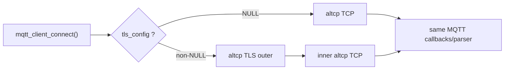
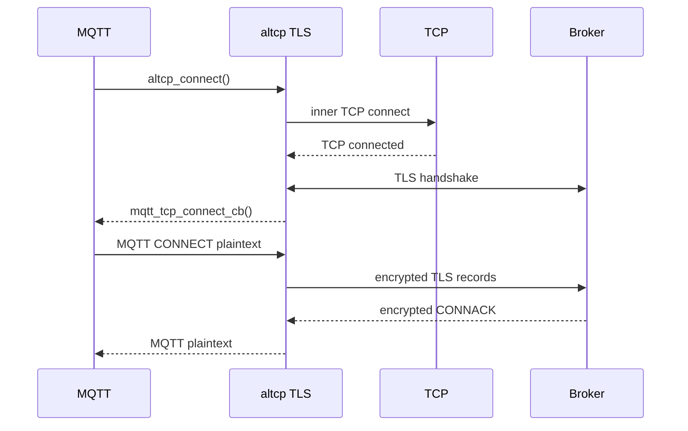
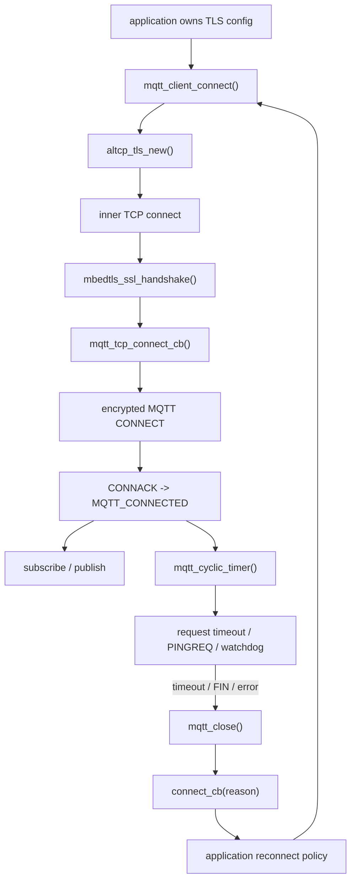

<meta name="referrer" content="no-referrer" />

# 教程 35：从 `tls_config` 到 `mqtt_cyclic_timer()`——MQTT over TLS、Keep Alive、Timeout 与应用侧 Reconnect

> 摘要：沿 MQTT TLS transport、Keep Alive、request timeout 与断线清理源码，明确 lwIP 与应用侧 reconnect/resubscribe 的责任边界。

[TOC]

MQTT over TLS 不是另一套 MQTT 协议。**Keep Alive（保活）**是 MQTT 层的空闲活性约定，空闲时通过 PINGREQ/PINGRESP 维持会话；**request timeout** 是 lwIP 对某个异步 MQTT 操作等待过久的实现超时；**reconnect** 则是连接断开后重新建立 MQTT session 的应用策略。Stage 34 已经完整建立正常 MQTT 会话，本篇只从这些异常生命周期问题继续。[S1](#source-s1)[S7](#source-s7)

`mqtt_connect_client_info_t::tls_config` 是 public connection 参数里选择 TLS transport 的配置指针，`mqtt_cyclic_timer()` 则是 lwIP MQTT Core 周期处理 Keep Alive 与 pending request timeout 的内部 timer callback。本文继续绑定用户提供的 `lwip.zip` 与 upstream commit `d08f4773edd0182b7910fc8f046eed82ffcd67c9`，并从 `tls_config` 进入真实 Source-driven 调用链。[S1](#source-s1)[S2](#source-s2)[S4](#source-s4)

## 0. 从 Stage 34 到 Stage 35：只恢复异常生命周期需要的五条规则

为避免重复 Stage 34，这里只保留后文源码马上会依赖的协议语义：

1. **MQTT over TLS**：MQTT Control Packet 本身不变，只是 MQTT plaintext 经 TLS 加密后再进入 TCP。`tls_config` 改变的是 transport，不是 MQTT parser。[S4](#source-s4)
2. **Keep Alive**：Client 在 CONNECT 中声明 Keep Alive 秒数；空闲期间 MQTT 用 `PINGREQ -> PINGRESP` 维持协议级活性。它不是 TCP keepalive。Stage 34 已讲协议规则，本篇只看 `mqtt_cyclic_timer()` 如何实现计数和 watchdog。[S7](#source-s7)
3. **Pending request timeout**：SUBSCRIBE、QoS>0 PUBLISH 等异步操作在 lwIP 内部有 pending request record；某个 request 超时表示该操作的 callback 没在期限内完成，不自动等价于整条 TCP/MQTT connection 已失效。[S1](#source-s1)
4. **Connection close**：remote FIN、lower-layer error、Keep Alive watchdog 等不同触发源最终会汇入 MQTT close/cleanup 路径；pending request、transport PCB 和 connection state 的清理必须区分。[S1](#source-s1)
5. **Reconnect / Resubscribe**：当前 lwIP `mqtt_client_connect()` 固定设置 **Clean Session（CONNECT 中要求从新的会话状态开始的标志）**，因此断线重连后不能把旧 subscription 当成必然仍然存在；何时重连、退避多久、连接成功后重新订阅哪些 Topic 属于应用连接编排策略。[S1](#source-s1)[S7](#source-s7)

Stage 33 已经建立 `altcp TLS -> mbedTLS -> TCP`。本篇只需要记住四个桥接点：`tls_config` 选择 TLS outer，inner TCP connected 后先运行 TLS handshake，handshake 成功后才把 connected event 交回 MQTT，MQTT plaintext 的 send/recv 最终仍通过同一 MQTT parser 与 callback contract。[S4](#source-s4)

下面开始从第一个真实新增入口 `tls_config` 下钻。

## 1. `tls_config` 是 MQTT 与 TLS 的唯一公开连接点

MQTT public header 在 `LWIP_ALTCP && LWIP_ALTCP_TLS` 下给 `mqtt_connect_client_info_t` 增加 `tls_config`，同时暴露普通 MQTT 与 secure MQTT 的默认端口。[S2](#source-s2)

```c
typedef struct mqtt_client_s mqtt_client_t;

#if LWIP_ALTCP && LWIP_ALTCP_TLS
struct altcp_tls_config;
#endif

/** @ingroup mqtt
 * Default MQTT port (non-TLS) */
#define MQTT_PORT     LWIP_IANA_PORT_MQTT
/** @ingroup mqtt
 * Default MQTT TLS port */
#define MQTT_TLS_PORT LWIP_IANA_PORT_SECURE_MQTT

/*---------------------------------------------------------------------------------------------- */
/* Connection with server */

/**
 * @ingroup mqtt
 * Client information and connection parameters */
struct mqtt_connect_client_info_t {
  /** Client identifier, must be set by caller */
  const char *client_id;
  /** User name, set to NULL if not used */
  const char* client_user;
  /** Password, set to NULL if not used */
  const char* client_pass;
  /** keep alive time in seconds, 0 to disable keep alive functionality*/
  u16_t keep_alive;
  /** will topic, set to NULL if will is not to be used,
      will_msg, will_qos and will retain are then ignored */
  const char* will_topic;
  /** will_msg, see will_topic */
  const char* will_msg;
  /** will_msg length, 0 to compute length from will_msg string */
  u8_t will_msg_len;
  /** will_qos, see will_topic */
  u8_t will_qos;
  /** will_retain, see will_topic */
  u8_t will_retain;
#if LWIP_ALTCP && LWIP_ALTCP_TLS
  /** TLS configuration for secure connections */
  struct altcp_tls_config *tls_config;
#endif
};
```

这说明 MQTT client 的 public API 没有另一套 `mqtt_tls_connect()`；应用仍调用 `mqtt_client_connect()`，只通过 `tls_config` 决定底层 `altcp_pcb` 是 plain TCP 还是 TLS wrapper。

upstream MQTT example 当前把该字段设为 `NULL`，因此 Stage 35 的 TLS 路径来自 MQTT Core + altcp TLS 源码，而不是一段现成的 `mqtt_example_tls_init()`。[S3](#source-s3)

## 2. 回到 `mqtt_client_connect()`：`tls_config != NULL` 只替换 transport

Stage 34 已经完整展开 `mqtt_client_connect()` 的 CONNECT packet 编码。本篇只看 transport 选择和 active-open 调用点。继续阅读 `mqtt_client_connect()`：[S1](#source-s1)

```c
#if LWIP_ALTCP && LWIP_ALTCP_TLS
  if (client_info->tls_config) {
    client->conn = altcp_tls_new(client_info->tls_config, IP_GET_TYPE(ip_addr));
  } else
#endif
  {
    client->conn = altcp_tcp_new_ip_type(IP_GET_TYPE(ip_addr));
  }
  if (client->conn == NULL) {
    return ERR_MEM;
  }

  /* Set arg pointer for callbacks */
  altcp_arg(client->conn, client);
  /* Any local address, pick random local port number */
  err = altcp_bind(client->conn, IP_ADDR_ANY, 0);
  if (err != ERR_OK) {
    LWIP_DEBUGF(MQTT_DEBUG_WARN, ("mqtt_client_connect: Error binding to local ip/port, %d\n", err));
    goto tcp_fail;
  }
  LWIP_DEBUGF(MQTT_DEBUG_TRACE, ("mqtt_client_connect: Connecting to host: %s at port:%"U16_F"\n", ipaddr_ntoa(ip_addr), port));

  /* Connect to server */
  err = altcp_connect(client->conn, ip_addr, port, mqtt_tcp_connect_cb);
  if (err != ERR_OK) {
    LWIP_DEBUGF(MQTT_DEBUG_TRACE, ("mqtt_client_connect: Error connecting to remote ip/port, %d\n", err));
    goto tcp_fail;
  }
  /* Set error callback */
  altcp_err(client->conn, mqtt_tcp_err_cb);
  client->conn_state = TCP_CONNECTING;
```

MQTT parser、output ring、request queue 和 callbacks 完全没有分叉。`client->conn` 仍是 `struct altcp_pcb *`，只是 TLS 分支通过 `altcp_tls_new()` 构造 outer TLS connection。



## 3. 进入 `altcp_tls_new()`：TLS outer 先包住一个 inner TCP

`mqtt_client_connect()` 的 TLS 分支调用 `altcp_tls_new()`。Stage 33 已完整解释 TLS adapter，本篇只确认 MQTT 看到的对象关系。`altcp_tls_new()` 先创建 inner TCP，再包装成 outer TLS pcb：[S5](#source-s5)

```c
struct altcp_pcb *
altcp_tls_new(struct altcp_tls_config *config, u8_t ip_type)
{
  struct altcp_pcb *inner_conn, *ret;
  LWIP_UNUSED_ARG(ip_type);

  inner_conn = altcp_tcp_new_ip_type(ip_type);
  if (inner_conn == NULL) {
    return NULL;
  }
  ret = altcp_tls_wrap(config, inner_conn);
  if (ret == NULL) {
    altcp_close(inner_conn);
  }
  return ret;
}
```

进入 `altcp_mbedtls_setup()` 后，决定 MQTT/TLS 边界的核心是 BIO callback、inner connection 和 TLS function table：[S4](#source-s4)

```c
  mbedtls_ssl_init(&state->ssl_context);
  ret = mbedtls_ssl_setup(&state->ssl_context, &config->conf);
  if (ret != 0) {
    altcp_mbedtls_free(conf, state);
    return ERR_MEM;
  }
  mbedtls_ssl_set_bio(&state->ssl_context, conn, altcp_mbedtls_bio_send, altcp_mbedtls_bio_recv, NULL);

  altcp_mbedtls_setup_callbacks(conn, inner_conn);
  conn->inner_conn = inner_conn;
  conn->fns = &altcp_mbedtls_functions;
  conn->state = state;
```

因此 `mqtt_client_t::conn` 指向 outer TLS pcb；真正执行 TCP I/O 的对象是 `conn->inner_conn`。这已经足够支撑后续 MQTT lifecycle，不需要在本篇再次展开 Mbed TLS config/context 的完整内部结构。

## 4. `altcp_connect()` 在 TLS outer 上调用，真正的 TCP connect 发生在 inner connection

`mqtt_client_connect()` 已经把 `mqtt_tcp_connect_cb` 传给 outer `altcp_connect()`。TLS function table 最终进入 `altcp_mbedtls_connect()`：[S4](#source-s4)

```c
static err_t
altcp_mbedtls_connect(struct altcp_pcb *conn, const ip_addr_t *ipaddr, u16_t port, altcp_connected_fn connected)
{
  if (conn == NULL) {
    return ERR_VAL;
  }
  conn->connected = connected;
  return altcp_connect(conn->inner_conn, ipaddr, port, altcp_mbedtls_lower_connected);
}
```

这里把 MQTT callback 保存为 outer `conn->connected`，而 inner TCP 注册的是 `altcp_mbedtls_lower_connected`。这条 bridge 是后面“TCP connected 不等于 MQTT transport ready”的直接源码证据。

## 5. TCP connected 后先进入 `altcp_mbedtls_lower_connected()`，不是 MQTT callback

inner TCP active open 完成后，首先执行 `altcp_mbedtls_lower_connected()`。成功路径没有直接调用 MQTT callback，而是进入 TLS receive/handshake processor：[S4](#source-s4)

```c
static err_t
altcp_mbedtls_lower_connected(void *arg, struct altcp_pcb *inner_conn, err_t err)
{
  struct altcp_pcb *conn = (struct altcp_pcb *)arg;
  LWIP_UNUSED_ARG(inner_conn);
  if (conn && conn->state) {
    altcp_mbedtls_state_t *state;
    if (err != ERR_OK) {
      if (conn->connected) {
        return conn->connected(conn->arg, conn, err);
      }
    }
    state = (altcp_mbedtls_state_t *)conn->state;
    state->overhead_bytes_adjust = 0;
    return altcp_mbedtls_lower_recv_process(conn, state);
  }
  return ERR_VAL;
}
```

继续阅读 `altcp_mbedtls_lower_recv_process()` 的 handshake 决策点：[S4](#source-s4)

```c
  if (!(state->flags & ALTCP_MBEDTLS_FLAGS_HANDSHAKE_DONE)) {
    int ret = mbedtls_ssl_handshake(&state->ssl_context);
    altcp_output(conn->inner_conn);

    if (ret == MBEDTLS_ERR_SSL_WANT_READ || ret == MBEDTLS_ERR_SSL_WANT_WRITE) {
      return ERR_OK;
    }
    if (ret != 0) {
      if (conn->err) {
        conn->err(conn->arg, ERR_CLSD);
      }
      if (altcp_close(conn) != ERR_OK) {
        altcp_abort(conn);
      }
      return ERR_OK;
    }

    state->flags |= ALTCP_MBEDTLS_FLAGS_HANDSHAKE_DONE;
    if (conn->connected) {
      err_t err;
      err = conn->connected(conn->arg, conn, ERR_OK);
      if (err != ERR_OK) {
        return err;
      }
    }
```

WANT_READ/WANT_WRITE 表示 handshake 等待更多 lower I/O；只有成功设置 `HANDSHAKE_DONE` 后才执行 outer `conn->connected`。该函数指针正是 `mqtt_tcp_connect_cb()`，因此 TLS 模式下它的真实语义是 **secure altcp transport ready**。[S1](#source-s1)[S4](#source-s4)

## 6. handshake 成功后才回到 `mqtt_tcp_connect_cb()`，MQTT CONNECT 此时才发送

handshake 成功后，上一节的 `conn->connected()` 回到 Stage 34 已展开的 `mqtt_tcp_connect_cb()`。本篇不再复制整个函数，只保留它在生命周期中的三个动作：[S1](#source-s1)

1. 注册 `mqtt_tcp_recv_cb` / `mqtt_tcp_sent_cb` / poll callback；
2. 把 `conn_state` 切到 `MQTT_CONNECTING` 并启动 `mqtt_cyclic_timer()`；
3. 调用 `mqtt_output_send()`，把早已排在 ring buffer 中的 MQTT CONNECT 发给 outer TLS pcb。

所以真正的 wire 顺序是：



这也是本篇需要保留的 TLS 最小模型：MQTT CONNECT 必须排在 TLS handshake 成功之后；具体 TLS handshake message 序列继续以 Stage 33 的资料为准。

## 7. MQTT 明文怎样经过 `altcp_mbedtls_write()` 变成 ciphertext

Stage 34 的 `mqtt_output_send()` 对 TLS 一无所知，它仍调用 `altcp_write(client->conn, ...)`。outer TLS pcb 把该调用分派到 `altcp_mbedtls_write()`；这里保留明文进入 mbedTLS 的核心片段：[S4](#source-s4)

```c
  state = (altcp_mbedtls_state_t *)conn->state;
  if (state == NULL) {
    return ERR_ARG;
  }
  if (!(state->flags & ALTCP_MBEDTLS_FLAGS_HANDSHAKE_DONE)) {
    return ERR_VAL;
  }

  if (state->ssl_context.out_left) {
    altcp_mbedtls_flush_output(state);
    if (state->ssl_context.out_left) {
      return ERR_MEM;
    }
  }
  ret = mbedtls_ssl_write(&state->ssl_context, (const unsigned char *)dataptr, len);
  altcp_output(conn->inner_conn);
```

`mbedtls_ssl_write()` 通过 Section 3 注册的 `altcp_mbedtls_bio_send()` 输出 TLS records。继续看 BIO send 中真正跨到 inner TCP 的调用点：[S4](#source-s4)

```c
  while (size_left) {
    u16_t write_len = (u16_t)LWIP_MIN(size_left, 0xFFFF);
    err_t err = altcp_write(conn->inner_conn, (const void *)dataptr, write_len, apiflags);
    if (err == ERR_OK) {
      written += write_len;
      size_left -= write_len;
      state->overhead_bytes_adjust += write_len;
    } else if (err == ERR_MEM) {
      if (written) {
        return written;
      }
      return 0;
    } else {
      return MBEDTLS_ERR_NET_SEND_FAILED;
    }
  }
```

于是发送边界可以压缩成 `mqtt_output_send()` → outer `altcp_write()` → `mbedtls_ssl_write()` → BIO send → inner `altcp_write()`。MQTT request queue、Packet Identifier 与 parser 都没有 TLS 分支。

## 8. RX 方向：TLS 先消费 TCP pbuf，解密后才交给 MQTT parser

RX 方向同样只需要保留两次边界转换。继续阅读 `altcp_mbedtls_lower_recv()`：inner TCP 的 ciphertext pbuf 被挂到 TLS state，然后进入统一 processor。[S4](#source-s4)

```c
  if (state->rx == NULL) {
    state->rx = p;
  } else {
    LWIP_ASSERT("rx pbuf overflow", (int)p->tot_len + (int)p->len <= 0xFFFF);
    pbuf_cat(state->rx, p);
  }
  return altcp_mbedtls_lower_recv_process(conn, state);
```

handshake 已完成时，`altcp_mbedtls_handle_rx_appldata()` 调用 `mbedtls_ssl_read()` 生成 plaintext pbuf：[S4](#source-s4)

```c
    ret = mbedtls_ssl_read(&state->ssl_context, (unsigned char *)buf->payload, PBUF_POOL_BUFSIZE);
    if (ret < 0) {
      if ((ret != MBEDTLS_ERR_SSL_WANT_READ) && (ret != MBEDTLS_ERR_SSL_WANT_WRITE)) {
        pbuf_free(buf);
        return ERR_OK;
      } else {
        pbuf_free(buf);
        return ERR_OK;
      }
    } else {
      if (ret) {
        pbuf_realloc(buf, (u16_t)ret);
        state->bio_bytes_appl += ret;
        if (state->rx_app == NULL) {
          state->rx_app = buf;
        } else {
          pbuf_cat(state->rx_app, buf);
        }
      }
```

解密后的 `state->rx_app` 再由 `altcp_mbedtls_pass_rx_data()` 交给 outer recv callback：[S4](#source-s4)

```c
    if (conn->recv) {
      u16_t tot_len = buf->tot_len;
      state->rx_passed_unrecved += tot_len;
      state->flags |= ALTCP_MBEDTLS_FLAGS_UPPER_CALLED;
      err = conn->recv(conn->arg, conn, buf, ERR_OK);
      if (err != ERR_OK) {
        if (err == ERR_ABRT) {
          return ERR_ABRT;
        }
        state->rx_app = buf;
        state->rx_passed_unrecved -= tot_len;
        return err;
      }
    }
```

Stage 34 注册在 outer pcb 上的 recv callback 就是 `mqtt_tcp_recv_cb()`。因此 Broker 的 CONNACK/PUBLISH 经过 `inner TCP ciphertext -> mbedtls_ssl_read() -> outer plaintext pbuf -> mqtt_parse_incoming()`；TLS 只改变承载，不改变 MQTT Control Packet parser 和 request correlation。[S1](#source-s1)[S4](#source-s4)

## 9. `mqtt_cyclic_timer()` 从 `MQTT_CONNECTING` 阶段就开始运行

`mqtt_tcp_connect_cb()` 在 transport ready 后立即 `sys_timeout()` 启动 `mqtt_cyclic_timer()`。此时 MQTT CONNECT 已经开始发送，但 CONNACK 可能还没回来。[S1](#source-s1)

进入 `mqtt_cyclic_timer()`：[S1](#source-s1)

```c
/**
 * Interval timer, called every MQTT_CYCLIC_TIMER_INTERVAL seconds in MQTT_CONNECTING and MQTT_CONNECTED states
 * @param arg MQTT client
 */
static void
mqtt_cyclic_timer(void *arg)
{
  u8_t restart_timer = 1;
  mqtt_client_t *client = (mqtt_client_t *)arg;
  LWIP_ASSERT("mqtt_cyclic_timer: client != NULL", client != NULL);

  if (client->conn_state == MQTT_CONNECTING) {
    client->cyclic_tick++;
    if ((client->cyclic_tick * MQTT_CYCLIC_TIMER_INTERVAL) >= MQTT_CONNECT_TIMOUT) {
      LWIP_DEBUGF(MQTT_DEBUG_TRACE, ("mqtt_cyclic_timer: CONNECT attempt to server timed out\n"));
      /* Disconnect TCP */
      mqtt_close(client, MQTT_CONNECT_TIMEOUT);
      restart_timer = 0;
    }
  } else if (client->conn_state == MQTT_CONNECTED) {
    /* Handle timeout for pending requests */
    mqtt_request_time_elapsed(&client->pend_req_queue, MQTT_CYCLIC_TIMER_INTERVAL);

    /* keep_alive > 0 means keep alive functionality shall be used */
    if (client->keep_alive > 0) {

      client->server_watchdog++;
      /* If reception from server has been idle for 1.5*keep_alive time, server is considered unresponsive */
      if ((client->server_watchdog * MQTT_CYCLIC_TIMER_INTERVAL) > (client->keep_alive + client->keep_alive / 2)) {
        LWIP_DEBUGF(MQTT_DEBUG_WARN, ("mqtt_cyclic_timer: Server incoming keep-alive timeout\n"));
        mqtt_close(client, MQTT_CONNECT_TIMEOUT);
        restart_timer = 0;
      }

      /* If time for a keep alive message to be sent, transmission has been idle for keep_alive time */
      client->cyclic_tick++;
      if ((client->cyclic_tick * MQTT_CYCLIC_TIMER_INTERVAL) >= client->keep_alive) {
        LWIP_DEBUGF(MQTT_DEBUG_TRACE, ("mqtt_cyclic_timer: Sending keep-alive message to server\n"));
        if (mqtt_output_check_space(&client->output, 0) != 0) {
          mqtt_output_append_fixed_header(&client->output, MQTT_MSG_TYPE_PINGREQ, 0, 0, 0, 0);
          client->cyclic_tick = 0;
        }
      }
    }
  } else {
    LWIP_DEBUGF(MQTT_DEBUG_WARN, ("mqtt_cyclic_timer: Timer should not be running in state %d\n", client->conn_state));
    restart_timer = 0;
  }
  if (restart_timer) {
    sys_timeout(MQTT_CYCLIC_TIMER_INTERVAL * 1000, mqtt_cyclic_timer, arg);
  }
}
```

这个函数其实同时维护三种不同时间语义：

- `MQTT_CONNECTING`：等待 CONNACK 的 connect timeout；
- `MQTT_CONNECTED`：pending request timeout；
- `MQTT_CONNECTED + keep_alive>0`：PINGREQ 发送时机和 `server_watchdog`。

当前默认 `MQTT_CYCLIC_TIMER_INTERVAL=5s`、`MQTT_REQ_TIMEOUT=30s`、`MQTT_CONNECT_TIMOUT=100s` 来自 `mqtt_opts.h`，它们是当前实现默认值，不是 MQTT 协议常量。[S6](#source-s6)

## 10. Pending request timeout：超时的是某个 MQTT 操作，不一定是整条连接

connected 状态下，cyclic timer 首先调用 `mqtt_request_time_elapsed()`。继续进入该函数：[S1](#source-s1)

```c
/**
 * Handle requests timeout
 * @param tail Pointer to request queue tail pointer
 * @param t Time since last call in seconds
 */
static void
mqtt_request_time_elapsed(struct mqtt_request_t **tail, u8_t t)
{
  struct mqtt_request_t *r;
  LWIP_ASSERT("mqtt_request_time_elapsed: tail != NULL", tail != NULL);
  r = *tail;
  while (t > 0 && r != NULL) {
    if (t >= r->timeout_diff) {
      t -= (u8_t)r->timeout_diff;
      /* Unchain */
      *tail = r->next;
      /* Notify upper layer about timeout */
      if (r->cb != NULL) {
        r->cb(r->arg, ERR_TIMEOUT);
      }
      mqtt_delete_request(r);
      /* Tail might be be modified in callback, so re-read it in every iteration */
      r = *(struct mqtt_request_t *const volatile *)tail;
    } else {
      r->timeout_diff -= t;
      t = 0;
    }
  }
}
```

当差分 timeout 到期时，request 从 pending queue 解链，callback 得到 `ERR_TIMEOUT`，request object 回到可复用状态。这里没有调用 `mqtt_close()`，因此“某次 SUBSCRIBE/PUBLISH request 超时”和“MQTT connection 断开”是两个层次。

## 11. Keep Alive：`cyclic_tick` 触发 PINGREQ，`server_watchdog` 监控长期无可见活动

`mqtt_cyclic_timer()` 在 `keep_alive > 0` 时每个周期增加两个计数：

- `cyclic_tick` 达到 Keep Alive 时把 PINGREQ 写入 output ring；
- `server_watchdog` 超过约 1.5 倍 Keep Alive 时调用 `mqtt_close(MQTT_CONNECT_TIMEOUT)`。[S1](#source-s1)[S7](#source-s7)

但这两个计数并非只由 PINGRESP 重置。继续阅读 `mqtt_tcp_sent_cb()`：[S1](#source-s1)

```c
static err_t
mqtt_tcp_sent_cb(void *arg, struct altcp_pcb *tpcb, u16_t len)
{
  mqtt_client_t *client = (mqtt_client_t *)arg;

  LWIP_UNUSED_ARG(tpcb);
  LWIP_UNUSED_ARG(len);

  if (client->conn_state == MQTT_CONNECTED) {
    struct mqtt_request_t *r;

    /* Reset keep-alive send timer and server watchdog */
    client->cyclic_tick = 0;
    client->server_watchdog = 0;
    /* QoS 0 publish has no response from server, so call its callbacks here */
    while ((r = mqtt_take_request(&client->pend_req_queue, 0)) != NULL) {
      LWIP_DEBUGF(MQTT_DEBUG_TRACE, ("mqtt_tcp_sent_cb: Calling QoS 0 publish complete callback\n"));
      if (r->cb != NULL) {
        r->cb(r->arg, ERR_OK);
      }
      mqtt_delete_request(r);
    }
    /* Try send any remaining buffers from output queue */
    mqtt_output_send(&client->output, client->conn);
  }
  return ERR_OK;
}
```

发送进度 callback 会同时把 `cyclic_tick` 和 `server_watchdog` 清零；而 `mqtt_tcp_recv_cb()` 收到正常数据后也会清零 `server_watchdog`。继续阅读 recv callback 中的 reset 点：[S1](#source-s1)

```c
  if (p == NULL) {
    LWIP_DEBUGF(MQTT_DEBUG_TRACE, ("mqtt_tcp_recv_cb: Recv pbuf=NULL, remote has closed connection\n"));
    mqtt_close(client, MQTT_CONNECT_DISCONNECTED);
  } else {
    mqtt_connection_status_t res;
    if (err != ERR_OK) {
      LWIP_DEBUGF(MQTT_DEBUG_WARN, ("mqtt_tcp_recv_cb: Recv err=%d\n", err));
      pbuf_free(p);
      return err;
    }

    /* Tell remote that data has been received */
    altcp_recved(pcb, p->tot_len);
    res = mqtt_parse_incoming(client, p);
    pbuf_free(p);

    if (res != MQTT_CONNECT_ACCEPTED) {
      mqtt_close(client, res);
    }
    /* If keep alive functionality is used */
    if (client->keep_alive != 0) {
      /* Reset server alive watchdog */
      client->server_watchdog = 0;
    }

  }
  return ERR_OK;
```

所以当前 lwIP 的 watchdog 表示“从实现可见的 MQTT/TCP 活动”，而不是一个只等待 PINGRESP 的独立状态机。PINGREQ/PINGRESP 是 MQTT 3.1.1 协议机制；具体双计数器实现属于当前 lwIP 策略。[S7](#source-s7)

## 12. 下层 error 与 remote FIN 怎样统一进入 `mqtt_close()`

remote FIN 通过前面的 `mqtt_tcp_recv_cb(p == NULL)` 进入 `mqtt_close()`；TCP/altcp error 则进入 `mqtt_tcp_err_cb()`。下面读取 error callback：[S1](#source-s1)

```c
static void
mqtt_tcp_err_cb(void *arg, err_t err)
{
  mqtt_client_t *client = (mqtt_client_t *)arg;
  LWIP_UNUSED_ARG(err); /* only used for debug output */
  LWIP_DEBUGF(MQTT_DEBUG_TRACE, ("mqtt_tcp_err_cb: TCP error callback: error %d, arg: %p\n", err, arg));
  LWIP_ASSERT("mqtt_tcp_err_cb: client != NULL", client != NULL);
  /* Set conn to null before calling close as pcb is already deallocated*/
  client->conn = NULL;
  mqtt_close(client, MQTT_CONNECT_DISCONNECTED);
}
```

这里先把 `client->conn = NULL`，因为 error callback 到达时 lower PCB 已经释放；随后 `mqtt_close()` 不再尝试关闭这个失效对象。

继续进入 `mqtt_close()`：[S1](#source-s1)

```c
/**
 * Close connection to server
 * @param client MQTT client
 * @param reason Reason for disconnection
 */
static void
mqtt_close(mqtt_client_t *client, mqtt_connection_status_t reason)
{
  LWIP_ASSERT("mqtt_close: client != NULL", client != NULL);

  /* Bring down TCP connection if not already done */
  if (client->conn != NULL) {
    err_t res;
    altcp_recv(client->conn, NULL);
    altcp_err(client->conn,  NULL);
    altcp_sent(client->conn, NULL);
    res = altcp_close(client->conn);
    if (res != ERR_OK) {
      altcp_abort(client->conn);
      LWIP_DEBUGF(MQTT_DEBUG_TRACE, ("mqtt_close: Close err=%s\n", lwip_strerr(res)));
    }
    client->conn = NULL;
  }

  /* Remove all pending requests */
  mqtt_clear_requests(&client->pend_req_queue);
  /* Stop cyclic timer */
  sys_untimeout(mqtt_cyclic_timer, client);

  /* Notify upper layer of disconnection if changed state */
  if (client->conn_state != TCP_DISCONNECTED) {

    client->conn_state = TCP_DISCONNECTED;
    if (client->connect_cb != NULL) {
      client->connect_cb(client, client->connect_arg, reason);
    }
  }
}
```

`mqtt_close()` 的清理顺序很关键：

1. 若 connection 仍存在，先解除 recv/err/sent callbacks，再 close/abort；
2. 清空全部 pending request；
3. 取消 cyclic timer；
4. 将状态切回 `TCP_DISCONNECTED`；
5. 通过 `connect_cb(reason)` 通知应用。

函数中没有 `mqtt_client_connect()`、DNS retry、backoff timer 或 automatic resubscribe，因此 **lwIP MQTT core 不负责自动重连**。

## 13. 主动 `mqtt_disconnect()` 为什么不回调“断线”

应用主动断开走 `mqtt_disconnect()`。继续阅读该 public API：[S1](#source-s1)

```c
 * @ingroup mqtt
 * Disconnect from MQTT server
 * @param client MQTT client
 */
void
mqtt_disconnect(mqtt_client_t *client)
{
  LWIP_ASSERT_CORE_LOCKED();
  LWIP_ASSERT("mqtt_disconnect: client != NULL", client);
  /* If connection in not already closed */
  if (client->conn_state != TCP_DISCONNECTED) {
    /* Set conn_state before calling mqtt_close to prevent callback from being called */
    client->conn_state = TCP_DISCONNECTED;
    mqtt_close(client, (mqtt_connection_status_t)0);
  }
}
```

它先把 `conn_state` 设成 `TCP_DISCONNECTED`，再进入 `mqtt_close()`。由于 `mqtt_close()` 只有在状态发生变化时才调用 `connect_cb`，主动 disconnect 不会再把它当成一次异常断线通知。

这与 remote FIN/error path 不同：异常断开时状态尚未预先置为 disconnected，因此 `mqtt_close()` 会回调 application。

## 14. Reconnect 后为什么不能假定旧订阅和 in-flight request 仍然存在

Stage 34 已经看到 `mqtt_client_connect()` 每次固定设置 Clean Session；Stage 35 又看到 `mqtt_close()` 无条件 `mqtt_clear_requests()`。[S1](#source-s1) 因此当前实现直接给出两个结论：

- 本地 pending request 不跨 connection 保存；
- reconnect Accepted 后，应用应按产品需要重新建立 subscription。

upstream example 的 `mqtt_connection_cb()` 本身就在每次 `MQTT_CONNECT_ACCEPTED` 时重新执行 subscribe，这是一个清晰的应用恢复锚点。[S3](#source-s3)

继续阅读 example 的 callback：[S3](#source-s3)

```c
mqtt_connection_cb(mqtt_client_t *client, void *arg, mqtt_connection_status_t status)
{
  const struct mqtt_connect_client_info_t* client_info = (const struct mqtt_connect_client_info_t*)arg;
  LWIP_UNUSED_ARG(client);

  LWIP_PLATFORM_DIAG(("MQTT client \"%s\" connection cb: status %d\n", client_info->client_id, (int)status));

  if (status == MQTT_CONNECT_ACCEPTED) {
    mqtt_sub_unsub(client,
            "topic_qos1", 1,
            mqtt_request_cb, LWIP_CONST_CAST(void*, client_info),
            1);
    mqtt_sub_unsub(client,
            "topic_qos0", 0,
            mqtt_request_cb, LWIP_CONST_CAST(void*, client_info),
            1);
  }
}
#endif /* LWIP_TCP */
```

业务消息是否重发不能由 lwIP 自动决定，因为这涉及幂等性、QoS、持久化和业务语义。MQTT Core 能报告“连接掉了”和“某 request timeout”，但无法知道某条业务 telemetry 是否应该再次发送。

## 15. 应用侧 reconnect 应围绕 connection callback 建状态机

下面是**工程集成伪代码**，不是 lwIP upstream 源码。它只表达责任和执行顺序，不规定 backoff 数值：

```c
connection_cb(status)
{
    if (status == MQTT_CONNECT_ACCEPTED) {
        cancel_reconnect_timer();
        restore_required_subscriptions();
        mark_cloud_session_ready();
        return;
    }

    mark_cloud_session_down();
    schedule_reconnect_after_policy_delay();
}

reconnect_timer_cb()
{
    if (!network_is_ready()) {
        reschedule_according_to_product_policy();
        return;
    }

    resolve_broker_if_needed();
    schedule_mqtt_connect_in_tcpip_context();
}
```

这里必须保留 lwIP execution-context 约束：`mqtt_client_connect()` 内部执行 `LWIP_ASSERT_CORE_LOCKED()`。如果 reconnect timer 运行在普通 RTOS task/timer context，应通过 TCPIP-thread 调度或正确的 core lock 进入，而不是从任意线程直接调用。[S1](#source-s1)[S8](#source-s8)

固定延迟、指数退避、jitter、网络状态门控都属于产品 policy；当前 lwIP MQTT Core 没有内建其中任何一种。

## 16. DNS 与 TLS config 生命周期仍属于产品连接编排

`mqtt_client_connect()` 接收的是 `const ip_addr_t *`，不是 hostname，因此使用云域名时通常先经过 Stage 14 的异步 DNS resolver，再把解析出的地址交给 MQTT。[S2](#source-s2)

TLS config 也不是 `mqtt_client_t` 内部自动创建的对象。应用可以通过 `altcp_tls_create_config_client()` 创建 client configuration；当前 mbedTLS Port 明确写出：CA certificate 可选以节省内存，但生产环境建议提供，否则容易受到中间人攻击。[S4](#source-s4)

继续阅读 client TLS config 的创建逻辑：[S4](#source-s4)

```c
static struct altcp_tls_config *
altcp_tls_create_config_client_common(const u8_t *ca, size_t ca_len, int is_2wayauth)
{
  int ret;
  struct altcp_tls_config *conf = altcp_tls_create_config(0, (is_2wayauth) ? 1 : 0, (is_2wayauth) ? 1 : 0, ca != NULL);
  if (conf == NULL) {
    return NULL;
  }

  /* Initialize the CA certificate if provided
   * CA certificate is optional (to save memory) but recommended for production environment
   * Without CA certificate, connection will be prone to man-in-the-middle attacks */
  if (ca) {
    mbedtls_x509_crt_init(conf->ca);
    ret = mbedtls_x509_crt_parse(conf->ca, ca, ca_len);
    if (ret != 0) {
      LWIP_DEBUGF(ALTCP_MBEDTLS_DEBUG, ("mbedtls_x509_crt_parse ca failed: %d 0x%x\n", ret, -1*ret));
      altcp_tls_free_config(conf);
      return NULL;
    }

    mbedtls_ssl_conf_ca_chain(&conf->conf, conf->ca, NULL);
  }
  return conf;
}

struct altcp_tls_config *
altcp_tls_create_config_client(const u8_t *ca, size_t ca_len)
{
  return altcp_tls_create_config_client_common(ca, ca_len, 0);
}
```

因此一个真实 Cloud connection manager 往往管理：

```text
Link/IP ready
 -> DNS address
 -> valid system time if certificate policy needs it
 -> TLS config / credentials
 -> mqtt_client_connect()
 -> CONNACK Accepted
 -> subscriptions restored
```

这些对象的生命周期和 secret storage 属于产品安全/连接管理层，不由 MQTT parser 决定。

## 17. Stage 35 的完整生命周期



责任边界最终可以压缩成：

| lwIP MQTT owns | application/product owns |
|---|---|
| CONNECT/CONNACK parser | DNS / Broker selection |
| pending request tracking | reconnect delay/backoff |
| Keep Alive timer/watchdog | resubscribe policy |
| transport close/error detection | business-message persistence/retry |
| connection status callback | network-ready gating |
| TLS transport usage | TLS config/credential lifecycle |

Stage 35 的关键结论不是“MQTT 有自动重连”，而是相反：**当前 lwIP MQTT client 把 transport/TLS、MQTT protocol state 和 application recovery policy 明确分层；断线检测属于 Core，重新连接和恢复业务状态属于应用。**

## 资料来源

<a id="source-s1"></a>
### [S1] lwIP MQTT client implementation
- 类型：用户提供源码快照 + upstream 对照
- 版本：用户提供 `lwip.zip`；目标文件与 upstream commit `d08f4773edd0182b7910fc8f046eed82ffcd67c9` 一致
- 定位：`src/apps/mqtt/mqtt.c`：`mqtt_client_connect()`、`mqtt_tcp_connect_cb()`、`mqtt_tcp_recv_cb()`、`mqtt_tcp_sent_cb()`、`mqtt_tcp_err_cb()`、`mqtt_cyclic_timer()`、`mqtt_request_time_elapsed()`、`mqtt_close()`
- URL/文档：[lwIP mqtt.c](https://github.com/lwip-tcpip/lwip/blob/d08f4773edd0182b7910fc8f046eed82ffcd67c9/src/apps/mqtt/mqtt.c)
- 使用位置：TLS transport 分支、Keep Alive、request timeout、断线清理、Clean Session、reconnect 边界
- 支撑内容：Stage 35 Source-driven 主调用链和“无自动重连”的直接实现证据

<a id="source-s2"></a>
### [S2] lwIP MQTT public API
- 类型：目标版本 public header
- 版本：同上
- 定位：`src/include/lwip/apps/mqtt.h`：`mqtt_connect_client_info_t`、`tls_config`、MQTT ports、`mqtt_connection_cb_t`、`mqtt_client_connect()`
- URL/文档：[lwIP mqtt.h](https://github.com/lwip-tcpip/lwip/blob/d08f4773edd0182b7910fc8f046eed82ffcd67c9/src/include/lwip/apps/mqtt.h)
- 使用位置：TLS 配置入口、connection callback contract、DNS/hostname 边界
- 支撑内容：说明 MQTT-TLS 对应用公开的配置与回调接口

<a id="source-s3"></a>
### [S3] lwIP upstream MQTT example
- 类型：目标版本 example
- 版本：同上
- 定位：`contrib/examples/mqtt/mqtt_example.c`：`mqtt_client_info`、`mqtt_connection_cb()`
- URL/文档：[lwIP mqtt_example.c](https://github.com/lwip-tcpip/lwip/blob/d08f4773edd0182b7910fc8f046eed82ffcd67c9/contrib/examples/mqtt/mqtt_example.c)
- 使用位置：example 默认无 TLS、CONNACK Accepted 后重新 subscribe
- 支撑内容：区分 example 行为与产品应自行增加的 TLS/reconnect policy

<a id="source-s4"></a>
### [S4] lwIP altcp mbedTLS integration
- 类型：目标版本上游源码
- 版本：同上
- 定位：`src/apps/altcp_tls/altcp_tls_mbedtls.c`：client config、`altcp_tls_wrap()`、`altcp_mbedtls_setup()`、active connect、handshake、TLS read/write/BIO
- URL/文档：[lwIP altcp_tls_mbedtls.c](https://github.com/lwip-tcpip/lwip/blob/d08f4773edd0182b7910fc8f046eed82ffcd67c9/src/apps/altcp_tls/altcp_tls_mbedtls.c)
- 使用位置：TLS outer/inner TCP、handshake、plaintext/ciphertext data path、CA boundary
- 支撑内容：证明 upper MQTT connected callback 只在 handshake 成功后触发

<a id="source-s5"></a>
### [S5] lwIP altcp TLS allocator
- 类型：目标版本上游源码
- 版本：同上
- 定位：`src/core/altcp_alloc.c`：`altcp_tls_new()`、`altcp_tls_alloc()`
- URL/文档：[lwIP altcp_alloc.c](https://github.com/lwip-tcpip/lwip/blob/d08f4773edd0182b7910fc8f046eed82ffcd67c9/src/core/altcp_alloc.c)
- 使用位置：TLS outer + inner TCP 创建关系
- 支撑内容：证明 MQTT TLS connection 最终仍建立在 TCP 上

<a id="source-s6"></a>
### [S6] lwIP MQTT compile-time options
- 类型：目标版本配置头
- 版本：同上
- 定位：`src/include/lwip/apps/mqtt_opts.h`：`MQTT_CYCLIC_TIMER_INTERVAL`、`MQTT_REQ_TIMEOUT`、`MQTT_CONNECT_TIMOUT`
- URL/文档：[lwIP mqtt_opts.h](https://github.com/lwip-tcpip/lwip/blob/d08f4773edd0182b7910fc8f046eed82ffcd67c9/src/include/lwip/apps/mqtt_opts.h)
- 使用位置：timer/request/connect timeout 默认值
- 支撑内容：限定当前 upstream 默认值，避免把实现默认值误写成 MQTT 协议常量

<a id="source-s7"></a>
### [S7] OASIS MQTT Version 3.1.1
- 类型：MQTT 标准
- 版本：MQTT 3.1.1
- URL/文档：[MQTT Version 3.1.1](https://docs.oasis-open.org/mqtt/mqtt/v3.1.1/mqtt-v3.1.1.html)
- 使用位置：Keep Alive / PINGREQ / PINGRESP 的协议语义
- 支撑内容：提供 Keep Alive、PINGREQ/PINGRESP、Clean Session 等协议语义；Stage 34 为正常 MQTT 会话主讲篇，本篇只映射 timer/watchdog/reconnect 生命周期

<a id="source-s8"></a>
### [S8] lwIP Multithreading / Common pitfalls
- 类型：目标版本 Doxygen 文档
- 版本：同上
- 定位：`doc/doxygen/main_page.h`：Multithreading / Common pitfalls
- URL/文档：[lwIP multithreading guidance](https://github.com/lwip-tcpip/lwip/blob/d08f4773edd0182b7910fc8f046eed82ffcd67c9/doc/doxygen/main_page.h)
- 使用位置：application reconnect timer 调用 MQTT API 的 execution-context 边界
- 支撑内容：说明 callback-style API 在 OS mode 下必须从 TCPIP thread 或正确的 core-lock context 调用
