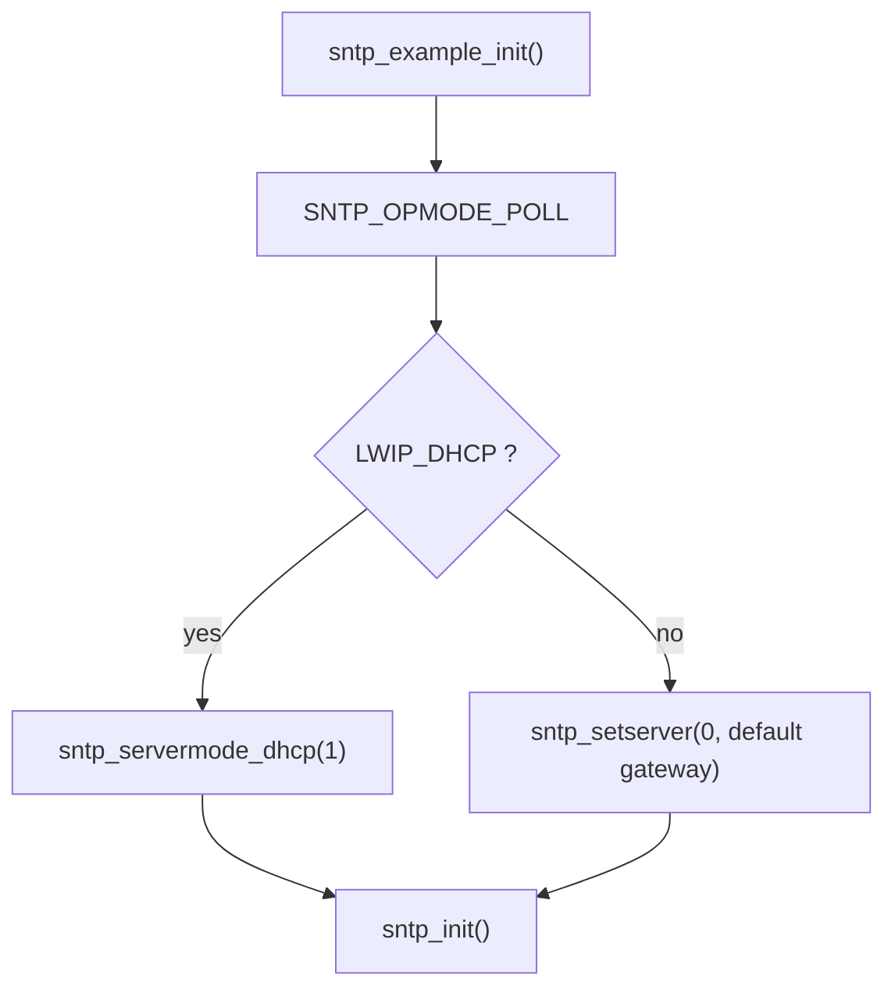
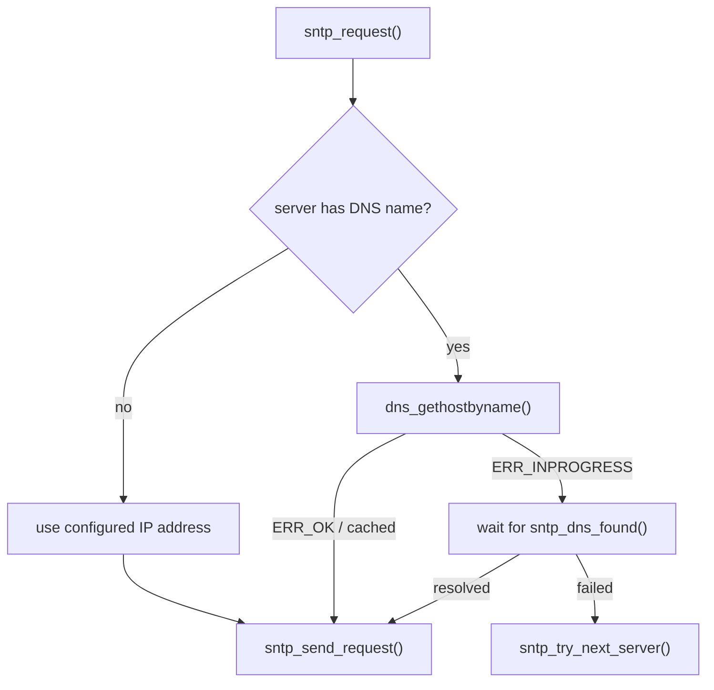
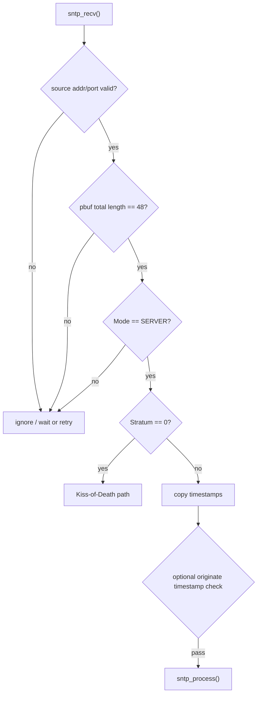
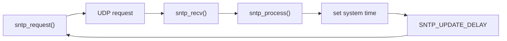
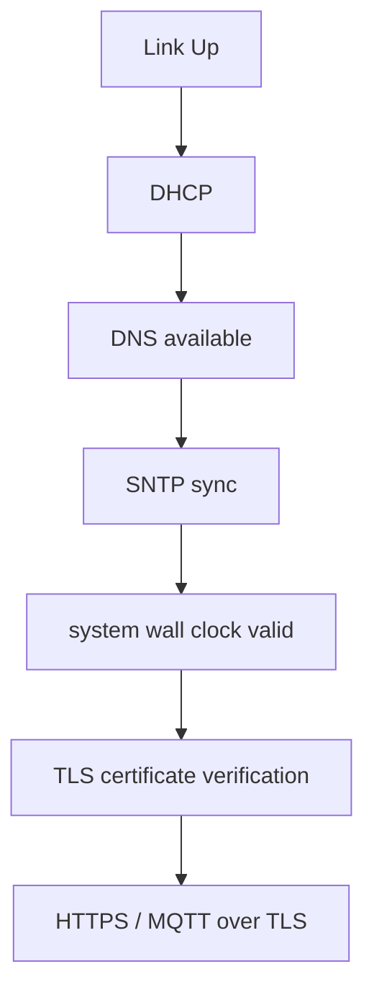
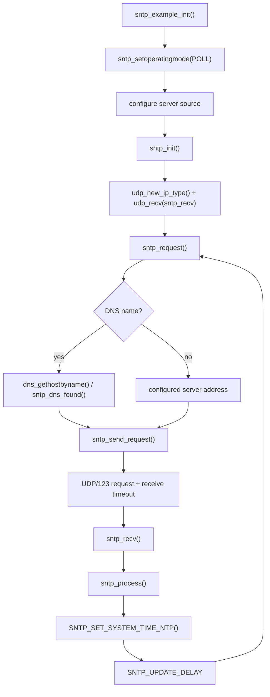

<meta name="referrer" content="no-referrer" />

# 教程 36：从 `sntp_example_init()` 到 `sntp_process()`——SNTP、DHCP/DNS、Timer 与系统时间同步

> 摘要：从 upstream SNTP example 追踪 Server 来源、DNS/UDP 请求、响应校验、Timer 与系统时间更新，并说明可靠时间为何会影响 TLS 证书验证和云连接。

[TOC]

Stage 13 已经追过 DHCP，Stage 14 已经追过 DNS，Stage 33～35 又把 TLS、HTTPS 与 MQTT over TLS 接到了 lwIP。Stage 36 不重新讲 UDP 或 DNS，而是从 upstream 的真实入口 `sntp_example_init()` 出发，回答设备联网后经常紧接着出现的一个问题：**IP 地址已经拿到了，为什么云设备还要先建立“可信时间”，lwIP 的 SNTP client 又是怎样把 DHCP/DNS、UDP、Timer 和系统时钟串起来的。** [S1](#source-s1)[S2](#source-s2)

本文源码使用用户提供的更新 `lwip.zip` 快照；与 upstream `master` commit `d08f4773edd0182b7910fc8f046eed82ffcd67c9` 对比后，本文涉及的 SNTP 源码文件 Git blob 完全一致，因此继续以该 commit 作为公开可追溯版本基线。[S1](#source-s1)[S2](#source-s2)

## 1. 从 `sntp_example_init()` 开始：example 先决定 Server 从哪里来

upstream example 的入口很短，但已经把 SNTP 初始化顺序写得很清楚：[S1](#source-s1)

```c
void
sntp_example_init(void)
{
  sntp_setoperatingmode(SNTP_OPMODE_POLL);
#if LWIP_DHCP
  sntp_servermode_dhcp(1); /* get SNTP server via DHCP */
#else /* LWIP_DHCP */
#if LWIP_IPV4
  sntp_setserver(0, netif_ip_gw4(netif_default));
#endif /* LWIP_IPV4 */
#endif /* LWIP_DHCP */
  sntp_init();
}
```

当前 example 选择 `SNTP_OPMODE_POLL`，也就是设备作为 SNTP client 主动向 Server 发 request，而不是监听广播时间。然后它根据构建配置选择 Server 来源：



这里有一个必须在 example 第一次出现时就说明的实现边界：**`LWIP_DHCP` 打开，不等于 DHCP 一定会把 NTP Server 交给 SNTP。** `sntp_servermode_dhcp()` 只有在 `SNTP_GET_SERVERS_FROM_DHCP` 或 DHCPv6 对应选项启用时才是真函数；否则 public header 直接把它定义为空宏。[S3](#source-s3)

而当前默认配置又是：[S3](#source-s3)[S4](#source-s4)

```text
LWIP_DHCP_GET_NTP_SRV = 0
SNTP_GET_SERVERS_FROM_DHCP = LWIP_DHCP_GET_NTP_SRV
```

所以如果只是打开 `LWIP_DHCP=1`，却没有额外打开 `LWIP_DHCP_GET_NTP_SRV`，继续阅读 `sntp_example_init()` 中的这条调用：

```c
sntp_servermode_dhcp(1);
```

不会自动产生一个可用 NTP Server。这不是 SNTP 协议限制，而是当前 lwIP 的编译配置关系。

## 2. DHCP Server 地址怎样真正进入 SNTP

当 `LWIP_DHCP_GET_NTP_SRV` 被启用后，Stage 13 里已经存在的 DHCP option parser 会开始接受 DHCP Option 42（NTP Server）。`dhcp.h` 同时要求系统提供：

```c
extern void dhcp_set_ntp_servers(u8_t num_ntp_servers,
                                 const ip4_addr_t* ntp_server_addrs);
```

SNTP module 正好实现了这个 callback。[S2](#source-s2)[S4](#source-s4)

调用关系是：


`dhcp_set_ntp_servers()` 还会检查 `sntp_set_servers_from_dhcp`。这个 flag 正是前面 `sntp_servermode_dhcp(1)` 设置的。因此 DHCP-NTP 集成要同时满足两个条件：

1. 编译时启用 `LWIP_DHCP_GET_NTP_SRV`；
2. 运行时允许 SNTP 接受 DHCP 下发的 Server。

这就是为什么不能把 `sntp_servermode_dhcp(1)` 理解成“主动去 DHCP 查询一次 NTP Server”。它只是打开 **DHCP callback 写入 SNTP server table 的许可**。

## 3. 进入 `sntp_init()`：真正创建的是一个 UDP Raw PCB

` sntp_example_init()` 最后调用 `sntp_init()`。下面进入 `sntp_init()`。[S2](#source-s2)

```c
void
sntp_init(void)
{
  /* LWIP_ASSERT_CORE_LOCKED(); is checked by udp_new() */
  LWIP_DEBUGF(SNTP_DEBUG_TRACE, ("sntp_init: SNTP initialised\n"));

#ifdef SNTP_SERVER_ADDRESS
#if SNTP_SERVER_DNS
  sntp_setservername(0, SNTP_SERVER_ADDRESS);
#else
#error SNTP_SERVER_ADDRESS string not supported SNTP_SERVER_DNS==0
#endif
#endif /* SNTP_SERVER_ADDRESS */

  if (sntp_pcb == NULL) {
    sntp_pcb = udp_new_ip_type(IPADDR_TYPE_ANY);
    LWIP_ASSERT("Failed to allocate udp pcb for sntp client", sntp_pcb != NULL);
    if (sntp_pcb != NULL) {
      udp_recv(sntp_pcb, sntp_recv, NULL);

      if (sntp_opmode == SNTP_OPMODE_POLL) {
        SNTP_RESET_RETRY_TIMEOUT();
#if SNTP_STARTUP_DELAY
        sys_timeout((u32_t)SNTP_STARTUP_DELAY_FUNC, sntp_request, NULL);
#else
        sntp_request(NULL);
#endif
      } else if (sntp_opmode == SNTP_OPMODE_LISTENONLY) {
        ip_set_option(sntp_pcb, SOF_BROADCAST);
        udp_bind(sntp_pcb, IP_ANY_TYPE, SNTP_PORT);
      }
    }
  }
}
```

这段代码完成三个关键动作：

- `udp_new_ip_type()` 创建 SNTP 专用 UDP PCB；
- `udp_recv(..., sntp_recv, ...)` 把回包入口绑定到 `sntp_recv()`；
- Poll mode 下安排第一次 `sntp_request()`。

因此 SNTP 并没有自己的线程。它仍然使用 lwIP Raw UDP API + `sys_timeout()` 驱动状态推进：

```text
UDP PCB
  + recv callback
  + sys_timeout()
  = SNTP client runtime
```

这也延续 Stage 11 的线程规则：在 `NO_SYS=0` 下，SNTP 属于 callback-style lwIP core API。`sntp_init()` 本身明确依赖 `udp_new()` 的 core-lock assertion，普通 RTOS task 或 IRQ 不能在没有 TCPIP-thread 调度/core locking 的情况下随意直接调用这些接口。[S8](#source-s8)

## 4. 第一次请求不是一定立即发送：`SNTP_STARTUP_DELAY` 决定入口时机

Poll mode 下存在两条进入 `sntp_request()` 的路径：

```text
SNTP_STARTUP_DELAY = 0
    -> sntp_init()
    -> sntp_request() immediately

SNTP_STARTUP_DELAY = 1
    -> sys_timeout(..., sntp_request, NULL)
    -> timeout expires
    -> sntp_request()
```

当前 `sntp_opts.h` 在存在 `LWIP_RAND` 时默认打开 startup delay，并把默认函数定义为 `LWIP_RAND() % 5000`。[S3](#source-s3) 源码注释同时引用 RFC 对启动随机延迟的要求；这里应区分“规范意图”和“当前默认实现值”，不要把当前宏值泛化成 SNTP 协议常量。

进入 `sntp_request()` 后，才真正决定此次请求使用 **IP 地址还是 DNS 名称**。

## 5. 进入 `sntp_request()`：DNS 只是 Server 地址获取的一条分支

`sntp_request()` 先检查当前 `sntp_servers[sntp_current_server]`。[S2](#source-s2)

当 `SNTP_SERVER_DNS=1` 且当前 Server 配置了名称时，它调用：

```text
dns_gethostbyname()
```

这里和 Stage 14 的异步 DNS 模型完全一致：



这说明 DNS 不是 SNTP 的一部分。SNTP core 只是允许 Server table 保存 hostname，并复用 lwIP DNS resolver 把 hostname 转成 `ip_addr_t`。

当前 upstream 默认 `SNTP_SERVER_DNS=0`，因此要使用类似 `pool.ntp.org` 的名字，必须在 `lwipopts.h` 中显式开启该能力。[S3](#source-s3)

## 6. 进入 `sntp_send_request()`：48 字节 request 通过 UDP/123 发出

地址已经确定后，`sntp_request()` 调用 `sntp_send_request()`。下面进入该函数。[S2](#source-s2)

```c
static void
sntp_send_request(const ip_addr_t *server_addr)
{
  struct pbuf *p;

  LWIP_ASSERT("server_addr != NULL", server_addr != NULL);

  p = pbuf_alloc(PBUF_TRANSPORT, SNTP_MSG_LEN, PBUF_RAM);
  if (p != NULL) {
    struct sntp_msg *sntpmsg = (struct sntp_msg *)p->payload;
    LWIP_DEBUGF(SNTP_DEBUG_STATE, ("sntp_send_request: Sending request to server\n"));
    sntp_initialize_request(sntpmsg);
    udp_sendto(sntp_pcb, p, server_addr, SNTP_PORT);
    pbuf_free(p);
#if SNTP_MONITOR_SERVER_REACHABILITY
    sntp_servers[sntp_current_server].reachability <<= 1;
#endif
    sys_untimeout(sntp_try_next_server, NULL);
    sys_timeout((u32_t)SNTP_RECV_TIMEOUT, sntp_try_next_server, NULL);
#if SNTP_CHECK_RESPONSE >= 1
    ip_addr_copy(sntp_last_server_address, *server_addr);
#endif
  } else {
    LWIP_DEBUGF(SNTP_DEBUG_SERIOUS, ("sntp_send_request: Out of memory, trying again in %"U32_F" ms\n",
                                     (u32_t)SNTP_RETRY_TIMEOUT));
    sys_untimeout(sntp_request, NULL);
    sys_timeout((u32_t)SNTP_RETRY_TIMEOUT, sntp_request, NULL);
  }
}
```

`SNTP_MSG_LEN` 在当前实现中固定为 48 字节，`SNTP_PORT` 对应标准 NTP/SNTP UDP 端口 123。[S2](#source-s2)[S3](#source-s3)[S5](#source-s5)

`pbuf_free(p)` 紧跟在 `udp_sendto()` 后并不代表数据已经从 PHY 发完；这里遵循 Raw UDP API 对发送数据复制/引用的既有 contract。Stage 03/05 已经讲过 pbuf 与 UDP send path，本篇只关注 SNTP 自己增加的状态。

发送成功后还会安排：

```text
SNTP_RECV_TIMEOUT
    ↓
sntp_try_next_server()
```

所以一次 poll request 从发送那一刻就带着“如果没收到有效响应怎么办”的 Timer。

## 7. `sntp_initialize_request()`：真正重要的是 Mode 与 Timestamp

`sntp_send_request()` 先调用 `sntp_initialize_request()` 构造 48 字节报文。[S2](#source-s2)

当前代码把第一个字节设置成：

```text
LI = no warning
VN = 4
Mode = client
```

其中 Mode=3 表示 client。若打开 `SNTP_CHECK_RESPONSE >= 2` 或 `SNTP_COMP_ROUNDTRIP`，request 还会把本地发送时刻写入 Transmit Timestamp，并保存下来供 response 的 Originate Timestamp 校验或 round-trip compensation 使用。

NTP/SNTP timestamp 不是 Unix `time_t` 的原样表示。当前 lwIP 实现内部把 NTP 时间处理成 32-bit seconds + 32-bit fraction，并用 2036 epoch 的 signed offset 技巧覆盖约 1968～2104 的日期范围。[S2](#source-s2) 这是当前实现的数据表示策略，不需要应用直接操作这些字段；正常产品只需要实现“系统时间怎么读/写”的宏接口。

## 8. 回包入口早在 `sntp_init()` 已经绑定：UDP 最终调用 `sntp_recv()`

前面 `sntp_init()` 已执行：

```c
udp_recv(sntp_pcb, sntp_recv, NULL);
```

因此 UDP/123 response 匹配到这个 PCB 后，会通过 Raw UDP callback 到达 `sntp_recv()`。这里不存在额外 SNTP worker thread。

`sntp_recv()` 的检查顺序是：[S2](#source-s2)



默认 `SNTP_CHECK_RESPONSE=0`，因此 source address/port 和 Originate Timestamp 的强化校验默认没有全部打开。[S3](#source-s3) 这同样是当前 lwIP 的尺寸/健壮性折中，不是协议允许任意 response 的意思。

## 9. Stratum 0：`sntp_recv()` 把 Kiss-of-Death 当成 Server 切换信号

当 response `stratum == 0` 时，当前实现进入 `SNTP_ERR_KOD` 路径，注释明确把它视为 Kiss-of-Death（KoD）。[S2](#source-s2)[S6](#source-s6)

如果支持多个 Server：

```text
current server gets kod_received = 1
    ↓
sntp_try_next_server()
    ↓
寻找下一个未被 KoD 标记且有地址/名称的 Server
```

如果只有一个 Server，则退化为 retry/backoff。

因此 `SNTP_MAX_SERVERS` 不只是一个数组大小，它直接决定失败时能否切换时间源。当前默认 `SNTP_MAX_SERVERS` 继承 `LWIP_DHCP_MAX_NTP_SERVERS`。[S3](#source-s3)

## 10. 进入 `sntp_process()`：真正改变系统时间的不是 SNTP core 自己

收到合法 response 后，`sntp_recv()` 调用 `sntp_process()`。下面进入 `sntp_process()`。[S2](#source-s2)

它首先取 Server 的 Transmit Timestamp：

```text
timestamps->xmit
    ↓
seconds + fraction
```

若 `SNTP_COMP_ROUNDTRIP=1`，还会结合：

```text
T1  client originate
T2  server receive
T3  server transmit
T4  client destination
```

计算 clock offset。当前默认该功能关闭。[S2](#source-s2)[S3](#source-s3)

继续阅读 `sntp_process()` 的末尾，无论是否做 round-trip compensation，最终都会到达：

```c
SNTP_SET_SYSTEM_TIME_NTP(sec, frac);
```

这是最重要的 Port 边界。

lwIP SNTP client 负责的是：

```text
得到“现在应该是什么时间”
```

它并不知道目标平台如何保存时间。真正把时间写进：

```text
Linux system clock
RTC
RTOS wall clock
MCU RTC peripheral
software epoch counter
```

属于平台/应用 Port。

如果项目没有定义更高精度接口，`SNTP_SET_SYSTEM_TIME_NTP()` 最终会降级到 `SNTP_SET_SYSTEM_TIME(sec)`。而 `sntp_opts.h` 给出的默认 `SNTP_SET_SYSTEM_TIME(sec)` 只是 `LWIP_UNUSED_ARG(sec)`，也就是 **默认什么都不设置**。[S2](#source-s2)[S3](#source-s3)

这意味着“SNTP packet 收到了”不等于“产品系统时间已经更新”。产品 Port 必须真正接上系统时钟。

## 11. upstream example 为什么只打印时间，而没有真正 set clock

`contrib/examples/sntp/sntp_example.c` 自己实现了：

```c
void
sntp_set_system_time(u32_t sec)
{
  char buf[32];
  struct tm current_time_val;
  time_t current_time = (time_t)sec;

#if defined(_WIN32) || defined(WIN32)
  localtime_s(&current_time_val, &current_time);
#else
  localtime_r(&current_time, &current_time_val);
#endif

  strftime(buf, sizeof(buf), "%d.%m.%Y %H:%M:%S", &current_time_val);
  LWIP_PLATFORM_DIAG(("SNTP time: %s\n", buf));
}
```

这是 **example behavior**：它把收到的时间转换成人类可读字符串并打印，用于演示 SNTP client 已得到时间。[S1](#source-s1)

生产 MCU 上不能把这一段理解为“SNTP 已经自动驱动 RTC”。真正产品实现应该让 `SNTP_SET_SYSTEM_TIME` / `SNTP_SET_SYSTEM_TIME_US` / `SNTP_SET_SYSTEM_TIME_NTP` 接到目标平台的系统时钟策略。

## 12. 一次同步成功后并不会结束：下一次请求由 Timer 再次启动

`sntp_recv()` 在正确 response 后：

1. 调用 `sntp_process()` 更新系统时间；
2. 清理当前 retry/receive timeout；
3. 重置 retry timeout；
4. 用 `SNTP_UPDATE_DELAY` 安排下一次 `sntp_request()`。[S2](#source-s2)

当前默认值包括：[S3](#source-s3)

| 配置 | 当前默认值 | 当前实现中的作用 |
|---|---:|---|
| `SNTP_RECV_TIMEOUT` | 15000 ms | 等待 response，超时后切 Server/重试 |
| `SNTP_UPDATE_DELAY` | 3600000 ms | 成功同步后的下一次 poll，默认 1 小时 |
| `SNTP_RETRY_TIMEOUT` | `SNTP_RECV_TIMEOUT` | 初始 retry delay |
| `SNTP_RETRY_TIMEOUT_EXP` | 1 | retry delay 指数增加 |
| `SNTP_RETRY_TIMEOUT_MAX` | `SNTP_RETRY_TIMEOUT * 10` | retry delay 上限 |
| `SNTP_MONITOR_SERVER_REACHABILITY` | 1 | 每 Server 维护 reachability shift register |

这些是当前 upstream 默认配置，不是所有产品都应该照搬的固定参数。

成功路径因此是一个周期循环：



失败路径则由 `SNTP_RECV_TIMEOUT`、`sntp_retry()` 和 `sntp_try_next_server()` 推动。

## 13. 为什么云设备经常在 TLS 之前做时间同步

SNTP 与 TLS 没有直接函数调用关系：

```text
sntp_process()
  X
altcp_tls / mbedTLS
```

真正关系发生在系统时间这一公共资源上。

X.509 certificate 通常携带有效期区间。Mbed TLS 的 X.509 verify API 定义了 `MBEDTLS_X509_BADCERT_EXPIRED` 和 `MBEDTLS_X509_BADCERT_FUTURE`，并提供基于 system time 判断证书时间是否已过期/尚未生效的逻辑。[S7](#source-s7)

因此典型 MCU 云连接启动顺序会是：



这里必须保留一个配置边界：**证书是否实际进行有效期检查，取决于具体 Mbed TLS build 与验证配置。** 因此不能写成“没有 SNTP 就绝对无法 TLS handshake”；准确说法是：当产品要求基于可信系统时间完成 X.509 有效期验证时，设备必须在验证前得到合理的当前时间，SNTP 是常见时间来源之一。[S7](#source-s7)

有 RTC、电池保持、可信启动时间或其他安全时间源的系统，不一定每次上电都必须先完成 SNTP。

## 14. SNTP 在产品网络状态机里的位置

前面已经学习过 DHCP、DNS、TLS、MQTT。现在可以给“网络 ready”增加一个更细的定义：

```text
L2/L3 ready
    = link up + IP address available

name service ready
    = DNS available

time ready
    = wall clock valid enough for product policy

secure cloud ready
    = TLS authenticated + application protocol connected
```

因此真实产品不要只维护一个模糊的：

```text
network_connected = true
```

而应该意识到这些状态可能分阶段到达。Stage 45 最终会把它们重新串成完整 MCU Cloud lifecycle；本篇只建立 SNTP 这一环。

## 15. Stage 36 的完整调用链

把已经出现的函数按真实执行顺序重新串起来：



Stage 36 到这里建立的是：**SNTP client 本身只负责获取和计算时间；Server 来源可以来自 DHCP、静态地址或 DNS，周期与失败恢复由 lwIP Timer 驱动，而真正的系统时钟写入属于平台 Port。**

下一篇 Stage 37 将转向设备主动访问云端的另一条高频路径：`httpc_get_file_dns()` → DNS → altcp/TCP 或 altcp/TLS → HTTP GET → Header/Body callback，把 HTTP/HTTPS Client 与 REST、配置拉取和 OTA 下载的网络侧基础接起来。

## 资料来源

<a id="source-s1"></a>
### [S1] lwIP upstream SNTP example
- 类型：用户提供源码快照 + upstream 对照
- 版本：用户提供 `lwip.zip`；相关文件 blob 与 upstream commit `d08f4773edd0182b7910fc8f046eed82ffcd67c9` 一致
- 定位：`contrib/examples/sntp/sntp_example.c`：`sntp_example_init()`、`sntp_set_system_time()`
- URL/文档：[lwIP sntp_example.c](https://github.com/lwip-tcpip/lwip/blob/d08f4773edd0182b7910fc8f046eed82ffcd67c9/contrib/examples/sntp/sntp_example.c)
- 使用位置：“真实入口”“DHCP/静态 Server 选择”“example 的时间打印行为”
- 支撑内容：证明 upstream example 怎样启动 SNTP，以及 example 只打印收到的时间而不代表通用 MCU RTC Port

<a id="source-s2"></a>
### [S2] lwIP SNTP client implementation
- 类型：用户提供源码快照 + upstream 对照
- 版本：同上
- 定位：`src/apps/sntp/sntp.c`：`sntp_init()`、`sntp_request()`、`sntp_dns_found()`、`sntp_send_request()`、`sntp_recv()`、`sntp_process()`、`sntp_retry()`、`sntp_try_next_server()`、`dhcp_set_ntp_servers()`
- URL/文档：[lwIP sntp.c](https://github.com/lwip-tcpip/lwip/blob/d08f4773edd0182b7910fc8f046eed82ffcd67c9/src/apps/sntp/sntp.c)
- 使用位置：Stage 36 Source-driven 主调用链
- 支撑内容：SNTP UDP PCB、DNS bridge、48-byte request/response、KoD、Timer、系统时间 Port 与 Server failover 的直接实现证据

<a id="source-s3"></a>
### [S3] lwIP SNTP public API 与 compile-time options
- 类型：用户提供源码快照 + upstream 对照
- 版本：同上
- 定位：`src/include/lwip/apps/sntp.h`、`src/include/lwip/apps/sntp_opts.h`
- URL/文档：[lwIP sntp.h](https://github.com/lwip-tcpip/lwip/blob/d08f4773edd0182b7910fc8f046eed82ffcd67c9/src/include/lwip/apps/sntp.h)、[lwIP sntp_opts.h](https://github.com/lwip-tcpip/lwip/blob/d08f4773edd0182b7910fc8f046eed82ffcd67c9/src/include/lwip/apps/sntp_opts.h)
- 使用位置：“DHCP/DNS 开关”“系统时间 hook”“timeout/update/retry 默认值”
- 支撑内容：限定当前 upstream 的默认配置与 Port contract，避免把实现默认值写成协议规定

<a id="source-s4"></a>
### [S4] lwIP DHCP NTP Server integration
- 类型：目标版本上游源码
- 版本：同上
- 定位：`src/include/lwip/opt.h`：`LWIP_DHCP_GET_NTP_SRV`；`src/include/lwip/dhcp.h`：`dhcp_set_ntp_servers()` contract；`src/core/ipv4/dhcp.c`：DHCP Option 42 parser
- URL/文档：[lwIP dhcp.h](https://github.com/lwip-tcpip/lwip/blob/d08f4773edd0182b7910fc8f046eed82ffcd67c9/src/include/lwip/dhcp.h)、[lwIP dhcp.c](https://github.com/lwip-tcpip/lwip/blob/d08f4773edd0182b7910fc8f046eed82ffcd67c9/src/core/ipv4/dhcp.c)
- 使用位置：“DHCP Server 地址怎样进入 SNTP”
- 支撑内容：证明 DHCP-NTP 需要 compile-time option 与 runtime servermode 两层条件

<a id="source-s5"></a>
### [S5] RFC 4330 — Simple Network Time Protocol Version 4
- 类型：协议规范
- 版本：RFC 4330，2006；已被 RFC 5905 取代，但当前 lwIP SNTP 源码仍明确以 RFC 4330 描述其 minimal SNTPv4 implementation
- URL/文档：[RFC 4330](https://www.rfc-editor.org/rfc/rfc4330.html)
- 使用位置：“SNTPv4 报文”“UDP/123”“poll/Server response”“Timer 规范背景”
- 支撑内容：提供 lwIP 当前实现所引用的 SNTPv4 协议背景

<a id="source-s6"></a>
### [S6] RFC 5905 — Network Time Protocol Version 4
- 类型：后续标准
- 版本：RFC 5905，2010
- URL/文档：[RFC 5905](https://www.rfc-editor.org/rfc/rfc5905.html)
- 使用位置：“KoD / Server reachability / 当前标准背景”
- 支撑内容：说明 RFC 4330 已被 NTPv4 规范更新；本文实现行为仍以目标 lwIP 源码为准

<a id="source-s7"></a>
### [S7] Mbed TLS X.509 verification time interface
- 类型：TLS library 官方源码/API 文档
- 版本：Mbed TLS development documentation，访问于 2026-10-02
- URL/文档：[Mbed TLS x509.h](https://github.com/Mbed-TLS/mbedtls/blob/development/include/mbedtls/x509.h)、[Mbed TLS x509_crt.h](https://github.com/Mbed-TLS/mbedtls/blob/development/include/mbedtls/x509_crt.h)
- 使用位置：“SNTP 为什么与 TLS/Cloud 有工程关系”
- 支撑内容：X.509 verify flags 包含 expired/future，且 time helper 会用系统时间判断证书有效期

<a id="source-s8"></a>
### [S8] lwIP Multithreading / Common pitfalls
- 类型：目标版本上游 Doxygen 文档
- 版本：commit `d08f4773edd0182b7910fc8f046eed82ffcd67c9`
- 定位：`doc/doxygen/main_page.h`：`Multithreading`、`Common pitfalls`
- URL/文档：[lwIP multithreading guidance](https://github.com/lwip-tcpip/lwip/blob/d08f4773edd0182b7910fc8f046eed82ffcd67c9/doc/doxygen/main_page.h)
- 使用位置：“SNTP Raw API 的 RTOS execution context”
- 支撑内容：说明 callback-style/core API 在 OS mode 下应由 TCPIP thread 或 core locking 保护
