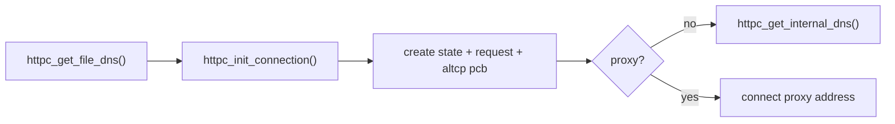
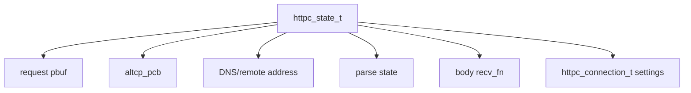
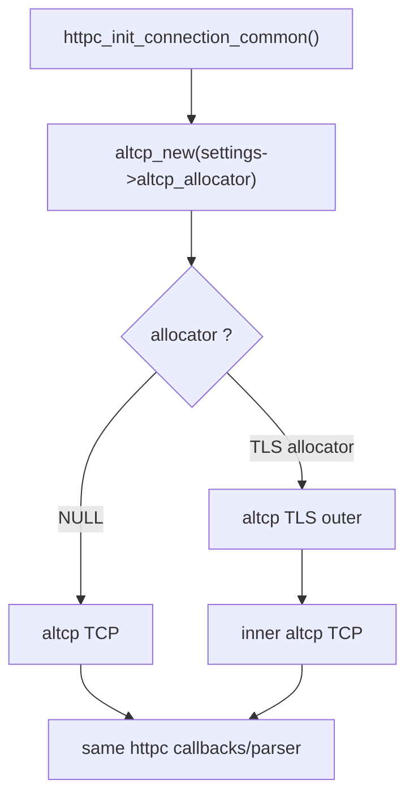
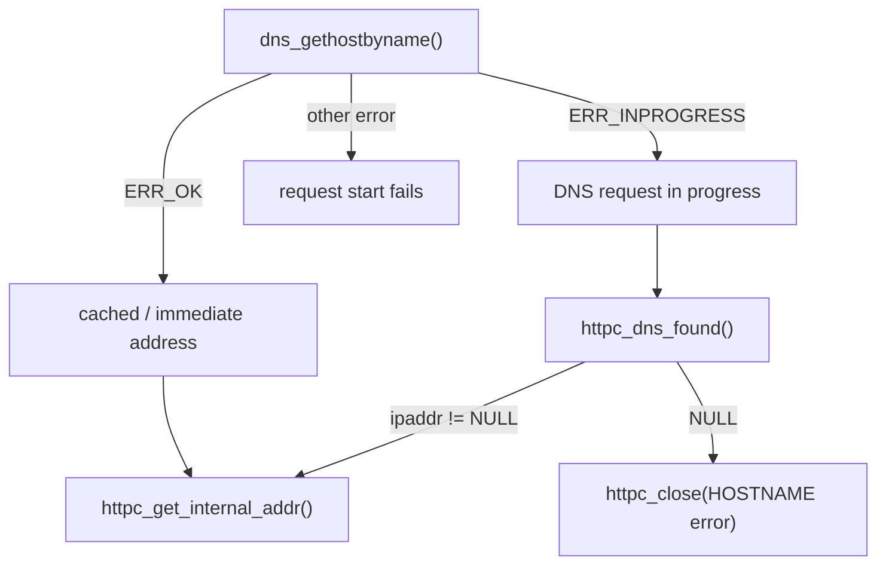
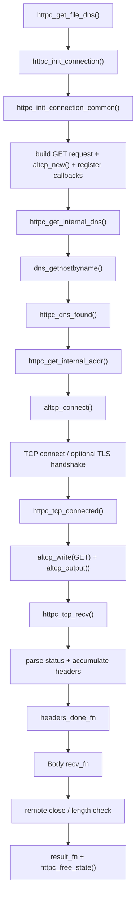

<meta name="referrer" content="no-referrer" />

# 教程 37：从 `httpc_get_file_dns()` 到 Body Callback——HTTP/HTTPS Client、DNS、altcp 与下载数据通路

> 摘要：从 lwIP HTTP client 公共入口追踪 DNS、altcp/TCP、GET、Header/Body callback，并说明 TLS allocator 如何把同一客户端切换成 HTTPS。

[TOC]

Stage 32～33 已经从 Server 方向追过 HTTPD 与 HTTPS：设备监听端口，Browser/Client 主动连接设备。Stage 37 反过来研究 MCU/RTOS 产品更常见的主动访问方向：**设备作为 HTTP Client，根据域名建立连接，发送 GET，接收 Header 和 Body，并在需要时把同一条 httpc 主线放到 altcp TLS 之上。** [S1](#source-s1)[S2](#source-s2)

本文源码继续使用用户提供的更新 `lwip.zip`。`src/apps/http/http_client.c`、`http_client.h`、altcp 与 altcp TLS 相关文件的 Git blob 已与 upstream `master` commit `d08f4773edd0182b7910fc8f046eed82ffcd67c9` 对照一致，因此正文仍绑定该 commit 作为公开源码基线。[S1](#source-s1)[S2](#source-s2)

## 1. 为什么从 `httpc_get_file_dns()` 开始，而不是从某个 example 开始

当前 upstream 没有像 MQTT/SNTP 那样提供一条独立的 `contrib/examples/http_client/...` application 入口；HTTP client 的真实对外入口就在 public API 中。因此本篇 Source-driven 主线从：

```c
httpc_get_file_dns()
```

开始，而不是人为制造一个不存在的 upstream demo。[S1](#source-s1)[S2](#source-s2)

public header 给出两条主要 GET 入口：

```c
err_t httpc_get_file(const ip_addr_t* server_addr, u16_t port,
                     const char* uri,
                     const httpc_connection_t *settings,
                     altcp_recv_fn recv_fn,
                     void* callback_arg,
                     httpc_state_t **connection);

err_t httpc_get_file_dns(const char* server_name, u16_t port,
                         const char* uri,
                         const httpc_connection_t *settings,
                         altcp_recv_fn recv_fn,
                         void* callback_arg,
                         httpc_state_t **connection);
```

区别很直接：

```text
httpc_get_file()
    -> application 已经有 ip_addr_t

httpc_get_file_dns()
    -> application 给 hostname/IP string
    -> httpc 自己经过 DNS/address parse
```

面向 Cloud/REST/OTA 场景，Server 通常以域名配置，因此本篇选 `httpc_get_file_dns()` 作为主入口。

## 2. 应用给 httpc 的四类信息分别控制什么

进入源码前先只解释 `httpc_get_file_dns()` 此刻真正用到的参数：[S1](#source-s1)

```text
server_name
    -> DNS 查询目标 + HTTP Host header

port
    -> TCP/TLS remote port

uri
    -> GET request-target，例如 /firmware/app.bin

settings
    -> result callback / headers callback /
       proxy / altcp allocator

recv_fn
    -> Body pbuf 的消费 callback
```

其中 `httpc_connection_t` 最关键：

```c
typedef struct _httpc_connection {
  ip_addr_t proxy_addr;
  u16_t proxy_port;
  u8_t use_proxy;

#if LWIP_ALTCP
  altcp_allocator_t *altcp_allocator;
#endif

  httpc_result_fn result_fn;
  httpc_headers_done_fn headers_done_fn;
} httpc_connection_t;
```

`altcp_allocator` 就是 Stage 33 已经见过的 transport 注入点：

```text
NULL
  -> plain TCP

TLS allocator
  -> TLS outer + TCP inner
```

所以 HTTP 与 HTTPS 并不是两套 httpc parser。

## 3. 进入 `httpc_get_file_dns()`：先创建 request state，再启动 DNS/Connect

下面是完整 public entry。[S2](#source-s2)

```c
err_t
httpc_get_file_dns(const char* server_name, u16_t port, const char* uri, const httpc_connection_t *settings,
                   altcp_recv_fn recv_fn, void* callback_arg, httpc_state_t **connection)
{
  err_t err;
  httpc_state_t* req;

  LWIP_ERROR("invalid parameters", (server_name != NULL) && (uri != NULL) && (recv_fn != NULL), return ERR_ARG;);

  err = httpc_init_connection(&req, settings, server_name, port, uri, recv_fn, callback_arg);
  if (err != ERR_OK) {
    return err;
  }

  if (settings && settings->use_proxy) {
    err = httpc_get_internal_addr(req, &settings->proxy_addr);
  } else {
    err = httpc_get_internal_dns(req, server_name);
  }
  if (err != ERR_OK) {
    httpc_free_state(req);
    return err;
  }

  if (connection != NULL) {
    *connection = req;
  }
  return ERR_OK;
}
```

主流程因此先分成两步：



这一点很重要：`ERR_OK` 表示“异步 HTTP request 已经成功启动”，不是“文件已经下载完成”。最终结果必须等待 `result_fn`。

## 4. 进入 `httpc_init_connection_common()`：HTTP request 在 connect 前就已经生成

`httpc_init_connection()` 很薄，只转入 `httpc_init_connection_common()`。这个函数同时创建 state、构造 GET request、创建 altcp connection，并注册全部 callback。[S2](#source-s2)

先看对象关系：



当前 `httpc_state_t` 保存：

- `pcb`：当前 altcp connection；
- `remote_addr/remote_port`：连接目标；
- `request`：还没有发出的 HTTP GET request；
- `rx_hdrs`：Header 尚未收完整时的 pbuf chain；
- `rx_status`：HTTP status code；
- `hdr_content_len` / `rx_content_len`：Header 声明长度与实际接收 Body 长度；
- `parse_state`：当前正在等 status line、Header 还是 Body。

`settings` 本身不是深拷贝，而是以 pointer 保存到 `req->conn_settings`。因此应用不能用一个已经离开生命周期的临时 `httpc_connection_t` 给长期异步 request 使用；至少要保证它存活到 transfer 完成 callback。[S2](#source-s2)

## 5. `httpc_create_request_string()`：当前 client 是一个刻意最小化的 HTTP/1.1 GET client

state 分配前，`httpc_init_connection_common()` 先计算 request string 长度，然后分配一个能够完整容纳 request 的单个 `PBUF_RAM`。当前 request template 是：[S2](#source-s2)

```text
GET <uri> HTTP/1.1\r\n
User-Agent: lwIP/<version> ...\r\n
Accept: */*\r\n
Host: <server_name>\r\n
Connection: Close\r\n
\r\n
```

从源码开头的 TODO 与 request template 可以直接确定当前能力边界；GET/HTTP request-response 语义由 HTTP Semantics 定义，而这里具体生成的是 HTTP/1.1 message syntax。[S2](#source-s2)[S6](#source-s6)[S7](#source-s7)

- request method 固定为 GET；
- HTTP version 固定生成 HTTP/1.1；
- 明确发送 `Connection: Close`，当前不做 persistent connection；
- 源码 TODO 明确还没有自动 follow redirect；
- 支持简单 HTTP proxy；
- Header parser 是轻量实现，不是完整通用 HTTP framework。

所以它非常适合：

```text
下载一个明确资源
配置拉取
OTA metadata
固件/资源 GET
简单 REST GET
```

但不应该因为名字叫 HTTP Client 就推断它具备完整 Browser/cURL 功能。

## 6. 同一个初始化点决定 HTTP 还是 HTTPS：`altcp_new()` 看 allocator

`httpc_init_connection_common()` 中最关键的一行是：[S2](#source-s2)

```c
req->pcb = altcp_new(settings ? settings->altcp_allocator : NULL);
```

`altcp_new_ip_type()` 的实现规则非常简单：[S3](#source-s3)

```text
allocator == NULL
    -> altcp_tcp_new_ip_type()
    -> plain TCP

allocator != NULL
    -> allocator->alloc(allocator->arg, ip_type)
    -> application 决定 transport layer
```

因此 HTTP/HTTPS 的分界点不是 request parser，而是 connection allocator：



这就是 Stage 32～35 一直在建立的 altcp 价值：应用协议不需要重新实现一套 TLS 版本。

## 7. callback 在真正 connect 之前就全部注册完成

创建 `req->pcb` 后，当前实现立即绑定：[S2](#source-s2)

```text
altcp_arg(req->pcb, req)
altcp_recv(req->pcb, httpc_tcp_recv)
altcp_err(req->pcb, httpc_tcp_err)
altcp_poll(req->pcb, httpc_tcp_poll, ...)
altcp_sent(req->pcb, httpc_tcp_sent)
```

因此后面出现：

```text
connected
recv
error
poll timeout
```

都能通过同一个 `httpc_state_t` 找回当前 request state。

这条初始化链要在第一次使用 callback 前说明清楚，否则后面的 `httpc_tcp_recv()` 会显得像凭空出现。

## 8. 回到 `httpc_get_file_dns()`：进入 `httpc_get_internal_dns()`

state 与 callback 都准备好后，`httpc_get_file_dns()` 调用 `httpc_get_internal_dns()`。[S2](#source-s2)

当 `LWIP_DNS=1`：

```text
dns_gethostbyname(server_name,
                  &req->remote_addr,
                  httpc_dns_found,
                  req)
```

会出现三种结果：



当 `LWIP_DNS=0`，这个函数只能尝试把 `server_name` 当成 IP address string 解析；普通域名不会神奇地被解析。[S2](#source-s2)

Stage 14 已经完整讲过 DNS cache / UDP / async callback，本篇只保留这条 bridge。

## 9. DNS 返回以后进入 `httpc_get_internal_addr()`：开始真正的 transport connect

`httpc_dns_found()` 成功时直接调用 `httpc_get_internal_addr(req, ipaddr)`。下面进入这个函数。[S2](#source-s2)

```c
static err_t
httpc_get_internal_addr(httpc_state_t* req, const ip_addr_t *ipaddr)
{
  err_t err;
  LWIP_ASSERT("req != NULL", req != NULL);

  if (&req->remote_addr != ipaddr) {
    req->remote_addr = *ipaddr;
  }

  err = altcp_connect(req->pcb, &req->remote_addr, req->remote_port, httpc_tcp_connected);
  if (err == ERR_OK) {
    return ERR_OK;
  }
  LWIP_DEBUGF(HTTPC_DEBUG_WARN_STATE, ("tcp_connect failed: %d\n", (int)err));
  return err;
}
```

如果是 plain HTTP：

```text
altcp_connect()
  -> TCP active open
  -> TCP handshake completes
  -> httpc_tcp_connected()
```

如果是 TLS allocator：

```text
altcp_connect(TLS outer)
  -> inner TCP connect
  -> TLS handshake
  -> secure transport ready
  -> httpc_tcp_connected()
```

也就是说，HTTPS 模式下 `httpc_tcp_connected()` 和 Stage 35 的 `mqtt_tcp_connect_cb()` 一样，看到的是 **altcp transport 已 ready**，而不只是裸 TCP 三次握手刚结束。[S4](#source-s4)[S5](#source-s5)

## 10. 进入 `httpc_tcp_connected()`：GET request 只发送一次

transport connect 成功后进入 `httpc_tcp_connected()`。[S2](#source-s2)

```c
static err_t
httpc_tcp_connected(void *arg, struct altcp_pcb *pcb, err_t err)
{
  err_t r;
  httpc_state_t* req = (httpc_state_t*)arg;
  LWIP_UNUSED_ARG(pcb);
  LWIP_UNUSED_ARG(err);

  r = altcp_write(req->pcb, req->request->payload, req->request->len - 1, TCP_WRITE_FLAG_COPY);
  if (r != ERR_OK) {
     return httpc_close(req, HTTPC_RESULT_ERR_MEM, 0, r);
  }
  pbuf_free(req->request);
  req->request = NULL;

  altcp_output(req->pcb);
  return ERR_OK;
}
```

这里有两个明确的实现选择：

1. 整个 request 在 connect 前已经准备好；
2. `altcp_write()` 如果不能一次接受这个“小 request”，当前代码直接失败，不建立像 HTTPD/MQTT 那样复杂的 request TX state machine。

成功写入后 request pbuf 就释放，因为 `TCP_WRITE_FLAG_COPY` 已要求下层复制数据。

plain HTTP 与 HTTPS 到这里仍使用同样代码：

```text
HTTP request bytes
   -> altcp_write()
      -> TCP

HTTP request bytes
   -> altcp_write(TLS outer)
      -> mbedtls_ssl_write()
      -> encrypted TLS records
      -> inner TCP
```

## 11. Server response 到达：`httpc_tcp_recv()` 先积累 Header，再把 Body 交给应用

`httpc_init_connection_common()` 早已注册：

```c
altcp_recv(req->pcb, httpc_tcp_recv);
```

所以 transport 收到 application plaintext 后会进入 `httpc_tcp_recv()`。HTTPS 时 TLS 已经先解密，httpc parser 不处理 TLS record。[S2](#source-s2)[S5](#source-s5)

当前 parser 有三个状态：[S2](#source-s2)

```text
HTTPC_PARSE_WAIT_FIRST_LINE
        ↓
HTTPC_PARSE_WAIT_HEADERS
        ↓
HTTPC_PARSE_RX_DATA
```

首次数据到达时，如果 Header 跨多个 TCP segment/pbuf，`httpc_tcp_recv()` 会把这些 pbuf 用 `pbuf_cat()` 暂存到 `req->rx_hdrs`，直到能找到完整：

```text
\r\n\r\n
```

这说明 HTTP 的 message boundary 与 TCP segment boundary 没有一一对应关系。Header 可以被拆开到多次 TCP receive callback，httpc 必须先恢复 application-level boundary。

## 12. status line 与 Header：当前 parser 只提取它真正需要的最小信息

`http_parse_response_status()` 从第一行提取：

```text
HTTP version
HTTP status code
```

然后 `http_wait_headers()` 搜索 Header 结束符，并尝试读取：

```text
Content-Length: <number>
```

当前实现对 `Content-Length: ` 使用直接字符串搜索，源码里还留有“case insensitive?” TODO。[S2](#source-s2)

这再次说明当前 httpc 的定位：它是轻量嵌入式 GET client，不是完整 HTTP parser library。

Header 完整后：

```text
altcp_recved(header bytes)
    ↓
headers_done_fn(...)
    ↓
pbuf_free_header(...)
    ↓
剩余 pbuf view 只保留 Body
    ↓
HTTPC_PARSE_RX_DATA
```

如果同一个 TCP pbuf 中同时包含：

```text
HTTP Header + Body 前几个字节
```

`pbuf_free_header()` 只移动数据视图，Body 不会被丢掉，而是继续进入后面的 Body callback。

## 13. `headers_done_fn` 与 `recv_fn` 是两种不同 callback

`httpc_connection_t::headers_done_fn` 只在完整 Header 被确认后调用一次，可以读取：

```text
HTTP status/header pbuf
header length
Content-Length（若识别到）
```

并允许通过返回非 `ERR_OK` 主动 abort。

而 `recv_fn` 接收的是 **Body pbuf**。当前 `httpc_tcp_recv()` 在进入 Body 状态后会：

```text
req->rx_content_len += p->tot_len
    ↓
reset timeout
    ↓
return req->recv_fn(..., p, ...)
```

这里它直接把 pbuf ownership 交给 callback，没有在返回前自动 `pbuf_free(p)`。[S2](#source-s2)

源码自带的 `httpc_fs_tcp_recv()` 给出了正确消费模式：[S2](#source-s2)

```c
static err_t
httpc_fs_tcp_recv(void *arg, struct altcp_pcb *pcb, struct pbuf *p, err_t err)
{
  httpc_filestate_t *filestate = (httpc_filestate_t*)arg;
  struct pbuf* q;
  LWIP_UNUSED_ARG(err);

  LWIP_ASSERT("p != NULL", p != NULL);

  for (q = p; q != NULL; q = q->next) {
    fwrite(q->payload, 1, q->len, filestate->file);
  }
  altcp_recved(pcb, p->tot_len);
  pbuf_free(p);
  return ERR_OK;
}
```

因此自定义 OTA/配置下载 callback 也必须认真处理：

```text
消费 pbuf chain
    ↓
altcp_recved()
    ↓
pbuf_free()
```

不能只保存 `p->payload` pointer 后立即返回，再假设它长期有效。

## 14. `p == NULL` 才进入 transfer completion 判断

当前 request 明确使用 HTTP/1.1 的 close-delimited connection strategy：[S7](#source-s7)

```text
Connection: Close
```

所以 remote close 是正常 transfer lifecycle 的一部分。

`httpc_tcp_recv()` 收到 `p == NULL` 时会判断：[S2](#source-s2)

```text
还没进入 Body
    -> HTTPC_RESULT_ERR_CLOSED

有 Content-Length，实际 Body 长度不匹配
    -> HTTPC_RESULT_ERR_CONTENT_LEN

已经接收 Body，长度匹配或没有 Content-Length
    -> HTTPC_RESULT_OK
```

然后进入：

```text
httpc_close()
    ↓
settings->result_fn(...)
    ↓
httpc_free_state()
    ↓
close / abort altcp connection
```

注意 `HTTPC_RESULT_OK` 表示 **HTTP transfer 在当前 client 的 transport/body 完整性语义下成功完成**。HTTP status code 仍通过 `srv_res` 单独返回。

当前实现不会因为收到 404/500 就自动把它转换成一个完整的高级“REST exception”模型；应用应该结合 `httpc_result` 与 `srv_res` 判断业务结果。[S1](#source-s1)[S2](#source-s2)

## 15. Poll timeout：没有进展的连接最终会被 `httpc_tcp_poll()` 关闭

初始化时 httpc 注册：

```text
altcp_poll(req->pcb, httpc_tcp_poll, HTTPC_POLL_INTERVAL)
```

`httpc_state_t::timeout_ticks` 初始为 `HTTPC_POLL_TIMEOUT`。当前源码：

```text
HTTPC_POLL_INTERVAL = 1
HTTPC_POLL_TIMEOUT  = 30   /* 15 seconds */
```

收到有效 Body 数据时会把 tick counter 重置。若 poll callback 连续把它减到 0：

```text
httpc_close(..., HTTPC_RESULT_ERR_TIMEOUT, ...)
```

所以 timeout 同样属于异步 callback lifecycle，而不是 application thread 阻塞等待一个固定秒数。[S2](#source-s2)

## 16. HTTPS 不需要第二个 HTTP client：只要提供 TLS allocator

`altcp.c` 自己给出了 TLS allocator 的标准构造方式：[S3](#source-s3)[S4](#source-s4)

下面是基于 upstream API 的**集成示意**，不是 upstream HTTP client example 原文：

```c
struct altcp_tls_config *tls_config;
altcp_allocator_t tls_allocator;
httpc_connection_t settings;

memset(&settings, 0, sizeof(settings));

tls_config = altcp_tls_create_config_client(ca_cert, ca_cert_len);

tls_allocator.alloc = altcp_tls_alloc;
tls_allocator.arg   = tls_config;

settings.altcp_allocator = &tls_allocator;
settings.result_fn = http_result_cb;
settings.headers_done_fn = http_headers_cb;

httpc_get_file_dns("api.example.com", 443, "/config.json",
                   &settings, http_body_cb, app_ctx, NULL);
```

对象关系变成：

```text
httpc_state_t
    ↓
altcp TLS outer
    ↓
mbedTLS
    ↓
altcp TCP inner
    ↓
tcp_pcb
```

HTTP request/response parser完全不需要改变。

## 17. 但“套上 TLS”还不等于一个完整生产级 HTTPS 身份验证策略

这一点必须在第一次把 httpc 切到 TLS 时说明清楚。

当前 lwIP mbedTLS port 的 client config 允许传入 CA；源码明确说明 CA 在实现上是可选的，但生产环境建议提供，否则连接容易受到中间人攻击。[S5](#source-s5)

同时当前默认：

```text
ALTCP_MBEDTLS_AUTHMODE = MBEDTLS_SSL_VERIFY_OPTIONAL
```

而不是强制 `VERIFY_REQUIRED`。[S5](#source-s5)

更重要的是，检查本文目标版本的 `http_client.c` 与 `altcp_tls_mbedtls.c`，`server_name` 会用于 DNS 和 HTTP `Host` Header，但 httpc 本身没有调用 `mbedtls_ssl_set_hostname()`，当前 altcp TLS port 中也没有自动把 HTTP hostname 注入 Mbed TLS hostname/SNI verification。[S2](#source-s2)[S5](#source-s5)

因此生产产品不能把：

```text
port = 443
+ altcp TLS allocator
```

直接等同于：

```text
完整、严格的 Web PKI HTTPS 身份验证已经完成
```

产品需要明确审核：

```text
CA trust
certificate verification mode
certificate validity time
peer hostname verification
SNI
```

是否满足自身安全要求。Stage 33 已经解释过 TLS transport 机制；Stage 37 这里补的是 **HTTP client 集成时的身份验证边界**。

## 18. Stage 36 的系统时间现在真正接到 HTTPS 上了

如果产品启用了 X.509 certificate validity checking，HTTPS TLS handshake 需要一个合理的当前系统时间来判断 certificate 是否 expired / not-yet-valid。[S5](#source-s5)

于是 Stage 36 与 Stage 37 形成：


这就是为什么很多 MCU Cloud startup flow 会把“时间 ready”放在 HTTPS/MQTT-TLS 之前。

## 19. OTA 下载时 httpc 真正能帮什么，不能帮什么

HTTP client 很适合 OTA 的 **网络传输部分**：

```text
DNS
  ↓
TCP/TLS
  ↓
GET /firmware.bin
  ↓
Body pbuf stream
```

但是它不会替产品完成：

```text
Flash erase/program
image partition selection
firmware signature verification
hash verification
version policy
rollback
bootloader state transition
power-loss recovery
```

因此真实 OTA 架构应明确分层：

```text
lwIP httpc
    -> 可靠取得 byte stream

OTA manager
    -> 消费 byte stream
    -> 写目标 slot
    -> 完整性/签名验证
    -> 切换启动状态
```

这和前面一直强调的 Core/Port/Product responsibility 一致。

## 20. `LWIP_HTTPC_HAVE_FILE_IO` 是 example helper，不是 MCU 必须的文件系统依赖

public header 提供：

```text
LWIP_HTTPC_HAVE_FILE_IO
```

打开后会编译 `httpc_get_file_to_disk()` / `httpc_get_file_dns_to_disk()`，内部用 `fopen/fwrite/fclose` 把 Body 直接写文件。[S1](#source-s1)[S2](#source-s2)

header 自己明确说明这些函数只是 interface example implementation。

所以 MCU OTA 并不要求必须先有 POSIX filesystem：

```text
Body callback
    -> Flash writer
```

完全可以替代：

```text
Body callback
    -> fwrite()
```

未来进入 RT-Thread 时，这一点也很有用：不要因为看见 File I/O helper 就误以为 HTTP client 核心依赖 DFS/文件系统。

## 21. HTTP client 的运行上下文仍然属于 callback-style lwIP core API

`httpc` 最终直接创建 altcp PCB、注册 callback 并调用 `altcp_connect()`。因此和 MQTT/SNTP 一样，在 `NO_SYS=0` 的 RTOS 模式下要遵守 lwIP core execution-context contract。[S8](#source-s8)

也就是说，未来 RT-Thread application thread 想发起：

```c
httpc_get_file_dns(...);
```

不能因为它“看起来是应用层 API”就忽略线程约束。应通过 TCPIP thread 调度或已配置的 core locking 进入，具体 RT-Thread 集成会留到 Stage 39，而不是在本篇展开 RT-Thread 内部实现。

## 22. Stage 37 的完整主调用链

把本篇已经出现的对象和 callback 按实际顺序串起来：



Stage 37 到这里建立的是：

```text
HTTP Client
  = DNS/address resolution
  + altcp transport
  + minimal HTTP/1.1 GET formatting/parsing
  + Header callback
  + streamed Body callback
  + completion/error callback
```

把 `altcp_allocator` 换成 TLS allocator 后，这条链就成为 HTTPS；httpc 本身不需要第二套 parser。

至此，面向 MCU / RTOS / IoT 产品开发的 lwIP **主要纯软件协议与应用主线**已经基本覆盖完成。后续 Stage 38 将不再继续罗列 application protocol，而是转向另一个层次：拿到 upstream lwIP 后，如何通过 `lwipopts.h`、源码选择、OS Port 与 Network Port 真正完成裁剪和移植。

## 资料来源

<a id="source-s1"></a>
### [S1] lwIP HTTP client public API
- 类型：用户提供源码快照 + upstream 对照
- 版本：用户提供 `lwip.zip`；相关文件 blob 与 upstream commit `d08f4773edd0182b7910fc8f046eed82ffcd67c9` 一致
- 定位：`src/include/lwip/apps/http_client.h`：`httpc_connection_t`、`httpc_result_t`、`httpc_get_file()`、`httpc_get_file_dns()`、Header/Body callback contract
- URL/文档：[lwIP http_client.h](https://github.com/lwip-tcpip/lwip/blob/d08f4773edd0182b7910fc8f046eed82ffcd67c9/src/include/lwip/apps/http_client.h)
- 使用位置：“公共入口”“settings/allocator/callback contract”“File I/O helper 边界”
- 支撑内容：限定应用可配置的 HTTP client interface

<a id="source-s2"></a>
### [S2] lwIP HTTP client implementation
- 类型：用户提供源码快照 + upstream 对照
- 版本：同上
- 定位：`src/apps/http/http_client.c`：`httpc_get_file_dns()`、`httpc_init_connection_common()`、`httpc_get_internal_dns()`、`httpc_dns_found()`、`httpc_get_internal_addr()`、`httpc_tcp_connected()`、`httpc_tcp_recv()`、`httpc_tcp_poll()`、`httpc_close()`、`httpc_fs_tcp_recv()`
- URL/文档：[lwIP http_client.c](https://github.com/lwip-tcpip/lwip/blob/d08f4773edd0182b7910fc8f046eed82ffcd67c9/src/apps/http/http_client.c)
- 使用位置：Stage 37 Source-driven 主调用链
- 支撑内容：GET request 构造、DNS bridge、Header/Body parsing、pbuf ownership、timeout、completion 与当前实现能力边界

<a id="source-s3"></a>
### [S3] lwIP altcp allocator abstraction
- 类型：目标版本上游源码
- 版本：同上
- 定位：`src/core/altcp.c`：allocator 说明、`altcp_new_ip_type()`；`src/include/lwip/altcp.h`：`altcp_allocator_t`
- URL/文档：[lwIP altcp.c](https://github.com/lwip-tcpip/lwip/blob/d08f4773edd0182b7910fc8f046eed82ffcd67c9/src/core/altcp.c)
- 使用位置：“HTTP 与 HTTPS 如何共享 httpc”“NULL allocator 与 TLS allocator 的分界”
- 支撑内容：证明 transport layer 由 runtime allocator 决定

<a id="source-s4"></a>
### [S4] lwIP altcp TLS allocator API
- 类型：目标版本上游源码
- 版本：同上
- 定位：`src/include/lwip/altcp_tls.h`：client config、`altcp_tls_alloc()`；`src/core/altcp_alloc.c`：`altcp_tls_new()`、`altcp_tls_alloc()`
- URL/文档：[lwIP altcp_tls.h](https://github.com/lwip-tcpip/lwip/blob/d08f4773edd0182b7910fc8f046eed82ffcd67c9/src/include/lwip/altcp_tls.h)、[lwIP altcp_alloc.c](https://github.com/lwip-tcpip/lwip/blob/d08f4773edd0182b7910fc8f046eed82ffcd67c9/src/core/altcp_alloc.c)
- 使用位置：“HTTPS allocator 集成”“TLS outer + TCP inner”
- 支撑内容：说明 HTTP client 如何在不改变 parser 的情况下创建 TLS-over-TCP connection

<a id="source-s5"></a>
### [S5] lwIP altcp mbedTLS client implementation
- 类型：目标版本上游源码
- 版本：同上
- 定位：`src/apps/altcp_tls/altcp_tls_mbedtls.c`：`altcp_tls_create_config_client_common()`、`altcp_tls_create_config_client()`、TLS handshake/BIO；`src/include/lwip/apps/altcp_tls_mbedtls_opts.h`：`ALTCP_MBEDTLS_AUTHMODE`
- URL/文档：[lwIP altcp_tls_mbedtls.c](https://github.com/lwip-tcpip/lwip/blob/d08f4773edd0182b7910fc8f046eed82ffcd67c9/src/apps/altcp_tls/altcp_tls_mbedtls.c)、[lwIP altcp TLS options](https://github.com/lwip-tcpip/lwip/blob/d08f4773edd0182b7910fc8f046eed82ffcd67c9/src/include/lwip/apps/altcp_tls_mbedtls_opts.h)
- 使用位置：“HTTPS handshake”“CA/authmode/hostname verification 安全边界”“系统时间与证书有效期”
- 支撑内容：证明当前 mbedTLS port 的 client verification 默认与 config 行为，避免把“用了 TLS”误写成“完整 Web PKI 验证已自动建立”

<a id="source-s6"></a>
### [S6] RFC 9110 — HTTP Semantics
- 类型：IETF Internet Standard
- 版本：RFC 9110 / STD 97，2022
- URL/文档：[RFC 9110](https://www.rfc-editor.org/rfc/rfc9110.html)
- 使用位置：“HTTP request/response 与 GET 语义”“status code 与 transfer result 的区别”
- 支撑内容：提供 HTTP 通用语义；当前 lwIP parser 能力仍以目标源码为准

<a id="source-s7"></a>
### [S7] RFC 9112 — HTTP/1.1
- 类型：IETF Internet Standard
- 版本：RFC 9112 / STD 99，2022
- URL/文档：[RFC 9112](https://www.rfc-editor.org/rfc/rfc9112.html)
- 使用位置：“HTTP/1.1 message syntax”“Connection: Close”“Header/body framing 背景”
- 支撑内容：提供 HTTP/1.1 wire-format 与 connection-management 规范背景

<a id="source-s8"></a>
### [S8] lwIP Multithreading / Common pitfalls
- 类型：目标版本上游 Doxygen 文档
- 版本：commit `d08f4773edd0182b7910fc8f046eed82ffcd67c9`
- 定位：`doc/doxygen/main_page.h`：`Multithreading`、`Common pitfalls`
- URL/文档：[lwIP multithreading guidance](https://github.com/lwip-tcpip/lwip/blob/d08f4773edd0182b7910fc8f046eed82ffcd67c9/doc/doxygen/main_page.h)
- 使用位置：“HTTP client callback-style API 的 RTOS execution context”
- 支撑内容：说明未来 RT-Thread task 调用 httpc 时仍必须满足 TCPIP thread/core locking contract
