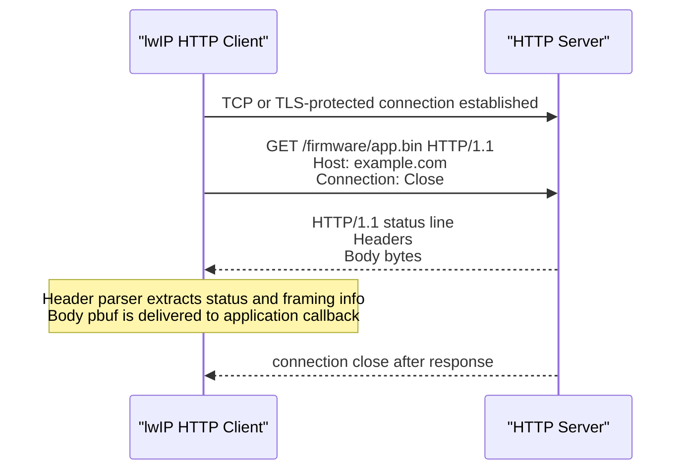
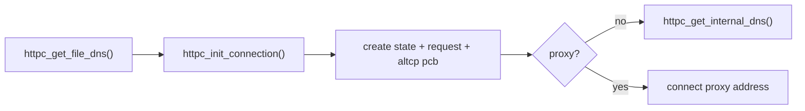
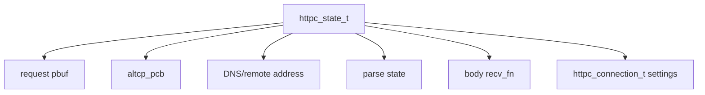
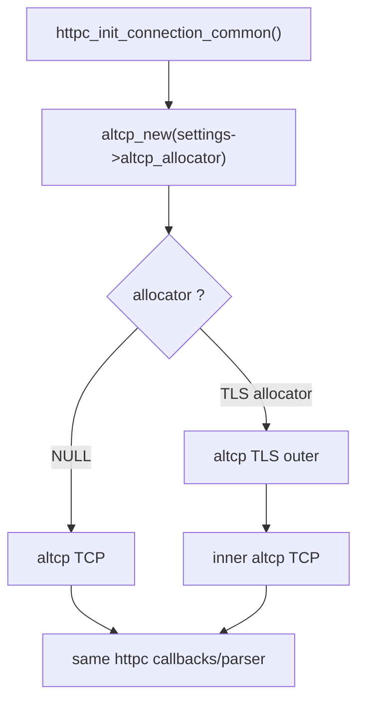
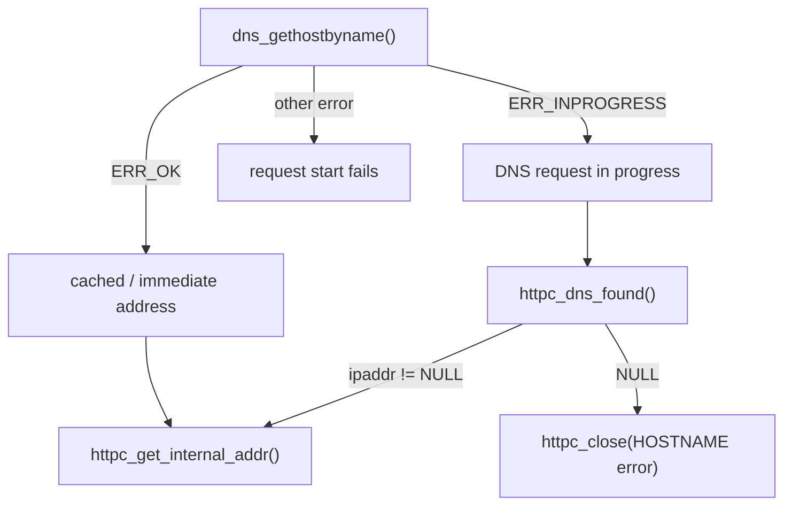
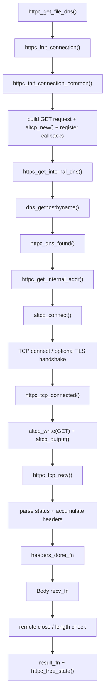

<meta name="referrer" content="no-referrer" />

# 教程 37：从 `httpc_get_file_dns()` 到 Body Callback——HTTP/HTTPS Client、DNS、altcp 与下载数据通路

> 摘要：从 lwIP HTTP client 公共入口追踪 DNS、altcp/TCP、GET、Header/Body callback，并说明 TLS allocator 如何把同一客户端切换成 HTTPS。

[TOC]

HTTP（Hypertext Transfer Protocol）是应用层 request/response 协议。**DNS（Domain Name System，域名系统）**负责把 Server hostname 解析成 IP address，`altcp` 是 lwIP 的 TCP-like transport abstraction，用于让同一应用逻辑选择 plain TCP 或 TLS-over-TCP。Stage 32 已经从 Server 方向建立 HTTP message 与 TCP byte-stream boundary，Stage 33 建立 TLS wrapper；Stage 37 从相反方向研究设备作为 Client 主动访问 Server 的路径：DNS、connect、GET、response Header/Body 与可选 HTTPS transport。[S1](#source-s1)[S2](#source-s2)[S3](#source-s3)[S6](#source-s6)[S7](#source-s7)

本文源码继续绑定用户提供的 `lwip.zip` 与 upstream commit `d08f4773edd0182b7910fc8f046eed82ffcd67c9`。主叙事是 Source-driven，真实公共入口选择 `httpc_get_file_dns()`。

## 0. 本篇所需的最小 HTTP/HTTPS Client 模型

Stage 32～33 是协议主讲位置，本篇不再复制整套 HTTP/TLS 教程；但即使不回看前文，也需要先恢复以下最小模型。

进入时序图前先锁定五个术语边界：

- **GET** 是 HTTP Method，表示获取 Request Target 指向的资源；当前 `httpc` 生成 HTTP/1.1 GET request。[S2](#source-s2)[S6](#source-s6)
- **HTTP status**（例如 `200`）是 Server 对 request 的应用层结果；它与 DNS success、TCP connect success、TLS handshake success、最终 transfer completion 都不是同一个状态。[S6](#source-s6)
- **Header/Body boundary** 由 HTTP message framing 决定，不等于单个 TCP segment 或 `pbuf` 的边界。当前 parser 会在连续 RX 数据中寻找 Header 结束，并把 Body 单独交给 `recv_fn`。[S2](#source-s2)[S7](#source-s7)
- `Host` Header 指明 HTTP request 目标主机/authority；当前域名入口会把 `server_name` 同时用于 DNS/address 处理与 HTTP `Host` Header 构造。[S2](#source-s2)[S6](#source-s6)
- `Connection: Close` 是当前 request 明确发送的 HTTP Header，表示本次 response 完成后不复用这条 connection。源码也直接注明当前 `httpc` 尚不支持 persistent connection。[S2](#source-s2)[S7](#source-s7)
- **HTTPS** 只改变 transport：HTTP request/response 仍保持同样的语义和 parser；`altcp` 是 lwIP 的 TCP-like transport abstraction，`altcp_allocator` 决定创建 plain TCP 还是 TLS-over-TCP connection。[S3](#source-s3)[S4](#source-s4)

一次 lwIP `httpc` 下载主线因此是：[S6](#source-s6)[S7](#source-s7)



“使用 TLS allocator”仍不等于已经完成完整 Web PKI identity verification。Client 需要合适的 CA/trust configuration、hostname verification，并在启用证书有效期检查时提供正确系统时间；这些安全边界会在后文回到当前 Mbed TLS port 的实际配置。[S5](#source-s5)[S10](#source-s10)

推荐进一步阅读 [MDN HTTP messages](https://developer.mozilla.org/en-US/docs/Web/HTTP/Guides/Messages)、[RFC 9110](https://www.rfc-editor.org/rfc/rfc9110.html) 与 [RFC 9112](https://www.rfc-editor.org/rfc/rfc9112.html)，用于核对 HTTP 语义与 wire-format；正文后续仍直接解释当前源码真正依赖的字段和状态。[S9](#source-s9)[S6](#source-s6)[S7](#source-s7)

## 1. 为什么从 `httpc_get_file_dns()` 开始，而不是从某个 example 开始

当前 upstream 没有像 MQTT/SNTP 那样提供一条独立的 `contrib/examples/http_client/...` application 入口；HTTP client 的真实对外入口就在 public API 中。因此本篇 Source-driven 主线从：

```text
httpc_get_file_dns()
```

开始，而不是人为制造一个不存在的 upstream demo。[S1](#source-s1)[S2](#source-s2)

public header 给出两条主要 GET 入口：

```c
err_t httpc_get_file(const ip_addr_t* server_addr, u16_t port, const char* uri, const httpc_connection_t *settings,
                     altcp_recv_fn recv_fn, void* callback_arg, httpc_state_t **connection);
err_t httpc_get_file_dns(const char* server_name, u16_t port, const char* uri, const httpc_connection_t *settings,
                     altcp_recv_fn recv_fn, void* callback_arg, httpc_state_t **connection);
```

区别很直接：

```text
httpc_get_file()
    -> application 已经有 ip_addr_t

httpc_get_file_dns()
    -> application 给 hostname/IP string
    -> httpc 自己经过 DNS/address parse
```

因此本篇选 `httpc_get_file_dns()` 作为域名访问主入口。

## 2. 应用给 httpc 的四类信息分别控制什么

进入源码前先只解释 `httpc_get_file_dns()` 此刻真正用到的参数：[S1](#source-s1)

```text
server_name
    -> DNS 查询目标 + HTTP Host header

port
    -> TCP/TLS remote port

uri
    -> GET request-target，例如 /firmware/app.bin

settings
    -> result callback / headers callback /
       proxy / altcp allocator

recv_fn
    -> Body pbuf 的消费 callback
```

其中 `httpc_connection_t` 最关键：

```c
typedef struct _httpc_connection {
  ip_addr_t proxy_addr;
  u16_t proxy_port;
  u8_t use_proxy;
  /* @todo: add username:pass? */

#if LWIP_ALTCP
  altcp_allocator_t *altcp_allocator;
#endif

  /* this callback is called when the transfer is finished (or aborted) */
  httpc_result_fn result_fn;
  /* this callback is called after receiving the http headers
     It can abort the connection by returning != ERR_OK */
  httpc_headers_done_fn headers_done_fn;
} httpc_connection_t;
```

`altcp_allocator` 就是 Stage 33 已经见过的 transport 注入点：

```text
NULL
  -> plain TCP

TLS allocator
  -> TLS outer + TCP inner
```

所以 HTTP 与 HTTPS 并不是两套 httpc parser。

## 3. 进入 `httpc_get_file_dns()`：先创建 request state，再启动 DNS/Connect

下面是完整 public entry。[S2](#source-s2)

```c
err_t
httpc_get_file_dns(const char* server_name, u16_t port, const char* uri, const httpc_connection_t *settings,
                   altcp_recv_fn recv_fn, void* callback_arg, httpc_state_t **connection)
{
  err_t err;
  httpc_state_t* req;

  LWIP_ERROR("invalid parameters", (server_name != NULL) && (uri != NULL) && (recv_fn != NULL), return ERR_ARG;);

  err = httpc_init_connection(&req, settings, server_name, port, uri, recv_fn, callback_arg);
  if (err != ERR_OK) {
    return err;
  }

  if (settings && settings->use_proxy) {
    err = httpc_get_internal_addr(req, &settings->proxy_addr);
  } else {
    err = httpc_get_internal_dns(req, server_name);
  }
  if (err != ERR_OK) {
    httpc_free_state(req);
    return err;
  }

  if (connection != NULL) {
    *connection = req;
  }
  return ERR_OK;
}
```

主流程因此先分成两步：



这一点很重要：`ERR_OK` 表示“异步 HTTP request 已经成功启动”，不是“文件已经下载完成”。最终结果必须等待 `result_fn`。

## 4. 进入 `httpc_init_connection_common()`：HTTP request 在 connect 前就已经生成

`httpc_init_connection()` 很薄，只转入 `httpc_init_connection_common()`。这个函数同时创建 state、构造 GET request、创建 altcp connection，并注册全部 callback。[S2](#source-s2)

先看对象关系：



当前 `httpc_state_t` 保存：

- `pcb`：当前 altcp connection；
- `remote_addr/remote_port`：连接目标；
- `request`：还没有发出的 HTTP GET request；
- `rx_hdrs`：Header 尚未收完整时的 pbuf chain；
- `rx_status`：HTTP status code；
- `hdr_content_len` / `rx_content_len`：Header 声明长度与实际接收 Body 长度；
- `parse_state`：当前正在等 status line、Header 还是 Body。

`settings` 本身不是深拷贝，而是以 pointer 保存到 `req->conn_settings`。因此应用不能用一个已经离开生命周期的临时 `httpc_connection_t` 给长期异步 request 使用；至少要保证它存活到 transfer 完成 callback。[S2](#source-s2)

## 5. `httpc_create_request_string()`：当前 client 是一个刻意最小化的 HTTP/1.1 GET client

state 分配前，`httpc_init_connection_common()` 会两次调用 `httpc_create_request_string()`：第一次用 `buffer=NULL` 计算长度，分配完成后第二次把 request 真正写入 `PBUF_RAM`。[S2](#source-s2) 先进入 request 构造函数：

```c
static int
httpc_create_request_string(const httpc_connection_t *settings, const char* server_name, int server_port, const char* uri,
                            int use_host, char *buffer, size_t buffer_size)
{
  if (settings && settings->use_proxy) {
    LWIP_ASSERT("server_name != NULL", server_name != NULL);
    if (server_port != HTTP_DEFAULT_PORT) {
      return snprintf(buffer, buffer_size, HTTPC_REQ_11_PROXY_PORT_FORMAT(server_name, server_port, uri, server_name));
    } else {
      return snprintf(buffer, buffer_size, HTTPC_REQ_11_PROXY_FORMAT(server_name, uri, server_name));
    }
  } else if (use_host) {
    LWIP_ASSERT("server_name != NULL", server_name != NULL);
    return snprintf(buffer, buffer_size, HTTPC_REQ_11_HOST_FORMAT(uri, server_name));
  } else {
    return snprintf(buffer, buffer_size, HTTPC_REQ_11_FORMAT(uri));
  }
}
```

它根据 proxy 与 `use_host` 选择不同 format；普通 `httpc_get_file_dns()` 路径会使用带 `Host` header 的 HTTP/1.1 format。对应 request template 是：[S2](#source-s2)

```text
GET <uri> HTTP/1.1\r\n
User-Agent: lwIP/<version> ...\r\n
Accept: */*\r\n
Host: <server_name>\r\n
Connection: Close\r\n
\r\n
```

从源码开头的 TODO 与 request template 可以直接确定当前能力边界；GET/HTTP request-response 语义由 HTTP Semantics 定义，而这里具体生成的是 HTTP/1.1 message syntax。[S2](#source-s2)[S6](#source-s6)[S7](#source-s7)

- request method 固定为 GET；
- HTTP version 固定生成 HTTP/1.1；
- 明确发送 `Connection: Close`，当前不做 persistent connection；
- 源码 TODO 明确还没有自动 follow redirect；
- 支持简单 HTTP proxy；
- Header parser 是轻量实现，不是完整通用 HTTP framework。

所以它非常适合：

```text
下载一个明确资源
配置拉取
OTA metadata
固件/资源 GET
简单 REST GET
```

但不应该因为名字叫 HTTP Client 就推断它具备完整 Browser/cURL 功能。

## 6. 同一个初始化点决定 HTTP 还是 HTTPS：`altcp_new()` 看 allocator

`httpc_init_connection_common()` 中最关键的一行是：[S2](#source-s2)

```c
req->pcb = altcp_new(settings ? settings->altcp_allocator : NULL);
```

`altcp_new_ip_type()` 的实现规则非常简单：[S3](#source-s3)

```text
allocator == NULL
    -> altcp_tcp_new_ip_type()
    -> plain TCP

allocator != NULL
    -> allocator->alloc(allocator->arg, ip_type)
    -> application 决定 transport layer
```

因此 HTTP/HTTPS 的分界点不是 request parser，而是 connection allocator：



这就是 Stage 32～35 一直在建立的 altcp 价值：应用协议不需要重新实现一套 TLS 版本。

## 7. callback 在真正 connect 之前就全部注册完成

继续阅读 `httpc_init_connection_common()`。创建 transport 以后，callback、request buffer 和 application context 在同一个初始化函数里一起固定下来：[S2](#source-s2)

```c
  req->pcb = altcp_new(settings ? settings->altcp_allocator : NULL);
  if(req->pcb == NULL) {
    httpc_free_state(req);
    return ERR_MEM;
  }
  req->remote_port = (settings && settings->use_proxy) ? settings->proxy_port : server_port;
  altcp_arg(req->pcb, req);
  altcp_recv(req->pcb, httpc_tcp_recv);
  altcp_err(req->pcb, httpc_tcp_err);
  altcp_poll(req->pcb, httpc_tcp_poll, HTTPC_POLL_INTERVAL);
  altcp_sent(req->pcb, httpc_tcp_sent);

  /* set up request buffer */
  req_len2 = httpc_create_request_string(settings, server_name, server_port, uri, use_host,
    (char *)req->request->payload, req_len + 1);
  if (req_len2 != req_len) {
    httpc_free_state(req);
    return ERR_VAL;
  }

  req->recv_fn = recv_fn;
  req->conn_settings = settings;
  req->callback_arg = callback_arg;

```

这里的顺序很关键：`altcp_recv/err/poll/sent` 在 DNS 和 connect 之前已经绑定，因此后续无论 plain TCP 还是 TLS outer connection，都通过同一个 `httpc_state_t` 回到这组 callback。

因此后面出现：

```text
connected
recv
error
poll timeout
```

都能通过同一个 `httpc_state_t` 找回当前 request state。

这条初始化链要在第一次使用 callback 前说明清楚，否则后面的 `httpc_tcp_recv()` 会显得像凭空出现。

## 8. 回到 `httpc_get_file_dns()`：进入 `httpc_get_internal_dns()`

state 与 callback 都准备好后，`httpc_get_file_dns()` 调用 `httpc_get_internal_dns()`。[S2](#source-s2)

继续进入 `httpc_get_internal_dns()`；`LWIP_DNS=1` 时，resolver 的 callback 和 `req` context 就在这里绑定：[S2](#source-s2)

```c
static err_t
httpc_get_internal_dns(httpc_state_t* req, const char* server_name)
{
  err_t err;
  LWIP_ASSERT("req != NULL", req != NULL);

#if LWIP_DNS
  err = dns_gethostbyname(server_name, &req->remote_addr, httpc_dns_found, req);
#else
  err = ipaddr_aton(server_name, &req->remote_addr) ? ERR_OK : ERR_ARG;
#endif

  if (err == ERR_OK) {
    /* cached or IP-string */
    err = httpc_get_internal_addr(req, &req->remote_addr);
  } else if (err == ERR_INPROGRESS) {
    return ERR_OK;
  }
  return err;
}
```

`ERR_OK` 表示 cache/IP string 已立即得到地址；`ERR_INPROGRESS` 表示函数先返回，等待 resolver 日后调用 `httpc_dns_found()`。继续进入这个 callback：[S2](#source-s2)

```c
static void
httpc_dns_found(const char* hostname, const ip_addr_t *ipaddr, void *arg)
{
  httpc_state_t* req = (httpc_state_t*)arg;
  err_t err;
  httpc_result_t result;

  LWIP_UNUSED_ARG(hostname);

  if (ipaddr != NULL) {
    err = httpc_get_internal_addr(req, ipaddr);
    if (err == ERR_OK) {
      return;
    }
    result = HTTPC_RESULT_ERR_CONNECT;
  } else {
    LWIP_DEBUGF(HTTPC_DEBUG_WARN_STATE, ("httpc_dns_found: failed to resolve hostname: %s\n",
      hostname));
    result = HTTPC_RESULT_ERR_HOSTNAME;
    err = ERR_ARG;
  }
  httpc_close(req, result, 0, err);
}
```

异步 DNS 成功后 callback 直接调用 `httpc_get_internal_addr()`；失败则通过 `httpc_close()` 把 `HTTPC_RESULT_ERR_HOSTNAME` 送到最终 result callback。于是三种结果是：



当 `LWIP_DNS=0`，这个函数只能尝试把 `server_name` 当成 IP address string 解析；普通域名不会神奇地被解析。[S2](#source-s2)

Stage 14 已经完整讲过 DNS cache / UDP / async callback，本篇只保留这条 bridge。

## 9. DNS 返回以后进入 `httpc_get_internal_addr()`：开始真正的 transport connect

`httpc_dns_found()` 成功时直接调用 `httpc_get_internal_addr(req, ipaddr)`。下面进入这个函数。[S2](#source-s2)

```c
static err_t
httpc_get_internal_addr(httpc_state_t* req, const ip_addr_t *ipaddr)
{
  err_t err;
  LWIP_ASSERT("req != NULL", req != NULL);

  if (&req->remote_addr != ipaddr) {
    /* fill in remote addr if called externally */
    req->remote_addr = *ipaddr;
  }

  err = altcp_connect(req->pcb, &req->remote_addr, req->remote_port, httpc_tcp_connected);
  if (err == ERR_OK) {
    return ERR_OK;
  }
  LWIP_DEBUGF(HTTPC_DEBUG_WARN_STATE, ("tcp_connect failed: %d\n", (int)err));
  return err;
}
```

如果是 plain HTTP：

```text
altcp_connect()
  -> TCP active open
  -> TCP handshake completes
  -> httpc_tcp_connected()
```

如果是 TLS allocator：

```text
altcp_connect(TLS outer)
  -> inner TCP connect
  -> TLS handshake
  -> secure transport ready
  -> httpc_tcp_connected()
```

也就是说，HTTPS 模式下 `httpc_tcp_connected()` 和 Stage 35 的 `mqtt_tcp_connect_cb()` 一样，看到的是 **altcp transport 已 ready**，而不只是裸 TCP 三次握手刚结束。[S4](#source-s4)[S5](#source-s5)

## 10. 进入 `httpc_tcp_connected()`：GET request 只发送一次

transport connect 成功后进入 `httpc_tcp_connected()`。[S2](#source-s2)

```c
static err_t
httpc_tcp_connected(void *arg, struct altcp_pcb *pcb, err_t err)
{
  err_t r;
  httpc_state_t* req = (httpc_state_t*)arg;
  LWIP_UNUSED_ARG(pcb);
  LWIP_UNUSED_ARG(err);

  /* send request; last char is zero termination */
  r = altcp_write(req->pcb, req->request->payload, req->request->len - 1, TCP_WRITE_FLAG_COPY);
  if (r != ERR_OK) {
     /* could not write the single small request -> fail, don't retry */
     return httpc_close(req, HTTPC_RESULT_ERR_MEM, 0, r);
  }
  /* everything written, we can free the request */
  pbuf_free(req->request);
  req->request = NULL;

  altcp_output(req->pcb);
  return ERR_OK;
}
```

这里有两个明确的实现选择：

1. 整个 request 在 connect 前已经准备好；
2. `altcp_write()` 如果不能一次接受这个“小 request”，当前代码直接失败，不建立像 HTTPD/MQTT 那样复杂的 request TX state machine。

成功写入后 request pbuf 就释放，因为 `TCP_WRITE_FLAG_COPY` 已要求下层复制数据。

plain HTTP 与 HTTPS 到这里仍使用同样代码：

```text
HTTP request bytes
   -> altcp_write()
      -> TCP

HTTP request bytes
   -> altcp_write(TLS outer)
      -> mbedtls_ssl_write()
      -> encrypted TLS records
      -> inner TCP
```

## 11. Server response 到达：`httpc_tcp_recv()` 先积累 Header，再把 Body 交给应用

`httpc_init_connection_common()` 早已注册：

```c
altcp_recv(req->pcb, httpc_tcp_recv);
```

所以 transport 收到 application plaintext 后会进入 `httpc_tcp_recv()`。HTTPS 时 TLS 已经先解密，httpc parser 不处理 TLS record。[S2](#source-s2)[S5](#source-s5)

继续阅读 `httpc_tcp_recv()`。当当前状态还不是 Body，函数先把新收到的 pbuf 接到 `rx_hdrs`，然后依次推进 status-line 与 Header 两个 parser；Header 完整后通过 `pbuf_free_header()` 把同一个 pbuf chain 的数据视图推进到 Body，并立即允许本次 callback 继续消费剩余 Body：[S2](#source-s2)

```c
  if (req->parse_state != HTTPC_PARSE_RX_DATA) {
      /* did not get RX data yet */
      result = HTTPC_RESULT_ERR_CLOSED;
    } else if ((req->hdr_content_len != HTTPC_CONTENT_LEN_INVALID) &&
      (req->hdr_content_len != req->rx_content_len)) {
      /* header has been received with content length but not all data received */
      result = HTTPC_RESULT_ERR_CONTENT_LEN;
    } else {
      /* receiving data and either all data received or no content length header */
      result = HTTPC_RESULT_OK;
    }
    return httpc_close(req, result, req->rx_status, ERR_OK);
  }
  if (req->parse_state != HTTPC_PARSE_RX_DATA) {
    if (req->rx_hdrs == NULL) {
      req->rx_hdrs = p;
    } else {
      pbuf_cat(req->rx_hdrs, p);
    }
    if (req->parse_state == HTTPC_PARSE_WAIT_FIRST_LINE) {
      u16_t status_str_off;
      err_t err = http_parse_response_status(req->rx_hdrs, &req->rx_http_version, &req->rx_status, &status_str_off);
      if (err == ERR_OK) {
        /* don't care status string */
        req->parse_state = HTTPC_PARSE_WAIT_HEADERS;
      }
    }
    if (req->parse_state == HTTPC_PARSE_WAIT_HEADERS) {
      u16_t total_header_len;
      err_t err = http_wait_headers(req->rx_hdrs, &req->hdr_content_len, &total_header_len);
      if (err == ERR_OK) {
        struct pbuf *q;
        /* full header received, send window update for header bytes and call into client callback */
        altcp_recved(pcb, total_header_len);
        if (req->conn_settings) {
          if (req->conn_settings->headers_done_fn) {
            err = req->conn_settings->headers_done_fn(req, req->callback_arg, req->rx_hdrs, total_header_len, req->hdr_content_len);
            if (err != ERR_OK) {
              return httpc_close(req, HTTPC_RESULT_LOCAL_ABORT, req->rx_status, err);
            }
          }
        }
        /* hide header bytes in pbuf */
        q = pbuf_free_header(req->rx_hdrs, total_header_len);
        p = q;
        req->rx_hdrs = NULL;
        /* go on with data */
        req->parse_state = HTTPC_PARSE_RX_DATA;
      }
    }
  }
  if ((p != NULL) && (req->parse_state == HTTPC_PARSE_RX_DATA)) {
    req->rx_content_len += p->tot_len;
    /* received valid data: reset timeout */
    req->timeout_ticks = HTTPC_POLL_TIMEOUT;
    if (req->recv_fn != NULL) {
      /* directly return here: the connection might already be aborted from the callback! */
      return req->recv_fn(req->callback_arg, pcb, p, r);
    } else {
      altcp_recved(pcb, p->tot_len);
      pbuf_free(p);
    }
  }
```

因此 parser 的三个状态不是抽象说明，而是这个 callback 中真实推进的状态：

```text
HTTPC_PARSE_WAIT_FIRST_LINE
        ↓
HTTPC_PARSE_WAIT_HEADERS
        ↓
HTTPC_PARSE_RX_DATA
```

首次数据到达时，如果 Header 跨多个 TCP segment/pbuf，`httpc_tcp_recv()` 会把这些 pbuf 用 `pbuf_cat()` 暂存到 `req->rx_hdrs`，直到能找到完整 `\r\n\r\n`。HTTP message boundary 与 TCP segment/pbuf boundary 的协议背景已经在前置资料中说明；这里的新增信息是：**当前 httpc 通过累积 `req->rx_hdrs` 恢复这条 application-level boundary。** [S2](#source-s2)[S7](#source-s7)

## 12. status line 与 Header：当前 parser 只提取它真正需要的最小信息

`httpc_tcp_recv()` 在 `HTTPC_PARSE_WAIT_FIRST_LINE` 状态调用 `http_parse_response_status()`。下面进入该 parser；它必须先找到第一行 `\r\n`、`HTTP/` 前缀和空格，再把 version/status 写回 caller 提供的字段：[S2](#source-s2)

```c
static err_t
http_parse_response_status(struct pbuf *p, u16_t *http_version, u16_t *http_status, u16_t *http_status_str_offset)
{
  u16_t end1 = pbuf_memfind(p, "\r\n", 2, 0);
  if (end1 != 0xFFFF) {
    /* get parts of first line */
    u16_t space1, space2;
    space1 = pbuf_memfind(p, " ", 1, 0);
    if (space1 != 0xFFFF) {
      if ((pbuf_memcmp(p, 0, "HTTP/", 5) == 0)  && (pbuf_get_at(p, 6) == '.')) {
        char status_num[10];
        size_t status_num_len;
        /* parse http version */
        u16_t version = pbuf_get_at(p, 5) - '0';
        version <<= 8;
        version |= pbuf_get_at(p, 7) - '0';
        *http_version = version;

        /* parse http status number */
        space2 = pbuf_memfind(p, " ", 1, space1 + 1);
        if (space2 != 0xFFFF) {
          *http_status_str_offset = space2 + 1;
          status_num_len = space2 - space1 - 1;
        } else {
          status_num_len = end1 - space1 - 1;
        }
        if (status_num_len < sizeof(status_num)) {
          if (pbuf_copy_partial(p, status_num, (u16_t)status_num_len, space1 + 1) == status_num_len) {
            int status;
            status_num[status_num_len] = 0;
            status = atoi(status_num);
            if ((status > 0) && (status <= 0xFFFF)) {
              *http_status = (u16_t)status;
              return ERR_OK;
            }
          }
        }
      }
    }
  }
  return ERR_VAL;
}
```

成功返回后 `httpc_tcp_recv()` 把状态切到 `HTTPC_PARSE_WAIT_HEADERS`。随后进入 `http_wait_headers()`；它搜索完整 Header 结束符，并尝试读取 `Content-Length`：[S2](#source-s2)

```c
static err_t
http_wait_headers(struct pbuf *p, u32_t *content_length, u16_t *total_header_len)
{
  u16_t end1 = pbuf_memfind(p, "\r\n\r\n", 4, 0);
  if (end1 < (0xFFFF - 2)) {
    /* all headers received */
    /* check if we have a content length (@todo: case insensitive?) */
    u16_t content_len_hdr;
    *content_length = HTTPC_CONTENT_LEN_INVALID;
    *total_header_len = end1 + 4;

    content_len_hdr = pbuf_memfind(p, "Content-Length: ", 16, 0);
    if (content_len_hdr != 0xFFFF) {
      u16_t content_len_line_end = pbuf_memfind(p, "\r\n", 2, content_len_hdr);
      if (content_len_line_end != 0xFFFF) {
        char content_len_num[16];
        u16_t content_len_num_len = (u16_t)(content_len_line_end - content_len_hdr - 16);
        if (content_len_num_len < sizeof(content_len_num)) {
          if (pbuf_copy_partial(p, content_len_num, content_len_num_len, content_len_hdr + 16) == content_len_num_len) {
            int len;
            content_len_num[content_len_num_len] = 0;
            len = atoi(content_len_num);
            if ((len >= 0) && ((u32_t)len < HTTPC_CONTENT_LEN_INVALID)) {
              *content_length = (u32_t)len;
            }
          }
        }
      }
    }
    return ERR_OK;
  }
  return ERR_VAL;
}
```

它识别的 Header 结束边界是 `\r\n\r\n`，并尝试读取：

```text
Content-Length: <number>
```

当前实现对 `Content-Length: ` 使用直接字符串搜索，源码里还留有“case insensitive?” TODO。[S2](#source-s2)

Header 完整后：

```text
altcp_recved(header bytes)
    ↓
headers_done_fn(...)
    ↓
pbuf_free_header(...)
    ↓
剩余 pbuf view 只保留 Body
    ↓
HTTPC_PARSE_RX_DATA
```

如果同一个 TCP pbuf 中同时包含：

```text
HTTP Header + Body 前几个字节
```

`pbuf_free_header()` 只移动数据视图，Body 不会被丢掉，而是继续进入后面的 Body callback。

## 13. `headers_done_fn` 与 `recv_fn` 是两种不同 callback

`httpc_connection_t::headers_done_fn` 只在完整 Header 被确认后调用一次，可以读取：

```text
HTTP status/header pbuf
header length
Content-Length（若识别到）
```

并允许通过返回非 `ERR_OK` 主动 abort。

而 `recv_fn` 接收的是 **Body pbuf**。当前 `httpc_tcp_recv()` 在进入 Body 状态后会：

```text
req->rx_content_len += p->tot_len
    ↓
reset timeout
    ↓
return req->recv_fn(..., p, ...)
```

这里它直接把 pbuf ownership 交给 callback，没有在返回前自动 `pbuf_free(p)`。[S2](#source-s2)

源码自带的 `httpc_fs_tcp_recv()` 给出了正确消费模式：[S2](#source-s2)

```c
static err_t
httpc_fs_tcp_recv(void *arg, struct altcp_pcb *pcb, struct pbuf *p, err_t err)
{
  httpc_filestate_t *filestate = (httpc_filestate_t*)arg;
  struct pbuf* q;
  LWIP_UNUSED_ARG(err);

  LWIP_ASSERT("p != NULL", p != NULL);

  for (q = p; q != NULL; q = q->next) {
    fwrite(q->payload, 1, q->len, filestate->file);
  }
  altcp_recved(pcb, p->tot_len);
  pbuf_free(p);
  return ERR_OK;
}
```

因此自定义 OTA/配置下载 callback 也必须认真处理：

```text
消费 pbuf chain
    ↓
altcp_recved()
    ↓
pbuf_free()
```

不能只保存 `p->payload` pointer 后立即返回，再假设它长期有效。

## 14. `p == NULL` 才进入 transfer completion 判断

当前 request template 明确发送 `Connection: Close`，因此 remote close 被纳入这份 client 的 transfer lifecycle。[S2](#source-s2)[S7](#source-s7) RFC 9112 对 close-delimited framing 的一般规则与限制直接参考前置资料；本文只追当前 httpc 收到 `p == NULL` 后怎样结合 parser state 与可选 `Content-Length` 判断结果。

`httpc_tcp_recv()` 收到 `p == NULL` 时会判断：[S2](#source-s2)

```text
还没进入 Body
    -> HTTPC_RESULT_ERR_CLOSED

有 Content-Length，实际 Body 长度不匹配
    -> HTTPC_RESULT_ERR_CONTENT_LEN

已经接收 Body，长度匹配或没有 Content-Length
    -> HTTPC_RESULT_OK
```

然后进入：

```text
httpc_close()
    ↓
settings->result_fn(...)
    ↓
httpc_free_state()
    ↓
close / abort altcp connection
```

注意 `HTTPC_RESULT_OK` 表示 **HTTP transfer 在当前 client 的 transport/body 完整性语义下成功完成**。HTTP status code 仍通过 `srv_res` 单独返回。

当前实现不会因为收到 404/500 就自动把它转换成一个完整的高级“REST exception”模型；应用应该结合 `httpc_result` 与 `srv_res` 判断业务结果。[S1](#source-s1)[S2](#source-s2)

## 15. Poll timeout：没有进展的连接最终会被 `httpc_tcp_poll()` 关闭

初始化时 httpc 注册：

```text
altcp_poll(req->pcb, httpc_tcp_poll, HTTPC_POLL_INTERVAL)
```

`httpc_state_t::timeout_ticks` 初始为 `HTTPC_POLL_TIMEOUT`。当前源码：

```text
HTTPC_POLL_INTERVAL = 1
HTTPC_POLL_TIMEOUT  = 30   /* 15 seconds */
```

收到有效 Body 数据时会把 tick counter 重置。若 poll callback 连续把它减到 0：

```text
httpc_close(..., HTTPC_RESULT_ERR_TIMEOUT, ...)
```

所以 timeout 同样属于异步 callback lifecycle，而不是 application thread 阻塞等待一个固定秒数。[S2](#source-s2)

## 16. HTTPS 只替换 transport：HTTP parser 不变

TLS handshake 与 BIO 的完整机制归属 Stage 33；对当前 httpc 主线而言，HTTPS 集成只需要给 `httpc_connection_t::altcp_allocator` 提供 TLS allocator；`httpc_init_connection_common()` 仍走同一套 request builder、callback 注册和 parser。[S3](#source-s3)[S4](#source-s4)

下面只保留最小集成关系，代码是基于 upstream API 的集成示意，不是 upstream example：

```c
tls_config = altcp_tls_create_config_client(ca_cert, ca_cert_len);
tls_allocator.alloc = altcp_tls_alloc;
tls_allocator.arg = tls_config;
settings.altcp_allocator = &tls_allocator;
httpc_get_file_dns("api.example.com", 443, "/config.json",
                   &settings, http_body_cb, app_ctx, NULL);
```

此时对象关系是 `httpc -> altcp TLS outer -> mbedTLS -> altcp TCP inner`；HTTP request/response parser 不需要第二份实现。

## 17. TLS allocator 不等于完整 HTTPS 身份认证

当前 lwIP mbedTLS port 允许 client config 传入 CA，但默认 `ALTCP_MBEDTLS_AUTHMODE` 是 `MBEDTLS_SSL_VERIFY_OPTIONAL`。[S5](#source-s5) 更关键的是，目标 `http_client.c` / `altcp_tls_mbedtls.c` 中，`server_name` 用于 DNS 和 HTTP `Host`，却没有自动进入 `mbedtls_ssl_set_hostname()`；Mbed TLS 官方 guidance 明确要求 certificate-authenticated client 把预期 server name 交给 TLS layer 才能完成 hostname authentication。[S2](#source-s2)[S5](#source-s5)[S10](#source-s10)

因此产品必须单独审核 CA trust、verification mode、certificate validity time、peer hostname verification 与 SNI；`port=443 + TLS allocator` 不能直接等价为“完整 Web PKI 身份验证已建立”。Stage 33 负责 TLS transport 机制，本节只保留 httpc 集成边界。

## 18. Stage 36 的系统时间怎样影响 HTTPS

启用基于系统时间的 X.509 validity checking 时，Mbed TLS 使用当前 wall clock 判断 certificate 是否 expired / not-yet-valid。[S10](#source-s10) 因而产品常把 Stage 36 的时间同步放在 certificate-authenticated HTTPS/MQTT-TLS 之前；但若系统已有 RTC、可信启动时间或关闭了 date-based checking，则不能把“必须先 SNTP”写成协议硬要求。


## 19. OTA 下载里 httpc 的职责边界

httpc 适合承担 `DNS -> TCP/TLS -> GET -> Body pbuf stream` 这条网络传输链；Flash erase/program、slot 选择、hash/签名验证、版本策略、rollback、bootloader 状态和掉电恢复仍属于 OTA manager。也就是说，httpc 交付的是 byte stream，不是完整 OTA 状态机。

## 20. `LWIP_HTTPC_HAVE_FILE_IO` 只是 Host/example helper

打开 `LWIP_HTTPC_HAVE_FILE_IO` 后，源码会编译 `httpc_get_file_to_disk()` / `httpc_get_file_dns_to_disk()`，内部用 `fopen/fwrite/fclose` 消费 Body；public header 明确把它定位为 interface example implementation。[S1](#source-s1)[S2](#source-s2) MCU OTA 完全可以把 `recv_fn` 直接接到 Flash writer，不需要先引入 POSIX filesystem。

## 21. HTTP client 的运行上下文仍然属于 callback-style lwIP core API

`httpc` 最终直接创建 altcp PCB、注册 callback 并调用 `altcp_connect()`。因此和 MQTT/SNTP 一样，在 `NO_SYS=0` 的 RTOS 模式下要遵守 lwIP core execution-context contract。[S8](#source-s8)

也就是说，未来 RT-Thread application thread 想发起：

```text
httpc_get_file_dns(...)
```

不能因为它“看起来是应用层 API”就忽略线程约束。应通过 TCPIP thread 调度或已配置的 core locking 进入，具体 RT-Thread 集成会留到 Stage 39，而不是在本篇展开 RT-Thread 内部实现。

## 22. Stage 37 的完整主调用链

把本篇已经出现的对象和 callback 按实际顺序串起来：



Stage 37 到这里建立的是：

```text
HTTP Client
  = DNS/address resolution
  + altcp transport
  + minimal HTTP/1.1 GET formatting/parsing
  + Header callback
  + streamed Body callback
  + completion/error callback
```

把 `altcp_allocator` 换成 TLS allocator 后，这条链就成为 HTTPS；httpc 本身不需要第二套 parser。

Stage 38 将转向 `lwipopts.h`、源码选择、OS Port 与 Network Port 的裁剪和移植。

## 资料来源

<a id="source-s1"></a>
### [S1] lwIP HTTP client public API
- 类型：用户提供源码快照 + upstream 对照
- 版本：用户提供 `lwip.zip`；相关文件 blob 与 upstream commit `d08f4773edd0182b7910fc8f046eed82ffcd67c9` 一致
- 定位：`src/include/lwip/apps/http_client.h`：`httpc_connection_t`、`httpc_result_t`、`httpc_get_file()`、`httpc_get_file_dns()`、Header/Body callback contract
- URL/文档：[lwIP http_client.h](https://github.com/lwip-tcpip/lwip/blob/d08f4773edd0182b7910fc8f046eed82ffcd67c9/src/include/lwip/apps/http_client.h)
- 使用位置：“公共入口”“settings/allocator/callback contract”“File I/O helper 边界”
- 支撑内容：限定应用可配置的 HTTP client interface

<a id="source-s2"></a>
### [S2] lwIP HTTP client implementation
- 类型：用户提供源码快照 + upstream 对照
- 版本：同上
- 定位：`src/apps/http/http_client.c`：`httpc_get_file_dns()`、`httpc_init_connection_common()`、`httpc_get_internal_dns()`、`httpc_dns_found()`、`httpc_get_internal_addr()`、`httpc_tcp_connected()`、`httpc_tcp_recv()`、`httpc_tcp_poll()`、`httpc_close()`、`httpc_fs_tcp_recv()`
- URL/文档：[lwIP http_client.c](https://github.com/lwip-tcpip/lwip/blob/d08f4773edd0182b7910fc8f046eed82ffcd67c9/src/apps/http/http_client.c)
- 使用位置：Stage 37 Source-driven 主调用链
- 支撑内容：GET request 构造、DNS bridge、Header/Body parsing、pbuf ownership、timeout、completion 与当前实现能力边界

<a id="source-s3"></a>
### [S3] lwIP altcp allocator abstraction
- 类型：目标版本上游源码
- 版本：同上
- 定位：`src/core/altcp.c`：allocator 说明、`altcp_new_ip_type()`；`src/include/lwip/altcp.h`：`altcp_allocator_t`
- URL/文档：[lwIP altcp.c](https://github.com/lwip-tcpip/lwip/blob/d08f4773edd0182b7910fc8f046eed82ffcd67c9/src/core/altcp.c)
- 使用位置：“HTTP 与 HTTPS 如何共享 httpc”“NULL allocator 与 TLS allocator 的分界”
- 支撑内容：证明 transport layer 由 runtime allocator 决定

<a id="source-s4"></a>
### [S4] lwIP altcp TLS allocator API
- 类型：目标版本上游源码
- 版本：同上
- 定位：`src/include/lwip/altcp_tls.h`：client config、`altcp_tls_alloc()`；`src/core/altcp_alloc.c`：`altcp_tls_new()`、`altcp_tls_alloc()`
- URL/文档：[lwIP altcp_tls.h](https://github.com/lwip-tcpip/lwip/blob/d08f4773edd0182b7910fc8f046eed82ffcd67c9/src/include/lwip/altcp_tls.h)、[lwIP altcp_alloc.c](https://github.com/lwip-tcpip/lwip/blob/d08f4773edd0182b7910fc8f046eed82ffcd67c9/src/core/altcp_alloc.c)
- 使用位置：“HTTPS allocator 集成”“TLS outer + TCP inner”
- 支撑内容：说明 HTTP client 如何在不改变 parser 的情况下创建 TLS-over-TCP connection

<a id="source-s5"></a>
### [S5] lwIP altcp mbedTLS client implementation
- 类型：目标版本上游源码
- 版本：同上
- 定位：`src/apps/altcp_tls/altcp_tls_mbedtls.c`：`altcp_tls_create_config_client_common()`、`altcp_tls_create_config_client()`、TLS handshake/BIO；`src/include/lwip/apps/altcp_tls_mbedtls_opts.h`：`ALTCP_MBEDTLS_AUTHMODE`
- URL/文档：[lwIP altcp_tls_mbedtls.c](https://github.com/lwip-tcpip/lwip/blob/d08f4773edd0182b7910fc8f046eed82ffcd67c9/src/apps/altcp_tls/altcp_tls_mbedtls.c)、[lwIP altcp TLS options](https://github.com/lwip-tcpip/lwip/blob/d08f4773edd0182b7910fc8f046eed82ffcd67c9/src/include/lwip/apps/altcp_tls_mbedtls_opts.h)
- 使用位置：“HTTPS handshake”“CA/authmode/hostname verification 安全边界”“系统时间与证书有效期”
- 支撑内容：证明当前 mbedTLS port 的 client verification 默认与 config 行为，避免把“用了 TLS”误写成“完整 Web PKI 验证已自动建立”

<a id="source-s6"></a>
### [S6] RFC 9110 — HTTP Semantics
- 类型：IETF Internet Standard
- 版本：RFC 9110 / STD 97，2022
- URL/文档：[RFC 9110](https://www.rfc-editor.org/rfc/rfc9110.html)
- 使用位置：“HTTP request/response 与 GET 语义”“status code 与 transfer result 的区别”
- 支撑内容：提供 HTTP 通用语义；当前 lwIP parser 能力仍以目标源码为准

<a id="source-s7"></a>
### [S7] RFC 9112 — HTTP/1.1
- 类型：IETF Internet Standard
- 版本：RFC 9112 / STD 99，2022
- URL/文档：[RFC 9112](https://www.rfc-editor.org/rfc/rfc9112.html)
- 使用位置：“HTTP/1.1 message syntax”“Connection: Close”“Header/body framing 背景”
- 支撑内容：提供 HTTP/1.1 wire-format 与 connection-management 规范背景

<a id="source-s8"></a>
### [S8] lwIP Multithreading / Common pitfalls
- 类型：目标版本上游 Doxygen 文档
- 版本：commit `d08f4773edd0182b7910fc8f046eed82ffcd67c9`
- 定位：`doc/doxygen/main_page.h`：`Multithreading`、`Common pitfalls`
- URL/文档：[lwIP multithreading guidance](https://github.com/lwip-tcpip/lwip/blob/d08f4773edd0182b7910fc8f046eed82ffcd67c9/doc/doxygen/main_page.h)
- 使用位置：“HTTP client callback-style API 的 RTOS execution context”
- 支撑内容：说明未来 RT-Thread task 调用 httpc 时仍必须满足 TCPIP thread/core locking contract

<a id="source-s9"></a>
### [S9] MDN — HTTP messages
- 类型：高质量协议学习资料
- 版本：MDN Web Docs，访问于 2026-10-03
- URL/文档：[MDN HTTP messages](https://developer.mozilla.org/en-US/docs/Web/HTTP/Guides/Messages)
- 使用位置：HTTP Client 最小协议模型、request/response message 结构
- 支撑内容：提供 HTTP/1.1 request/response、start-line/Header/Body 的直观学习入口；正文仍自行恢复当前 httpc 主线需要的最小模型，规范结论以 RFC 9110/9112 为准

<a id="source-s10"></a>
### [S10] Mbed TLS — TLS client hostname 与 X.509 time verification
- 类型：TLS library 官方文档
- 版本：Mbed TLS 2.28.x / 官方安全 guidance
- URL/文档：[Mbed TLS hostname verification guidance](https://mbed-tls.readthedocs.io/en/latest/kb/attacks/ssl_set_hostname/)、[Mbed TLS 2.28 X.509 time API](https://mbed-tls.readthedocs.io/projects/api/en/v2.28.9/api/file/x509_8h/)、[Mbed TLS external time dependencies](https://mbed-tls.readthedocs.io/en/latest/kb/development/what-external-dependencies-does-mbedtls-rely-on/)
- 使用位置：HTTPS Client 身份验证边界、hostname verification 与 Stage 36 系统时间接入
- 支撑内容：说明 TLS client 需要显式设置预期 hostname 才能完成 certificate hostname authentication，并说明 X.509 validity 检查如何依赖系统 time/date
