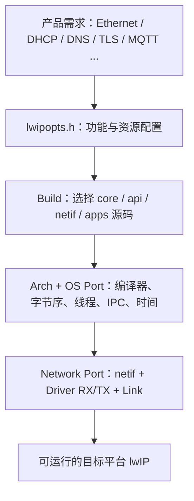
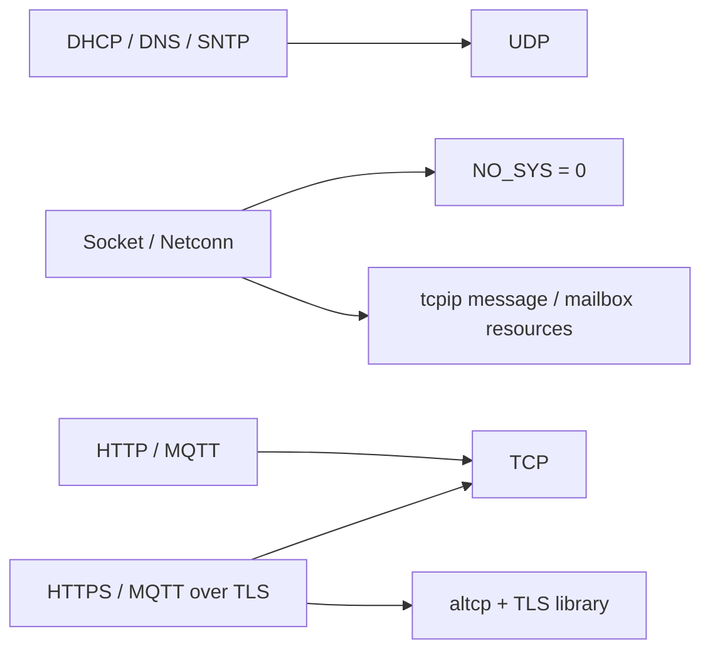
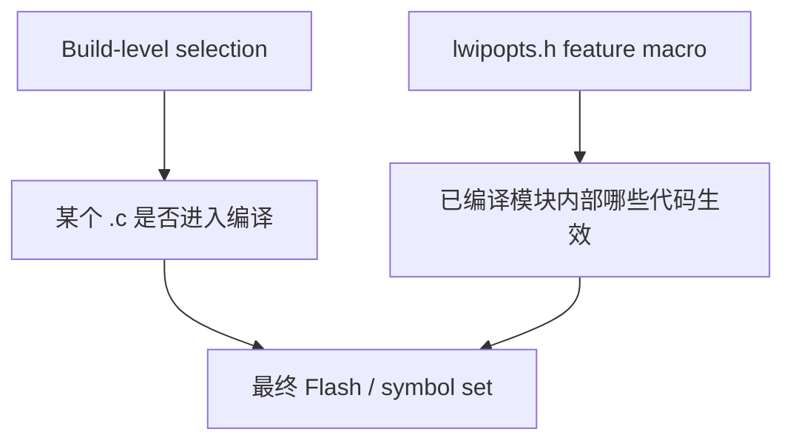
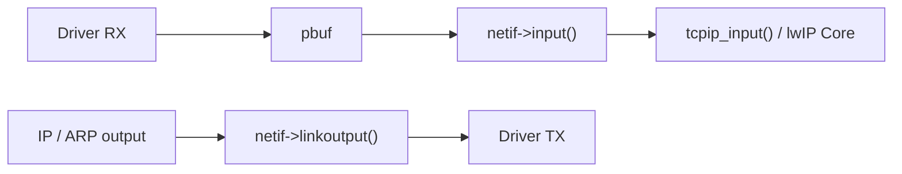
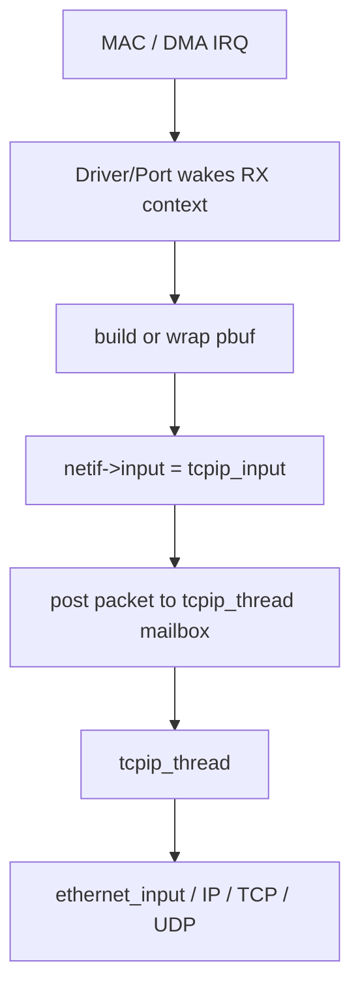
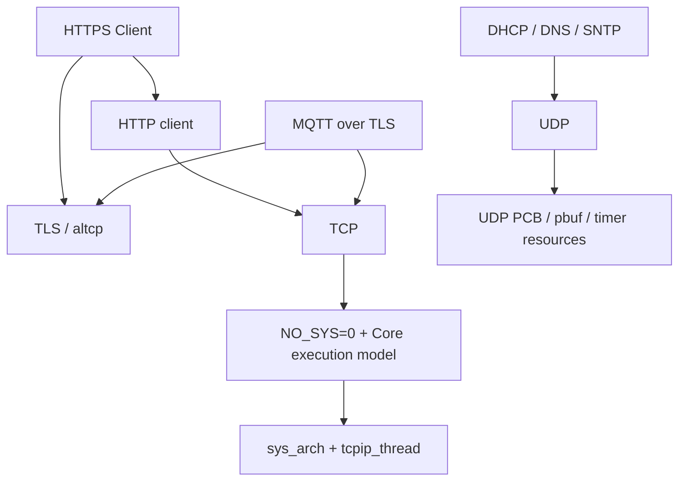
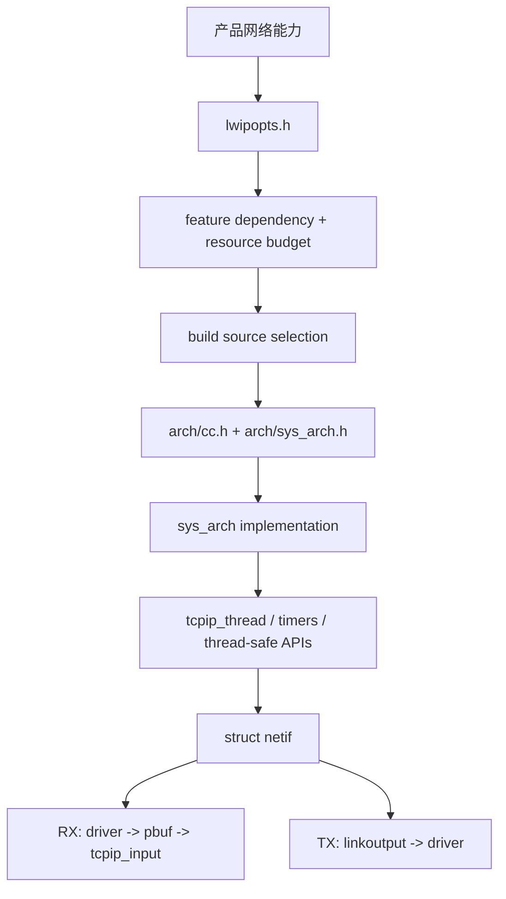

<meta name="referrer" content="no-referrer" />

# 教程 38：从 `lwipopts.h` 到 Port Contract——lwIP 裁剪、构建选择、OS Port 与 Network Port

> 摘要：把前 37 篇已经会用的 lwIP 反过来拆成工程移植契约，理解功能裁剪、资源预算、构建选择、OS Port 与网卡 Port 怎样组合成一个可运行系统。

[TOC]

Stage 01～37 一直使用“已经能运行”的 lwIP：Unix Port 已经提供线程、时间、TAP `netif` 与构建环境，文章主要沿协议栈和应用协议向下追。进入真实 MCU 项目后，问题会反过来：**拿到 upstream lwIP 源码后，项目究竟需要配置哪些功能、实现哪些平台接口、选择哪些源码，并怎样把网卡驱动接到 `netif`。**

Stage 38 不重新讲 Stage 11 的 `tcpip_thread/sys_arch` 原理，也不重新讲 Stage 20～22 的 DMA/PHY 细节，而是建立一套可以迁移到 RT-Thread、FreeRTOS、ThreadX 或其他平台的 Port 心智模型。本文源码基线为用户提供的更新 `lwip.zip`；`opt.h`、`init.c`、`sys.h`、`Filelists.cmake`、`netif.h` 与 Doxygen Porting 文档的 Git blob 均已与 upstream commit `d08f4773edd0182b7910fc8f046eed82ffcd67c9` 对照一致。[S1](#source-s1)[S2](#source-s2)[S3](#source-s3)[S4](#source-s4)

## 阅读源码前：先把 upstream Porting 文档当成 contract

Stage 38 的职责不是替代 lwIP 官方 Porting 文档。upstream 2.1.x Doxygen 已经分别给出 bare-metal `NO_SYS` mainloop、OS abstraction 与 `struct netif` 的公开接口说明：`NO_SYS=1` 需要在 mainloop 喂包并周期执行 `sys_check_timeouts()`；OS Port 需要实现 `sys_arch` 的 semaphore、mailbox、mutex、thread 与 time contract；`netif_add()` 则明确规定 `state/init/input` 怎样把具体网卡接入协议栈。[S7](#source-s7)

阅读这些官方页面时只需要先回答三个问题：**Core 在什么执行上下文运行、OS 需要补哪些 primitives、Driver 通过哪个 `netif` 边界交包。** 本篇随后使用目标源码快照解释配置、构建和 Port contract 怎样组合；涉及具体默认值和函数行为时，仍以固定 commit 的 `[S1]～[S6]` 为实现证据，而不是把 live Doxygen 当作目标快照本身。

## 1. “移植 lwIP”不是改 TCP/IP Core，而是补齐四个工程边界

把目标板上的 lwIP 拆开，真正需要项目决定的主要是四类问题：



这四层职责不同：

| 层 | 回答的问题 | 典型对象 |
| --- | --- | --- |
| 配置 | 哪些协议、API、资源额度要启用 | `lwipopts.h`、`LWIP_*`、`MEMP_*`、`TCP_*` |
| 构建 | 哪些 `.c` 文件真正进入目标镜像 | `Filelists.cmake`、项目 Make/CMake/SCons |
| OS/Arch Port | lwIP 如何使用目标编译器、线程与 IPC | `arch/cc.h`、`arch/sys_arch.h`、`sys_arch.c` |
| Network Port | 一帧数据怎样在驱动和 lwIP 之间交接 | `struct netif`、`input`、`output`、`linkoutput` |

因此“裁剪”和“移植”也不是同一件事：裁剪主要决定 **编什么、开什么、留多少资源**；移植主要决定 **这些抽象在目标平台上由谁实现**。

## 2. `opt.h` 为什么先包含 `lwipopts.h`：项目配置应该覆盖默认值，而不是修改 Core

打开 `src/include/lwip/opt.h`，配置入口在很靠前的位置：[S1](#source-s1)

```c
/*
 * Include user defined options first. Anything not defined in these files
 * will be set to standard values. Override anything you don't like!
 */
#include "lwipopts.h"
#include "lwip/debug.h"
```

这几行已经给出 upstream 的配置模型：

```text
项目 lwipopts.h
    ↓ 先定义需要覆盖的宏
upstream opt.h
    ↓ 只给“尚未定义”的选项补默认值
最终编译配置
```

因此正常 Port 不应直接改 `opt.h`：

```text
不推荐：
upstream/src/include/lwip/opt.h
    ↓
项目直接改默认宏

推荐：
project/port/include/lwipopts.h
    ↓
通过 include path 进入 lwIP
```

这样做的工程意义不是“文件更漂亮”，而是把 **项目策略** 与 **upstream Core** 分开。后续升级 upstream 时，`lwipopts.h` 仍是目标平台自己的配置层。

例如 upstream 当前默认值中能看到：[S1](#source-s1)

```text
NO_SYS          = 0
LWIP_UDP        = 1
LWIP_TCP        = 1
LWIP_NETCONN    = 1
LWIP_SOCKET     = 1
LWIP_DHCP       = 0
LWIP_DNS        = 0
MEM_SIZE        = 1600
MEMP_NUM_TCP_PCB = 5
PBUF_POOL_SIZE   = 16
```

这些只是 upstream 默认值，不是 MCU 产品推荐值。真正目标配置应由连接数量、吞吐量、RTOS 模型、协议需求和 RAM 预算决定。

## 3. 第一层裁剪先决定 `NO_SYS`：它直接改变可用 API 和整个运行模型

`NO_SYS` 是移植入口里最先应该确定的开关之一。upstream `opt.h` 对它的注释很明确：[S1](#source-s1)

```c
/**
 * NO_SYS==1: Use lwIP without OS-awareness (no thread, semaphores, mutexes or
 * mboxes). This means threaded APIs cannot be used (socket, netconn,
 * i.e. everything in the 'api' folder), only the callback-style raw API is
 * available (and you have to watch out for yourself that you don't access
 * lwIP functions/structures from more than one context at a time!)
 */
#if !defined NO_SYS || defined __DOXYGEN__
#define NO_SYS                          0
#endif
```

因此不是简单的“有 RTOS 就写 0、裸机就写 1”，而是运行契约发生变化：

| 配置 | Core 执行方式 | 可用 API | Port 主要责任 |
| --- | --- | --- | --- |
| `NO_SYS=1` | 无 lwIP OS thread；主循环/事件驱动 | Raw/callback API | 时间、critical protection、主循环喂包与 `sys_check_timeouts()` |
| `NO_SYS=0` | `tcpip_thread` 负责 Core context | Raw + Netconn + Socket 等 | semaphore、mailbox、mutex、thread、time、protection |

upstream Porting 文档进一步强调：`NO_SYS=1` 时收到 packet 后应在 mainloop 调用 `netif->input()`，不能直接从 ISR 调 lwIP Core；并且主循环必须周期执行 `sys_check_timeouts()`。OS 模式下则由 TCPIP thread 统一推进 Core，其他线程通过 thread-safe API、mailbox 或 core locking 进入。[S4](#source-s4)

对于后续 RT-Thread 主线，答案已经明确：它属于 `NO_SYS=0` 的 RTOS Port。

## 4. 功能宏不是独立复选框：`init.c` 会直接拒绝非法组合

裁剪时最容易产生的误区是把每个 `LWIP_*` 都当成彼此独立的开关。实际上 `src/core/init.c` 在编译期做了大量 dependency/sanity check。[S2](#source-s2)

当前源码直接包含这些检查：

```text
LWIP_DHCP = 1  -> LWIP_UDP 必须 = 1
LWIP_DNS  = 1  -> LWIP_UDP 必须 = 1
LWIP_UDP  = 1  -> MEMP_NUM_UDP_PCB >= 1
LWIP_TCP  = 1  -> MEMP_NUM_TCP_PCB >= 1
Sequential API -> MEMP_NUM_TCPIP_MSG_API >= 1
LWIP_NETIF_API -> NO_SYS = 0
Sequential API -> NO_SYS = 0
```

从前 37 篇已经学过的应用反推，依赖会更直观：



这里需要区分两类“依赖”：

1. **upstream 编译期硬约束**：`init.c` 有 `#error`，配置不合法直接无法通过编译；
2. **产品功能依赖**：例如 MQTT 应用需要 TCP、MQTT over TLS 还需要 TLS allocator，这些由应用实现和构建组合共同决定。

裁剪时应该从产品 feature tree 向下推，而不是从 `opt.h` 第一行开始逐宏决定开关。

## 5. “关掉协议”与“减少资源”是两个维度

功能宏解决“有没有这个能力”，资源宏解决“允许同时存在多少运行时对象、能缓存多少数据”。Stage 12 已经讲过 `mem/memp/pbuf` 的对象模型，这里只把它们重新放回产品裁剪决策。[S1](#source-s1)[S2](#source-s2)

典型资源项包括：

```text
MEM_SIZE
MEMP_NUM_TCP_PCB
MEMP_NUM_TCP_PCB_LISTEN
MEMP_NUM_TCP_SEG
MEMP_NUM_UDP_PCB
MEMP_NUM_NETCONN
MEMP_NUM_TCPIP_MSG_API
PBUF_POOL_SIZE
PBUF_POOL_BUFSIZE
TCP_SND_BUF
TCP_SND_QUEUELEN
TCP_WND
```

这些值不是越小越“优化”。例如：

```text
MEMP_NUM_TCP_PCB 太小
    -> 并发 TCP connection 数不足

PBUF_POOL_SIZE 太小
    -> RX burst / forwarding / TCP receive 时更容易耗尽 packet buffer

TCP_SND_BUF / TCP_SND_QUEUELEN 太小
    -> 应用更快遇到 send-buffer backpressure

TCP_WND 太小
    -> bandwidth-delay product 较大的链路更早受 receive window 限制
```

反过来，单纯放大所有池也会直接增加静态或动态 RAM 压力。

upstream `init.c` 还对资源之间的关系做 sanity check。例如当前源码要求 `MEMP_NUM_TCP_SEG` 至少覆盖 `TCP_SND_QUEUELEN`，并检查 `TCP_SND_BUF` 与 `TCP_MSS`、`TCP_SND_QUEUELEN` 的关系。[S2](#source-s2) 这说明资源预算必须作为一个**联动模型**调整，而不是一个宏一个宏孤立修改。

## 6. 第二层裁剪在 Build：宏决定行为，构建系统决定哪些对象文件进入镜像

upstream `src/Filelists.cmake` 并没有替项目做最终选择，而是把源码整理成多个 source group，供最终项目组合。[S3](#source-s3)

当前文件可以看到：

```text
lwipcore_SRCS
lwipcore4_SRCS
lwipcore6_SRCS
lwipapi_SRCS
lwipnetif_SRCS
...
lwiphttp_SRCS
lwipsntp_SRCS
lwipmqtt_SRCS
...
lwipnoapps_SRCS
lwipallapps_SRCS
```

upstream 文件自己的注释也说明，`Filelists.cmake` 设计成被最终工程 include，然后由项目使用这些 `*_SRCS` 变量，而不是把所有源码无条件 `add_subdirectory()` 进去。[S3](#source-s3)

因此“裁剪”存在两个层级：



举例：

- 不使用 PPP，可以从目标 build 中完全不加入 PPP source group；
- 不使用 SNMP/HTTP/MQTT app，也无需机械地把 `src/apps/*` 全编进镜像；
- Core 中某些通用 `.c` 可能仍进入 source list，再由 `LWIP_TCP/LWIP_UDP/...` 宏控制实际代码路径。

因此真正的“最小镜像”不能只看 `lwipopts.h`，还要检查最终构建清单和 link map。

## 7. 第三个边界是 `arch`：先告诉 lwIP 目标 C 环境是什么

在进入 RTOS IPC 之前，还有一层更底的 Architecture/Compiler Port。常见目录形式是：

```text
port/
└── arch/
    ├── cc.h
    └── sys_arch.h
```

`cc.h` 通常负责把 lwIP 的编译假设映射到工具链/CPU：

```text
integer format / type assumptions
byte order
packed struct
platform diagnostics/assert
compiler-specific attributes
```

这层的意义在 Ethernet/IP header 上尤其直接：协议结构存在明确 wire layout，编译器 padding 和字节序不能由 C 编译器自行猜测。

`sys_arch.h` 则定义 lwIP OS abstraction 使用的具体类型，例如：

```text
sys_sem_t
sys_mutex_t
sys_mbox_t
sys_thread_t
sys_prot_t
```

它们只说明“lwIP 的 semaphore/mailbox/thread handle 在这个平台上是什么类型”；真正操作这些对象的函数实现在 OS Port 中。[S5](#source-s5)

## 8. OS Port 的 Contract 在 `sys.h`：RTOS 不需要懂 TCP，只需要实现这些 primitives

Stage 11 已经解释了 `tcpip_thread`、mailbox、semaphore 和 Core Locking 为什么存在。Stage 38 只看 Port contract：如果 `NO_SYS=0`，目标 RTOS 必须为 lwIP 提供哪些基础能力。

当前 `src/include/lwip/sys.h` 的主要接口包括：[S5](#source-s5)

```text
Semaphore
  sys_sem_new()
  sys_sem_signal()
  sys_arch_sem_wait()
  sys_sem_free()

Mutex
  sys_mutex_new()
  sys_mutex_lock()
  sys_mutex_unlock()
  sys_mutex_free()

Mailbox
  sys_mbox_new()
  sys_mbox_post()
  sys_mbox_trypost()
  sys_arch_mbox_fetch()
  sys_arch_mbox_tryfetch()
  sys_mbox_free()

Thread
  sys_thread_new()

Time
  sys_now()
  sys_jiffies()

Critical protection
  sys_arch_protect()
  sys_arch_unprotect()
```

Port 的核心工作就是把这些“lwIP 语义”映射到 RTOS native primitives：

```text
lwIP semaphore  <-> RTOS semaphore
lwIP mailbox    <-> RTOS queue/mailbox
lwIP mutex      <-> RTOS mutex
lwIP thread     <-> RTOS task/thread
lwIP millisecond time <-> RTOS tick/time source
```

这里不能只做到“函数名能编过”。例如 `sys_arch_mbox_fetch()` 的 timeout 单位/返回语义会直接影响 lwIP timer 调度；`sys_arch_protect()` 的保护范围又会影响 lightweight protection 和跨上下文安全。[S4](#source-s4)[S5](#source-s5)

因此 OS Port 是**行为契约适配**，不是 typedef 替换。

## 9. `tcpip_thread` 的优先级、栈和 mailbox 也是产品资源预算的一部分

在 OS 模式中，Core thread 不是一个抽象概念，它会消耗实际 RTOS 资源。`lwipopts.h` 可以配置：

```text
TCPIP_THREAD_NAME
TCPIP_THREAD_STACKSIZE
TCPIP_THREAD_PRIO
TCPIP_MBOX_SIZE
```

这些参数的工程影响分别是：

| 配置 | 影响 |
| --- | --- |
| stack size | callback/parser/TLS 边界等调用深度可用栈空间 |
| priority | TCP/IP Core 相对 Driver/Application task 的调度时机 |
| mailbox size | 短时间 burst 下可积压的 input/API message 数量 |
| thread name | RTOS 诊断/trace 的可读性 |

这类值不能只从 upstream default 抄到每个 MCU。真正选择必须结合目标 RTOS priority model、栈水位、RX burst、应用并发和测量结果。

## 10. 第四个边界是 `struct netif`：它把协议栈和具体网卡驱动隔开

当 OS Port 能让 lwIP Core 运行后，还需要一个 Network Port 把“packet”交给真实网络接口。这个抽象就是前面已经多次使用的 `struct netif`。[S6](#source-s6)

移植时最关键的不是再背一遍所有字段，而是知道两条方向：



对于 Ethernet interface，典型初始化还要确定：

```text
netif->state        -> Driver/Port private context
netif->hwaddr       -> MAC address
netif->hwaddr_len   -> Ethernet 通常 6
netif->mtu          -> interface MTU
netif->flags        -> broadcast / ARP / IGMP / link 等能力
netif->output       -> IPv4 logical output，例如 etharp_output
netif->linkoutput   -> 最终 Ethernet frame TX 入口
netif->input        -> RX 进入 lwIP 的入口
```

`output` 与 `linkoutput` 不应混为一层：`output` 仍处在 IP→link-layer resolution 的位置；`linkoutput` 才是已经得到 link-layer frame 后交给硬件 Port 的边界。

## 11. OS 模式 RX 为什么通常接 `tcpip_input()`，而不是 ISR 直接跑 `ethernet_input()`

在 `NO_SYS=0` 的典型 single-core lwIP 模式里，Raw/Core API 由 `tcpip_thread` 串行化。upstream Porting/Multithreading 文档明确要求其他线程不能未经保护直接进入 lwIP Core。[S4](#source-s4)

因此 Ethernet RX 常见结构是：



这里 ISR 的主要职责通常是确认/清除 hardware event、记录 descriptor 状态并唤醒后续 context，而不是在中断上下文连续执行 TCP/IP stack。

具体项目可以使用专用 RX task、deferred interrupt、polling 或支持 core locking 的其他模型；**必须满足的是 lwIP execution-context contract，而不是必须照抄某个 Unix Port 或 RTOS Port 的线程数量。**

## 12. `netif_add()` 的 init callback 是 Driver 与 lwIP 的正式握手点

upstream Porting 文档描述的通用模式是：[S4](#source-s4)

```text
allocate/prepare struct netif
    ↓
netif_add(..., state, init, input)
    ↓
init(netif)
    ↓
填写 hwaddr / mtu / flags / output / linkoutput
    ↓
netif enters netif_list
```

随后项目再根据运行状态设置：

```text
netif_set_default()
netif_set_up()
netif_set_link_up()
dhcp_start()
```

这几个操作分别描述不同状态：

- `netif_set_up()`：管理意义上的 interface up；
- `netif_set_link_up()`：物理/link layer 已经可用；
- `dhcp_start()`：在当前 interface 上启动 DHCP client。

Stage 22 已经从 PHY 角度解释过 admin state 与 link state 的区别；Stage 38 只指出 Port 必须把这两个状态正确传给 lwIP。

## 13. 一个 MCU Cloud 产品怎样从需求反推出最小配置集合

假设产品目标是：

```text
Ethernet
+ IPv4
+ DHCP
+ DNS
+ SNTP
+ HTTPS Client
+ MQTT over TLS
```

第一步从功能依赖向下展开：



然后再做三类预算：

1. **Feature budget**：哪些协议/app source 必须进入 build；
2. **Memory/concurrency budget**：需要多少 PCB、segment、pbuf、mailbox、heap；
3. **Platform budget**：TCPIP/RX task stack、priority、Driver DMA buffer、TLS heap 等。

这时 `lwipopts.h` 才有真实依据，而不是从网上复制一份“常用配置”。

## 14. 什么属于 lwIP Port，什么属于具体 Driver

进入 MCU 阶段前需要把边界再压实一次：

| 内容 | 主要归属 |
| --- | --- |
| `sys_sem_* / sys_mbox_* / sys_thread_new` | OS Port |
| endian / packed / assert | Arch/Compiler Port |
| `netif` 初始化、input/linkoutput bridge | Network Port |
| MAC register / DMA descriptor | MCU Ethernet Driver |
| PHY MDIO、speed/duplex | PHY/Driver |
| pbuf 与 DMA buffer 如何互相持有 | Driver + Network Port contract |
| TCP/DHCP/DNS/MQTT state machine | lwIP Core/App |

因此移植一个新 MCU 时不应该“改 TCP 源码让它适配 MAC”。正确方向是让 Driver/Port 满足 `netif` 和 OS contract，把上层协议保持为 upstream 行为。

## 15. Stage 38 形成的 Port Contract

把整篇收束成一张迁移模型：



完成这一步后，阅读任何 RTOS 的 lwIP Port 都有了统一问题列表：

```text
它怎样生成 lwipopts.h？
它怎样选择 lwIP source？
它怎样实现 sys_arch？
它怎样创建 tcpip_thread？
它怎样把 Driver device 变成 struct netif？
RX 怎样进入 tcpip_input？
TX 怎样落到 driver？
Link Up/Down 怎样反馈给 netif？
```

Stage 39 将直接拿 RT-Thread 当前源码逐项回答这些问题。重点不是学习完整 RT-Thread，而是验证：**一个真实 RTOS 到底怎样把 Stage 38 的 Port Contract 落成代码。**

## 资料来源

<a id="source-s1"></a>
### [S1] lwIP `opt.h` — user configuration 与 upstream defaults
- 类型：用户提供源码快照 + upstream 对照
- 版本：用户提供 `lwip.zip`；目标文件 Git blob 与 upstream commit `d08f4773edd0182b7910fc8f046eed82ffcd67c9` 一致
- 定位：`src/include/lwip/opt.h`：`lwipopts.h` include、`NO_SYS`、protocol/API/resource defaults
- URL/文档：[lwIP opt.h](https://github.com/lwip-tcpip/lwip/blob/d08f4773edd0182b7910fc8f046eed82ffcd67c9/src/include/lwip/opt.h)
- 使用位置：“配置覆盖模型”“NO_SYS”“Feature/Resource 裁剪”
- 支撑内容：证明项目配置先于 upstream default 生效，并限定当前默认值和主要 option 语义

<a id="source-s2"></a>
### [S2] lwIP compile-time sanity checks
- 类型：用户提供源码快照 + upstream 对照
- 版本：同上
- 定位：`src/core/init.c`：DHCP/DNS/UDP/TCP/Sequential API/NO_SYS/TCP resource checks
- URL/文档：[lwIP init.c](https://github.com/lwip-tcpip/lwip/blob/d08f4773edd0182b7910fc8f046eed82ffcd67c9/src/core/init.c)
- 使用位置：“功能依赖”“资源联动”
- 支撑内容：证明 option 并非任意组合，非法 dependency/resource relationship 会在编译期被拒绝

<a id="source-s3"></a>
### [S3] lwIP CMake source groups
- 类型：用户提供源码快照 + upstream 对照
- 版本：同上
- 定位：`src/Filelists.cmake`：`lwipcore_SRCS`、`lwipapi_SRCS`、IPv4/IPv6、netif、HTTP/SNTP/MQTT 与 aggregate source groups
- URL/文档：[lwIP Filelists.cmake](https://github.com/lwip-tcpip/lwip/blob/d08f4773edd0182b7910fc8f046eed82ffcd67c9/src/Filelists.cmake)
- 使用位置：“Build-level 裁剪”
- 支撑内容：说明 upstream 如何提供 source groups 给最终工程组合，区分构建选择与 option 宏裁剪

<a id="source-s4"></a>
### [S4] lwIP Porting / Multithreading 官方 Doxygen 说明
- 类型：用户提供源码快照 + upstream 对照
- 版本：同上
- 定位：`doc/doxygen/main_page.h`：Porting for bare metal、Porting for an OS、Initializing a netif、Multithreading、Common pitfalls
- URL/文档：[lwIP main_page.h](https://github.com/lwip-tcpip/lwip/blob/d08f4773edd0182b7910fc8f046eed82ffcd67c9/doc/doxygen/main_page.h)
- 使用位置：“NO_SYS 两种模型”“RX execution context”“netif 初始化”“Core locking”
- 支撑内容：给出 upstream 对 bare-metal/OS Port、netif 与线程安全的正式边界

<a id="source-s5"></a>
### [S5] lwIP system abstraction API
- 类型：用户提供源码快照 + upstream 对照
- 版本：同上
- 定位：`src/include/lwip/sys.h`：semaphore、mutex、mailbox、thread、time、protection Port contract
- URL/文档：[lwIP sys.h](https://github.com/lwip-tcpip/lwip/blob/d08f4773edd0182b7910fc8f046eed82ffcd67c9/src/include/lwip/sys.h)
- 使用位置：“OS Port Contract”
- 支撑内容：限定 `NO_SYS=0` 下目标 RTOS 要提供的基础同步、消息、线程和时间接口

<a id="source-s6"></a>
### [S6] lwIP network interface contract
- 类型：用户提供源码快照 + upstream 对照
- 版本：同上
- 定位：`src/include/lwip/netif.h`：`struct netif`、`netif_input_fn`、`netif_output_fn`、`netif_linkoutput_fn` 与 interface state
- URL/文档：[lwIP netif.h](https://github.com/lwip-tcpip/lwip/blob/d08f4773edd0182b7910fc8f046eed82ffcd67c9/src/include/lwip/netif.h)
- 使用位置：“Network Port”“RX/TX 边界”
- 支撑内容：定义 lwIP Core 与具体 network driver 之间的接口对象和函数指针边界


<a id="source-s7"></a>
### [S7] lwIP 2.1.x 官方 Porting API 文档
- 类型：lwIP 官方 Doxygen 在线文档
- 版本：2.1.x 文档站，访问日期 2026-10-03；仅作为 Porting 学习导引，目标实现仍以 `[S1]～[S6]` 固定 commit 为准
- URL/文档：[Mainloop mode (NO_SYS)](https://www.nongnu.org/lwip/2_1_x/group__lwip__nosys.html)、[OS abstraction layer](https://www.nongnu.org/lwip/2_1_x/group__sys__os.html)、[Network interface (NETIF)](https://www.nongnu.org/lwip/2_1_x/group__netif.html)
- 使用位置：“阅读源码前”“NO_SYS/OS Port/netif 三个边界”
- 支撑内容：提供 upstream 面向 Port 作者的公开接口说明，帮助先建立 contract，再阅读目标源码
