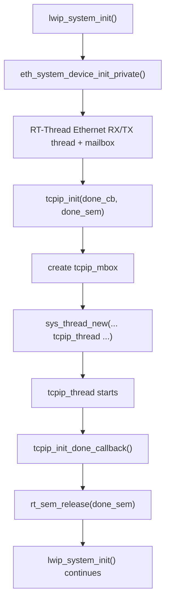
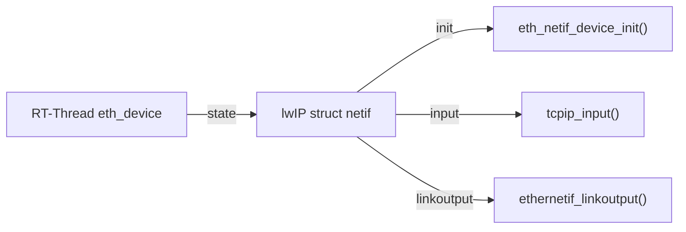
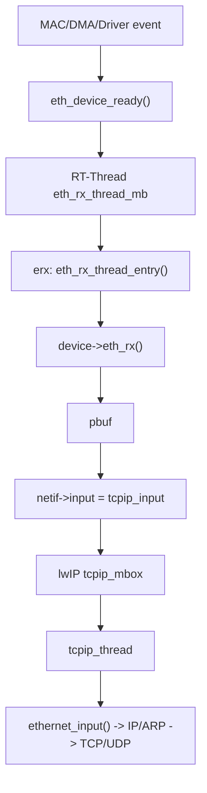
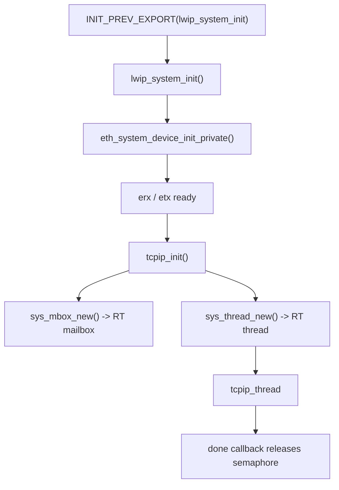
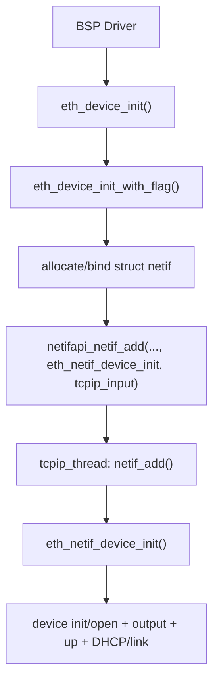

<meta name="referrer" content="no-referrer" />

# 教程 39：从 `lwip_system_init()` 到 `tcpip_input()`——RT-Thread 如何把 lwIP 接进 RTOS 与 Ethernet Device

> 摘要：从 RT-Thread 的 lwIP 初始化入口追踪 Kconfig、sys_arch、eth_device、RX/TX 线程与 tcpip_input，建立真实 RTOS Port 的完整桥接流程。

[TOC]

Stage 38 已经把 lwIP Port Contract 拆成四块：`lwipopts.h` 配置、源码构建选择、OS/Arch Port、Network Port。Stage 39 不再重复这些抽象的原理，而是直接拿 RT-Thread 当前源码回答一个问题：**RT-Thread 怎样把这些 contract 一项项落成可运行代码，并把一个 Ethernet Driver 最终接到 `tcpip_thread`。**

本文 RT-Thread 源码固定到 `RT-Thread/rt-thread` commit `dc8aaa73f2dbea255325ec058a083aeeb5381d0a`（2026-09-28）。这一版本的 Kconfig 可以选择内置 lwIP 1.4.1、2.0.3、2.1.2，也可以选择 `latest` package；本文为了追一条确定的内置源码链，以 **RT-Thread vendored lwIP 2.1.2 + shared port layer** 为主要实现证据。[S1](#source-s1)[S5](#source-s5)

RT-Thread 的完整 Device Framework、NetDev、SAL、DFS 并不是本篇目标。它们只在当前调用链真正出现时说明接口位置；Socket/SAL 与 NetDev 会留到 Stage 40～41。

## 1. 从 RT-Thread 初始化入口 `lwip_system_init()` 开始

RT-Thread shared Port 的初始化入口位于：

```text
components/net/lwip/port/sys_arch.c
```

`lwip_system_init()` 定义完成后，`sys_arch.c` 通过下面的导出宏把这个函数挂进 RT-Thread initialization sequence：

```c
INIT_PREV_EXPORT(lwip_system_init);
```

因此系统初始化阶段会自动进入该函数。[S3](#source-s3)

下面进入完整的 `lwip_system_init()`：

```c
int lwip_system_init(void)
{
    rt_err_t rc;
    struct rt_semaphore done_sem;
    static rt_bool_t init_ok = RT_FALSE;

    if (init_ok)
    {
        rt_kprintf("lwip system already init.\n");
        return 0;
    }
#ifdef RT_USING_SMP
    rt_mutex_init(&_mutex, "sys_arch", RT_IPC_FLAG_FIFO);
#endif

    extern int eth_system_device_init_private(void);
    eth_system_device_init_private();

    /* set default netif to NULL */
    netif_default = RT_NULL;

    rc = rt_sem_init(&done_sem, "done", 0, RT_IPC_FLAG_FIFO);
    if (rc != RT_EOK)
    {
        LWIP_ASSERT("Failed to create semaphore", 0);

        return -1;
    }

    tcpip_init(tcpip_init_done_callback, (void *)&done_sem);

    /* waiting for initialization done */
    if (rt_sem_take(&done_sem, RT_WAITING_FOREVER) != RT_EOK)
    {
        rt_sem_detach(&done_sem);

        return -1;
    }
    rt_sem_detach(&done_sem);

    rt_kprintf("lwIP-%d.%d.%d initialized!\n", LWIP_VERSION_MAJOR, LWIP_VERSION_MINOR, LWIP_VERSION_REVISION);

    init_ok = RT_TRUE;

    return 0;
}
```

这个函数没有直接初始化 TCP、UDP、DHCP，而是先做两件更基础的事情：

1. `eth_system_device_init_private()` 建立 RT-Thread 自己的 Ethernet RX/TX bridge context；
2. `tcpip_init()` 启动 upstream lwIP 的 TCPIP core thread。[S3](#source-s3)[S4](#source-s4)[S6](#source-s6)

主链因此从一开始就分成两个线程域：



在继续进入两个子调用前，先追清 `tcpip_init()` 所依赖的编译期参数怎样由 RT-Thread 配置体系提供。

## 2. 从入口里出现的 TCPIP 参数反查 Kconfig：它并不直接替代 `lwipopts.h`

RT-Thread 的配置入口在 `components/net/lwip/Kconfig`。启用：

```text
RT_USING_LWIP
```

之后，可以继续选择 lwIP 版本以及 TCP、UDP、DHCP、DNS、IPv6、PPP、资源数量和线程参数等。[S1](#source-s1)

当前 Kconfig 中可以直接看到这类配置：

```text
RT_LWIP_TCP
RT_LWIP_UDP
RT_LWIP_DHCP
RT_LWIP_DNS
RT_LWIP_PBUF_NUM
RT_LWIP_TCP_PCB_NUM
RT_LWIP_TCP_SEG_NUM
RT_LWIP_TCP_SND_BUF
RT_LWIP_TCP_WND
RT_LWIP_TCPTHREAD_PRIORITY
RT_LWIP_TCPTHREAD_MBOX_SIZE
RT_LWIP_TCPTHREAD_STACKSIZE
RT_LWIP_ETHTHREAD_PRIORITY
RT_LWIP_ETHTHREAD_MBOX_SIZE
RT_LWIP_ETHTHREAD_STACKSIZE
```

但 lwIP Core 最终认识的仍然是：

```text
LWIP_TCP
LWIP_UDP
LWIP_DHCP
MEMP_NUM_TCP_PCB
TCP_SND_BUF
TCPIP_THREAD_PRIO
...
```

中间的翻译层就是 RT-Thread 的共享 `components/net/lwip/port/lwipopts.h`。[S2](#source-s2)

例如当前 Port 中存在明确映射：

```c
#ifdef RT_LWIP_TCP
#define LWIP_TCP                    1
#else
#define LWIP_TCP                    0
#endif

#ifdef RT_LWIP_DHCP
#define LWIP_DHCP                   1
#else
#define LWIP_DHCP                   0
#endif

#ifdef RT_LWIP_PBUF_NUM
#define PBUF_POOL_SIZE              RT_LWIP_PBUF_NUM
#endif
```

TCPIP thread 参数也一样：

```c
#ifdef RT_LWIP_TCPTHREAD_PRIORITY
#define TCPIP_MBOX_SIZE             RT_LWIP_TCPTHREAD_MBOX_SIZE
#define TCPIP_THREAD_PRIO           RT_LWIP_TCPTHREAD_PRIORITY
#define TCPIP_THREAD_STACKSIZE      RT_LWIP_TCPTHREAD_STACKSIZE
#else
#define TCPIP_MBOX_SIZE             8
#define TCPIP_THREAD_PRIO           128
#define TCPIP_THREAD_STACKSIZE      4096
#endif
#define TCPIP_THREAD_NAME           "tcpip"
```

所以配置链是：


这里已经能看出 RT-Thread 的第一个集成策略：**上层使用 RT-Thread 自己的 Kconfig 命名，Port 层再把它翻译成 upstream lwIP contract。**

## 3. Kconfig 最终锁定 `NO_SYS=0`：所以 `tcpip_init()` 必须创建 Core Thread

`port/lwipopts.h` 当前直接定义：[S2](#source-s2)

```c
#define NO_SYS                      0
#define SYS_LIGHTWEIGHT_PROT        1
#define LWIP_SOCKET                 1
#define LWIP_NETCONN                1
```

这就锁定了本文后面的运行模型：

```text
RT-Thread task / driver context
        ↓
OS abstraction / tcpip mailbox
        ↓
tcpip_thread
        ↓
lwIP Core
```

Stage 11 已经解释过 `NO_SYS=0` 的线程模型，这里只关注 RT-Thread **怎么实现它**。

## 4. 进入 `eth_system_device_init_private()`：RT-Thread 先建立自己的 Ethernet RX/TX bridge

`eth_system_device_init_private()` 位于 `port/ethernetif.c`。当前默认没有定义 `LWIP_NO_RX_THREAD/LWIP_NO_TX_THREAD` 时，它分别初始化 mailbox 与静态 thread，然后启动 `erx` 与 `etx`。[S4](#source-s4)

源码主逻辑是：

```c
int eth_system_device_init_private(void)
{
    rt_err_t result = RT_EOK;

#ifndef LWIP_NO_RX_THREAD
    result = rt_mb_init(&eth_rx_thread_mb, "erxmb",
                        &eth_rx_thread_mb_pool[0], sizeof(eth_rx_thread_mb_pool)/sizeof(rt_ubase_t),
                        RT_IPC_FLAG_FIFO);
    RT_ASSERT(result == RT_EOK);

    result = rt_thread_init(&eth_rx_thread, "erx", eth_rx_thread_entry, RT_NULL,
                            &eth_rx_thread_stack[0], sizeof(eth_rx_thread_stack),
                            RT_ETHERNETIF_THREAD_PREORITY, 16);
    RT_ASSERT(result == RT_EOK);
    result = rt_thread_startup(&eth_rx_thread);
    RT_ASSERT(result == RT_EOK);
#endif

#ifndef LWIP_NO_TX_THREAD
    result = rt_mb_init(&eth_tx_thread_mb, "etxmb",
                        &eth_tx_thread_mb_pool[0], sizeof(eth_tx_thread_mb_pool)/sizeof(rt_ubase_t),
                        RT_IPC_FLAG_FIFO);
    RT_ASSERT(result == RT_EOK);

    result = rt_thread_init(&eth_tx_thread, "etx", eth_tx_thread_entry, RT_NULL,
                            &eth_tx_thread_stack[0], sizeof(eth_tx_thread_stack),
                            RT_ETHERNETIF_THREAD_PREORITY, 16);
    RT_ASSERT(result == RT_EOK);

    result = rt_thread_startup(&eth_tx_thread);
    RT_ASSERT(result == RT_EOK);
#endif

    return (int)result;
}
```

这里的 `erx/etx` **不是 lwIP 的 `tcpip_thread`**。

它们属于 RT-Thread 的 Ethernet Port，用来在具体 Driver callback 与 lwIP `netif` 之间做线程桥接：

```text
erx
  -> 从 Driver 拉 RX pbuf
  -> 调 netif->input()

etx
  -> 收到 linkoutput 提交的 pbuf
  -> 调 Driver eth_tx()

tcpip
  -> 真正运行 lwIP Core packet processing / timers / API messages
```

这个区分非常重要。否则后面看到 `erx -> tcpip_input -> tcpip` 时容易误认为有两个 TCP/IP Core thread。

`eth_system_device_init_private()` 返回后，执行回到 `lwip_system_init()`，下一条关键语句是 `tcpip_init(...)`。

## 5. 回到 `lwip_system_init()`，进入 upstream `tcpip_init()`

RT-Thread vendored lwIP 2.1.2 的 `tcpip_init()` 仍遵循 upstream OS-mode contract：[S6](#source-s6)

```c
void
tcpip_init(tcpip_init_done_fn initfunc, void *arg)
{
  lwip_init();

  tcpip_init_done = initfunc;
  tcpip_init_done_arg = arg;
  if (sys_mbox_new(&tcpip_mbox, TCPIP_MBOX_SIZE) != ERR_OK) {
    LWIP_ASSERT("failed to create tcpip_thread mbox", 0);
  }
#if LWIP_TCPIP_CORE_LOCKING
  if (sys_mutex_new(&lock_tcpip_core) != ERR_OK) {
    LWIP_ASSERT("failed to create lock_tcpip_core", 0);
  }
#endif /* LWIP_TCPIP_CORE_LOCKING */

  sys_thread_new(TCPIP_THREAD_NAME, tcpip_thread, NULL, TCPIP_THREAD_STACKSIZE, TCPIP_THREAD_PRIO);
}
```

Stage 38 里看到的 Port Contract 此刻开始落地：

```text
sys_mbox_new()
    ↓
RT-Thread rt_mb_create()

sys_thread_new()
    ↓
RT-Thread rt_thread_create()
    ↓
rt_thread_startup()
```

RT-Thread `sys_arch.c` 中的线程适配函数是：[S3](#source-s3)

```c
sys_thread_t sys_thread_new(const char    *name,
                            lwip_thread_fn thread,
                            void          *arg,
                            int            stacksize,
                            int            prio)
{
    rt_thread_t t;

    RT_DEBUG_NOT_IN_INTERRUPT;

    /* create thread */
    t = rt_thread_create(name, thread, arg, stacksize, prio, 20);
    RT_ASSERT(t != RT_NULL);

    /* startup thread */
    rt_thread_startup(t);

    return t;
}
```

所以 `tcpip_thread` 并不是 RT-Thread 重写的一套协议栈线程。**线程函数仍来自 lwIP `tcpip.c`，RT-Thread 只实现“怎样创建一个线程去运行它”。**

## 6. `sys_arch` 的核心思想就是“lwIP primitive → RT-Thread primitive”

无需再次逐函数学习 Stage 11 的 IPC 原理，把当前源码映射表看清即可：[S2](#source-s2)[S3](#source-s3)

| lwIP Port API | RT-Thread 当前实现 |
| --- | --- |
| `sys_sem_new()` | `rt_sem_create()` |
| `sys_sem_signal()` | `rt_sem_release()` |
| `sys_arch_sem_wait()` | `rt_sem_take()` + tick/ms conversion |
| `sys_mutex_new()` | `rt_mutex_create()` |
| `sys_mutex_lock()` | `rt_mutex_take()` |
| `sys_mbox_new()` | `rt_mb_create()` |
| `sys_mbox_post()` | `rt_mb_send_wait()` |
| `sys_arch_mbox_fetch()` | `rt_mb_recv_interruptible()` |
| `sys_thread_new()` | `rt_thread_create()` + `rt_thread_startup()` |
| `sys_now()` | `rt_tick_get_millisecond()` |
| `sys_jiffies()` | `rt_tick_get()` |
| `sys_arch_protect()` | SMP mutex 或 spinlock + IRQ save |

`arch/sys_arch.h` 则直接把类型对应起来：[S2](#source-s2)

```c
typedef rt_uint32_t sys_prot_t;
typedef rt_sem_t sys_sem_t;
typedef rt_mutex_t sys_mutex_t;
typedef rt_mailbox_t  sys_mbox_t;
typedef rt_thread_t sys_thread_t;
```

所以 RT-Thread 对 lwIP 的 OS Port 不是修改 `tcpip.c` 的调度算法，而是在它要求 semaphore/mailbox/thread/time 时，用 RT-Thread 原语满足 contract。

## 7. `tcpip_thread` 启动以后，为什么 `lwip_system_init()` 才能继续

`tcpip_init()` 保存：

```text
initfunc = tcpip_init_done_callback
arg      = &done_sem
```

然后启动 `tcpip_thread`。进入 `tcpip_thread()` 后，在主循环前会调用这个 callback：[S6](#source-s6)

```c
static void
tcpip_thread(void *arg)
{
  struct tcpip_msg *msg;
  LWIP_UNUSED_ARG(arg);

  LWIP_MARK_TCPIP_THREAD();

  LOCK_TCPIP_CORE();
  if (tcpip_init_done != NULL) {
    tcpip_init_done(tcpip_init_done_arg);
  }

  while (1) {
    LWIP_TCPIP_THREAD_ALIVE();
    TCPIP_MBOX_FETCH(&tcpip_mbox, (void **)&msg);
    if (msg == NULL) {
      LWIP_DEBUGF(TCPIP_DEBUG, ("tcpip_thread: invalid message: NULL\n"));
      LWIP_ASSERT("tcpip_thread: invalid message", 0);
      continue;
    }
    tcpip_thread_handle_msg(msg);
  }
}
```

RT-Thread 提供的 callback 很简单：[S3](#source-s3)

```c
static void tcpip_init_done_callback(void *arg)
{
    rt_sem_release((rt_sem_t)arg);
}
```

因此初始化同步关系是：

```text
lwip_system_init()
  -> tcpip_init()
  -> tcpip_thread created
  -> tcpip_thread runs init_done callback
  -> callback releases done_sem
  -> lwip_system_init() wakes up
```

这个 semaphore 只承担**初始化完成同步**，不是 TCP/IP packet mailbox。

## 8. 到这里 lwIP Core 已经活了，但还没有任何具体 Ethernet Device

`lwip_system_init()` 完成意味着：

```text
sys_arch ready
Ethernet bridge threads ready
tcpip_thread ready
lwIP core modules initialized
```

但实际网卡仍需要 BSP/Driver 提供。RT-Thread 为 Ethernet Driver 定义了一层很薄的桥接对象 `struct eth_device`：[S4](#source-s4)

```c
struct eth_device
{
    /* inherit from rt_device */
    struct rt_device parent;

    /* network interface for lwip */
    struct netif *netif;

    rt_uint16_t flags;
    rt_uint8_t  link_changed;
    rt_uint8_t  link_status;
    rt_uint8_t  rx_notice;

    struct rt_spinlock spinlock;

    /* eth device interface */
    struct pbuf* (*eth_rx)(rt_device_t dev);
    rt_err_t (*eth_tx)(rt_device_t dev, struct pbuf* p);
};
```

这一层把两个体系接在一起：

```text
RT-Thread side                 lwIP side
--------------                 ---------
struct rt_device parent   <->  device lifecycle
eth_rx / eth_tx           <->  pbuf packet path
struct netif *netif       <->  lwIP interface object
```

具体 STM32 Driver 怎样实现 `eth_rx/eth_tx` 留到 Stage 42～43。本篇只追“Driver 已经提供这两个 callback 以后，RT-Thread 怎样把它注册进 lwIP”。

## 9. Driver 调 `eth_device_init()`：这是 Ethernet Device 接入 Port 的入口

RT-Thread Driver 常见接入点是：

```c
eth_device_init(&device, "e0");
```

当前 `eth_device_init()` 本身很短：[S4](#source-s4)

```c
rt_err_t eth_device_init(struct eth_device * dev, const char *name)
{
    rt_uint16_t flags = NETIF_FLAG_BROADCAST | NETIF_FLAG_ETHARP;

#if LWIP_IGMP
    /* IGMP support */
    flags |= NETIF_FLAG_IGMP;
#endif

    return eth_device_init_with_flag(dev, name, flags);
}
```

这里第一次把 Driver capability 转成 lwIP `netif->flags` 候选值：普通 Ethernet 需要 broadcast/ARP；如果启用 IGMP，再加入 multicast group capability。

继续进入 `eth_device_init_with_flag()`。

## 10. `eth_device_init_with_flag()`：同时建立 RT Device 与 lwIP `netif`

`eth_device_init_with_flag()` 前半段完成这些动作：[S4](#source-s4)

```text
allocate struct netif
    ↓
dev->netif = netif
    ↓
dev->parent.type = RT_Device_Class_NetIf
    ↓
rt_device_register()
    ↓
set netif name / hwaddr_len / mtu
    ↓
netif->linkoutput = ethernetif_linkoutput
    ↓
rt_device_control(NIOCTL_GADDR) 取得 MAC address
```

这里已经出现了 Stage 38 的 Network Port contract：

```text
struct netif
MTU
MAC address
linkoutput
private state
```

真正把它加入 lwIP Core 的位置在同一个函数后半段。继续阅读 `eth_device_init_with_flag()`：

```c
/* if tcp thread has been started up, we add this netif to the system */
if (rt_thread_find("tcpip") != RT_NULL)
{
#if LWIP_VERSION_MAJOR == 1U /* v1.x */
    struct ip_addr ipaddr, netmask, gw;
#else /* >= v2.x */
    ip4_addr_t ipaddr, netmask, gw;
#endif /* LWIP_VERSION_MAJOR == 1U */

#if !LWIP_DHCP
    ipaddr.addr = inet_addr(RT_LWIP_IPADDR);
    gw.addr = inet_addr(RT_LWIP_GWADDR);
    netmask.addr = inet_addr(RT_LWIP_MSKADDR);
#else
    IP4_ADDR(&ipaddr, 0, 0, 0, 0);
    IP4_ADDR(&gw, 0, 0, 0, 0);
    IP4_ADDR(&netmask, 0, 0, 0, 0);
#endif
    netifapi_netif_add(netif, &ipaddr, &netmask, &gw, dev, eth_netif_device_init, tcpip_input);
}
```

这行 `netifapi_netif_add()` 是本篇最重要的连接点之一。

它同时传入：

```text
netif                  -> 刚分配的 lwIP interface
state = dev            -> RT-Thread eth_device
init = eth_netif_device_init
input = tcpip_input
```

于是对象关系变成：



## 11. 为什么这里用 `netifapi_netif_add()` 而不是直接 `netif_add()`

RT-Thread 已经选择 `NO_SYS=0`。因此从普通 RT-Thread context 修改 lwIP `netif_list` 时，需要遵守 Core thread contract。

vendored lwIP 2.1.2 的 `netifapi_netif_add()` 注释直接写明：它通过在 `tcpip_thread` context 运行 `netif_add()` 来实现 thread-safe add。[S6](#source-s6)

进入 `netifapi_netif_add()` 后，它把参数放进 `netifapi_msg`，最后：

```c
err = tcpip_api_call(netifapi_do_netif_add, &API_VAR_REF(msg).call);
```

而 `netifapi_do_netif_add()` 才真正执行：

```c
if (!netif_add(msg->netif,
#if LWIP_IPV4
               API_EXPR_REF(msg->msg.add.ipaddr),
               API_EXPR_REF(msg->msg.add.netmask),
               API_EXPR_REF(msg->msg.add.gw),
#endif
               msg->msg.add.state,
               msg->msg.add.init,
               msg->msg.add.input)) {
  return ERR_IF;
} else {
  return ERR_OK;
}
```

所以这里不是多绕一层没有意义：

```text
RT-Thread initialization/driver context
    ↓
netifapi_netif_add()
    ↓
tcpip_api_call()
    ↓
tcpip_thread context
    ↓
netif_add()
```

这正是 Stage 11/38 所讲 execution-context contract 的实际落地。

## 12. `netif_add()` 会回调 `eth_netif_device_init()`：Port 开始填完整接口

`netif_add()` 保存传入的 `state/input`，并调用传入的 `init` callback。这里 `init` 就是 RT-Thread 的 `eth_netif_device_init()`。[S4](#source-s4)[S6](#source-s6)

进入 `eth_netif_device_init()`，当前路径依次做：[S4](#source-s4)

```text
netif->state -> struct eth_device
    ↓
rt_device_init(device)
    ↓
rt_device_open(device, RDWR)
    ↓
copy flags / set MTU
    ↓
netif->output = etharp_output
    ↓
set default netif if none
    ↓
netif_set_up()
    ↓
if DHCP: dhcp_start()
    ↓
if PHY already up: netif_set_link_up()
```

当前源码在 `RT_USING_NETDEV` 开启时还会调用 `netdev_add(netif)`。这条支路在这里仅记录为“RT-Thread 上层网络接口抽象的注册点”；**Stage 39 不展开 `NetDev/SAL`**，因为它们不是 lwIP Port 能否收发 packet 的必要前置解释，Stage 40～41 会单独处理。

`eth_netif_device_init()` 返回后，`netif_add()` 完成注册；控制最终回到 Driver 的 `eth_device_init()` 调用方。此时 lwIP 已经拥有一个可工作的 `struct netif`。

## 13. 此时最关键的三条函数指针已经绑定

把初始化阶段压缩以后，一个 Ethernet netif 至少已经形成：

```text
netif->state
    -> RT-Thread struct eth_device

netif->input
    -> tcpip_input

netif->output
    -> etharp_output

netif->linkoutput
    -> ethernetif_linkoutput
```

因此后面的 RX/TX 不需要每次判断“这是哪家 MCU Driver”。`netif->state` 可以找回 `eth_device`，再通过 `eth_rx/eth_tx` 函数指针进入具体 Driver。

下面先追 RX。

## 14. RX 的第一跳不是 `tcpip_input()`：Driver 先调用 `eth_device_ready()`

具体 Ethernet Driver 在 IRQ、DMA completion 或自己的 deferred context 中确认“有 packet 可取”后，调用：[S4](#source-s4)

```c
eth_device_ready(&device);
```

当前函数完整实现是：

```c
rt_err_t eth_device_ready(struct eth_device* dev)
{
    if (dev->netif)
    {
        if(dev->rx_notice == RT_FALSE)
        {
            dev->rx_notice = RT_TRUE;
            return rt_mb_send(&eth_rx_thread_mb, (rt_ubase_t)dev);
        }
        else
            return RT_EOK;
        /* post message to Ethernet thread */
    }
    else
        return -RT_ERROR; /* netif is not initialized yet, just return. */
}
```

这里传给 mailbox 的不是 packet pointer，而是：

```text
struct eth_device *
```

`rx_notice` 用来避免同一个 device 在上一次通知尚未被 RX thread 消费时反复塞入相同 mailbox notification。

因此 ISR/Driver 此时只完成：

```text
“e0 有数据了”
```

真正从 DMA/Driver 拉出 `pbuf` 的动作在 `erx` thread。

## 15. `erx` 线程被唤醒后进入 `eth_rx_thread_entry()`

`eth_system_device_init_private()` 已经把 `erx` thread 的入口绑定到 `eth_rx_thread_entry()`。因此 `eth_device_ready()` 的 mailbox message 到达以后，执行上下文切换到这个线程。[S4](#source-s4)

进入 `eth_rx_thread_entry()` 的 packet 主路径：

```c
static void eth_rx_thread_entry(void* parameter)
{
    struct eth_device* device;

    while (1)
    {
        if (rt_mb_recv(&eth_rx_thread_mb, (rt_ubase_t *)&device, RT_WAITING_FOREVER) == RT_EOK)
        {
            rt_base_t level;
            struct pbuf *p;

            /* check link status */
            if (device->link_changed)
            {
                int status;

                level = rt_spin_lock_irqsave(&(device->spinlock));
                status = device->link_status;
                device->link_changed = 0x00;
                rt_spin_unlock_irqrestore(&(device->spinlock), level);

                if (status)
                    netifapi_netif_set_link_up(device->netif);
                else
                    netifapi_netif_set_link_down(device->netif);
            }

            level = rt_spin_lock_irqsave(&(device->spinlock));
            device->rx_notice = RT_FALSE;
            rt_spin_unlock_irqrestore(&(device->spinlock), level);

            /* receive all of buffer */
            while (1)
            {
                if(device->eth_rx == RT_NULL) break;

                p = device->eth_rx(&(device->parent));
                if (p != RT_NULL)
                {
                    if( device->netif->input(p, device->netif) != ERR_OK )
                    {
                        LWIP_DEBUGF(NETIF_DEBUG, ("ethernetif_input: Input error\n"));
                        pbuf_free(p);
                        p = NULL;
                    }
                }
                else break;
            }
        }
        else
        {
            LWIP_ASSERT("Should not happen!\n",0);
        }
    }
}
```

这里同时解决了三个边界问题：

1. link change 也被 deferred 到 Ethernet RX thread 处理；
2. Driver 的 `eth_rx()` 真正产生/返回 `pbuf`；
3. 拿到 `pbuf` 后不直接调用 TCP/UDP，而是调用此前绑定的 `netif->input()`。

而 `netif->input` 在初始化时已经被设成 `tcpip_input`。

## 16. 从 `netif->input()` 进入 `tcpip_input()`：这才真正跨进 lwIP Core

继续阅读 `eth_rx_thread_entry()` 的 RX 循环，此处调用此前绑定的 `netif->input`：

```c
device->netif->input(p, device->netif)
```

由于 `eth_device_init_with_flag()` 注册 netif 时把 `input` 参数设为 `tcpip_input`，当前这次间接调用实际进入：

```c
tcpip_input(p, device->netif)
```

RT-Thread vendored lwIP 2.1.2 的 `tcpip_input()` 会根据 netif flags 为 Ethernet packet 选择 `ethernet_input`，再进入 `tcpip_inpkt()`。[S6](#source-s6) 当前 shared `lwipopts.h` 没有打开 `LWIP_TCPIP_CORE_LOCKING_INPUT`，因此沿 lwIP 2.1.2 默认分支把 packet 封装成 input message 后投递到 TCPIP thread mailbox；若项目显式改用 core-locking-input，`tcpip_inpkt()` 的执行策略会变化，不能把“必经 mailbox”泛化成所有 lwIP Port 的固定规则。

关键入口是：

```c
err_t
tcpip_input(struct pbuf *p, struct netif *inp)
{
#if LWIP_ETHERNET
  if (inp->flags & (NETIF_FLAG_ETHARP | NETIF_FLAG_ETHERNET)) {
    return tcpip_inpkt(p, inp, ethernet_input);
  } else
#endif /* LWIP_ETHERNET */
    return tcpip_inpkt(p, inp, ip_input);
}
```

于是完整 RX context transition 才终于闭环：



这也是 RT-Thread Port 最重要的线程边界：**Driver/ISR 不直接执行 lwIP TCP/IP Core；RT-Thread 先把硬件事件 deferred 到 `erx`，再由 `tcpip_input()` 把 packet deferred 到 lwIP `tcpip_thread`。**

具体 MCU 是否一定需要独立 `erx`，是 Port 设计选择；这里描述的是当前 RT-Thread shared Ethernet Port 的实现。

## 17. TX 方向从 `netif->linkoutput` 回到 RT-Thread `eth_device`

初始化时已经执行：

```c
netif->linkoutput = ethernetif_linkoutput;
```

所以前面 Stage 19/20 学过的 Ethernet TX 最终来到 RT-Thread 的 `ethernetif_linkoutput()`。[S4](#source-s4)

当前默认存在 TX thread 时，这个函数把 `netif + pbuf` 包成 `eth_tx_msg`，发进 `eth_tx_thread_mb`，并等待 completion：

```c
static err_t ethernetif_linkoutput(struct netif *netif, struct pbuf *p)
{
#ifndef LWIP_NO_TX_THREAD
    struct eth_tx_msg msg;

    RT_ASSERT(netif != RT_NULL);

    msg.netif = netif;
    msg.buf   = p;
    rt_completion_init(&msg.ack);
    if (rt_mb_send(&eth_tx_thread_mb, (rt_ubase_t) &msg) == RT_EOK)
    {
        rt_completion_wait(&msg.ack, RT_WAITING_FOREVER);
    }
#else
    struct eth_device* enetif;

    RT_ASSERT(netif != RT_NULL);
    enetif = (struct eth_device*)netif->state;

    if (enetif->eth_tx(&(enetif->parent), p) != RT_EOK)
    {
        return ERR_IF;
    }
#endif
    return ERR_OK;
}
```

`etx` thread 收到 message 后，通过：

```text
msg->netif->state
```

找回 `struct eth_device`，再调用：

```c
enetif->eth_tx(&(enetif->parent), msg->buf)
```

最后 `rt_completion_done()` 唤醒等待者。[S4](#source-s4)

所以 TX chain 是：


如果配置 `LWIP_NO_TX_THREAD`，`ethernetif_linkoutput()` 则直接从 `netif->state` 找到 `eth_device` 并调用 `eth_tx()`。这说明独立 TX thread 是 RT-Thread Port 的可选实现策略，不是 lwIP Core contract。

## 18. Link Up/Down 也通过同一 bridge，而不是 PHY 代码直接改 Core 状态

Driver/PHY 检测到 link 改变时可以调用：[S4](#source-s4)

```c
eth_device_linkchange(dev, up);
```

有 RX thread 的默认配置下，它先在 spinlock 下更新：

```text
link_changed
link_status
```

然后把 device 发到 `eth_rx_thread_mb`。`erx` thread 前面已经看到这段处理：

```text
link_status = up
    -> netifapi_netif_set_link_up()

link_status = down
    -> netifapi_netif_set_link_down()
```

因此 Link event 同样遵守：

```text
Driver/PHY context
    ↓
RT-Thread Ethernet bridge
    ↓
thread-safe netif API
    ↓
lwIP Core state
```

PHY/MDIO/Auto-Negotiation 的具体 Driver 实现会留到 Stage 44；本篇只确认 RT-Thread Port 给它预留了怎样的上报路径。

## 19. `SConscript` 说明“Port 层”和“vendored lwIP”在构建上也是两部分

RT-Thread 当前构建结构进一步印证了这个分层。[S5](#source-s5)

共享 Port 的：

```text
components/net/lwip/port/SConscript
```

会把 port 目录自己的 `.c` 作为 `lwIP` group 加入，依赖 `RT_USING_LWIP`。

而：

```text
components/net/lwip/lwip-2.1.2/SConscript
```

单独列出 Core、IPv4、IPv6、API、netif、PPP、SNMP 等 upstream source，并根据 RT-Thread config 选择附加模块。[S5](#source-s5)

因此从构建视角也可以画成：

```text
RT-Thread configuration
     ├─ selects lwIP implementation/version sources
     └─ selects shared RT-Thread port sources
                     ↓
             one final firmware image
```

值得注意的是，当前内置 2.1.2 `SConscript` 虽然定义了 HTTP、SNTP、MQTT 等 app source list，但底部基础 `src` 并没有把这些 app group 全部无条件追加进去。[S5](#source-s5) 所以不能因为 upstream 目录里存在某个 app，就假设 RT-Thread 内置 lwIP 默认一定把它编进固件。产品仍要以实际 package/version/build script 为准。

## 20. RT-Thread 在这里“改了什么”：主要是 Port 与 Integration，不等于重写 lwIP Core

追完调用链后，Stage 38 的 contract 与 RT-Thread 当前实现可以逐项对应：

| Stage 38 contract | RT-Thread 当前实现 |
| --- | --- |
| Feature/resource config | `Kconfig -> rtconfig.h -> port/lwipopts.h` |
| Compiler/arch abstraction | `port/arch/cc.h` |
| OS handle types | `port/arch/sys_arch.h` |
| Semaphore/mailbox/thread/time | `port/sys_arch.c` |
| Core thread | vendored lwIP `tcpip.c` + RT `sys_thread_new()` |
| Ethernet interface object | `struct netif` + RT `struct eth_device` |
| RX bridge | `eth_device_ready -> erx -> eth_rx -> tcpip_input` |
| TX bridge | `linkoutput -> etx -> eth_tx` |
| Link bridge | `eth_device_linkchange -> netifapi_netif_set_link_*` |

这比“RT-Thread 修改了 lwIP”更准确。

RT-Thread 确实维护 vendored lwIP 版本和适配代码，也存在版本兼容条件，但当前这条主线真正关键的是：

```text
upstream/vendored lwIP Core contract
        ↑
RT-Thread Port / Integration
        ↓
RT-Thread Device + concrete Ethernet Driver
```

Stage 40/41 才会继续研究 RT-Thread 为什么又在 Socket/Network Device 层增加 SAL、NetDev 等上层抽象。

## 21. Stage 39 的完整调用链

初始化：



网卡注册：



运行时 RX/TX：

```text
RX:
Driver event
 -> eth_device_ready()
 -> erx
 -> eth_rx()
 -> pbuf
 -> tcpip_input()
 -> tcpip_thread
 -> lwIP Core

TX:
lwIP Core
 -> netif->linkoutput
 -> ethernetif_linkoutput()
 -> etx
 -> eth_tx()
 -> Driver
```

到这里，Stage 38 的“抽象 Port Contract”已经通过 RT-Thread 真实源码完整落地。

下一篇 Stage 40 不再继续深入 `rt_thread/rt_mailbox/rt_device` 的内部实现，而是从应用真正调用的 `socket()` 开始，只追与 lwIP 相交的路径：为什么 RT-Thread 会先经过统一 fd/DFS 与 SAL，最后才进入 `lwip_socket()`。完整 DFS、Device Framework 与 RT-Thread Kernel 源码仍留给独立 RT-Thread Source Lab。

## 资料来源

<a id="source-s1"></a>
### [S1] RT-Thread lwIP Kconfig
- 类型：RT-Thread 官方仓库源码
- 版本：commit `dc8aaa73f2dbea255325ec058a083aeeb5381d0a`，2026-09-28
- 定位：`components/net/lwip/Kconfig`：`RT_USING_LWIP`、version choice、protocol/resource/thread options
- URL/文档：[RT-Thread lwIP Kconfig](https://github.com/RT-Thread/rt-thread/blob/dc8aaa73f2dbea255325ec058a083aeeb5381d0a/components/net/lwip/Kconfig)
- 使用位置：“版本与 feature/resource 配置入口”
- 支撑内容：证明当前 RT-Thread 可选 lwIP 版本以及 Kconfig 暴露的主要协议、资源与线程参数

<a id="source-s2"></a>
### [S2] RT-Thread lwIP `lwipopts.h` 与 arch Port
- 类型：RT-Thread 官方仓库源码
- 版本：同上
- 定位：`components/net/lwip/port/lwipopts.h`、`port/arch/sys_arch.h`、`port/arch/cc.h`
- URL/文档：[RT-Thread lwipopts.h](https://github.com/RT-Thread/rt-thread/blob/dc8aaa73f2dbea255325ec058a083aeeb5381d0a/components/net/lwip/port/lwipopts.h)、[RT-Thread sys_arch.h](https://github.com/RT-Thread/rt-thread/blob/dc8aaa73f2dbea255325ec058a083aeeb5381d0a/components/net/lwip/port/arch/sys_arch.h)、[RT-Thread cc.h](https://github.com/RT-Thread/rt-thread/blob/dc8aaa73f2dbea255325ec058a083aeeb5381d0a/components/net/lwip/port/arch/cc.h)
- 使用位置：“Kconfig 到 lwIP macro 映射”“NO_SYS 模式”“RTOS handle 类型”
- 支撑内容：说明 `RT_LWIP_*` 如何转成 upstream option，并证明 RT-Thread 当前使用 `NO_SYS=0`

<a id="source-s3"></a>
### [S3] RT-Thread lwIP OS Port
- 类型：RT-Thread 官方仓库源码
- 版本：同上
- 定位：`components/net/lwip/port/sys_arch.c`：`lwip_system_init()`、`tcpip_init_done_callback()`、`sys_sem_*`、`sys_mbox_*`、`sys_thread_new()`、`sys_now()`、`sys_arch_protect()`
- URL/文档：[RT-Thread sys_arch.c](https://github.com/RT-Thread/rt-thread/blob/dc8aaa73f2dbea255325ec058a083aeeb5381d0a/components/net/lwip/port/sys_arch.c)
- 使用位置：“真实初始化入口”“sys_arch mapping”“tcpip_thread 创建”
- 支撑内容：证明 lwIP OS abstraction 如何映射到 RT-Thread IPC/thread/time/protection primitives

<a id="source-s4"></a>
### [S4] RT-Thread Ethernet Port
- 类型：RT-Thread 官方仓库源码
- 版本：同上
- 定位：`components/net/lwip/port/ethernetif.c`、`port/netif/ethernetif.h`：`struct eth_device`、`eth_system_device_init_private()`、`eth_device_init()`、`eth_device_ready()`、`eth_rx_thread_entry()`、`ethernetif_linkoutput()`、`eth_device_linkchange()`
- URL/文档：[RT-Thread ethernetif.c](https://github.com/RT-Thread/rt-thread/blob/dc8aaa73f2dbea255325ec058a083aeeb5381d0a/components/net/lwip/port/ethernetif.c)、[RT-Thread ethernetif.h](https://github.com/RT-Thread/rt-thread/blob/dc8aaa73f2dbea255325ec058a083aeeb5381d0a/components/net/lwip/port/netif/ethernetif.h)
- 使用位置：“eth_device 与 netif 绑定”“RX/TX thread bridge”“Link change”
- 支撑内容：Stage 39 Ethernet integration 主调用链的直接实现证据

<a id="source-s5"></a>
### [S5] RT-Thread lwIP build integration
- 类型：RT-Thread 官方仓库源码
- 版本：同上
- 定位：`components/net/lwip/port/SConscript`、`components/net/lwip/lwip-2.1.2/SConscript`
- URL/文档：[RT-Thread port SConscript](https://github.com/RT-Thread/rt-thread/blob/dc8aaa73f2dbea255325ec058a083aeeb5381d0a/components/net/lwip/port/SConscript)、[RT-Thread lwIP 2.1.2 SConscript](https://github.com/RT-Thread/rt-thread/blob/dc8aaa73f2dbea255325ec058a083aeeb5381d0a/components/net/lwip/lwip-2.1.2/SConscript)
- 使用位置：“Port 与 vendored source 的构建关系”“应用源码是否默认加入”
- 支撑内容：说明 RT-Thread 如何把 shared Port 和选定 lwIP implementation 组合进 firmware

<a id="source-s6"></a>
### [S6] RT-Thread vendored lwIP 2.1.2 `tcpip` / `netifapi` / `netif`
- 类型：RT-Thread 仓库内置 lwIP 源码
- 版本：RT-Thread commit `dc8aaa73f2dbea255325ec058a083aeeb5381d0a` 中的 vendored 2.1.2
- 定位：`components/net/lwip/lwip-2.1.2/src/api/tcpip.c`：`tcpip_init()`、`tcpip_thread()`、`tcpip_input()`；`src/api/netifapi.c`：`netifapi_netif_add()`、`netifapi_do_netif_add()`；`src/core/netif.c`：`netif_add()`
- URL/文档：[RT-Thread vendored tcpip.c](https://github.com/RT-Thread/rt-thread/blob/dc8aaa73f2dbea255325ec058a083aeeb5381d0a/components/net/lwip/lwip-2.1.2/src/api/tcpip.c)、[RT-Thread vendored netifapi.c](https://github.com/RT-Thread/rt-thread/blob/dc8aaa73f2dbea255325ec058a083aeeb5381d0a/components/net/lwip/lwip-2.1.2/src/api/netifapi.c)、[RT-Thread vendored netif.c](https://github.com/RT-Thread/rt-thread/blob/dc8aaa73f2dbea255325ec058a083aeeb5381d0a/components/net/lwip/lwip-2.1.2/src/core/netif.c)
- 使用位置：“tcpip thread 启动”“thread-safe netif add”“tcpip_input RX bridge”
- 支撑内容：证明 RT-Thread Port 如何继续调用标准 lwIP 2.1.2 Core/API，而不是在 Port 层重写 TCP/IP processing
