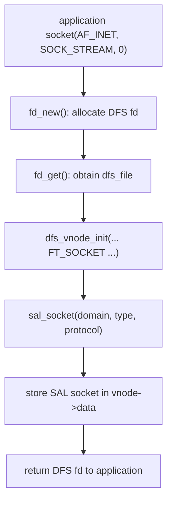
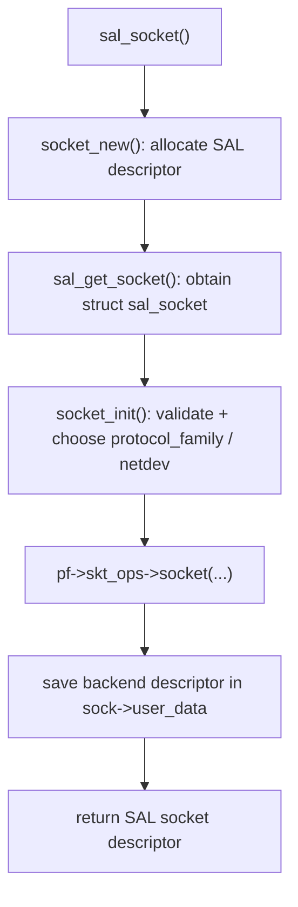
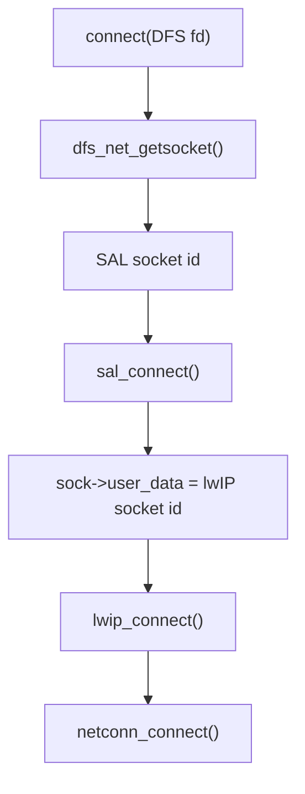
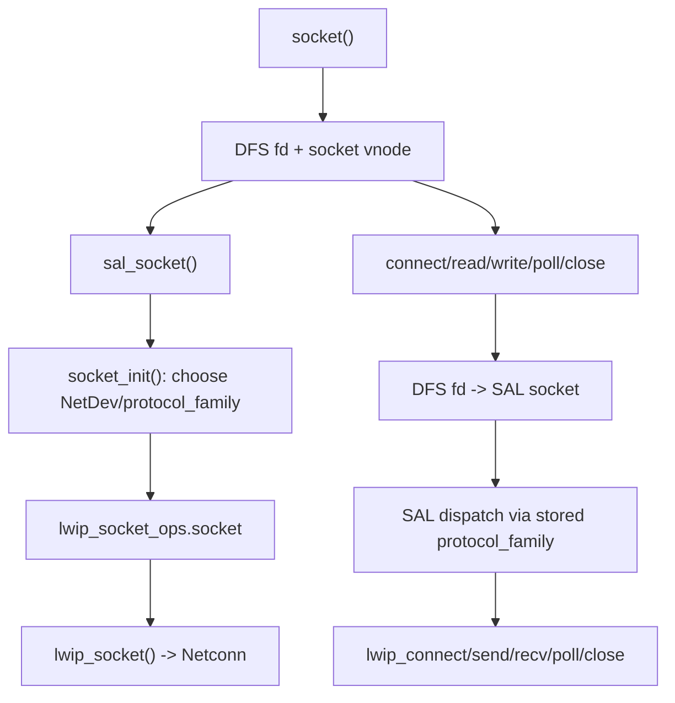

<meta name="referrer" content="no-referrer" />

# 教程 40：从 `socket()` 到 `lwip_socket()`——DFS fd、SAL Socket 与 lwIP Backend

> 摘要：从 RT-Thread 的 BSD socket 入口追踪 DFS fd、SAL socket、NetDev 选择与 lwIP backend，解释三层句柄如何把 POSIX 文件语义接到 lwIP Socket API。

[TOC]

Stage 39 已经把 Ethernet Driver 接到了 lwIP `tcpip_thread`。但应用通常不会直接调用 `lwip_socket()`：启用 RT-Thread 的 SAL 与 POSIX socket 支持后，应用写的仍然是标准 `socket()`、`connect()`、`read()`、`write()`、`poll()`，中间却多出 DFS、SAL 和 NetDev。

Stage 40 只回答这条应用侧主线：**`socket(AF_INET, SOCK_STREAM, 0)` 为什么最后会进入 `lwip_socket()`，以及后续同一个文件描述符怎样继续走到 `lwip_connect()`、`lwip_sendto()`、`lwip_recvfrom()`。**

本文 RT-Thread 源码继续固定到 `RT-Thread/rt-thread` commit `dc8aaa73f2dbea255325ec058a083aeeb5381d0a`（2026-09-28），lwIP backend 以该提交内置的 lwIP 2.1.2 为主要证据。[S1](#source-s1)[S6](#source-s6)

## 1. 真实入口就是应用调用的 `socket()`

当 `RT_USING_SAL` 与 `SAL_USING_POSIX` 生效时，`components/net/sal/socket/net_sockets.c` 会编进系统；这里直接实现并导出标准 BSD 名称 `socket()`。[S1](#source-s1)[S2](#source-s2)

`socket()` 的执行顺序不是先进入 lwIP，而是先建立 RT-Thread 的文件描述符对象：



`socket()` 因此同时创建两种不同层次的对象：[S2](#source-s2)

| 对象 | 谁分配 | 对应用是否可见 | 当前职责 |
| --- | --- | --- | --- |
| DFS fd / `dfs_file` / `dfs_vnode` | `socket()` 外层 | 是 | 让 socket 进入统一 fd、`read/write/close/poll/select` 体系 |
| SAL socket | `sal_socket()` | 否 | 记录 domain/type/protocol、NetDev、backend operations 与 backend socket |

这一步先解释了一个容易混淆的问题：**RT-Thread 应用拿到的整数 fd 不是 lwIP 自己的 socket index。**

## 2. 为什么必须先建立 DFS fd：`SAL_USING_POSIX` 把网络句柄接进文件系统 fd 模型

SAL 的 Kconfig 对 `SAL_USING_POSIX` 的约束是 `depends on DFS_USING_POSIX`；启用后，SAL 构建脚本会额外加入：

```text
socket/net_sockets.c
dfs_net/*.c
```

这不是为了让“网络变成文件系统”，而是为了复用统一的 descriptor 与 POSIX I/O 分发表。[S1](#source-s1)

`socket()` 为新 fd 创建 `FT_SOCKET` vnode，并把 `dfs_net_get_fops()` 返回的 `_net_fops` 绑定进去。`components/net/sal/dfs_net/dfs_net.c` 中这组 file operations 只提供五类桥接：[S2](#source-s2)

| DFS operation | 网络桥接 |
| --- | --- |
| `.read` | `dfs_net_read()` → `sal_recvfrom()` |
| `.write` | `dfs_net_write()` → `sal_sendto()` |
| `.close` | `dfs_net_close()` → `sal_closesocket()` |
| `.ioctl` | `dfs_net_ioctl()` → `sal_ioctlsocket()` |
| `.poll` | `dfs_net_poll()` → `sal_poll()` |

所以 `read(fd, buf, n)` 与 `recv(fd, buf, n, 0)` 最终可以到达同一个 backend receive operation，只是入口不同。

这里 DFS 的职责到此为止。文件系统 pathname、mount、block device、VFS lookup 等机制与本系列的 lwIP 主线无关，不继续下钻。

## 3. 进入 `sal_socket()`：先分配 SAL socket，再决定 protocol family

`socket()` 建好 DFS 外壳后直接调用 `sal_socket(domain, type, protocol)`。[S2](#source-s2)

`sal_socket()` 位于 `components/net/sal/src/sal_socket.c`。主流程是：[S3](#source-s3)



`struct sal_socket` 可以理解为 SAL 自己的 per-socket control object。这里最重要的字段不是网络协议内部状态，而是三组“路由信息”：[S3](#source-s3)

- `domain / type / protocol`：保存创建参数；
- `netdev`：这个 socket 绑定到哪个 RT-Thread network interface device；
- `protocol_family`：这个 NetDev 对应哪一组 socket/netdb operations；
- `user_data`：下层 backend 返回的实际 socket descriptor。

因此 SAL 本身不重新实现 TCP。它做的是 **选择 backend + 保存 dispatch context + 转发 socket API**。

## 4. `socket_init()` 怎样决定 `AF_INET` 交给谁

进入 `socket_init()` 后，当前实现先验证 family/type/protocol 组合，然后按三层优先级选择 provider。[S3](#source-s3)

第一层是 `sal_proto_family_find(family)`。当前头文件把这种注册表明确描述为“不需要 NetDev 的 protocol provider”；例如 AF_UNIX 可以走这一类路径。lwIP 与 AT 的常规网卡路径主要依赖 NetDev，而不是靠这个全局表完成选择。[S3](#source-s3)

若没有命中全局 provider，第二层检查 `netdev_default`：

```text
netdev_default 存在
+ netdev is UP
+ netdev->sal_user_data 指向的 family/sec_family 匹配请求 family
    ↓
优先使用 default NetDev
```

第三层才调用 `netdev_get_by_family(family)`，从已注册且处于 UP 状态的 NetDev 中查找匹配 protocol family。[S3](#source-s3)

Stage 41 会专门拆这套 NetDev 选择算法。本篇只需要得到当前 `AF_INET` + lwIP 场景的结果：

```text
sock->netdev           = lwIP 对应 NetDev
sock->protocol_family  = &lwip_inet_family
```

## 5. `lwip_inet_family` 是 SAL 到 lwIP 的函数分发表

`components/net/sal/impl/af_inet_lwip.c` 定义 `lwip_inet_family`。它把 protocol family 与两张 operation table 关联起来：[S4](#source-s4)

```text
lwip_inet_family
├── family      = AF_INET
├── sec_family  = AF_INET6   （当前 lwIP 版本条件满足时）
├── skt_ops     = &lwip_socket_ops
└── netdb_ops   = &lwip_netdb_ops
```

`skt_ops` 中的映射很直接：[S4](#source-s4)

| SAL operation | lwIP backend |
| --- | --- |
| `socket` | `inet_socket()` → `lwip_socket()` |
| `connect` | `lwip_connect()` |
| `bind` | `lwip_bind()` |
| `listen` | `lwip_listen()` |
| `accept` | `inet_accept()` → `lwip_accept()` |
| `sendto` | `lwip_sendto()` |
| `recvfrom` | `lwip_recvfrom()` |
| `getsockopt` / `setsockopt` | `lwip_getsockopt()` / `lwip_setsockopt()` |
| `shutdown` | `lwip_shutdown()` |
| `poll` | `inet_poll()` |

这里的 `inet_socket()` 只在 `SAL_USING_POSIX` 下多做一件 RT-Thread integration：调用 `lwip_socket()` 成功后取得 `struct lwip_sock`，把 connection callback 接到 SAL/DFS 的 wait queue 事件桥上，并初始化 `wait_head`。[S4](#source-s4)

因此真正的 backend socket 创建仍然是 `lwip_socket()`。

## 6. 三个整数不能混为一谈：DFS fd、SAL socket、lwIP socket

当 `socket(AF_INET, SOCK_STREAM, 0)` 成功返回时，已经形成三级映射：


这三个整数可能恰好数值相同，也可能不同；代码不能依赖“数字看起来一样”。真正的契约是每层通过自己的对象表完成转换。[S2](#source-s2)[S3](#source-s3)[S6](#source-s6)

它们的职责分别是：

| 层 | descriptor 指向什么 | 下一层如何找到 |
| --- | --- | --- |
| DFS | `dfs_file` / socket vnode | `vnode->data` 取 SAL id |
| SAL | `struct sal_socket` | `user_data` 取 backend id |
| lwIP Socket | `struct lwip_sock` | 内部保存 `netconn` |

这也是调试 RT-Thread socket 时不能只打印一个 `fd` 就判断“lwIP 的 socket 是多少”的原因。

## 7. 进入 `lwip_socket()` 后重新接回 Stage 06 的 Socket → Netconn 主线

SAL 的 `inet_socket()` 最终调用 vendored lwIP 2.1.2 的 `lwip_socket()`。[S4](#source-s4)[S6](#source-s6)

`SOCK_STREAM` 分支会调用 `netconn_new_with_callback(... NETCONN_TCP ...)` 创建 `struct netconn`，随后 `alloc_socket()` 建立 lwIP 自己的 socket table entry，并把分配到的 lwIP socket index 写回 `conn->socket`。[S6](#source-s6)

Stage 06 已经解释过 lwIP Socket API 如何封装 Netconn；因此这里不重新展开 `netconn_apimsg()` 与 `tcpip_thread`。新的关键关系只是：

```text
RT-Thread BSD socket
    ↓ DFS / SAL dispatch
lwip_socket()
    ↓
lwIP Socket layer
    ↓
Netconn
    ↓
tcpip_thread / TCP Core
```

也就是说 Stage 40 并没有出现另一套 TCP 实现，只是在 Stage 06 的 lwIP Socket API 外面再增加 RT-Thread 的统一 descriptor 与 backend abstraction。

## 8. `connect(fd, ...)` 为什么能准确找到刚才那个 lwIP socket

创建完成后，应用继续调用标准 `connect(fd, ...)`。`net_sockets.c` 中的 `connect()` 先执行：

```text
dfs_net_getsocket(fd)
```

`dfs_net_getsocket()` 通过 `fd_get()` 找到 `dfs_file`，确认 vnode 类型为 `FT_SOCKET`，再从 `vnode->data` 还原 SAL socket id。[S2](#source-s2)

随后 `connect()` 调用 `sal_connect(sal_socket, ...)`。[S2](#source-s2)

`sal_connect()` 再执行三步：[S3](#source-s3)

1. 用 SAL descriptor 找回 `struct sal_socket`；
2. 检查该 socket 的 NetDev 是否仍然 UP；
3. 调用 `sock->protocol_family->skt_ops->connect()`，参数中的 backend descriptor 取自 `sock->user_data`。

对 lwIP provider，operation table 中的 `connect` 就是 `lwip_connect()`。[S4](#source-s4)

因此同一个应用 fd 的 lookup 链为：



最后两步重新进入 Stage 06/07 已经建立的 Netconn/TCP 主线。[S6](#source-s6)

## 9. `read()` / `write()` 与 `recv()` / `send()` 为什么最终会合流

RT-Thread 同时允许两类应用写法：

```text
read(fd, buf, len);
write(fd, buf, len);
```

以及：

```text
recv(fd, buf, len, flags);
send(fd, buf, len, flags);
```

第一类通过 DFS `_net_fops`：

```text
read  -> dfs_net_read  -> sal_recvfrom
write -> dfs_net_write -> sal_sendto
```

第二类通过 `net_sockets.c` 的 BSD socket wrapper，先 `dfs_net_getsocket(fd)`，再进入同一组 `sal_recvfrom()` / `sal_sendto()`。[S2](#source-s2)

而 SAL 最终仍通过当前 socket 保存的 `protocol_family->skt_ops` 转发。lwIP backend 对应 `lwip_recvfrom()` 与 `lwip_sendto()`。[S3](#source-s3)[S4](#source-s4)

因此 `read/write` 与 `recv/send` 的差异主要存在于上层 API 语义；到 SAL backend dispatch 后，它们已经汇合到同一个 lwIP socket object。

## 10. `poll()` 为什么还需要 `inet_socket()` 给 lwIP socket 安装 event callback

普通同步 `connect/send/recv` 只需要函数分发表，但 `poll/select` 还需要“状态变化时唤醒等待者”。

`af_inet_lwip.c` 在 `SAL_USING_POSIX` 下的 `inet_socket()` 会取得刚创建的 `struct lwip_sock`，把其 Netconn callback 替换为 SAL 侧 `event_callback`，同时初始化 RT-Thread wait queue。[S4](#source-s4)

之后：

```text
lwIP socket event
    ↓
event_callback()
    ↓
rt_wqueue_wakeup()
    ↓
DFS/SAL poll waiter becomes runnable
```

`dfs_net_poll()` 则把 `struct dfs_file` 传给 `sal_poll()`，SAL 再分派到 `lwip_socket_ops.poll = inet_poll()`。[S2](#source-s2)[S3](#source-s3)[S4](#source-s4)

这说明 POSIX fd integration 不只是“多套一层编号”。为了让 `poll/select` 工作，还必须把 lwIP 的 socket event 接到 RT-Thread 的 wait queue。

## 11. 为什么启用 SAL 后不会和 lwIP 自己的 `socket()` 名称冲突

RT-Thread 的 `lwipopts.h` 对 `LWIP_COMPAT_SOCKETS` 有明确条件：[S5](#source-s5)

```text
SAL_USING_POSIX
    ↓
LWIP_COMPAT_SOCKETS = 0
```

没有 SAL POSIX 层时，lwIP 可以提供兼容的 BSD 函数名；启用 SAL POSIX 后，这些 unprefixed alias 被关闭，系统保留 `lwip_socket()`、`lwip_connect()` 等 backend 名称，而标准 `socket()`、`connect()` 名称由 SAL 的 `net_sockets.c` 提供。

这正好形成清晰边界：

```text
Application API name       Backend API name
socket()                   lwip_socket()
connect()                  lwip_connect()
send()/recv()              lwip_send*/lwip_recv*
```

如果移植时同时强行打开两个 provider 的同名 BSD alias，反而会破坏这套分层。

## 12. `close()` 必须按相反顺序释放三层对象

创建时形成：

```text
DFS fd -> SAL socket -> lwIP socket -> Netconn
```

关闭时必须反向拆除。

RT-Thread `closesocket(fd)` 先通过 DFS fd 找到 SAL socket；DFS V2 路径调用 `dfs_file_close()`，其 socket fops 最终进入 `dfs_net_close()`。只有 vnode reference count 到最后一个引用时，`dfs_net_close()` 才调用 `sal_closesocket()`。[S2](#source-s2)

SAL 再调用当前 protocol family 的 backend close；对 lwIP 就是 `lwip_close()`。lwIP 继续执行 `netconn_prepare_delete()` 与 socket table 回收。[S3](#source-s3)[S4](#source-s4)[S6](#source-s6)

最后外层 `fd_release()` 回收 DFS descriptor。

这条 teardown 顺序体现了三层 ownership：外层 fd 生命周期不能先于仍在使用的 SAL/backend object 被错误复用。

## 13. 把 Stage 40 压缩成一条完整应用调用链

现在可以把一次普通 TCP client 的应用侧路径连起来：



Stage 39 解决的是“驱动怎样进入 lwIP”；Stage 40 解决的是“应用怎样进入 lwIP”。两篇从上下两端最终汇合到同一个 lwIP Core。

下一篇 Stage 41 将把 `socket_init()` 中暂时略过的 NetDev 选择展开：同一系统同时存在 lwIP Ethernet、AT Wi-Fi/蜂窝网络时，`netdev_default`、`family/sec_family` 与 `netdev_get_by_family()` 怎样共同决定一个新 socket 最终进入哪个 backend。

## 资料来源

<a id="source-s1"></a>
### [S1] RT-Thread SAL 配置与构建脚本
- 类型：RT-Thread 官方仓库源码
- 版本：commit `dc8aaa73f2dbea255325ec058a083aeeb5381d0a`，2026-09-28
- 定位：`components/net/sal/Kconfig`、`components/net/sal/SConscript`
- URL/文档：[SAL Kconfig](https://github.com/RT-Thread/rt-thread/blob/dc8aaa73f2dbea255325ec058a083aeeb5381d0a/components/net/sal/Kconfig)、[SAL SConscript](https://github.com/RT-Thread/rt-thread/blob/dc8aaa73f2dbea255325ec058a083aeeb5381d0a/components/net/sal/SConscript)
- 使用位置：“BSD socket 入口为何由 SAL 提供”“SAL_USING_POSIX/DFS 与 backend source selection”
- 支撑内容：证明 SAL、NetDev、POSIX/DFS 与 lwIP adapter 的编译依赖关系

<a id="source-s2"></a>
### [S2] RT-Thread BSD Socket 与 DFS bridge
- 类型：RT-Thread 官方仓库源码
- 版本：同上
- 定位：`components/net/sal/socket/net_sockets.c`：`socket()`、`connect()`、`accept()`、`closesocket()`；`components/net/sal/dfs_net/dfs_net.c`：`dfs_net_getsocket()`、`dfs_net_read()`、`dfs_net_write()`、`dfs_net_close()`、`dfs_net_poll()`
- URL/文档：[net_sockets.c](https://github.com/RT-Thread/rt-thread/blob/dc8aaa73f2dbea255325ec058a083aeeb5381d0a/components/net/sal/socket/net_sockets.c)、[dfs_net.c](https://github.com/RT-Thread/rt-thread/blob/dc8aaa73f2dbea255325ec058a083aeeb5381d0a/components/net/sal/dfs_net/dfs_net.c)
- 使用位置：“socket() 真实入口”“DFS fd 生命周期”“read/write/poll/close bridge”
- 支撑内容：证明应用 fd 如何保存 SAL descriptor，以及 POSIX file operations 如何进入 SAL

<a id="source-s3"></a>
### [S3] RT-Thread SAL Core
- 类型：RT-Thread 官方仓库源码
- 版本：同上
- 定位：`components/net/sal/src/sal_socket.c`：`sal_init()`、`socket_init()`、`sal_socket()`、`sal_connect()`、`sal_sendto()`、`sal_recvfrom()`、`sal_poll()`；`components/net/sal/include/sal_low_lvl.h`
- URL/文档：[sal_socket.c](https://github.com/RT-Thread/rt-thread/blob/dc8aaa73f2dbea255325ec058a083aeeb5381d0a/components/net/sal/src/sal_socket.c)、[sal_low_lvl.h](https://github.com/RT-Thread/rt-thread/blob/dc8aaa73f2dbea255325ec058a083aeeb5381d0a/components/net/sal/include/sal_low_lvl.h)
- 使用位置：“SAL descriptor”“protocol family / NetDev 选择”“operation dispatch”
- 支撑内容：证明 SAL socket table、backend selection 与 per-socket dispatch context 的真实实现

<a id="source-s4"></a>
### [S4] RT-Thread lwIP SAL Adapter
- 类型：RT-Thread 官方仓库源码
- 版本：同上
- 定位：`components/net/sal/impl/af_inet_lwip.c`：`inet_socket()`、`inet_accept()`、`inet_poll()`、`lwip_socket_ops`、`lwip_inet_family`、`sal_lwip_netdev_set_pf_info()`
- URL/文档：[af_inet_lwip.c](https://github.com/RT-Thread/rt-thread/blob/dc8aaa73f2dbea255325ec058a083aeeb5381d0a/components/net/sal/impl/af_inet_lwip.c)
- 使用位置：“SAL 怎样调用 lwIP”“poll event bridge”“lwIP family 映射”
- 支撑内容：证明 SAL operation table 最终绑定 `lwip_socket/lwip_connect/lwip_sendto/lwip_recvfrom` 等 backend API

<a id="source-s5"></a>
### [S5] RT-Thread lwIP `lwipopts.h`
- 类型：RT-Thread 官方仓库源码
- 版本：同上
- 定位：`components/net/lwip/port/lwipopts.h`：`LWIP_COMPAT_SOCKETS`
- URL/文档：[RT-Thread lwipopts.h](https://github.com/RT-Thread/rt-thread/blob/dc8aaa73f2dbea255325ec058a083aeeb5381d0a/components/net/lwip/port/lwipopts.h)
- 使用位置：“为什么 SAL 与 lwIP 不产生 BSD socket 符号冲突”
- 支撑内容：证明 `SAL_USING_POSIX` 下 lwIP compatibility socket names 被关闭

<a id="source-s6"></a>
### [S6] RT-Thread vendored lwIP 2.1.2 Socket / Netconn
- 类型：RT-Thread 仓库内置 lwIP 源码
- 版本：RT-Thread commit `dc8aaa73f2dbea255325ec058a083aeeb5381d0a` 中的 lwIP 2.1.2
- 定位：`components/net/lwip/lwip-2.1.2/src/api/sockets.c`：`lwip_socket()`、`lwip_connect()`、`lwip_close()`；`src/api/api_lib.c`：`netconn_new_with_proto_and_callback()`
- URL/文档：[lwIP sockets.c](https://github.com/RT-Thread/rt-thread/blob/dc8aaa73f2dbea255325ec058a083aeeb5381d0a/components/net/lwip/lwip-2.1.2/src/api/sockets.c)、[lwIP api_lib.c](https://github.com/RT-Thread/rt-thread/blob/dc8aaa73f2dbea255325ec058a083aeeb5381d0a/components/net/lwip/lwip-2.1.2/src/api/api_lib.c)
- 使用位置：“lwip_socket() 之后的 Netconn bridge”“lwip_connect()/close()”
- 支撑内容：证明 RT-Thread SAL 最终重新进入标准 lwIP Socket → Netconn → Core 路径
