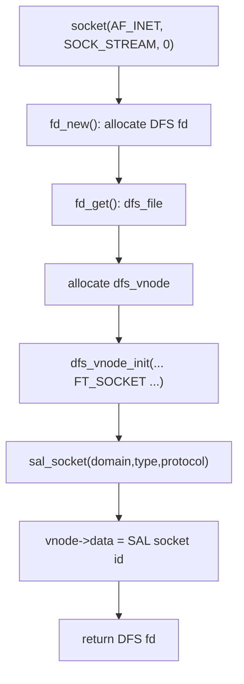
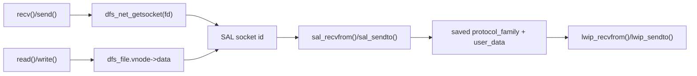
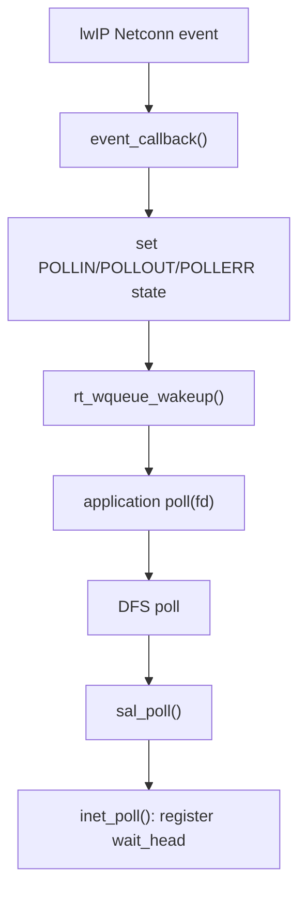
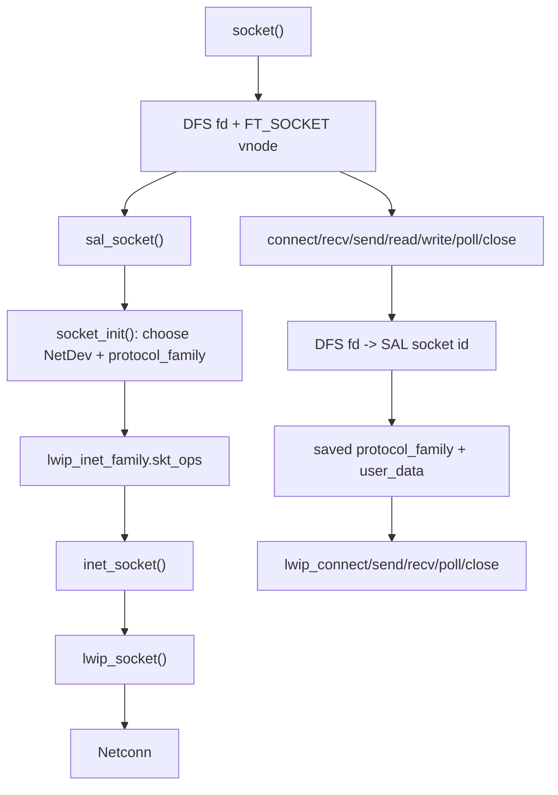

<meta name="referrer" content="no-referrer" />

# 教程 40：从 `socket()` 到 `lwip_socket()`——DFS fd、SAL Socket 与 lwIP Backend

> 摘要：沿 RT-Thread 标准 Socket 入口追踪 DFS fd、SAL socket、lwIP socket 与 Netconn，解释创建、连接、收发、poll 和关闭如何保持同一 backend 上下文。

[TOC]

Stage 39 已经回答“Ethernet Driver 怎样把 packet 送进 lwIP”。Stage 40 改从应用侧进入：**SAL（Socket Abstraction Layer，Socket 抽象层）**为不同网络协议栈提供统一 BSD Socket API；**DFS（Device File System，设备文件系统）**在启用 POSIX 兼容时提供统一文件描述符和 file operations；lwIP 则仍是实际执行 TCP/UDP Socket 的 backend。对嵌入式产品，这种分层允许应用继续使用 `socket()/connect()/read()/write()/poll()`，底层却可以由 lwIP、AT 或其他网络实现承担。[S1](#source-s1)[S2](#source-s2)

本文只追一条真实主线：`socket(AF_INET, SOCK_STREAM, 0)` 为什么最终进入 `lwip_socket()`，随后同一个应用 fd 又怎样继续找到 `lwip_connect()`、`lwip_sendto()`、`lwip_recvfrom()` 和 `lwip_close()`。RT-Thread 源码固定到 commit `dc8aaa73f2dbea255325ec058a083aeeb5381d0a`（2026-09-28），lwIP backend 使用该提交内置 lwIP 2.1.2。[S1](#source-s1)[S6](#source-s6)

## 阅读源码前：SAL 与 VFS/DFS 的框架关系直接看官方文档

RT-Thread 官方 SAL 文档已经完整画出 Application → VFS/DFS → SAL → protocol stack 的分层，并用 `connect()` 示例说明标准 BSD API 怎样经 SAL operation table 调到 `lwip_connect()` 或其他 backend；官方 VFS 文档则负责解释统一 fd/file-operation 基础设施。[S7](#source-s7)[S8](#source-s8) 因此本文不再承担“什么是 SAL、为什么 socket 也能 read/write”这类框架教学。

这里真正需要源码回答的是另外三个实现问题：**一个应用 fd 怎样关联 SAL descriptor；backend 在创建时怎样被选择并保存；poll/close 等后续操作怎样继续复用同一个 provider。** live 文档用于建立框架，下面的 descriptor ownership 与 dispatch 顺序仍以固定 commit 的 `[S2]～[S6]` 为准。

## 1. 真实入口：`socket()` 先创建 DFS fd，而不是直接调用 lwIP

启用 SAL POSIX 层后，应用调用的标准 `socket()` 实现在 `components/net/sal/socket/net_sockets.c`。下面直接进入该函数。[S2](#source-s2)

```c
int socket(int domain, int type, int protocol)
{
    /* create a BSD socket */
    int fd;
    int socket;
    struct dfs_file *d;

    /* allocate a fd */
    fd = fd_new();
    if (fd < 0)
    {
        rt_set_errno(-ENOMEM);

        return -1;
    }
    d = fd_get(fd);

#ifdef RT_USING_DFS_V2
    d->fops = dfs_net_get_fops();
#endif

    d->vnode = (struct dfs_vnode *)rt_malloc(sizeof(struct dfs_vnode));
    if (!d->vnode)
    {
        /* release fd */
        fd_release(fd);
        rt_set_errno(-ENOMEM);
        return -1;
    }
    dfs_vnode_init(d->vnode, FT_SOCKET, dfs_net_get_fops());

    /* create socket  and then put it to the dfs_file */
    socket = sal_socket(domain, type, protocol);
    if (socket >= 0)
    {
        d->flags = O_RDWR; /* set flags as read and write */

        /* set socket to the data of dfs_file */
        d->vnode->data = (void *)(size_t)socket;
    }
    else
    {
#ifdef RT_USING_DFS_V2
        dfs_vnode_destroy(d->vnode);
        d->vnode = RT_NULL;
#endif
        /* release fd */
        fd_release(fd);
        rt_set_errno(-ENOMEM);
        return -1;
    }

    return fd;
}
```

这段代码已经建立第一层 ownership：



应用最终拿到的是 `fd`。`sal_socket()` 返回的整数没有直接返回应用，而是保存到 `d->vnode->data`。因此从第一步开始就必须区分：

```text
应用整数 fd
    !=
SAL socket descriptor
```

如果 `sal_socket()` 失败，外层会释放刚分配的 DFS fd/vnode；这说明 DFS 对象是本次 API 的最外层 owner。

## 2. `dfs_net_getsocket()`：后续每个 BSD API 都靠 vnode 找回 SAL socket

`socket()` 把 SAL descriptor 放进 `vnode->data` 后，`connect()`、`recv()`、`send()` 等入口都需要把应用 fd 重新还原成 SAL descriptor。这个桥接函数位于 `dfs_net.c`。[S2](#source-s2)

```c
int dfs_net_getsocket(int fd)
{
    int socket;
    struct dfs_file *file;

    file = fd_get(fd);
    if (file == NULL) return -1;

    if (file->vnode->type != FT_SOCKET) socket = -1;
    else socket = (int)(size_t)file->vnode->data;

    return socket;
}
```

它只做两件事：

1. `fd_get(fd)` 找回 DFS 的 `struct dfs_file`；
2. 确认 vnode 是 `FT_SOCKET` 后读取 `vnode->data`。

因此 DFS 在这里回答的是：

> **这个整数 fd 对应哪个 socket 对象？**

它没有决定 TCP 还是 UDP，也没有决定 lwIP 还是 AT。backend 选择发生在下一层 SAL。

## 3. 进入 `sal_socket()` 前先看 `struct sal_socket`：它保存 backend 选择结果

`socket()` 的直接下一步是 `sal_socket()`。在进入函数前，先看它实际维护的 per-socket control object。[S3](#source-s3)

```c
struct sal_socket
{
    uint32_t magic;                    /* SAL socket magic word */

    int socket;                        /* SAL socket descriptor */
    int domain;
    int type;
    int protocol;

    struct netdev *netdev;             /* SAL network interface device */
    const struct sal_proto_family *protocol_family; /* selected protocol provider */

    void *user_data;                   /* user-specific data */
#ifdef SAL_USING_TLS
    void *user_data_tls;               /* user-specific TLS data */
#endif
};
```

这些字段构成 per-socket dispatch context：`netdev` 与 `protocol_family` 保存创建时选中的接口/provider，`user_data` 保存 backend 返回的实际 socket descriptor；SAL 本身不重新实现 TCP state machine。

## 4. 进入 `sal_socket()`：先分配 SAL descriptor，再调用 `socket_init()` 选择 provider

回到 `net_sockets.c::socket()` 的直接调用点，下面进入 `sal_socket()`。[S3](#source-s3)

```c
int sal_socket(int domain, int type, int protocol)
{
    int retval;
    int socket, proto_socket;
    struct sal_socket *sock;
    const struct sal_proto_family *pf;

    /* allocate a new socket and registered socket options */
    socket = socket_new();
    if (socket < 0)
    {
        return -1;
    }

    /* get sal socket object by socket descriptor */
    sock = sal_get_socket(socket);
    if (sock == RT_NULL)
    {
        socket_delete(socket);
        return -1;
    }

    /* Initialize sal socket object */
    retval = socket_init(domain, type, protocol, &sock);
    if (retval < 0)
    {
        LOG_E("SAL socket protocol family input failed, return error %d.", retval);
        socket_delete(socket);
        return retval;
    }

    /* valid the network interface socket opreation */
    SAL_SOCKETOPS_VALID(sock, pf, socket);

    proto_socket = pf->skt_ops->socket(domain, type, protocol);
    if (proto_socket >= 0)
    {
#ifdef SAL_USING_TLS
        if (SAL_SOCKOPS_PROTO_TLS_VALID(sock, socket))
        {
            sock->user_data_tls = proto_tls->ops->socket(socket);
            if (sock->user_data_tls == RT_NULL)
            {
                socket_delete(socket);
                return -1;
            }
        }
#endif
        sock->user_data = (void *)(size_t)proto_socket;
        return sock->socket;
    }
    socket_delete(socket);
    return -1;
}
```

当前主线的关键状态变化是：

```text
socket_new()
  -> 分配 SAL descriptor

socket_init()
  -> 写 sock->netdev
  -> 写 sock->protocol_family

pf->skt_ops->socket()
  -> 调真正 backend 创建 socket

sock->user_data = proto_socket
  -> 保存 backend descriptor
```

注意 `proto_socket` 与 SAL `socket` 是两个不同整数。`sock->user_data` 正是后续 `connect/send/recv/close` 能继续找到同一 backend socket 的关键。

## 5. 进入 `socket_init()`：backend 只在创建阶段选择一次

`sal_socket()` 调用 `socket_init()` 后，SAL 才真正确定 protocol provider。[S3](#source-s3)

```c
static int socket_init(int family, int type, int protocol, struct sal_socket **res)
{
    struct sal_socket *sock;
    const struct sal_proto_family *pf;
    struct netdev *netdv_def = netdev_default;
    struct netdev *netdev = RT_NULL;
    rt_bool_t flag = RT_FALSE;

    /* Existing range checks for family and type */
    if (family < 0 || family > AF_MAX)
    {
        LOG_E("Invalid family: %d (must be 0 ~ %d)", family, AF_MAX);
        return -1;
    }

    if (type < 0 || type > SOCK_MAX)
    {
        LOG_E("Invalid type: %d (must be 0 ~ %d)", type, SOCK_MAX);
        return -2;
    }

    /* Range check for protocol */
    if (!VALID_PROTOCOL(protocol))
    {
        LOG_E("Invalid protocol: %d (must be 0 ~ %d)", protocol, IPPROTO_RAW);
        rt_set_errno(EINVAL);
        return -4;
    }

    sock = *res;
    sock->domain = family;
    sock->type = type;
    sock->protocol = protocol;

    /* Combo compatibility check */
    if (!VALID_COMBO(family, type, protocol))
    {
        LOG_E("Invalid combo: domain=%d, type=%d, protocol=%d", family, type, protocol);
        rt_set_errno(EINVAL);
        return -4;
    }

    pf = sal_proto_family_find(family);
    if (pf != RT_NULL)
    {
        sock->protocol_family = pf;
        sock->netdev = RT_NULL;
        return 0;
    }

    /* Existing netdev selection logic */
    if (netdv_def && netdev_is_up(netdv_def))
    {
        /* check default network interface device protocol family */
        pf = (struct sal_proto_family *)netdv_def->sal_user_data;
        if (pf != RT_NULL && pf->skt_ops && (pf->family == family || pf->sec_family == family))
        {
            sock->netdev = netdv_def;
            sock->protocol_family = pf;
            flag = RT_TRUE;
        }
    }

    if (flag == RT_FALSE)
    {
        /* get network interface device by protocol family */
        netdev = netdev_get_by_family(family);
        if (netdev == RT_NULL)
        {
            LOG_E("not find network interface device by protocol family(%d).", family);
            return -3;
        }

        sock->netdev = netdev;
        sock->protocol_family = (const struct sal_proto_family *)netdev->sal_user_data;
        if (sock->protocol_family == RT_NULL || sock->protocol_family->skt_ops == RT_NULL)
        {
            return -3;
        }
    }

    LOG_D("Socket init success: domain=%d, type=%d, protocol=%d, netdev=%s",
          family, type, protocol, sock->netdev ? sock->netdev->name : "default");
    return 0;
}
```

Stage 41 会逐行分析这里的 NetDev 选择算法。Stage 40 只需要抓住生命周期结论：

```text
socket 创建时
    ↓
选出 netdev + protocol_family
    ↓
保存进 struct sal_socket
    ↓
之后 connect/send/recv 不重新做 backend 选择
```

这就是为什么一个已经创建好的 socket 不会因为稍后 `netdev_default` 改变就自动迁移到另一套协议栈。

## 6. `lwip_inet_family`：SAL 如何把 `AF_INET` 映射到 lwIP operation table

在当前 lwIP backend 中，`af_inet_lwip.c` 定义了两层表：一层是 Socket 操作，一层是 protocol family 描述。[S4](#source-s4)

```c
static const struct sal_socket_ops lwip_socket_ops =
{
    .socket      = inet_socket,
    .closesocket = lwip_close,
    .bind        = lwip_bind,
    .listen      = lwip_listen,
    .connect     = lwip_connect,
    .accept      = inet_accept,
    .sendto      = (int (*)(int, const void *, size_t, int, const struct sockaddr *, socklen_t))lwip_sendto,
#if LWIP_VERSION >= 0x20102ff
    .sendmsg     = (int (*)(int, const struct msghdr *, int))lwip_sendmsg,
    .recvmsg     = (int (*)(int, struct msghdr *, int))lwip_recvmsg,
#endif
    .recvfrom    = (int (*)(int, void *, size_t, int, struct sockaddr *, socklen_t *))lwip_recvfrom,
    .getsockopt  = lwip_getsockopt,
    //TODO fix on 1.4.1
    .setsockopt  = lwip_setsockopt,
    .shutdown    = lwip_shutdown,
    .getpeername = lwip_getpeername,
    .getsockname = inet_getsockname,
    .ioctlsocket = inet_ioctlsocket,
    .socketpair  = RT_NULL,
#ifdef SAL_USING_POSIX
    .poll        = inet_poll,
#endif
};
```

紧接着是 family descriptor：[S4](#source-s4)

```c
static const struct sal_proto_family lwip_inet_family =
{
    .family     = AF_INET,
#if LWIP_VERSION > 0x2000000
    .sec_family = AF_INET6,
#else
    .sec_family = AF_INET,
#endif
    .skt_ops    = &lwip_socket_ops,
    .netdb_ops  = &lwip_netdb_ops,
};
```

因此 `socket_init()` 选中 `lwip_inet_family` 后，后续分发已经确定：

```text
SAL connect      -> lwip_connect
SAL sendto       -> lwip_sendto
SAL recvfrom     -> lwip_recvfrom
SAL closesocket  -> lwip_close
SAL poll         -> inet_poll
```

只有 `.socket` 不是直接写 `lwip_socket`，而是先进入 `inet_socket()`，因为 POSIX poll integration 还需要额外安装 event callback。

## 7. 进入 `inet_socket()`：真正创建 lwIP socket，并安装 poll 事件桥

`sal_socket()` 通过 `pf->skt_ops->socket()` 到达 `inet_socket()`。[S4](#source-s4)

```c
static int inet_socket(int domain, int type, int protocol)
{
#ifdef SAL_USING_POSIX
    int socket;

    socket = lwip_socket(domain, type, protocol);
    if (socket >= 0)
    {
        struct lwip_sock *lwsock;

        lwsock = lwip_tryget_socket(socket);
        lwsock->conn->callback = event_callback;

        rt_wqueue_init(&lwsock->wait_head);
    }

    return socket;
#else
    return lwip_socket(domain, type, protocol);
#endif /* SAL_USING_POSIX */
}
```

这里完成第二次对象映射：

```text
SAL socket
  sock->user_data
       ↓
lwIP socket descriptor
       ↓
struct lwip_sock
       ↓
struct netconn
```

同时 `lwsock->conn->callback = event_callback` 把 lwIP Netconn 的事件通知改接到 RT-Thread wait queue。这条异步桥后面解释 `poll()` 时再完整展开。

## 8. 进入 `lwip_socket()`：lwIP Socket 层再创建 Netconn

`inet_socket()` 直接调用 vendored lwIP 2.1.2 `lwip_socket()`。下面进入该函数。[S6](#source-s6)

```c
int
lwip_socket(int domain, int type, int protocol)
{
  struct netconn *conn;
  int i;

  LWIP_UNUSED_ARG(domain); /* @todo: check this */

  /* create a netconn */
  switch (type) {
    case SOCK_RAW:
      conn = netconn_new_with_proto_and_callback(DOMAIN_TO_NETCONN_TYPE(domain, NETCONN_RAW),
             (u8_t)protocol, DEFAULT_SOCKET_EVENTCB);
      LWIP_DEBUGF(SOCKETS_DEBUG, ("lwip_socket(%s, SOCK_RAW, %d) = ",
                                  domain == PF_INET ? "PF_INET" : "UNKNOWN", protocol));
      break;
    case SOCK_DGRAM:
      conn = netconn_new_with_callback(DOMAIN_TO_NETCONN_TYPE(domain,
                                       ((protocol == IPPROTO_UDPLITE) ? NETCONN_UDPLITE : NETCONN_UDP)),
                                       DEFAULT_SOCKET_EVENTCB);
      LWIP_DEBUGF(SOCKETS_DEBUG, ("lwip_socket(%s, SOCK_DGRAM, %d) = ",
                                  domain == PF_INET ? "PF_INET" : "UNKNOWN", protocol));
#if LWIP_NETBUF_RECVINFO
      if (conn) {
        /* netconn layer enables pktinfo by default, sockets default to off */
        conn->flags &= ~NETCONN_FLAG_PKTINFO;
      }
#endif /* LWIP_NETBUF_RECVINFO */
      break;
    case SOCK_STREAM:
      conn = netconn_new_with_callback(DOMAIN_TO_NETCONN_TYPE(domain, NETCONN_TCP), DEFAULT_SOCKET_EVENTCB);
      LWIP_DEBUGF(SOCKETS_DEBUG, ("lwip_socket(%s, SOCK_STREAM, %d) = ",
                                  domain == PF_INET ? "PF_INET" : "UNKNOWN", protocol));
      break;
    default:
      LWIP_DEBUGF(SOCKETS_DEBUG, ("lwip_socket(%d, %d/UNKNOWN, %d) = -1\n",
                                  domain, type, protocol));
      set_errno(EINVAL);
      return -1;
  }

  if (!conn) {
    LWIP_DEBUGF(SOCKETS_DEBUG, ("-1 / ENOBUFS (could not create netconn)\n"));
    set_errno(ENOBUFS);
    return -1;
  }

  i = alloc_socket(conn, 0);

  if (i == -1) {
    netconn_delete(conn);
    set_errno(ENFILE);
    return -1;
  }
  conn->socket = i;
  done_socket(&sockets[i - LWIP_SOCKET_OFFSET]);
  LWIP_DEBUGF(SOCKETS_DEBUG, ("%d\n", i));
  set_errno(0);
  return i;
}
```

对于本文 `SOCK_STREAM` 路径：

```text
lwip_socket()
  -> netconn_new_with_callback(... NETCONN_TCP ...)
  -> alloc_socket(conn, 0)
  -> conn->socket = lwIP socket id
```

Stage 06 已经完整讲过 Socket → Netconn → `tcpip_thread`，因此这里停止继续下钻。Stage 40 新增的知识是：**RT-Thread 的 DFS/SAL 最终重新接回了原来那条 lwIP Socket 主线。**

## 9. 创建结束后，三个 descriptor 怎样一一关联

`lwip_socket()` 返回后，控制依次返回：

```text
lwip_socket id
    ↓ return to inet_socket()
inet_socket returns backend id
    ↓ return to sal_socket()
sock->user_data = backend id
    ↓ return SAL descriptor
socket() stores SAL descriptor in vnode->data
    ↓ return DFS fd to application
```

因此一个成功创建的 TCP socket 形成：


三个整数可能碰巧相同，但代码不能依赖数值相等；映射必须经各层对象表完成。

## 10. `connect(fd, ...)`：先从 DFS fd 找回 SAL socket，再从 `user_data` 找回 lwIP socket

应用继续调用标准 `connect()`。下面进入 `net_sockets.c::connect()`。[S2](#source-s2)

```c
int connect(int s, const struct sockaddr *name, socklen_t namelen)
{
    int socket = dfs_net_getsocket(s);
    return sal_connect(socket, name, namelen);
}
```

第一步通过前面已经解释过的 `dfs_net_getsocket()` 得到 SAL descriptor。随后进入 `sal_connect()`。[S3](#source-s3)

```c
int sal_connect(int socket, const struct sockaddr *name, socklen_t namelen)
{
    struct sal_socket *sock;
    const struct sal_proto_family *pf;
    int ret;

    /* get the socket object by socket descriptor */
    SAL_SOCKET_OBJ_GET(sock, socket);

    /* check the network interface is up status */
    SAL_NETDEV_IS_UP(sock->netdev);
    /* check the network interface socket opreation */
    SAL_SOCKETOPS_VALID(sock, pf, connect);

    ret = pf->skt_ops->connect((int)(size_t)sock->user_data, name, namelen);
#ifdef SAL_USING_TLS
    if (ret >= 0 && SAL_SOCKOPS_PROTO_TLS_VALID(sock, connect))
    {
        if (proto_tls->ops->connect(sock->user_data_tls) < 0)
        {
            return -1;
        }

        return ret;
    }
#endif

    return ret;
}
```

这里能直接看到“创建时选择、运行时复用”的 contract：

```text
SAL_SOCKET_OBJ_GET()
    -> 取回创建时的 struct sal_socket

sock->protocol_family
    -> 决定 pf->skt_ops

sock->user_data
    -> 取回创建时的 lwIP socket id
```

对 `lwip_inet_family`，`pf->skt_ops->connect` 就是 `lwip_connect()`。

## 11. 进入 `lwip_connect()`：再次回到 Stage 06/07 的 Netconn/TCP 路径

下面进入 vendored lwIP `lwip_connect()`。[S6](#source-s6)

```c
int
lwip_connect(int s, const struct sockaddr *name, socklen_t namelen)
{
  struct lwip_sock *sock;
  err_t err;

  sock = get_socket(s);
  if (!sock) {
    return -1;
  }

  if (!SOCK_ADDR_TYPE_MATCH_OR_UNSPEC(name, sock)) {
    /* sockaddr does not match socket type (IPv4/IPv6) */
    sock_set_errno(sock, err_to_errno(ERR_VAL));
    done_socket(sock);
    return -1;
  }

  LWIP_UNUSED_ARG(namelen);
  if (name->sa_family == AF_UNSPEC) {
    LWIP_DEBUGF(SOCKETS_DEBUG, ("lwip_connect(%d, AF_UNSPEC)\n", s));
    err = netconn_disconnect(sock->conn);
  } else {
    ip_addr_t remote_addr;
    u16_t remote_port;

    /* check size, family and alignment of 'name' */
    LWIP_ERROR("lwip_connect: invalid address", IS_SOCK_ADDR_LEN_VALID(namelen) &&
               IS_SOCK_ADDR_TYPE_VALID_OR_UNSPEC(name) && IS_SOCK_ADDR_ALIGNED(name),
               sock_set_errno(sock, err_to_errno(ERR_ARG)); done_socket(sock); return -1;);

    SOCKADDR_TO_IPADDR_PORT(name, &remote_addr, remote_port);
    LWIP_DEBUGF(SOCKETS_DEBUG, ("lwip_connect(%d, addr=", s));
    ip_addr_debug_print_val(SOCKETS_DEBUG, remote_addr);
    LWIP_DEBUGF(SOCKETS_DEBUG, (" port=%"U16_F")\n", remote_port));

#if LWIP_IPV4 && LWIP_IPV6
    /* Dual-stack: Unmap IPv4 mapped IPv6 addresses */
    if (IP_IS_V6_VAL(remote_addr) && ip6_addr_isipv4mappedipv6(ip_2_ip6(&remote_addr))) {
      unmap_ipv4_mapped_ipv6(ip_2_ip4(&remote_addr), ip_2_ip6(&remote_addr));
      IP_SET_TYPE_VAL(remote_addr, IPADDR_TYPE_V4);
    }
#endif /* LWIP_IPV4 && LWIP_IPV6 */

    err = netconn_connect(sock->conn, &remote_addr, remote_port);
  }

  if (err != ERR_OK) {
    LWIP_DEBUGF(SOCKETS_DEBUG, ("lwip_connect(%d) failed, err=%d\n", s, err));
    sock_set_errno(sock, err_to_errno(err));
    done_socket(sock);
    return -1;
  }

  LWIP_DEBUGF(SOCKETS_DEBUG, ("lwip_connect(%d) succeeded\n", s));
  sock_set_errno(sock, 0);
  done_socket(sock);
  return 0;
}
```

`lwip_connect()` 将 `sockaddr` 转为 lwIP `ip_addr_t + port`，最终调用 `netconn_connect()`。到这里，应用侧链路已经和 Stage 06/07 完全汇合：

```text
RT-Thread connect(fd)
  -> DFS
  -> SAL
  -> lwip_connect(lwIP socket)
  -> netconn_connect()
  -> tcpip_thread
  -> TCP active open
```

## 12. `recv()` / `send()`：BSD Socket wrapper 继续复用同一个 dispatch context

标准 `recv()` 与 `send()` 仍然先还原 SAL descriptor。[S2](#source-s2)

```c
int recv(int s, void *mem, size_t len, int flags)
{
    int socket = dfs_net_getsocket(s);

    return sal_recvfrom(socket, mem, len, flags, NULL, NULL);
}
```

```c
int send(int s, const void *dataptr, size_t size, int flags)
{
    int socket = dfs_net_getsocket(s);

    return sal_sendto(socket, dataptr, size, flags, NULL, 0);
}
```

进入 `sal_recvfrom()` 后，当前 socket 对象决定 backend。[S3](#source-s3)

```c
int sal_recvfrom(int socket, void *mem, size_t len, int flags,
                 struct sockaddr *from, socklen_t *fromlen)
{
    struct sal_socket *sock;
    const struct sal_proto_family *pf;

    /* get the socket object by socket descriptor */
    SAL_SOCKET_OBJ_GET(sock, socket);

    /* check the network interface is up status  */
    SAL_NETDEV_IS_UP(sock->netdev);
    /* check the network interface socket opreation */
    SAL_SOCKETOPS_VALID(sock, pf, recvfrom);

#ifdef SAL_USING_TLS
    if (SAL_SOCKOPS_PROTO_TLS_VALID(sock, recv))
    {
        int ret;

        if ((ret = proto_tls->ops->recv(sock->user_data_tls, mem, len)) < 0)
        {
            return -1;
        }
        return ret;
    }
    else
    {
        return pf->skt_ops->recvfrom((int)(size_t)sock->user_data, mem, len, flags, from, fromlen);
    }
#else
    return pf->skt_ops->recvfrom((int)(size_t)sock->user_data, mem, len, flags, from, fromlen);
#endif
}
```

发送方向同样通过 `sock->user_data`：[S3](#source-s3)

```c
int sal_sendto(int socket, const void *dataptr, size_t size, int flags,
               const struct sockaddr *to, socklen_t tolen)
{
    struct sal_socket *sock;
    const struct sal_proto_family *pf;

    /* get the socket object by socket descriptor */
    SAL_SOCKET_OBJ_GET(sock, socket);

    /* check the network interface is up status  */
    SAL_NETDEV_IS_UP(sock->netdev);
    /* check the network interface socket opreation */
    SAL_SOCKETOPS_VALID(sock, pf, sendto);

#ifdef SAL_USING_TLS
    if (SAL_SOCKOPS_PROTO_TLS_VALID(sock, send))
    {
        int ret;

        if ((ret = proto_tls->ops->send(sock->user_data_tls, dataptr, size)) < 0)
        {
            return -1;
        }
        return ret;
    }
    else
    {
        return pf->skt_ops->sendto((int)sock->user_data, dataptr, size, flags, to, tolen);
    }
#else
    return pf->skt_ops->sendto((int)(size_t)sock->user_data, dataptr, size, flags, to, tolen);
#endif
}
```

对当前 lwIP family，这两条最终进入 `lwip_recvfrom()` / `lwip_sendto()`。SAL 没有重新实现 TCP/UDP payload queue，只负责分发。

## 13. `read()` / `write()` 为什么也能操作 socket：DFS file operations 直接桥到同一组 SAL API

由于 `socket()` 已将 vnode 初始化为 `FT_SOCKET` 并绑定 `dfs_net_get_fops()`，POSIX `read/write` 会进入 `dfs_net.c` 的 network file operations。[S2](#source-s2)

继续阅读 `dfs_net_read()`：

```c
#ifdef RT_USING_DFS_V2
static ssize_t dfs_net_read(struct dfs_file* file, void *buf, size_t count, off_t *pos)
#else
static ssize_t dfs_net_read(struct dfs_file* file, void *buf, size_t count)
#endif
{
    int ret;
    int socket = (int)(size_t)file->vnode->data;

    ret = sal_recvfrom(socket, buf, count, 0, NULL, NULL);
    if (ret < 0)
    {
        ret = rt_get_errno();
        return (ret > 0) ? (-ret) : ret;
    }

    return ret;
}
```

继续阅读 `dfs_net_write()`：[S2](#source-s2)

```c
#ifdef RT_USING_DFS_V2
static ssize_t dfs_net_write(struct dfs_file *file, const void *buf, size_t count, off_t *pos)
#else
static ssize_t dfs_net_write(struct dfs_file *file, const void *buf, size_t count)
#endif
{
    int ret;
    int socket = (int)(size_t)file->vnode->data;

    ret = sal_sendto(socket, buf, count, 0, NULL, 0);
    if (ret < 0)
    {
        ret = rt_get_errno();
        return (ret > 0) ? (-ret) : ret;
    }

    return ret;
}
```

因此两类 API 在 SAL 层汇合：



DFS 只是让 Socket 复用统一 fd/file-operation infrastructure，并不改变 lwIP socket 的网络对象语义。

## 14. `poll()` 的异步桥：为什么 `inet_socket()` 必须替换 Netconn callback

同步 `send/recv` 只需调用 operation table；`poll()` 还需要“网络状态变化时唤醒等待线程”。这条链的注册点就是前面 `inet_socket()` 中：

```c
lwsock->conn->callback = event_callback;
rt_wqueue_init(&lwsock->wait_head);
```

当 lwIP Netconn 发生 receive/send/error event 时，会进入 `event_callback()`。[S4](#source-s4)

```c
static void event_callback(struct netconn *conn, enum netconn_evt evt, u16_t len)
{
    int s;
    struct lwip_sock *sock;
    uint32_t event = 0;
    SYS_ARCH_DECL_PROTECT(lev);

    LWIP_UNUSED_ARG(len);

    /* Get socket */
    if (conn)
    {
        s = conn->socket;
        if (s < 0)
        {
            /* Data comes in right away after an accept, even though
             * the server task might not have created a new socket yet.
             * Just count down (or up) if that's the case and we
             * will use the data later. Note that only receive events
             * can happen before the new socket is set up. */
            SYS_ARCH_PROTECT(lev);
            if (conn->socket < 0)
            {
                if (evt == NETCONN_EVT_RCVPLUS)
                {
                    conn->socket--;
                }
                SYS_ARCH_UNPROTECT(lev);
                return;
            }
            s = conn->socket;
            SYS_ARCH_UNPROTECT(lev);
        }

        sock = lwip_tryget_socket(s);
        if (!sock)
        {
            return;
        }
    }
    else
    {
        return;
    }

    SYS_ARCH_PROTECT(lev);
    /* Set event as required */
    switch (evt)
    {
    case NETCONN_EVT_RCVPLUS:
        sock->rcvevent++;
        break;
    case NETCONN_EVT_RCVMINUS:
        sock->rcvevent--;
        break;
    case NETCONN_EVT_SENDPLUS:
        sock->sendevent = 1;
        break;
    case NETCONN_EVT_SENDMINUS:
        sock->sendevent = 0;
        break;
    case NETCONN_EVT_ERROR:
        sock->errevent = 1;
        break;
    default:
        LWIP_ASSERT("unknown event", 0);
        break;
    }

#if LWIP_VERSION >= 0x20100ff
    if ((void*)(sock->lastdata.pbuf) || (sock->rcvevent > 0))
#else
    if ((void*)(sock->lastdata) || (sock->rcvevent > 0))
#endif
        event |= POLLIN;
    if (sock->sendevent)
        event |= POLLOUT;
    if (sock->errevent)
        event |= POLLERR;

    SYS_ARCH_UNPROTECT(lev);

    if (event)
    {
        rt_wqueue_wakeup(&sock->wait_head, (void*)(size_t)event);
    }
}
```

这里完成的是：

```text
lwIP Netconn event
  -> 更新 lwip_sock rcvevent/sendevent/errevent
  -> 转成 POLLIN/POLLOUT/POLLERR
  -> rt_wqueue_wakeup()
```

另一方面，DFS 的 poll 入口只做桥接：[S2](#source-s2)

```c
static int dfs_net_poll(struct dfs_file *file, struct rt_pollreq *req)
{
    extern int sal_poll(struct dfs_file *file, struct rt_pollreq *req);

    return sal_poll(file, req);
}
```

进入 `sal_poll()`：[S3](#source-s3)

```c
int sal_poll(struct dfs_file *file, struct rt_pollreq *req)
{
    struct sal_socket *sock;
    const struct sal_proto_family *pf;
    int socket = (int)(size_t)file->vnode->data;

    /* get the socket object by socket descriptor */
    SAL_SOCKET_OBJ_GET(sock, socket);

    /* check the network interface is up status  */
    SAL_NETDEV_IS_UP(sock->netdev);
    /* check the network interface socket opreation */
    SAL_SOCKETOPS_VALID(sock, pf, poll);

    return pf->skt_ops->poll(file, req);
}
```

对 lwIP family，下一步进入 `inet_poll()`。[S4](#source-s4)

```c
static int inet_poll(struct dfs_file *file, struct rt_pollreq *req)
{
    int mask = 0;
    struct lwip_sock *sock;
    struct sal_socket *sal_sock;

    sal_sock = sal_get_socket((int)(size_t)file->vnode->data);
    if(!sal_sock)
    {
        return -1;
    }

    sock = lwip_tryget_socket((int)(size_t)sal_sock->user_data);
    if (sock != NULL)
    {
        rt_base_t level;

        rt_poll_add(&sock->wait_head, req);

        level = rt_spin_lock_irqsave(&_spinlock);

#if LWIP_VERSION >= 0x20100ff
        if ((void*)(sock->lastdata.pbuf) || sock->rcvevent)
#else
        if ((void*)(sock->lastdata) || sock->rcvevent)
#endif
        {
            mask |= POLLIN;
        }
        if (sock->sendevent)
        {
            mask |= POLLOUT;
        }
        if (sock->errevent)
        {
            mask |= POLLERR;
            /* clean error event */
            sock->errevent = 0;
        }
        rt_spin_unlock_irqrestore(&_spinlock, level);
    }

    return mask;
}
```

于是 poll 的完整异步关系是：



这说明 SAL POSIX 集成不仅是 descriptor 映射，还包含事件模型适配。

## 15. 为什么标准 `socket()` 与 lwIP 自己的兼容别名不会冲突

RT-Thread `lwipopts.h` 在 `SAL_USING_POSIX` 条件下显式关闭 lwIP 的 BSD compatibility aliases：[S5](#source-s5)

```c
/*
 * LWIP_COMPAT_SOCKETS==1: Enable BSD-style sockets functions names.
 * (only used if you use sockets.c)
 */
#ifdef SAL_USING_POSIX
#define LWIP_COMPAT_SOCKETS             0
#else
#ifndef LWIP_COMPAT_SOCKETS
#define LWIP_COMPAT_SOCKETS             1
#endif
#endif
```

因此分层明确：

```text
应用可见： socket() / connect() / send() / recv()
              ↓ SAL/DFS
backend：    lwip_socket() / lwip_connect() / lwip_sendto() / lwip_recvfrom()
```

这不是两套 Socket API 同时竞争同名符号，而是 SAL 有意占据标准 BSD 名称，lwIP 保留 `lwip_*` backend 名称。

## 16. `closesocket()`：按 DFS → SAL → lwIP 的反方向释放

创建顺序是：

```text
DFS fd
  -> SAL socket
  -> lwIP socket
  -> Netconn
```

关闭时从最外层开始。先进入 `net_sockets.c::closesocket()`。[S2](#source-s2)

```c
int closesocket(int s)
{
    int error = 0;
    int socket = -1;
    struct dfs_file *d;

    socket = dfs_net_getsocket(s);
    if (socket < 0)
    {
        rt_set_errno(-ENOTSOCK);
        return -1;
    }

    d = fd_get(s);
    if (d == RT_NULL)
    {
        rt_set_errno(-EBADF);
        return -1;
    }

    if (!d->vnode)
    {
        rt_set_errno(-EBADF);
        return -1;
    }

#ifdef RT_USING_DFS_V2
    if (dfs_file_close(d) == 0)
#else
    if (sal_closesocket(socket) == 0)
#endif
    {
        error = 0;
    }
    else
    {
        rt_set_errno(-ENOTSOCK);
        error = -1;
    }

    /* socket has been closed, delete it from file system fd */
    fd_release(s);

    return error;
}
```

DFS V2 的 socket fops 会进入 `dfs_net_close()`；只有 vnode 最后一个引用才真正关闭 SAL socket。[S2](#source-s2)

```c
static int dfs_net_close(struct dfs_file* file)
{
    int socket;
    int ret = 0;

    if (file->vnode->ref_count == 1)
    {
        socket = (int)(size_t)file->vnode->data;
        ret = sal_closesocket(socket);
    }
    return ret;
}
```

继续进入 `sal_closesocket()`：[S3](#source-s3)

```c
int sal_closesocket(int socket)
{
    struct sal_socket *sock;
    const struct sal_proto_family *pf;
    int error = 0;

    /* get the socket object by socket descriptor */
    SAL_SOCKET_OBJ_GET(sock, socket);

    /* clsoesocket operation not need to vaild network interface status */
    /* valid the network interface socket opreation */
    SAL_SOCKETOPS_VALID(sock, pf, closesocket);

    if (pf->skt_ops->closesocket((int)(size_t)sock->user_data) == 0)
    {
#ifdef SAL_USING_TLS
        if (SAL_SOCKOPS_PROTO_TLS_VALID(sock, closesocket))
        {
            if (proto_tls->ops->closesocket(sock->user_data_tls) < 0)
            {
                return -1;
            }
        }
#endif
        error = 0;
    }
    else
    {
        error = -1;
    }

    /* delete socket */
    socket_delete(socket);

    return error;
}
```

对 lwIP family，`pf->skt_ops->closesocket` 就是 `lwip_close()`。进入 lwIP：[S6](#source-s6)

```c
int
lwip_close(int s)
{
  struct lwip_sock *sock;
  int is_tcp = 0;
  err_t err;

  LWIP_DEBUGF(SOCKETS_DEBUG, ("lwip_close(%d)\n", s));

  sock = get_socket(s);
  if (!sock) {
    return -1;
  }

  if (sock->conn != NULL) {
    is_tcp = NETCONNTYPE_GROUP(netconn_type(sock->conn)) == NETCONN_TCP;
  } else {
    LWIP_ASSERT("sock->lastdata == NULL", sock->lastdata.pbuf == NULL);
  }

#if LWIP_IGMP
  /* drop all possibly joined IGMP memberships */
  lwip_socket_drop_registered_memberships(s);
#endif /* LWIP_IGMP */
#if LWIP_IPV6_MLD
  /* drop all possibly joined MLD6 memberships */
  lwip_socket_drop_registered_mld6_memberships(s);
#endif /* LWIP_IPV6_MLD */

  err = netconn_prepare_delete(sock->conn);
  if (err != ERR_OK) {
    sock_set_errno(sock, err_to_errno(err));
    done_socket(sock);
    return -1;
  }

  free_socket(sock, is_tcp);
  set_errno(0);
  return 0;
}
```

因此 teardown 的真实顺序是：

```text
application fd
 -> DFS file/vnode
 -> SAL socket
 -> lwIP socket
 -> Netconn prepare/delete path
```

`sal_closesocket()` 特意不检查 NetDev 是否 UP，因为即使链路已经断开，应用仍必须能够释放 socket 资源。

## 17. Stage 40 的完整心智模型

把整个应用生命周期串起来：



Stage 39 解决“Driver → lwIP”，Stage 40 解决“Application → lwIP”。两条路径最终都汇入同一个 lwIP Core。

下一篇 Stage 41 继续展开这里唯一暂时保留的黑盒：`socket_init()` 为什么会选中某个 NetDev，以及系统同时存在 lwIP Ethernet 与 AT Wi-Fi/4G 时，`netdev_default`、`family/sec_family` 和 `netdev_get_by_family()` 怎样共同决定 backend。

## 资料来源

<a id="source-s1"></a>
### [S1] RT-Thread SAL / DFS 配置与官方组件说明
- 类型：RT-Thread 官方仓库源码与官方文档
- 版本：commit `dc8aaa73f2dbea255325ec058a083aeeb5381d0a`
- 定位：`components/net/sal/Kconfig`、`components/dfs/Kconfig`、`documentation/6.components/sal/sal.md`、`documentation/6.components/filesystem/README.md`
- URL/文档：[SAL Kconfig](https://github.com/RT-Thread/rt-thread/blob/dc8aaa73f2dbea255325ec058a083aeeb5381d0a/components/net/sal/Kconfig)、[SAL documentation](https://github.com/RT-Thread/rt-thread/blob/dc8aaa73f2dbea255325ec058a083aeeb5381d0a/documentation/6.components/sal/sal.md)、[DFS documentation](https://github.com/RT-Thread/rt-thread/blob/dc8aaa73f2dbea255325ec058a083aeeb5381d0a/documentation/6.components/filesystem/README.md)
- 使用位置：“开场概念桥”“SAL/DFS 在系统中的职责边界”
- 支撑内容：SAL=Socket Abstraction Layer；DFS 提供 RT-Thread 的文件描述符/虚拟文件系统基础设施

<a id="source-s2"></a>
### [S2] RT-Thread BSD Socket 与 DFS bridge
- 类型：RT-Thread 官方仓库源码
- 版本：同上
- 定位：`components/net/sal/socket/net_sockets.c`：`socket()`、`connect()`、`recv()`、`send()`、`closesocket()`；`components/net/sal/dfs_net/dfs_net.c`：`dfs_net_getsocket()`、`dfs_net_read()`、`dfs_net_write()`、`dfs_net_close()`、`dfs_net_poll()`
- URL/文档：[net_sockets.c](https://github.com/RT-Thread/rt-thread/blob/dc8aaa73f2dbea255325ec058a083aeeb5381d0a/components/net/sal/socket/net_sockets.c)、[dfs_net.c](https://github.com/RT-Thread/rt-thread/blob/dc8aaa73f2dbea255325ec058a083aeeb5381d0a/components/net/sal/dfs_net/dfs_net.c)
- 使用位置：“DFS fd 创建与回查”“read/write/poll/close bridge”
- 支撑内容：证明标准 BSD/POSIX API 如何从 DFS descriptor 进入 SAL

<a id="source-s3"></a>
### [S3] RT-Thread SAL Core
- 类型：RT-Thread 官方仓库源码
- 版本：同上
- 定位：`components/net/sal/include/sal_low_lvl.h`：`struct sal_socket`、`struct sal_socket_ops`；`components/net/sal/src/sal_socket.c`：`socket_init()`、`sal_socket()`、`sal_connect()`、`sal_sendto()`、`sal_recvfrom()`、`sal_poll()`、`sal_closesocket()`
- URL/文档：[sal_low_lvl.h](https://github.com/RT-Thread/rt-thread/blob/dc8aaa73f2dbea255325ec058a083aeeb5381d0a/components/net/sal/include/sal_low_lvl.h)、[sal_socket.c](https://github.com/RT-Thread/rt-thread/blob/dc8aaa73f2dbea255325ec058a083aeeb5381d0a/components/net/sal/src/sal_socket.c)
- 使用位置：“SAL socket 对象”“backend selection”“per-socket dispatch context”“运行时操作与 teardown”
- 支撑内容：证明 `netdev/protocol_family/user_data` 在创建时保存、后续操作复用

<a id="source-s4"></a>
### [S4] RT-Thread lwIP SAL Adapter
- 类型：RT-Thread 官方仓库源码
- 版本：同上
- 定位：`components/net/sal/impl/af_inet_lwip.c`：`event_callback()`、`inet_socket()`、`inet_poll()`、`lwip_socket_ops`、`lwip_inet_family`、`sal_lwip_netdev_set_pf_info()`
- URL/文档：[af_inet_lwip.c](https://github.com/RT-Thread/rt-thread/blob/dc8aaa73f2dbea255325ec058a083aeeb5381d0a/components/net/sal/impl/af_inet_lwip.c)
- 使用位置：“SAL → lwIP operation table”“poll/event bridge”
- 支撑内容：证明 SAL 怎样调用 `lwip_*`，以及 POSIX poll 如何接入 lwIP Netconn event

<a id="source-s5"></a>
### [S5] RT-Thread lwIP `lwipopts.h`
- 类型：RT-Thread 官方仓库源码
- 版本：同上
- 定位：`components/net/lwip/port/lwipopts.h`：`LWIP_COMPAT_SOCKETS`
- URL/文档：[RT-Thread lwipopts.h](https://github.com/RT-Thread/rt-thread/blob/dc8aaa73f2dbea255325ec058a083aeeb5381d0a/components/net/lwip/port/lwipopts.h)
- 使用位置：“标准 BSD 名称与 lwIP backend 名称为什么不冲突”
- 支撑内容：证明 `SAL_USING_POSIX` 下关闭 lwIP compatibility socket aliases

<a id="source-s6"></a>
### [S6] RT-Thread vendored lwIP 2.1.2 Socket / Netconn
- 类型：RT-Thread 仓库内置 lwIP 源码
- 版本：RT-Thread commit `dc8aaa73f2dbea255325ec058a083aeeb5381d0a` 中的 lwIP 2.1.2
- 定位：`components/net/lwip/lwip-2.1.2/src/api/sockets.c`：`lwip_socket()`、`lwip_connect()`、`lwip_close()`
- URL/文档：[lwIP sockets.c](https://github.com/RT-Thread/rt-thread/blob/dc8aaa73f2dbea255325ec058a083aeeb5381d0a/components/net/lwip/lwip-2.1.2/src/api/sockets.c)
- 使用位置：“lwIP socket 创建/连接/关闭”“重新接回 Netconn 主线”
- 支撑内容：证明 SAL 最终进入标准 lwIP Socket → Netconn → Core 路径


<a id="source-s7"></a>
### [S7] RT-Thread 官方 SAL 文档
- 类型：RT-Thread 官方在线文档
- 版本：访问日期 2026-10-03；用于框架导读，目标实现仍固定到本文 commit
- URL/文档：[Socket Abstraction Layer: SAL](https://rt-thread.github.io/rt-thread/page_component_sal.html)
- 使用位置：“阅读源码前”“SAL/VFS/协议栈分层”“标准 BSD API 到 backend 的总体关系”
- 支撑内容：官方说明 SAL 的统一 BSD Socket API、protocol family/backend abstraction 与 POSIX/文件描述符集成定位

<a id="source-s8"></a>
### [S8] RT-Thread 官方 Virtual File System 文档
- 类型：RT-Thread 官方在线文档
- 版本：访问日期 2026-10-03
- URL/文档：[Virtual File System](https://rt-thread.github.io/rt-thread/page_component_vfs.html)
- 使用位置：“阅读源码前”“read/write 复用 fd/file-operation infrastructure”
- 支撑内容：提供 RT-Thread VFS/设备抽象的通用背景；本文具体 socket vnode/fops 行为仍由 `[S2]` 目标源码证明
