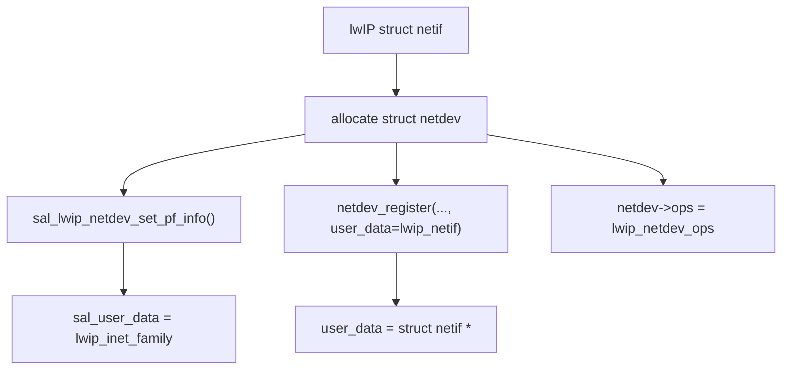
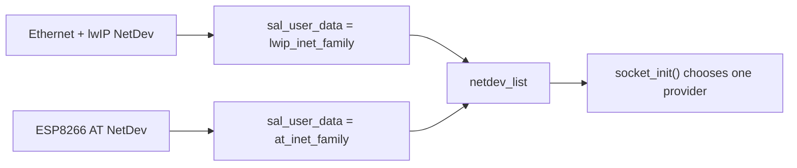
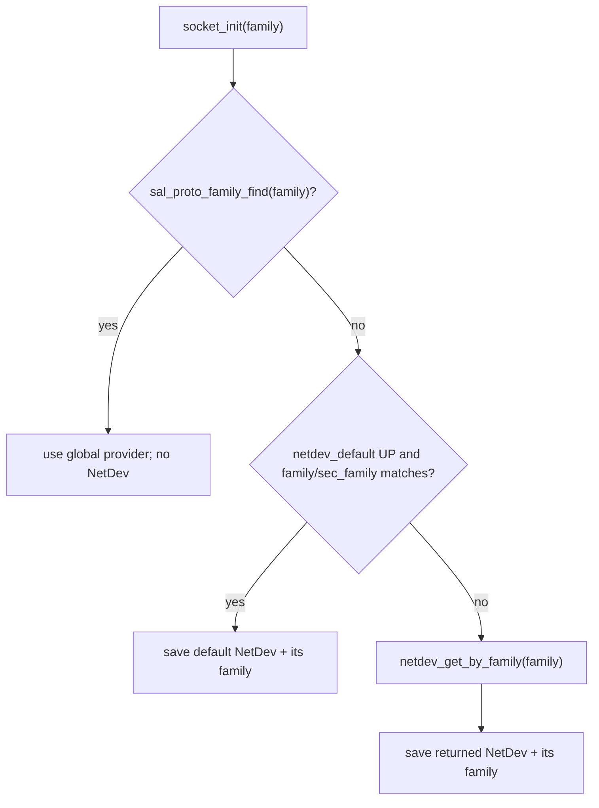
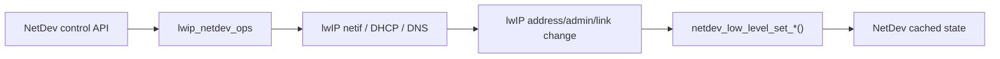
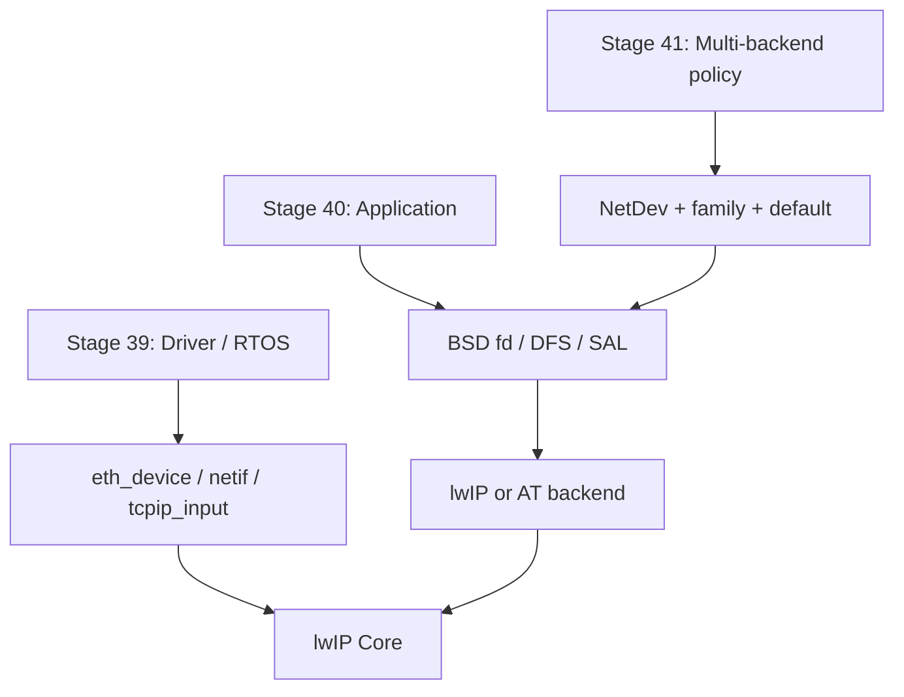

<meta name="referrer" content="no-referrer" />

# 教程 41：从 NetDev 注册到 `socket_init()`——Default NetDev、Protocol Family 与 lwIP / AT Backend 选择

> 摘要：沿 lwIP 与 AT NetDev 的真实注册路径追踪 protocol family、default NetDev 和 family 匹配，解释同一 BSD Socket API 如何在多个网络后端间完成创建期选择。

[TOC]

Stage 40 已经确认：SAL（Socket Abstraction Layer）创建 socket 时会把选中的 `netdev` 与 `protocol_family` 保存进 `struct sal_socket`。Stage 41 继续追这个选择的来源。**NetDev（Network Interface Device，网络接口设备）**是 RT-Thread 对不同网络接口的统一管理对象：它保存接口状态、地址、控制操作和 backend 私有绑定；SAL 再借助 `sal_user_data` 把某个 NetDev 与一组 Socket/NetDB operation table 联系起来。这样 Ethernet+lwIP、Wi-Fi/4G AT modem 等完全不同的实现可以同时进入统一网络接口视图。[S1](#source-s1)[S2](#source-s2)

本文只回答三个问题：NetDev 如何注册；lwIP/AT 为什么会挂上不同 protocol family；`socket_init(AF_INET, ...)` 在多个 UP 接口之间究竟按什么优先级选择 backend。RT-Thread 主仓库固定到 commit `dc8aaa73f2dbea255325ec058a083aeeb5381d0a`（2026-09-28）；AT 设备以官方 `RT-Thread-packages/at_device` commit `846865fa94a705189b0d48500b5dd4af54ca16a5` 的 ESP8266 adapter 作为真实例子。[S1](#source-s1)[S5](#source-s5)

## 阅读源码前：官方 Network Framework 先解释“为什么需要多 backend”

RT-Thread 官方 Network Framework 与 SAL 文档已经从产品视角解释统一 BSD Socket API、lwIP/AT 等不同网络实现以及 protocol family 的 primary/secondary matching。[S7](#source-s7) 这些资料适合先理解“为什么同一个 `socket(AF_INET, ...)` 可能面对多个 provider”，因此本文不再把 NetDev/SAL 写成第二套框架概论。

本文只做实现下钻：固定 revision 中 `netdev_add()`/`netdev_register()` 怎样建立对象，`sal_user_data` 怎样挂 protocol family，以及 **当前 `socket_init()` 究竟按什么顺序使用 global provider、default NetDev 与 family scan**。最后这条选择顺序属于目标源码事实，不能只由总览文档推断。

## 1. 从 Stage 39 的真实入口继续：lwIP `netif` 注册后调用 `netdev_add()`

Stage 39 已经追到 RT-Thread `eth_netif_device_init()`：lwIP `struct netif` 已经存在，Ethernet Driver 也已经和它建立了 `state/input/linkoutput` 关系。在启用 `RT_USING_NETDEV` 时，初始化继续调用 `netdev_add(netif)`。下面直接进入 `components/net/lwip/port/ethernetif.c::netdev_add()`。[S1](#source-s1)

```c
static int netdev_add(struct netif *lwip_netif)
{
    int result = 0;
    struct netdev *netdev = RT_NULL;
    char name[NETIF_NAMESIZE] = {0};

    RT_ASSERT(lwip_netif);

    netdev = (struct netdev *)rt_calloc(1, sizeof(struct netdev));
    if (netdev == RT_NULL)
    {
        return -ERR_IF;
    }

#ifdef SAL_USING_LWIP
    extern int sal_lwip_netdev_set_pf_info(struct netdev *netdev);
    /* set the lwIP network interface device protocol family information */
    sal_lwip_netdev_set_pf_info(netdev);
#endif /* SAL_USING_LWIP */

    rt_strncpy(name, lwip_netif->name, NETIF_NAMESIZE);
    result = netdev_register(netdev, name, (void *)lwip_netif);

    /* Update netdev info after registered */
    netdev_flags_sync(lwip_netif);
    netdev->ops = &lwip_netdev_ops;
    netdev->hwaddr_len =  lwip_netif->hwaddr_len;
    SMEMCPY(netdev->hwaddr, lwip_netif->hwaddr, lwip_netif->hwaddr_len);
    netdev->ip_addr = lwip_netif->ip_addr;
    netdev->gw = lwip_netif->gw;
    netdev->netmask = lwip_netif->netmask;

#ifdef NETDEV_USING_LINK_STATUS_CALLBACK
    extern void netdev_status_change(struct netdev *netdev, enum netdev_cb_type type);
    netdev_set_status_callback(netdev, netdev_status_change);
#endif

    return result;
}
```

这个函数一次建立三种绑定：



也就是说，`struct netdev` 同时向三个方向连接：

- `user_data`：回到具体 lwIP `struct netif`；
- `sal_user_data`：告诉 SAL 这个 NetDev 使用哪套 protocol family；
- `ops`：告诉 NetDev control API 怎样把 up/down/IP/DNS/default 等操作送回具体 backend。

这三者不能混为一个“网卡指针”。

## 2. `struct netdev` 为什么同时需要 `ops`、`sal_user_data` 和 `user_data`

`components/net/netdev/include/netdev.h` 中，这三个字段位于同一个 NetDev 对象里。[S2](#source-s2)

```c
    uint16_t flags;                                    /* network interface device status flag */
    uint16_t mtu;                                      /* maximum transfer unit (in bytes) */
    const struct netdev_ops *ops;                      /* network interface device operations */

    netdev_callback_fn status_callback;                /* network interface device flags change callback */
    netdev_callback_fn addr_callback;                  /* network interface device address information change callback */

    int ifindex;                                       /* network interface device ifindex */

#ifdef RT_USING_SAL
    void *sal_user_data;                               /* user-specific data for SAL */
#endif /* RT_USING_SAL */
    void *user_data;                                   /* user-specific data */
};
```

从职责看：

| 字段 | 谁消费 | 当前 lwIP 场景保存什么 | 解决的问题 |
|---|---|---|---|
| `ops` | NetDev control API | `&lwip_netdev_ops` | set up/down、IP、DNS、DHCP、default 如何落到 lwIP |
| `sal_user_data` | SAL | `&lwip_inet_family` | `socket/connect/send/recv/getaddrinfo` 使用哪组 backend operations |
| `user_data` | backend adapter | `struct netif *` | NetDev 怎样找到具体 lwIP interface |

因此 NetDev 不等于 SAL，也不等于 lwIP `netif`。它是两者之间的统一接口对象。

## 3. `sal_lwip_netdev_set_pf_info()`：lwIP NetDev 的 Socket backend 标签只是一根指针

回到 `netdev_add()`，在注册 NetDev 前先调用 `sal_lwip_netdev_set_pf_info()`。进入 `af_inet_lwip.c`。[S3](#source-s3)

```c
int sal_lwip_netdev_set_pf_info(struct netdev *netdev)
{
    RT_ASSERT(netdev);

    netdev->sal_user_data = (void *) &lwip_inet_family;
    return 0;
}
```

它没有初始化 TCP/IP，也没有创建 socket。真正作用只是：

```text
这个 NetDev
    ↓
SAL 看到 sal_user_data
    ↓
按 lwip_inet_family 分发
```

`lwip_inet_family` 本身定义为：[S3](#source-s3)

```c
static const struct sal_proto_family lwip_inet_family =
{
    .family     = AF_INET,
#if LWIP_VERSION > 0x2000000
    .sec_family = AF_INET6,
#else
    .sec_family = AF_INET,
#endif
    .skt_ops    = &lwip_socket_ops,
    .netdb_ops  = &lwip_netdb_ops,
};
```

因此 lwIP NetDev 暴露给 SAL 的能力不是“设备名叫 e0”，而是：

```text
primary family = AF_INET
secondary family = AF_INET6（当前 2.1.2 路径）
socket ops = lwip_socket_ops
netdb ops = lwip_netdb_ops
```

Stage 40 已经追过 `lwip_socket_ops.connect = lwip_connect`、`sendto = lwip_sendto` 等具体映射。

## 4. 回到 `netdev_add()`，进入 `netdev_register()`：统一接口真正进入 `netdev_list`

`netdev_add()` 下一步调用：

```c
result = netdev_register(netdev, name, (void *)lwip_netif);
```

下面进入 `netdev_register()`。[S2](#source-s2)

```c
int netdev_register(struct netdev *netdev, const char *name, void *user_data)
{
    rt_uint16_t flags_mask;
    rt_uint16_t index;

    RT_ASSERT(netdev);
    RT_ASSERT(name);

    /* clean network interface device */
    flags_mask = NETDEV_FLAG_UP | NETDEV_FLAG_LINK_UP | NETDEV_FLAG_INTERNET_UP | NETDEV_FLAG_DHCP;
    netdev->flags &= ~flags_mask;

    ip_addr_set_zero(&(netdev->ip_addr));
    ip_addr_set_zero(&(netdev->netmask));
    ip_addr_set_zero(&(netdev->gw));

    IP_SET_TYPE_VAL(netdev->ip_addr, IPADDR_TYPE_V4);
    IP_SET_TYPE_VAL(netdev->netmask, IPADDR_TYPE_V4);
    IP_SET_TYPE_VAL(netdev->gw, IPADDR_TYPE_V4);
#if NETDEV_IPV6
    for (index = 0; index < NETDEV_IPV6_NUM_ADDRESSES; index++)
    {
        ip_addr_set_zero(&(netdev->ip6_addr[index]));
        IP_SET_TYPE_VAL(netdev->ip_addr, IPADDR_TYPE_V6);
    }
#endif /* NETDEV_IPV6 */
    for (index = 0; index < NETDEV_DNS_SERVERS_NUM; index++)
    {
        ip_addr_set_zero(&(netdev->dns_servers[index]));
        IP_SET_TYPE_VAL(netdev->ip_addr, IPADDR_TYPE_V4);
    }
    netdev->status_callback = RT_NULL;
    netdev->addr_callback = RT_NULL;

    if(rt_strlen(name) > RT_NAME_MAX)
    {
        char netdev_name[RT_NAME_MAX + 1] = {0};

        rt_strncpy(netdev_name, name, RT_NAME_MAX);
        LOG_E("netdev name[%s] length is so long that have been cut into [%s].", name, netdev_name);
    }

    /* fill network interface device */
    rt_strncpy(netdev->name, name, RT_NAME_MAX);
    netdev->user_data = user_data;

    /* initialize current network interface device single list */
    rt_slist_init(&(netdev->list));

    rt_spin_lock(&_spinlock);

    if (netdev_list == RT_NULL)
    {
        netdev_list = netdev;
    }
    else
    {
        /* tail insertion */
        rt_slist_append(&(netdev_list->list), &(netdev->list));
    }

    netdev_num++;
    netdev->ifindex = netdev_num;

    rt_spin_unlock(&_spinlock);

    if (netdev_default == RT_NULL)
    {
        netdev_set_default(netdev_list);
    }

    /* execute netdev register callback */
    if (g_netdev_register_callback)
    {
        g_netdev_register_callback(netdev, NETDEV_CB_REGISTER);
    }

#if defined(SAL_USING_AF_NETLINK)
    rtnl_ip_notify(netdev, RTM_NEWLINK);
#endif

    return RT_EOK;
}
```

这里完成五件与后续选择直接相关的事情：

1. 清空 UP/LINK/INTERNET/DHCP 等运行时状态；
2. `netdev->user_data = lwip_netif`；
3. 插入全局 `netdev_list`；
4. 分配 `ifindex`；
5. 如果还没有 default NetDev，把第一个注册项设成 default。

因此 `netdev_list` 是 RT-Thread 的统一网络接口列表，而不是 lwIP 自己的 `netif_list`。

## 5. AT backend 也遵守同一注册 contract：ESP8266 是一个真实例子

为了证明 NetDev 并不是 lwIP 专属，下面读取 `RT-Thread-packages/at_device` 的 ESP8266 adapter。AT 设备通过串口 AT 命令让外部 Wi-Fi/蜂窝模块自己运行网络栈，本机并不通过 lwIP 处理该模块的 TCP packet；但上层仍希望用统一 Socket/NetDev API，因此 AT package 也注册 `struct netdev`。[S5](#source-s5)

进入 `esp8266_netdev_add()`：

```c
static struct netdev *esp8266_netdev_add(const char *netdev_name)
{
#define ETHERNET_MTU        1500
#define HWADDR_LEN          6
    struct netdev *netdev = RT_NULL;

    RT_ASSERT(netdev_name);

    netdev = netdev_get_by_name(netdev_name);
    if (netdev != RT_NULL)
    {
        return (netdev);
    }

    netdev = (struct netdev *) rt_calloc(1, sizeof(struct netdev));
    if (netdev == RT_NULL)
    {
        LOG_E("no memory for netdev create.");
        return RT_NULL;
    }

    netdev->mtu = ETHERNET_MTU;
    netdev->ops = &esp8266_netdev_ops;
    netdev->hwaddr_len = HWADDR_LEN;

#ifdef SAL_USING_AT
    extern int sal_at_netdev_set_pf_info(struct netdev *netdev);
    /* set the network interface socket/netdb operations */
    sal_at_netdev_set_pf_info(netdev);
#endif

    netdev_register(netdev, netdev_name, RT_NULL);

    return netdev;
}
```

结构与 lwIP `netdev_add()` 非常相似：

```text
allocate netdev
  -> set backend-specific ops
  -> set protocol family info
  -> netdev_register()
```

区别在于它不需要保存 `struct netif *`，所以 `netdev_register(..., RT_NULL)` 的 `user_data` 与 lwIP 路径不同。

## 6. AT 的 `sal_user_data` 指向另一套 protocol family

ESP8266 注册前调用 `sal_at_netdev_set_pf_info()`。进入 RT-Thread 主仓库的 `af_inet_at.c`：[S3](#source-s3)

```c
int sal_at_netdev_set_pf_info(struct netdev *netdev)
{
    RT_ASSERT(netdev);

    netdev->sal_user_data = (void *) &at_inet_family;
    return 0;
}
```

`at_inet_family` 是：[S3](#source-s3)

```c
static const struct sal_proto_family at_inet_family =
{
    AF_AT,
    AF_INET,
    &at_socket_ops,
    &at_netdb_ops,
};
```

而 `at_socket_ops` 的创建/连接/收发最终指向 AT socket implementation：[S3](#source-s3)

```c
static const struct sal_socket_ops at_socket_ops =
{
    at_socket,
    at_closesocket,
    at_bind,
#ifdef AT_USING_SOCKET_SERVER
    at_listen,
#else
    NULL,
#endif
    at_connect,
#ifdef AT_USING_SOCKET_SERVER
    at_accept,
#else
    NULL,
#endif
    at_sendto,
    NULL,
    NULL,
    at_recvfrom,
    at_getsockopt,
    at_setsockopt,
    at_shutdown,
    NULL,
    NULL,
    NULL,
    NULL,
#ifdef SAL_USING_POSIX
    at_poll,
#endif /* SAL_USING_POSIX */
};
```

所以两个 NetDev 进入 `netdev_list` 后可以并存：



## 7. `family` 与 `sec_family`：把官方 matching 模型落到当前两个 backend

SAL 官方文档已经解释 primary/secondary protocol family 的用途。[S7](#source-s7) 当前固定 revision 中，真正需要记住的是两个 descriptor 的具体取值：[S3](#source-s3)

| Backend | `family` | `sec_family` | Socket operations |
| --- | --- | --- | --- |
| lwIP 2.1.2 | `AF_INET` | `AF_INET6` | `lwip_socket_ops` |
| AT | `AF_AT` | `AF_INET` | `at_socket_ops` |

因此 `socket(AF_AT, ...)` 只能命中 AT 的 primary family；`socket(AF_INET, ...)` 同时可能匹配 lwIP primary 或 AT secondary。**哪个实际获选仍必须继续读 `socket_init()`**：family 标签只描述候选匹配能力，不等于最终优先级。

## 8. 回到 Stage 40 的 `socket_init()`：当前选择顺序是“全局 provider → default NetDev → family scan”

Stage 40 已经从 socket 生命周期读过这个函数；这里重新从多网络选择角度展开。[S4](#source-s4)

```c
static int socket_init(int family, int type, int protocol, struct sal_socket **res)
{
    struct sal_socket *sock;
    const struct sal_proto_family *pf;
    struct netdev *netdv_def = netdev_default;
    struct netdev *netdev = RT_NULL;
    rt_bool_t flag = RT_FALSE;

    /* Existing range checks for family and type */
    if (family < 0 || family > AF_MAX)
    {
        LOG_E("Invalid family: %d (must be 0 ~ %d)", family, AF_MAX);
        return -1;
    }

    if (type < 0 || type > SOCK_MAX)
    {
        LOG_E("Invalid type: %d (must be 0 ~ %d)", type, SOCK_MAX);
        return -2;
    }

    /* Range check for protocol */
    if (!VALID_PROTOCOL(protocol))
    {
        LOG_E("Invalid protocol: %d (must be 0 ~ %d)", protocol, IPPROTO_RAW);
        rt_set_errno(EINVAL);
        return -4;
    }

    sock = *res;
    sock->domain = family;
    sock->type = type;
    sock->protocol = protocol;

    /* Combo compatibility check */
    if (!VALID_COMBO(family, type, protocol))
    {
        LOG_E("Invalid combo: domain=%d, type=%d, protocol=%d", family, type, protocol);
        rt_set_errno(EINVAL);
        return -4;
    }

    pf = sal_proto_family_find(family);
    if (pf != RT_NULL)
    {
        sock->protocol_family = pf;
        sock->netdev = RT_NULL;
        return 0;
    }

    /* Existing netdev selection logic */
    if (netdv_def && netdev_is_up(netdv_def))
    {
        /* check default network interface device protocol family */
        pf = (struct sal_proto_family *)netdv_def->sal_user_data;
        if (pf != RT_NULL && pf->skt_ops && (pf->family == family || pf->sec_family == family))
        {
            sock->netdev = netdv_def;
            sock->protocol_family = pf;
            flag = RT_TRUE;
        }
    }

    if (flag == RT_FALSE)
    {
        /* get network interface device by protocol family */
        netdev = netdev_get_by_family(family);
        if (netdev == RT_NULL)
        {
            LOG_E("not find network interface device by protocol family(%d).", family);
            return -3;
        }

        sock->netdev = netdev;
        sock->protocol_family = (const struct sal_proto_family *)netdev->sal_user_data;
        if (sock->protocol_family == RT_NULL || sock->protocol_family->skt_ops == RT_NULL)
        {
            return -3;
        }
    }

    LOG_D("Socket init success: domain=%d, type=%d, protocol=%d, netdev=%s",
          family, type, protocol, sock->netdev ? sock->netdev->name : "default");
    return 0;
}
```

执行顺序必须精确理解为：



对普通 lwIP/AT 网络设备，真正关键的是后两步：**可用 default 先于 fallback scan。**

## 9. `netdev_get_by_family()`：fallback scan 内部才是 primary 优先于 secondary

当 default 不可用或不匹配时，`socket_init()` 调 `netdev_get_by_family()`。进入 NetDev Core。[S2](#source-s2)

```c
struct netdev *netdev_get_by_family(int family)
{
    rt_slist_t *node = RT_NULL;
    struct netdev *netdev = RT_NULL;
    struct sal_proto_family *pf = RT_NULL;

    if (netdev_list == RT_NULL)
    {
        return RT_NULL;
    }

    rt_spin_lock(&_spinlock);

    for (node = &(netdev_list->list); node; node = rt_slist_next(node))
    {
        netdev = rt_slist_entry(node, struct netdev, list);
        pf = (struct sal_proto_family *) netdev->sal_user_data;
        if (pf && pf->skt_ops && pf->family == family && netdev_is_up(netdev))
        {
            rt_spin_unlock(&_spinlock);
            return netdev;
        }
    }

    for (node = &(netdev_list->list); node; node = rt_slist_next(node))
    {
        netdev = rt_slist_entry(node, struct netdev, list);
        pf = (struct sal_proto_family *) netdev->sal_user_data;
        if (pf && pf->skt_ops && pf->sec_family == family && netdev_is_up(netdev))
        {
            rt_spin_unlock(&_spinlock);
            return netdev;
        }
    }

    rt_spin_unlock(&_spinlock);

    return RT_NULL;
}
```

它明确做两轮遍历：

```text
第一轮：pf->family == requested family
第二轮：pf->sec_family == requested family
```

并且两轮都要求 `netdev_is_up(netdev)`。

因此如果**没有一个可直接使用的 default NetDev**，同时存在 UP 的 lwIP 与 AT NetDev，`socket(AF_INET)` 会先找到 lwIP 的 primary `AF_INET`，只有 primary 找不到才考虑 AT 的 secondary `AF_INET`。

但这条“primary 优先”只属于 fallback scan。若 default 本身是 UP 的 AT NetDev，`socket_init()` 会在进入本函数前就用 AT 的 secondary match 命中。

## 10. `netdev_default` 从哪里来：第一个注册接口自动成为 default

前面 `netdev_register()` 的末尾已经看到：[S2](#source-s2)

```c
if (netdev_default == RT_NULL)
{
    netdev_set_default(netdev_list);
}
```

因此系统第一个注册的 NetDev 会成为初始 default。真正设置动作在 `netdev_set_default()`：[S2](#source-s2)

```c
void netdev_set_default(struct netdev *netdev)
{
    if (netdev && (netdev != netdev_default))
    {
        netdev_default = netdev;

        /* execture the default network interface device in the current network stack */
        if (netdev->ops && netdev->ops->set_default)
        {
            netdev->ops->set_default(netdev);
        }

        /* execture application netdev default change callback */
        if (g_netdev_default_change_callback)
        {
            g_netdev_default_change_callback(netdev, NETDEV_CB_DEFAULT_CHANGE);
        }
        LOG_D("Setting default network interface device name(%s) successfully.", netdev->name);
    }
}
```

它不只改全局指针，还调用 backend `ops->set_default()`。对 lwIP NetDev，`lwip_netdev_ops` 的对应函数是：[S1](#source-s1)

```c
static int lwip_netdev_set_default(struct netdev *netif)
{
    netif_set_default((struct netif *)netif->user_data);
    return ERR_OK;
}
```

于是当 default 切到 lwIP NetDev 时：

```text
RT-Thread netdev_default
    ↓
netdev->ops->set_default()
    ↓
lwip_netdev_set_default()
    ↓
lwIP netif_set_default(struct netif *)
```

RT-Thread 的 default interface policy 与 lwIP 自己的 default netif 因此可以同步。

## 11. Link/Admin 状态改变时，为什么 backend 选择会变化

`socket_init()` 和 `netdev_get_by_family()` 都要求 NetDev 处于 UP 状态。因此状态同步不是附属功能，而会直接影响新 socket 是否能选择该接口。

NetDev Core 的 `netdev_low_level_set_status()` 会修改 `NETDEV_FLAG_UP`：[S2](#source-s2)

```c
void netdev_low_level_set_status(struct netdev *netdev, rt_bool_t is_up)
{
    if (netdev && netdev_is_up(netdev) != is_up)
    {
        if (is_up)
        {
            netdev->flags |= NETDEV_FLAG_UP;
        }
        else
        {
            netdev->flags &= ~NETDEV_FLAG_UP;

#ifdef NETDEV_USING_AUTO_DEFAULT
            /* change to the first link_up network interface device automatically */
            netdev_auto_change_default(netdev);
#endif /* NETDEV_USING_AUTO_DEFAULT */
        }

        /* execute  network interface device status change callback function */
        if (netdev->status_callback)
        {
            netdev->status_callback(netdev, is_up ? NETDEV_CB_STATUS_UP : NETDEV_CB_STATUS_DOWN);
        }
    }
}
```

Link 状态则由 `netdev_low_level_set_link_status()` 维护：[S2](#source-s2)

```c
void netdev_low_level_set_link_status(struct netdev *netdev, rt_bool_t is_up)
{
    if (netdev && netdev_is_link_up(netdev) != is_up)
    {
        if (is_up)
        {
            netdev->flags |= NETDEV_FLAG_LINK_UP;

#ifdef RT_USING_SAL
            /* set network interface device flags to internet up */
            if (netdev_is_up(netdev) && !ip_addr_isany(&(netdev->ip_addr)))
            {
                sal_check_netdev_internet_up(netdev);
            }
#endif /* RT_USING_SAL */
        }
        else
        {
            netdev->flags &= ~NETDEV_FLAG_LINK_UP;

            /* set network interface device flags to internet down */
            netdev->flags &= ~NETDEV_FLAG_INTERNET_UP;

#ifdef NETDEV_USING_AUTO_DEFAULT
            /* change to the first link_up network interface device automatically */
            netdev_auto_change_default(netdev);
#endif /* NETDEV_USING_AUTO_DEFAULT */
        }

        /* execute link status change callback function */
        if (netdev->status_callback)
        {
            netdev->status_callback(netdev, is_up ? NETDEV_CB_STATUS_LINK_UP : NETDEV_CB_STATUS_LINK_DOWN);
        }
    }
}
```

这里要区分三个状态：

```text
UP          = interface 管理状态
LINK_UP     = 链路状态
INTERNET_UP = 更高层连通状态
```

`socket_init()` 当前主要检查 `UP`；auto-default 在 down/link-down 分支可以按配置触发切换。不能把“网线插着”“接口 UP”“Internet 可达”视为同一个布尔量。

## 12. lwIP 自己的 IP/Link 变化怎样反向同步进 NetDev

RT-Thread 内置 lwIP 2.1.2 在 `netif.c` 中增加了 NetDev hook。IPv4 地址真正变化后，`netif_do_set_ipaddr()` 会回写统一 NetDev 地址：[S6](#source-s6)

```c
#ifdef RT_USING_NETDEV
  /* rt-thread sal network interface device set IP address operations */
  netdev_low_level_set_ipaddr(netdev_get_by_name(netif->name), &netif->ip_addr);
#endif /* RT_USING_NETDEV */
```

`netif_set_up()` 的状态切换路径中也会同步：[S6](#source-s6)

```c
#ifdef RT_USING_NETDEV
    /* rt-thread network interface device set up status */
    netdev_low_level_set_status(netdev_get_by_name(netif->name), RT_TRUE);
#endif /* RT_USING_NETDEV */
```

继续阅读 `netif_set_link_up()` 的 Link Up 路径，RT-Thread hook 同样回写：[S6](#source-s6)

```c
#ifdef RT_USING_NETDEV
    /* rt-thread network interface device set link up status */
    netdev_low_level_set_link_status(netdev_get_by_name(netif->name), RT_TRUE);
#endif /* RT_USING_NETDEV */
```

而 `netif_set_link_down()` 中写入 `RT_FALSE`：[S6](#source-s6)

```c
#ifdef RT_USING_NETDEV
    /* rt-thread network interface device set link down status */
    netdev_low_level_set_link_status(netdev_get_by_name(netif->name), RT_FALSE);
#endif /* RT_USING_NETDEV */
```

因此 lwIP 与 NetDev 不是两套互不相干的状态：



这种双向 adapter 让上层可以通过统一 NetDev 查看/控制接口，同时 lwIP 的真实状态变化也能反馈回来。

## 13. 已创建 socket 为什么不会跟着 default NetDev 自动迁移

Stage 40 已经看过 `struct sal_socket`：

```text
sock->netdev
sock->protocol_family
sock->user_data
```

都在 `sal_socket()` 创建阶段写入。后续 `sal_connect()` 的关键分发语句是：[S4](#source-s4)

```c
ret = pf->skt_ops->connect((int)(size_t)sock->user_data, name, namelen);
```

这里的 `pf` 来自当前 `sock->protocol_family`，backend descriptor 来自 `sock->user_data`。它没有重新读取 `netdev_default`。

因此：

```text
创建 socket 时 default = eth0/lwIP
    ↓
socket 固定保存 lwIP family + lwIP socket id
    ↓
后来 default 改为 esp0/AT
    ↓
旧 socket 仍然继续使用 lwIP dispatch context
```

如果旧网络已经断开，该连接可能失败，但 SAL 不会把一个已有 TCP session 无缝搬到另一协议栈。Wi-Fi→4G failover 通常需要应用/连接管理层关闭并重建连接，再恢复 MQTT/HTTP 等应用状态。

## 14. DNS/NetDB 选择为什么不能简单等同于 socket backend 选择

名称解析没有一个现成 `struct sal_socket` 可携带 per-socket `netdev/protocol_family`。当前 `sal_gethostbyname()` 先尝试 default NetDev：[S4](#source-s4)

```c
struct hostent *sal_gethostbyname(const char *name)
{
    struct netdev *netdev = netdev_default;
    struct sal_proto_family *pf;

    if (SAL_NETDEV_NETDBOPS_VALID(netdev, pf, gethostbyname))
    {
        return pf->netdb_ops->gethostbyname(name);
    }
    else
    {
        /* get the first network interface device with up status */
        netdev = netdev_get_first_by_flags(NETDEV_FLAG_UP);
        if (SAL_NETDEV_NETDBOPS_VALID(netdev, pf, gethostbyname))
        {
            return pf->netdb_ops->gethostbyname(name);
        }
    }

    return RT_NULL;
}
```

`sal_getaddrinfo()` 也是先 default、再首个 UP NetDev，并额外记录本次 resolution result 对应的 NetDev：[S4](#source-s4)

```c
int sal_getaddrinfo(const char *nodename,
                    const char *servname,
                    const struct addrinfo *hints,
                    struct addrinfo **res)
{
    struct netdev *netdev = netdev_default;
    struct sal_proto_family *pf;
    int ret = 0;
    rt_uint32_t i = 0;

    if (SAL_NETDEV_NETDBOPS_VALID(netdev, pf, getaddrinfo))
    {
        ret = pf->netdb_ops->getaddrinfo(nodename, servname, hints, res);
    }
    else
    {
        /* get the first network interface device with up status */
        netdev = netdev_get_first_by_flags(NETDEV_FLAG_UP);
        if (SAL_NETDEV_NETDBOPS_VALID(netdev, pf, getaddrinfo))
        {
            ret = pf->netdb_ops->getaddrinfo(nodename, servname, hints, res);
        }
        else
        {
            ret = -1;
        }
    }

    if (ret == RT_EOK)
    {
        /*record the netdev and res*/
        for (i = 0; i < SAL_SOCKETS_NUM; i++)
        {
            if (sal_dev_res_tbl[i].res == RT_NULL)
            {
                sal_dev_res_tbl[i].res = *res;
                sal_dev_res_tbl[i].netdev = netdev;
                break;
            }
        }

        RT_ASSERT((i < SAL_SOCKETS_NUM));
    }

    return ret;
}
```

所以多网络产品不能简单假设：

> “一次全局 DNS lookup 得到地址后，随后的任意新 socket 一定使用同一个 backend。”

是否一致取决于当时的 default/UP/family policy。对云连接管理，DNS 与 socket 创建最好被视为同一连接编排流程，而不是两个无关步骤。

## 15. 两个具体场景：相同 `socket(AF_INET)` 为什么会走不同后端

假设系统已经注册：

```text
eth0
  sal_user_data -> lwip_inet_family
  family        = AF_INET

esp0
  sal_user_data -> at_inet_family
  family        = AF_AT
  sec_family    = AF_INET
```

### 场景 A：`eth0` 是 UP 的 default

`socket_init(AF_INET)` 在 default check 中直接看到：

```text
eth0 UP
+ lwip_inet_family.family == AF_INET
    ↓
保存 eth0 + lwip_inet_family
    ↓
pf->skt_ops->socket()
    ↓
inet_socket()
    ↓
lwip_socket()
```

### 场景 B：`esp0` 是 UP 的 default

同样的应用调用可以写成：

```text
socket(AF_INET, SOCK_STREAM, 0)
```

也可以在 default check 中命中：

```text
esp0 UP
+ at_inet_family.sec_family == AF_INET
    ↓
保存 esp0 + at_inet_family
    ↓
at_socket_ops.socket
    ↓
at_socket()
```

所以当前 SAL 设计的关键不是“`AF_INET` 永远代表 lwIP”，而是：

> **创建 socket 时，根据 family + default NetDev + UP 状态选择一个 provider，然后把选择结果固定进该 socket。**

如果应用明确调用 `socket(AF_AT, ...)`，则直接要求 AT primary family，lwIP NetDev 不匹配。

## 16. Stage 39～41 的边界现在闭合了

三篇分别从不同入口解释同一个系统：



对 lwIP 主线来说，到这里已经足以理解 RT-Thread 网络抽象：

- `eth_device/netif` 解决 Driver 与 lwIP 数据通路；
- DFS/SAL 解决应用统一 Socket API 与 backend dispatch；
- NetDev 解决多接口统一状态、控制操作和创建期 backend 选择。

不需要继续把 RT-Thread Kernel、完整 DFS pathname/mount、AT parser 或 Device Framework 全量源码塞进本系列。下一阶段可以回到具体 MCU Ethernet：Stage 42～43 将把 `eth_rx/eth_tx` 真正落到 STM32H7 MAC、DMA Descriptor、Cache 与 buffer ownership。

## 资料来源

<a id="source-s1"></a>
### [S1] RT-Thread lwIP Ethernet Port 的 NetDev adapter
- 类型：RT-Thread 官方仓库源码
- 版本：commit `dc8aaa73f2dbea255325ec058a083aeeb5381d0a`
- 定位：`components/net/lwip/port/ethernetif.c`：`netdev_add()`、`lwip_netdev_ops`、`lwip_netdev_set_default()`、`eth_netif_device_init()`
- URL/文档：[ethernetif.c](https://github.com/RT-Thread/rt-thread/blob/dc8aaa73f2dbea255325ec058a083aeeb5381d0a/components/net/lwip/port/ethernetif.c)
- 使用位置：“lwIP netif 怎样包装成 NetDev”“`user_data/ops/sal_user_data` 关系”“default 同步”
- 支撑内容：lwIP Port 侧 NetDev 创建与 control-plane adapter 的直接证据

<a id="source-s2"></a>
### [S2] RT-Thread NetDev Core
- 类型：RT-Thread 官方仓库源码
- 版本：同上
- 定位：`components/net/netdev/include/netdev.h`、`components/net/netdev/src/netdev.c`：`struct netdev`、`netdev_register()`、`netdev_get_by_family()`、`netdev_set_default()`、`netdev_low_level_set_status()`、`netdev_low_level_set_link_status()`
- URL/文档：[netdev.h](https://github.com/RT-Thread/rt-thread/blob/dc8aaa73f2dbea255325ec058a083aeeb5381d0a/components/net/netdev/include/netdev.h)、[netdev.c](https://github.com/RT-Thread/rt-thread/blob/dc8aaa73f2dbea255325ec058a083aeeb5381d0a/components/net/netdev/src/netdev.c)
- 使用位置：“NetDev 对象”“注册/default”“family lookup”“UP/LINK/INTERNET 状态”
- 支撑内容：Stage 41 多接口列表与选择算法的直接实现证据

<a id="source-s3"></a>
### [S3] RT-Thread SAL lwIP / AT Protocol Family Adapter
- 类型：RT-Thread 官方仓库源码
- 版本：同上
- 定位：`components/net/sal/impl/af_inet_lwip.c`：`lwip_inet_family`、`lwip_socket_ops`、`sal_lwip_netdev_set_pf_info()`；`components/net/sal/impl/af_inet_at.c`：`at_inet_family`、`at_socket_ops`、`sal_at_netdev_set_pf_info()`
- URL/文档：[af_inet_lwip.c](https://github.com/RT-Thread/rt-thread/blob/dc8aaa73f2dbea255325ec058a083aeeb5381d0a/components/net/sal/impl/af_inet_lwip.c)、[af_inet_at.c](https://github.com/RT-Thread/rt-thread/blob/dc8aaa73f2dbea255325ec058a083aeeb5381d0a/components/net/sal/impl/af_inet_at.c)
- 使用位置：“lwIP/AT family/sec_family”“不同 backend operation table”
- 支撑内容：证明两个 backend 怎样通过同一个 `sal_user_data` contract 暴露给 SAL

<a id="source-s4"></a>
### [S4] RT-Thread SAL Backend Selection
- 类型：RT-Thread 官方仓库源码
- 版本：同上
- 定位：`components/net/sal/src/sal_socket.c`：`socket_init()`、`sal_connect()`、`sal_gethostbyname()`、`sal_getaddrinfo()`
- URL/文档：[sal_socket.c](https://github.com/RT-Thread/rt-thread/blob/dc8aaa73f2dbea255325ec058a083aeeb5381d0a/components/net/sal/src/sal_socket.c)
- 使用位置：“default 优先级”“family fallback”“已创建 socket provider 固定”“NetDB selection”
- 支撑内容：证明 backend 在 socket 创建时保存，以及 DNS/NetDB 采用不同于 per-socket 的选择上下文

<a id="source-s5"></a>
### [S5] RT-Thread AT Device ESP8266 NetDev Adapter
- 类型：RT-Thread 官方 packages 仓库源码
- 版本：`RT-Thread-packages/at_device` commit `846865fa94a705189b0d48500b5dd4af54ca16a5`
- 定位：`class/esp8266/at_device_esp8266.c`：`esp8266_netdev_add()`、`esp8266_netdev_ops`
- URL/文档：[ESP8266 at_device adapter](https://github.com/RT-Thread-packages/at_device/blob/846865fa94a705189b0d48500b5dd4af54ca16a5/class/esp8266/at_device_esp8266.c)
- 使用位置：“真实 AT NetDev 注册”“AT backend 与 lwIP 对照”
- 支撑内容：证明 AT package 也通过 `sal_at_netdev_set_pf_info()` + `netdev_register()` 接入统一 NetDev/SAL

<a id="source-s6"></a>
### [S6] RT-Thread vendored lwIP 2.1.2 NetIf → NetDev 状态同步
- 类型：RT-Thread 仓库内置 lwIP 源码
- 版本：RT-Thread commit `dc8aaa73f2dbea255325ec058a083aeeb5381d0a` 中的 lwIP 2.1.2
- 定位：`components/net/lwip/lwip-2.1.2/src/core/netif.c`：`netif_do_set_ipaddr()`、`netif_set_up()`、`netif_set_link_up()`、`netif_set_link_down()`
- URL/文档：[vendored lwIP netif.c](https://github.com/RT-Thread/rt-thread/blob/dc8aaa73f2dbea255325ec058a083aeeb5381d0a/components/net/lwip/lwip-2.1.2/src/core/netif.c)
- 使用位置：“lwIP IP/admin/link 状态怎样反向同步进 NetDev”
- 支撑内容：RT-Thread vendored lwIP 的 NetDev synchronization hook


<a id="source-s7"></a>
### [S7] RT-Thread 官方 Network Framework 与 SAL 文档
- 类型：RT-Thread 官方在线文档
- 版本：访问日期 2026-10-03；用于多 backend 与 protocol family 概念导读
- URL/文档：[Network Framework](https://rt-thread.github.io/rt-thread/page_component_network.html)、[Socket Abstraction Layer: SAL](https://rt-thread.github.io/rt-thread/page_component_sal.html)
- 使用位置：“阅读源码前”“family/sec_family 概念边界”
- 支撑内容：官方说明统一 BSD Socket abstraction、lwIP/AT 等 backend，以及 protocol family primary/secondary matching 的框架语义；当前选择优先级仍由 `[S2]～[S4]` 源码证明
