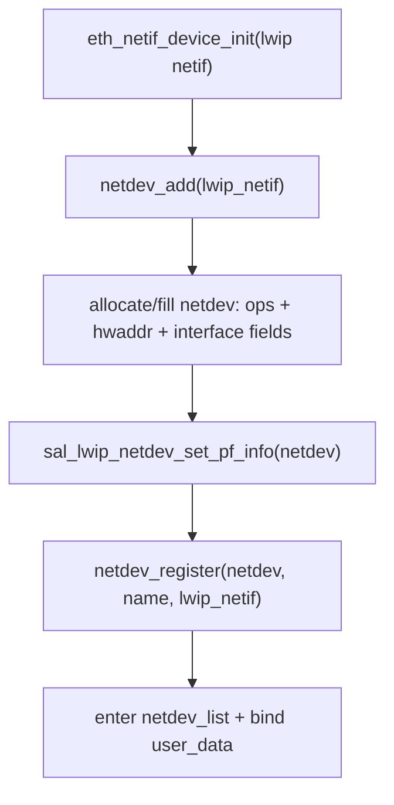
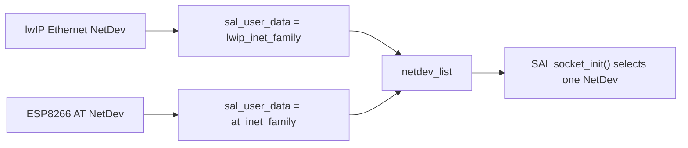
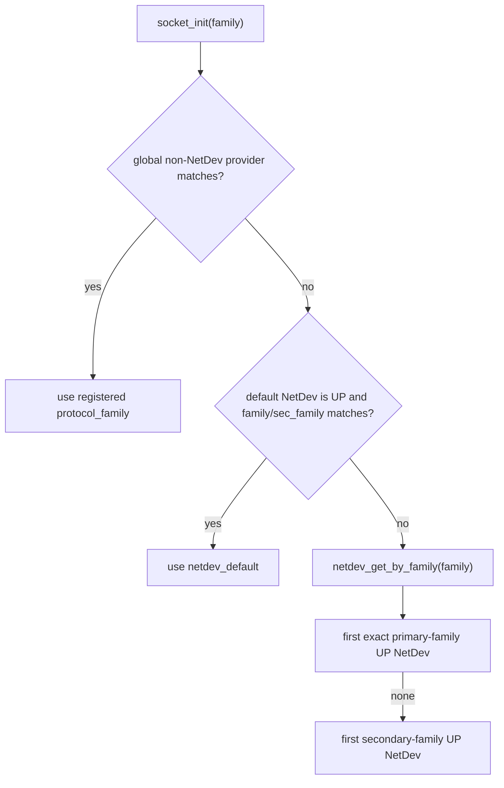
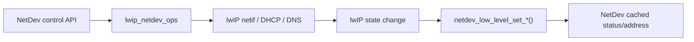

<meta name="referrer" content="no-referrer" />

# 教程 41：从 NetDev 注册到 `socket_init()`——Default NetDev、Protocol Family 与 lwIP / AT Backend 选择

> 摘要：沿 lwIP 与 AT NetDev 的注册路径追踪 sal_user_data、default NetDev 和 family 匹配，解释同一 BSD Socket API 如何动态选择不同网络后端。

[TOC]

Stage 40 已经确认：应用调用 `socket(AF_INET, ...)` 时，SAL 的 `socket_init()` 会先选择一个 NetDev 与 `protocol_family`，再通过其 `skt_ops` 创建真正的 backend socket。剩下的问题是：**这些 NetDev 从哪里来、为什么一个 NetDev 指向 lwIP 而另一个指向 AT、系统有多个网络接口时哪个会被新 socket 选中。**

Stage 41 从“设备注册”这一端重新追踪。RT-Thread 主仓库继续固定到 commit `dc8aaa73f2dbea255325ec058a083aeeb5381d0a`（2026-09-28）；AT 设备用官方 `RT-Thread-packages/at_device` commit `846865fa94a705189b0d48500b5dd4af54ca16a5`（2026-09-23）的 ESP8266 adapter 作为一个真实 package 例子。[S1](#source-s1)[S5](#source-s5)

## 1. 先回到 Stage 39 的 lwIP NetDev 创建点：`netdev_add()`

Stage 39 已追到 `eth_netif_device_init()`。在启用 `RT_USING_NETDEV` 时，这个函数调用 RT-Thread lwIP Port 内部的 `netdev_add(lwip_netif)`。[S1](#source-s1)

这个 helper 的关键初始化顺序可以压缩为：



这里第一次同时出现 NetDev 的两类“后端指针”：[S1](#source-s1)[S2](#source-s2)

```text
netdev->user_data      = lwip_netif
netdev->sal_user_data  = &lwip_inet_family
```

两者用途完全不同：

- `user_data` 连接 **NetDev control plane** 与具体网络栈接口对象；lwIP 场景保存 `struct netif *`；
- `sal_user_data` 连接 **SAL socket plane** 与 protocol-family operation table；lwIP 场景保存 `lwip_inet_family`。

如果只记住“NetDev 代表网卡”而忽略这两个指针，就很难理解 Stage 40 的 socket backend selection。

## 2. `sal_lwip_netdev_set_pf_info()` 实际只做一件事：给 NetDev 贴上 lwIP protocol-family 标签

`components/net/sal/impl/af_inet_lwip.c` 中的 `sal_lwip_netdev_set_pf_info()` 并不会初始化 TCP/IP 协议栈。它只把：

```text
netdev->sal_user_data = &lwip_inet_family
```

写入当前 NetDev。[S3](#source-s3)

`lwip_inet_family` 再指向：

```text
family     = AF_INET
sec_family = AF_INET6（当前版本条件满足时）
skt_ops    = lwip_socket_ops
netdb_ops  = lwip_netdb_ops
```

因此 NetDev 与 lwIP Socket backend 的连接不是靠名字 `e0`、`w0` 推断出来，而是靠 `sal_user_data` 中保存的 operation descriptor。

## 3. 进入 `netdev_register()`：它建立统一的 network-interface list

`netdev_add()` 接着调用 `netdev_register(netdev, name, lwip_netif)`。[S1](#source-s1)

`netdev_register()` 的职责不是创建 lwIP `netif`；那个对象在更早已经存在。这里主要做：[S2](#source-s2)

1. 清理 UP/LINK_UP/INTERNET_UP/DHCP 等运行时 flag；
2. 初始化 IPv4/IPv6/DNS 地址字段；
3. 保存 `name` 与 `user_data`；
4. 把 NetDev 插入全局 `netdev_list`；
5. 分配递增 `ifindex`；
6. 如果还没有 default NetDev，就把第一个注册设备设为 `netdev_default`。

所以 `netdev_list` 是 RT-Thread 的“统一网络接口视图”，不等于 lwIP 自己的 `netif_list`。

对 lwIP，两者之间通过 `netdev->user_data = lwip_netif` 建立对应；对 AT 设备，`user_data` 则由对应 package 自己决定。

## 4. `netdev_ops` 与 `sal_user_data` 分别解决什么问题

同一个 `struct netdev` 同时保存：

```text
const struct netdev_ops *ops
void *sal_user_data
void *user_data
```

它们分工如下：[S2](#source-s2)

| 字段 | 面向谁 | 解决的问题 |
| --- | --- | --- |
| `ops` | NetDev control plane | set up/down、IP、DNS、DHCP、ping、set_default 怎样落到具体 backend |
| `sal_user_data` | SAL socket plane | `socket/connect/send/recv/getaddrinfo` 应分发到哪套 protocol family |
| `user_data` | backend 私有绑定 | NetDev 自己需要保存哪个具体栈/驱动对象 |

因此“切换 default NetDev”和“切换某个已创建 socket 的 backend”不是同一件事。`netdev_default` 影响**后续选择与系统默认接口**；已创建 SAL socket 已经把 `sock->netdev` 与 `sock->protocol_family` 保存下来，后续 `connect/send/recv` 继续使用自己的 dispatch context。[S4](#source-s4)

## 5. AT backend 使用相同 NetDev contract，但 protocol family 不同

RT-Thread 主仓库的 `af_inet_at.c` 定义另一组 protocol family：[S3](#source-s3)

```text
at_inet_family
├── family     = AF_AT
├── sec_family = AF_INET
├── skt_ops    = at_socket_ops
└── netdb_ops  = at_netdb_ops
```

`sal_at_netdev_set_pf_info()` 同样只是把这个 family descriptor 写入 `netdev->sal_user_data`。[S3](#source-s3)

真实 AT 设备通常来自独立 package。当前 `RT-Thread-packages/at_device` 的 ESP8266 adapter 中，`esp8266_netdev_add()` 会先分配并填写 `struct netdev`，设置 `esp8266_netdev_ops`，然后在 `SAL_USING_AT` 下调用 `sal_at_netdev_set_pf_info(netdev)`，最后执行 `netdev_register()`。[S5](#source-s5)

因此 lwIP Ethernet 与 ESP8266 AT 虽然底层实现完全不同，在 NetDev/SAL 看来都形成同样的注册结果：



## 6. `family` 与 `sec_family` 为什么存在两级匹配

这里是多 backend 选择的核心。

当前 lwIP family 的 primary family 是 `AF_INET`；AT family 的 primary family 是 `AF_AT`，secondary family 是 `AF_INET`。[S3](#source-s3)

可以把它理解为：

| Backend | primary `family` | `sec_family` | 意义 |
| --- | --- | --- | --- |
| lwIP | `AF_INET` | 当前版本下可为 `AF_INET6` | 标准 Internet socket 的直接 provider |
| AT | `AF_AT` | `AF_INET` | 可用专属 AF_AT 显式选择，也允许标准 Internet family 作为 secondary 匹配 |

因此一个应用使用标准 `AF_INET` 并不天然意味着“一定走 lwIP”。最终还要结合 default NetDev 与当前 UP 状态。

这一点不能从旧的“AF_INET = lwIP、AF_AT = AT”静态记忆推出，必须看当前 `socket_init()` 的真实选择算法。[S4](#source-s4)

## 7. 回到 `socket_init()`：当前实现的真实优先级

Stage 40 已经进入过 `socket_init()`；这里从多 NetDev 角度重新读取它。[S4](#source-s4)

当前选择顺序是：



第一步的 global provider 主要给“不依赖 NetDev”的 family 使用；lwIP/AT 网络设备主线从 `netdev_default` 开始判断。[S4](#source-s4)

因此普通 `AF_INET` 的行为可以总结为：

1. 如果当前 default NetDev 是 UP，并且其 primary 或 secondary family 可以匹配 `AF_INET`，直接使用 default；
2. 否则扫描 `netdev_list`，先找 primary family 精确等于 `AF_INET` 的 UP NetDev；
3. 仍找不到时，再接受 secondary family 等于 `AF_INET` 的 UP NetDev。[S2](#source-s2)[S4](#source-s4)

这意味着：当 default 是一个 UP 状态的 AT NetDev 时，标准 `socket(AF_INET, ...)` 可以走 AT backend，因为 AT 把 `AF_INET` 声明成了 `sec_family`。[S3](#source-s3)[S4](#source-s4)

## 8. `netdev_get_by_family()` 为什么要先 primary 再 secondary

`netdev_get_by_family()` 位于 `components/net/netdev/src/netdev.c`。它对 `netdev_list` 做两轮遍历：[S2](#source-s2)

第一轮要求：

```text
pf->family == requested family
+ skt_ops exists
+ netdev is UP
```

第二轮才接受：

```text
pf->sec_family == requested family
+ skt_ops exists
+ netdev is UP
```

所以在“没有可用 default NetDev”的 fallback 场景里，如果同时存在一个 UP 的 lwIP NetDev 与一个 UP 的 AT NetDev，`AF_INET` 会先命中 lwIP 的 primary match，再考虑 AT 的 secondary match。[S2](#source-s2)[S3](#source-s3)

但如果 default NetDev 本身已经 UP 且能 secondary match，`socket_init()` 会在调用 `netdev_get_by_family()` 之前直接选择 default。因此“primary 优先”不是全局绝对规则，而是 fallback search 内部的规则。[S4](#source-s4)

这两个层次必须分清。

## 9. `netdev_default` 怎样建立，又怎样在链路变化时切换

`netdev_register()` 在注册第一个 NetDev 时，如果 `netdev_default == NULL`，就调用 `netdev_set_default()`。[S2](#source-s2)

`netdev_set_default()` 先更新全局指针，再检查当前 NetDev 的 `ops->set_default` 是否存在；存在时通知具体 backend。[S2](#source-s2)

对 lwIP NetDev，Stage 39 已经见过 `lwip_netdev_ops`。它的 `set_default` 最终调用 lwIP `netif_set_default()`，因此 RT-Thread default 与 lwIP default netif 会同步。[S1](#source-s1)

如果启用 `NETDEV_USING_AUTO_DEFAULT`，NetDev link status 变化还会触发自动选择：[S2](#source-s2)[S7](#source-s7)

- 某接口 link up，而当前 default 的 link 不通时，可以切到新接口；
- 当前 default link down 时，会寻找第一个 `NETDEV_FLAG_LINK_UP` 的 NetDev 作为替代。

这里依据的是 **link status**，不是“新 socket 已完成连通性探测”。`NETDEV_FLAG_INTERNET_UP` 是另一层状态；不要把 link up 与 internet reachable 混成一个概念。[S2](#source-s2)

## 10. lwIP 的 IP/Link 状态怎样同步回 NetDev

NetDev 不只是 socket backend selector，也缓存统一的 IP、netmask、gateway、DNS 与 flags。

RT-Thread vendored lwIP 2.1.2 在 `netif.c` 中增加了与 NetDev 的同步点：[S6](#source-s6)

```text
netif IP changes
    -> netdev_low_level_set_ipaddr(...)

netif_set_up/down
    -> netdev_low_level_set_status(...)

netif_set_link_up/down
    -> netdev_low_level_set_link_status(...)
```

所以 DHCP、静态地址设置或 PHY link 变化最终可以反映到 `struct netdev` 的统一状态字段；反方向调用 NetDev control API 时，`lwip_netdev_ops` 又把操作送回 `netif_set_*()` / DHCP / DNS API。[S1](#source-s1)[S2](#source-s2)[S6](#source-s6)

这形成双向 adapter：



## 11. 已创建 socket 不会因为 default NetDev 改变就自动迁移 backend

这一点是多网络系统里最容易误判的行为。

`socket_init()` 在创建阶段把：

```text
sock->netdev
sock->protocol_family
sock->user_data
```

写进 `struct sal_socket`。后续 `sal_connect()`、`sal_sendto()`、`sal_recvfrom()` 都从这个 socket object 取已保存的 NetDev 与 operation table，而不是每次重新读取 `netdev_default`。[S4](#source-s4)

因此可以推导出：**default NetDev 的变化主要影响后续新建 socket 和没有固定 provider 的名称解析/网络操作；它不会把已经创建的 TCP connection 从 lwIP 无缝搬到 AT modem。**

若产品要求 Wi-Fi → 4G failover，通常需要应用或连接管理层感知链路变化，关闭/重建连接，并根据业务协议恢复 session。SAL/NetDev 提供的是 backend selection 与统一状态，不等价于 transport session migration。

## 12. DNS 与 socket backend selection 也不是完全同一条规则

SAL 的 socket 创建有 per-socket `sock->netdev`；而 `sal_gethostbyname()` / `sal_getaddrinfo()` 没有现成 socket object 可以携带绑定信息。[S4](#source-s4)

当前实现先尝试 `netdev_default` 的 `netdb_ops`，失败时再寻找第一个 UP NetDev。[S4](#source-s4)

这意味着多网络产品若需要“指定某张网卡解析并随后从同一 backend 建连”，不能只假设全局 DNS lookup 与后续 socket selection 永远天然一致。产品需要明确 default policy、专用 family，或在更高层维护连接编排约束。

Stage 35 已经把 DNS → MQTT connect 的职责放在应用连接管理层；Stage 41 现在补上 RT-Thread 多 backend 下为什么这种编排更重要。

## 13. 两个真实场景：为什么相同 `socket(AF_INET)` 可能走不同后端

假设系统同时注册：

```text
eth0: lwIP Ethernet, family=AF_INET
esp0: AT ESP8266, family=AF_AT, sec_family=AF_INET
```

### 场景 A：`eth0` 是 UP 的 default NetDev

`socket(AF_INET, SOCK_STREAM, 0)` 在 `socket_init()` 的 default check 直接命中 `eth0`，最终调用 `lwip_socket_ops.socket -> lwip_socket()`。[S3](#source-s3)[S4](#source-s4)

### 场景 B：`esp0` 是 UP 的 default NetDev

同样的 `socket(AF_INET, SOCK_STREAM, 0)` 可以通过 `esp0` 的 secondary family `AF_INET` 匹配，最终调用 `at_socket_ops.socket -> at_socket()`。[S3](#source-s3)[S4](#source-s4)[S5](#source-s5)

如果应用使用 `socket(AF_AT, ...)`，则会显式要求 AT primary family；lwIP NetDev 不会匹配这个 family。[S3](#source-s3)

因此 SAL 的抽象目标并不是“AF_INET 永远代表 lwIP”，而是让标准 socket API 与 runtime NetDev policy 解耦。

## 14. Stage 39～41 现在形成完整的 RT-Thread / lwIP 边界

三篇可以拼成一张工程地图：

```text
Stage 39：Driver / RTOS -> lwIP
    eth_device / erx / etx / tcpip_input

Stage 40：Application -> lwIP
    BSD fd / DFS -> SAL -> lwip_socket

Stage 41：Multiple network backends
    NetDev registration -> default/family selection -> lwIP or AT
```

这已经足够解释 RT-Thread 上大多数“为什么应用调用 socket，最后却进入某个具体网络栈”的问题，而不需要把 RT-Thread Kernel、DFS、AT parser 或整个 Device Framework 全量源码搬进 lwIP 系列。

下一阶段可以离开通用 RT-Thread 网络框架，进入具体 MCU：Stage 42 选择 STM32 + RT-Thread + lwIP Ethernet Port，把 `struct eth_device` 的 `eth_rx/eth_tx` 真正落到 STM32 MAC/ETH HAL 与 BSP Driver。

## 资料来源

<a id="source-s1"></a>
### [S1] RT-Thread lwIP Ethernet Port 的 NetDev 注册
- 类型：RT-Thread 官方仓库源码
- 版本：commit `dc8aaa73f2dbea255325ec058a083aeeb5381d0a`，2026-09-28
- 定位：`components/net/lwip/port/ethernetif.c`：`netdev_add()`、`lwip_netdev_ops`、`lwip_netdev_set_default()`、`eth_netif_device_init()`
- URL/文档：[ethernetif.c](https://github.com/RT-Thread/rt-thread/blob/dc8aaa73f2dbea255325ec058a083aeeb5381d0a/components/net/lwip/port/ethernetif.c)
- 使用位置：“lwIP NetDev 创建”“user_data/sal_user_data/ops 关系”“default 同步到 lwIP”
- 支撑内容：证明 lwIP `struct netif` 怎样被包装成 RT-Thread NetDev，并绑定 NetDev operations

<a id="source-s2"></a>
### [S2] RT-Thread NetDev Core
- 类型：RT-Thread 官方仓库源码
- 版本：同上
- 定位：`components/net/netdev/include/netdev.h`、`components/net/netdev/src/netdev.c`：`struct netdev`、`struct netdev_ops`、`netdev_register()`、`netdev_get_by_family()`、`netdev_set_default()`、`netdev_low_level_set_*()`
- URL/文档：[netdev.h](https://github.com/RT-Thread/rt-thread/blob/dc8aaa73f2dbea255325ec058a083aeeb5381d0a/components/net/netdev/include/netdev.h)、[netdev.c](https://github.com/RT-Thread/rt-thread/blob/dc8aaa73f2dbea255325ec058a083aeeb5381d0a/components/net/netdev/src/netdev.c)
- 使用位置：“统一 NetDev 对象”“family lookup”“default 与状态同步”
- 支撑内容：Stage 41 多网络选择与状态缓存主线的直接实现证据

<a id="source-s3"></a>
### [S3] RT-Thread SAL lwIP / AT Protocol Family Adapter
- 类型：RT-Thread 官方仓库源码
- 版本：同上
- 定位：`components/net/sal/impl/af_inet_lwip.c`：`lwip_inet_family`、`sal_lwip_netdev_set_pf_info()`；`components/net/sal/impl/af_inet_at.c`：`at_inet_family`、`sal_at_netdev_set_pf_info()`
- URL/文档：[af_inet_lwip.c](https://github.com/RT-Thread/rt-thread/blob/dc8aaa73f2dbea255325ec058a083aeeb5381d0a/components/net/sal/impl/af_inet_lwip.c)、[af_inet_at.c](https://github.com/RT-Thread/rt-thread/blob/dc8aaa73f2dbea255325ec058a083aeeb5381d0a/components/net/sal/impl/af_inet_at.c)
- 使用位置：“family/sec_family”“lwIP 与 AT backend operation tables”
- 支撑内容：证明不同 network backend 怎样通过同一 `sal_user_data` contract 暴露给 SAL

<a id="source-s4"></a>
### [S4] RT-Thread SAL Backend Selection
- 类型：RT-Thread 官方仓库源码
- 版本：同上
- 定位：`components/net/sal/src/sal_socket.c`：`socket_init()`、`sal_socket()`、`sal_connect()`、`sal_gethostbyname()`、`sal_getaddrinfo()`
- URL/文档：[sal_socket.c](https://github.com/RT-Thread/rt-thread/blob/dc8aaa73f2dbea255325ec058a083aeeb5381d0a/components/net/sal/src/sal_socket.c)
- 使用位置：“default NetDev 优先级”“family fallback”“已创建 socket backend 固定”“DNS 选择”
- 支撑内容：证明 socket 创建时如何保存 NetDev/protocol family，以及后续操作如何复用保存的 dispatch context

<a id="source-s5"></a>
### [S5] RT-Thread AT Device ESP8266 NetDev Adapter
- 类型：RT-Thread 官方 packages 仓库源码
- 版本：`RT-Thread-packages/at_device` commit `846865fa94a705189b0d48500b5dd4af54ca16a5`，2026-09-23
- 定位：`class/esp8266/at_device_esp8266.c`：`esp8266_netdev_add()`、`esp8266_netdev_ops`
- URL/文档：[ESP8266 at_device adapter](https://github.com/RT-Thread-packages/at_device/blob/846865fa94a705189b0d48500b5dd4af54ca16a5/class/esp8266/at_device_esp8266.c)
- 使用位置：“AT NetDev 如何设置 `sal_user_data` 并注册”“lwIP/AT 对照”
- 支撑内容：提供当前真实 package 侧 `sal_at_netdev_set_pf_info()` + `netdev_register()` 调用证据

<a id="source-s6"></a>
### [S6] RT-Thread vendored lwIP 2.1.2 NetIf 状态同步
- 类型：RT-Thread 仓库内置 lwIP 源码
- 版本：RT-Thread commit `dc8aaa73f2dbea255325ec058a083aeeb5381d0a` 中的 lwIP 2.1.2
- 定位：`components/net/lwip/lwip-2.1.2/src/core/netif.c`：`netif_do_set_ipaddr()`、`netif_set_up()`、`netif_set_link_up()`、`netif_set_link_down()`
- URL/文档：[vendored lwIP netif.c](https://github.com/RT-Thread/rt-thread/blob/dc8aaa73f2dbea255325ec058a083aeeb5381d0a/components/net/lwip/lwip-2.1.2/src/core/netif.c)
- 使用位置：“lwIP 状态怎样回写 NetDev”
- 支撑内容：证明 RT-Thread vendored lwIP 对 IP/admin/link 状态增加了 NetDev synchronization hook

<a id="source-s7"></a>
### [S7] RT-Thread NetDev Kconfig
- 类型：RT-Thread 官方仓库源码
- 版本：同上
- 定位：`components/net/netdev/Kconfig`：`NETDEV_USING_AUTO_DEFAULT`、status/ping/netstat/IPv6 options
- URL/文档：[NetDev Kconfig](https://github.com/RT-Thread/rt-thread/blob/dc8aaa73f2dbea255325ec058a083aeeb5381d0a/components/net/netdev/Kconfig)
- 使用位置：“default NetDev 自动切换开关”
- 支撑内容：证明当前 auto-default 行为由独立 Kconfig option 控制
