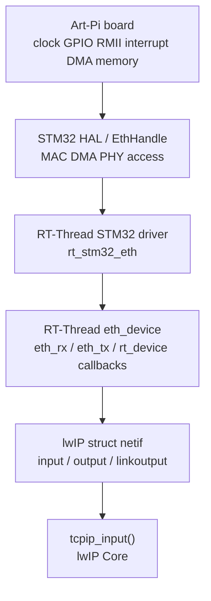
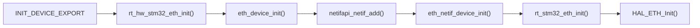
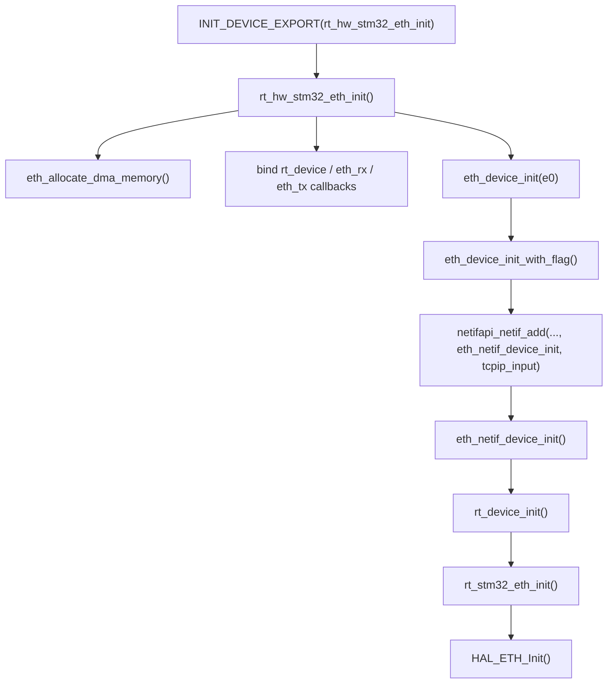
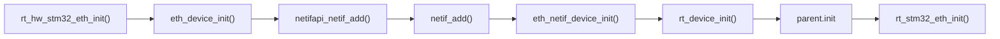
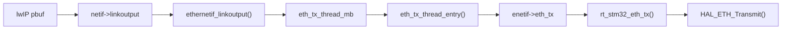
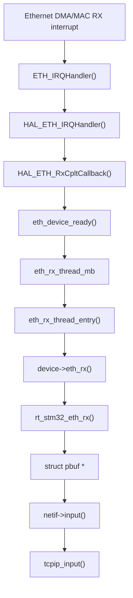
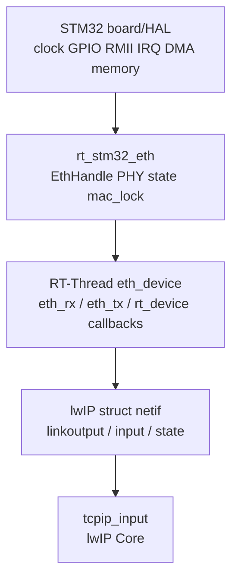

<meta name="referrer" content="no-referrer" />

# 教程 42：从 `rt_hw_stm32_eth_init()` 到 `tcpip_input()`——STM32H750 + RT-Thread + lwIP Ethernet Port

> 摘要：以 STM32H750 Art-Pi 为例，从设备初始化入口连续追踪 eth_device、lwIP netif、HAL ETH、PHY thread 与 RX/TX bridge，建立 MCU Ethernet Port 的真实源码链。

[TOC]

Ethernet Port 是把 lwIP 的网络接口契约真正落到 MCU、RTOS（Real-Time Operating System，实时操作系统）与网卡硬件上的适配层。本文中的 **MAC（Media Access Control，媒体访问控制器）** 位于 STM32H750 内部，负责 Ethernet 帧收发；**DMA（Direct Memory Access，直接内存访问）** 负责在外设与 SRAM 之间搬运 frame；**PHY（Physical Layer Transceiver，物理层收发器）** 使用 LAN8720A，把 MAC 的数字接口转换成网线侧电信号；MAC 与 PHY 通过 **RMII（Reduced Media Independent Interface）** 连接。STM32 **HAL（Hardware Abstraction Layer，硬件抽象层）** 封装具体 MAC/DMA 外设访问，RT-Thread 再用 `rt_device` / `eth_device` 把 Driver 包装成统一设备，lwIP 则通过 `struct netif` 表示网络接口，最终由 `tcpip_input()` 把收到的 `pbuf` 交给 lwIP Core。[S2](#source-s2)[S3](#source-s3)[S8](#source-s8)

本文固定使用 RT-Thread commit `dc8aaa73f2dbea255325ec058a083aeeb5381d0a` 的 STM32H750 Art-Pi + LAN8720A 实现。Stage 42 只回答一个问题：**从 RT-Thread 自动初始化开始，一个具体 STM32 Ethernet Driver 怎样经过 `eth_device`、`netif` 与 RX/TX bridge 接入 lwIP。** 更深的 DMA buffer 生命周期与 cache/zero-copy 数据面留给 Stage 43；网线插拔后的 PHY Link 与 DHCP 恢复留给 Stage 44。

## 阅读源码前：建议提前阅读

1. [RT-Thread Kernel Basics](https://rt-thread.github.io/rt-thread/page_kernel_basics.html)
   - 用途：先理解 `INIT_DEVICE_EXPORT()` 所属的自动初始化阶段，避免把 `rt_hw_stm32_eth_init()` 当成普通应用函数。[S10](#source-s10)
2. [RT-Thread I/O Device Framework](https://rt-thread.github.io/rt-thread/page_device_framework.html)
   - 用途：理解 `rt_device`、Driver callback 与统一设备对象之间的关系；本文不再重写 RT-Thread Device Framework。[S10](#source-s10)
3. [RT-Thread `drv_eth.c`（固定 commit）](https://github.com/RT-Thread/rt-thread/blob/dc8aaa73f2dbea255325ec058a083aeeb5381d0a/bsp/stm32/libraries/HAL_Drivers/drivers/drv_eth.c)
   - 用途：本文具体板级主线源码，建议阅读时始终对照 `rt_hw_stm32_eth_init()`、`rt_stm32_eth_init()`、`rt_stm32_eth_rx()` 与 `rt_stm32_eth_tx()`。[S2](#source-s2)
4. [STM32H742/H743/H750 Reference Manual RM0433](https://www.st.com/resource/en/reference_manual/rm0433-stm32h742-stm32h743753-and-stm32h750-value-line-advanced-armbased-32bit-mcus-stmicroelectronics.pdf)
   - 用途：查 MAC、DMA、RMII 与 descriptor-driven Ethernet 硬件边界；不要求先读完整手册。[S8](#source-s8)

这些资料是加速理解的入口，不是正文的强制前置依赖。下面先把本文反复出现的对象放进同一张图。

## 进入主链前：先把六层对象放在正确位置



这里最容易混淆的是 `eth_device` 与 `netif`。`eth_device` 是 RT-Thread 网络设备包装，负责把具体驱动接入 RTOS 的 RX/TX 线程；`struct netif` 是 lwIP 自己的网络接口对象，保存 IP 层状态以及 `input/output/linkoutput` 函数入口。[S3](#source-s3) `EthHandle` 则属于 STM32 HAL，保存 MAC/DMA 的硬件配置与 descriptor list（DMA 描述符列表，用于记录 buffer 地址和状态）。三者处在不同层次，不能把其中任意一个简称成“网卡对象”。

Stage 42 的真实初始化主线因此可以先读成：



后面的源码会沿这条真实执行顺序展开；RX/TX 只在初始化链建立完成后补齐运行时 bridge，不把数据面细节提前塞进初始化章节。

## 1. 真实入口不是 `HAL_ETH_Init()`，而是 `rt_hw_stm32_eth_init()`

当前 driver 在文件尾通过 `INIT_DEVICE_EXPORT(rt_hw_stm32_eth_init)` 把板级 Ethernet 初始化挂进 RT-Thread device initialization sequence。[S2](#source-s2) 因此源码主线必须先从 `rt_hw_stm32_eth_init()` 开始，而不是从 HAL 中间函数倒推。

第一次阅读时先抓住这条导航链：



`rt_hw_stm32_eth_init()` 本身同时完成资源准备、函数指针装配和 RT-Thread Ethernet device 注册。下面是当前 revision 的连续源码：[S2](#source-s2)

```c
static int rt_hw_stm32_eth_init(void)
{
    rt_err_t state;
    rt_thread_t tid;

#ifdef ETH_RESET_PIN
    reset_pin = rt_pin_get(ETH_RESET_PIN);
    if (reset_pin < 0)
    {
        LOG_E("invalid ETH reset pin: %s", ETH_RESET_PIN);
        return -RT_ERROR;
    }
    rt_pin_mode(reset_pin, PIN_MODE_OUTPUT);
    rt_pin_write(reset_pin, PIN_HIGH);
#endif

    state = eth_allocate_dma_memory();
    if (state != RT_EOK)
    {
        LOG_E("No memory for ETH DMA");
        return state;
    }

    state = rt_mutex_init(&stm32_eth_device.mac_lock, "ethmac", RT_IPC_FLAG_PRIO);
    if (state != RT_EOK)
    {
        LOG_E("initialize MAC mutex failed: %d", state);
        return state;
    }

    stm32_eth_device.ETH_Speed = ETH_SPEED_100M;
    stm32_eth_device.ETH_Mode = ETH_FULLDUPLEX_MODE;
```

这里第一件真正与 DMA 数据面相关的动作是 `eth_allocate_dma_memory()`；mutex 则为后续 RX/TX 与 PHY link reconfiguration 共享 `EthHandle` 建立串行化边界。函数继续初始化 MAC address，并把具体 STM32 driver 的入口装进通用 `eth_device`：[S2](#source-s2)

```c
    /* OUI 00-80-E1 STMICROELECTRONICS. */
    stm32_eth_device.dev_addr[0] = 0x00;
    stm32_eth_device.dev_addr[1] = 0x80;
    stm32_eth_device.dev_addr[2] = 0xE1;
    /* Generate MAC addr from 96-bit unique ID (only for test). */
    stm32_eth_device.dev_addr[3] = *(rt_uint8_t *)(UID_BASE + 4);
    stm32_eth_device.dev_addr[4] = *(rt_uint8_t *)(UID_BASE + 2);
    stm32_eth_device.dev_addr[5] = *(rt_uint8_t *)(UID_BASE + 0);

    stm32_eth_device.parent.parent.init = rt_stm32_eth_init;
    stm32_eth_device.parent.parent.open = rt_stm32_eth_open;
    stm32_eth_device.parent.parent.close = rt_stm32_eth_close;
    stm32_eth_device.parent.parent.read = rt_stm32_eth_read;
    stm32_eth_device.parent.parent.write = rt_stm32_eth_write;
    stm32_eth_device.parent.parent.control = rt_stm32_eth_control;
    stm32_eth_device.parent.parent.user_data = RT_NULL;
    stm32_eth_device.parent.eth_rx = rt_stm32_eth_rx;
    stm32_eth_device.parent.eth_tx = rt_stm32_eth_tx;

    state = eth_device_init(&(stm32_eth_device.parent), "e0");
    if (state != RT_EOK)
    {
        LOG_E("emac device init failed: %d", state);
        return -RT_ERROR;
    }
```

此处必须区分两组 callback：

| 保存位置 | 当前绑定 | 谁会调用 |
| --- | --- | --- |
| `parent.parent.init` | `rt_stm32_eth_init()` | RT-Thread `rt_device_init()` |
| `parent.parent.control` | `rt_stm32_eth_control()` | Port 读取 MAC 等 device control |
| `parent.eth_rx` | `rt_stm32_eth_rx()` | RT-Thread Ethernet RX thread |
| `parent.eth_tx` | `rt_stm32_eth_tx()` | RT-Thread Ethernet TX bridge |

也就是说，`ethernetif.c` 从这里以后不需要知道 STM32 HAL 函数名；它只依赖 `eth_device` contract。[S3](#source-s3)

`rt_hw_stm32_eth_init()` 最后创建 PHY monitor thread，然后返回：[S2](#source-s2)

```c
    tid = rt_thread_create("phy",
                           phy_monitor_thread_entry,
                           RT_NULL,
                           1024,
                           RT_THREAD_PRIORITY_MAX - 2,
                           2);
    if (tid == RT_NULL)
    {
        return -RT_ERROR;
    }

    rt_thread_startup(tid);
    return RT_EOK;
}
```

PHY thread 为什么直到最后才创建，会在硬件 init 与 `eth_device` 注册链走通以后再回来看。

## 2. 进入 `eth_allocate_dma_memory()`：先决定 descriptor 与 RX buffer 放在哪里

`rt_hw_stm32_eth_init()` 第一个子调用是 `eth_allocate_dma_memory()`。Art-Pi 的 H750 分支没有运行时 `calloc`，而是直接把三个全局指针指向板级静态 storage：[S2](#source-s2)

```c
static rt_err_t eth_allocate_dma_memory(void)
{
#ifdef BSP_USING_ETH_H750
    DMARxDscrTab = DMARxDscrTab_Storage;
    DMATxDscrTab = DMATxDscrTab_Storage;
    Rx_Buff = Rx_Buff_Storage;
#else
    DMARxDscrTab = (ETH_DMADescTypeDef *)rt_calloc(ETH_RX_DESC_CNT, sizeof(ETH_DMADescTypeDef));
    DMATxDscrTab = (ETH_DMADescTypeDef *)rt_calloc(ETH_TX_DESC_CNT, sizeof(ETH_DMADescTypeDef));
    Rx_Buff = (rt_uint8_t *)rt_calloc(ETH_RX_BUFFER_CNT, ETH_MAX_PACKET_SIZE);

    if ((DMARxDscrTab == RT_NULL) || (DMATxDscrTab == RT_NULL) || (Rx_Buff == RT_NULL))
    {
        rt_free(DMARxDscrTab);
        rt_free(DMATxDscrTab);
        rt_free(Rx_Buff);
        DMARxDscrTab = RT_NULL;
        DMATxDscrTab = RT_NULL;
        Rx_Buff = RT_NULL;
        return -RT_ENOMEM;
    }
#endif

    return RT_EOK;
}
```

H750 的静态 storage 在 `drv_eth.c` 中被放进专门 section，并显式做 32-byte alignment：[S2](#source-s2)

```c
#elif defined(__GNUC__)
static ETH_DMADescTypeDef DMARxDscrTab_Storage[ETH_RX_DESC_CNT]
        __attribute__((section(".RxDecripSection"), aligned(32)));
static ETH_DMADescTypeDef DMATxDscrTab_Storage[ETH_TX_DESC_CNT]
        __attribute__((section(".TxDecripSection"), aligned(32)));
static rt_uint8_t Rx_Buff_Storage[ETH_RX_BUFFER_CNT * ETH_MAX_PACKET_SIZE]
        __attribute__((section(".RxArraySection"), aligned(32)));
```

对应 linker script 再把 `.RxDecripSection/.TxDecripSection/.RxArraySection` 映射到各自 Ethernet DMA memory region。[S5](#source-s5) 这里先只记住 Port contract：**HAL handle 里保存的 descriptor pointer 必须指向 DMA 可访问且 cache policy 明确的内存。** 为什么 Art-Pi 把该区域设为 non-cacheable，以及 TX payload 为什么仍需要 clean，留到 Stage 43 跟一帧数据时解释。

`eth_allocate_dma_memory()` 返回后，执行重新回到 `rt_hw_stm32_eth_init()`；随后完成上面的 callback 绑定并调用 `eth_device_init()`。

## 3. 进入 `eth_device_init()`：STM32 driver 第一次切到通用 RT-Thread lwIP Port

`eth_device_init()` 位于 `components/net/lwip/port/ethernetif.c`。它只决定这个 Ethernet interface 的 lwIP flags，然后进入 `eth_device_init_with_flag()`：[S3](#source-s3)

```c
rt_err_t eth_device_init(struct eth_device * dev, const char *name)
{
    rt_uint16_t flags = NETIF_FLAG_BROADCAST | NETIF_FLAG_ETHARP;

#if LWIP_IGMP
    /* IGMP support */
    flags |= NETIF_FLAG_IGMP;
#endif

    return eth_device_init_with_flag(dev, name, flags);
}
```

这里的 `dev` 就是刚才的 `&stm32_eth_device.parent`。进入 `eth_device_init_with_flag()` 后，Port 创建 lwIP `struct netif`、把它存回 `dev->netif`，然后把 `eth_device` 注册为 RT-Thread 网络设备：[S3](#source-s3)

```c
rt_err_t eth_device_init_with_flag(struct eth_device *dev, const char *name, rt_uint16_t flags)
{
    struct netif* netif;
#if LWIP_NETIF_HOSTNAME
    char *hostname = RT_NULL;
    netif = (struct netif*) rt_calloc (1, sizeof(struct netif) + LWIP_HOSTNAME_LEN);
#else
    netif = (struct netif*) rt_calloc (1, sizeof(struct netif));
#endif
    if (netif == RT_NULL)
    {
        rt_kprintf("malloc netif failed\n");
        return -RT_ERROR;
    }

    rt_spin_lock_init(&(dev->spinlock));
    /* set netif */
    dev->netif = netif;
    dev->flags = flags;
    /* link changed status of device */
    dev->link_changed = 0x00;
    /* avoid send the same mail to mailbox */
    dev->rx_notice = 0x00;
    dev->parent.type = RT_Device_Class_NetIf;
    /* register to RT-Thread device manager */
    rt_device_register(&(dev->parent), name, RT_DEVICE_FLAG_RDWR);
```

到这里出现了第一组双向关联：

```text
stm32_eth_device.parent  -> dev->netif -> struct netif
struct netif->state      -> 稍后重新指回这个 eth_device
```

继续阅读 `eth_device_init_with_flag()`，函数接着建立真正与 lwIP 数据路径有关的字段：[S3](#source-s3)

```c
    /* set name */
    rt_strncpy(netif->name, name, NETIF_NAMESIZE);

    /* set hw address to 6 */
    netif->hwaddr_len   = 6;
    /* maximum transfer unit */
    netif->mtu          = ETHERNET_MTU;

    /* set linkoutput */
    netif->linkoutput   = ethernetif_linkoutput;

    /* get hardware MAC address */
    rt_device_control(&(dev->parent), NIOCTL_GADDR, netif->hwaddr);
```

`NIOCTL_GADDR` 会通过刚才绑定的 `parent.parent.control` 回到 STM32 driver 的 `rt_stm32_eth_control()`；当前实现只在该命令下复制 `stm32_eth_device.dev_addr`：[S2](#source-s2)

```c
static rt_err_t rt_stm32_eth_control(rt_device_t dev, int cmd, void *args)
{
    RT_UNUSED(dev);

    switch (cmd)
    {
    case NIOCTL_GADDR:
        if (args != RT_NULL)
        {
            rt_memcpy(args, stm32_eth_device.dev_addr, MAX_ADDR_LEN);
        }
        else
        {
            return -RT_ERROR;
        }
        break;

    default:
        break;
    }

    return RT_EOK;
}
```

这条小回路说明 `struct netif` 中的 MAC 并不是 `ethernetif.c` 自己生成的，而是通过 RT-Thread device control contract 从具体 driver 读取。

## 4. `netifapi_netif_add()` 把 `eth_device`、init callback 和 `tcpip_input` 一次绑定进去

继续阅读 `eth_device_init_with_flag()`。当 `tcpip` thread 已经启动时，函数构造初始 IPv4 参数，并调用 `netifapi_netif_add()`：[S3](#source-s3)

```c
    /* if tcp thread has been started up, we add this netif to the system */
    if (rt_thread_find("tcpip") != RT_NULL)
    {
#if LWIP_VERSION_MAJOR == 1U /* v1.x */
        struct ip_addr ipaddr, netmask, gw;
#else /* >= v2.x */
        ip4_addr_t ipaddr, netmask, gw;
#endif /* LWIP_VERSION_MAJOR == 1U */

#if !LWIP_DHCP
        ipaddr.addr = inet_addr(RT_LWIP_IPADDR);
        gw.addr = inet_addr(RT_LWIP_GWADDR);
        netmask.addr = inet_addr(RT_LWIP_MSKADDR);
#else
        IP4_ADDR(&ipaddr, 0, 0, 0, 0);
        IP4_ADDR(&gw, 0, 0, 0, 0);
        IP4_ADDR(&netmask, 0, 0, 0, 0);
#endif
        netifapi_netif_add(netif, &ipaddr, &netmask, &gw, dev, eth_netif_device_init, tcpip_input);
    }

    return RT_EOK;
}
```

这一个 call site 同时把三件事交给 lwIP：

- `state = dev`：以后 `netif->state` 能找回 RT-Thread `eth_device`；
- `init = eth_netif_device_init`：`netif_add()` 时回调 RT-Thread Port 完成 device 初始化；
- `input = tcpip_input`：RX thread 拿到完整 `pbuf` 后，`netif->input()` 最终把 packet 交给 lwIP Core thread。

Stage 39 已经解释过 `netifapi_netif_add()` 到 `tcpip_thread` 的 mailbox bridge，本篇不重复展开 Core；这里只保留“这些 callback 是在哪里绑定进去的”这一事实。

## 5. `eth_netif_device_init()` 反向调用 `rt_device_init()`，再回到 STM32 driver

`netifapi_netif_add()` 在 lwIP Core context 执行 `netif_add()`，后者会调用刚才传入的 init callback `eth_netif_device_init()`。下面进入该函数。[S3](#source-s3)

```c
static err_t eth_netif_device_init(struct netif *netif)
{
    struct eth_device *ethif;

    ethif = (struct eth_device*)netif->state;
    if (ethif != RT_NULL)
    {
        rt_device_t device;

#ifdef RT_USING_NETDEV
        /* network interface device register */
        netdev_add(netif);
#endif /* RT_USING_NETDEV */

        /* get device object */
        device = (rt_device_t) ethif;
        if (rt_device_init(device) != RT_EOK)
        {
            return ERR_IF;
        }
        if (rt_device_open(device, RT_DEVICE_FLAG_RDWR) != RT_EOK)
        {
            return ERR_IF;
        }
```

`rt_device_init(device)` 会根据 `rt_hw_stm32_eth_init()` 里已经保存的 `parent.parent.init` 调用 `rt_stm32_eth_init()`。这就是此前最容易被架构图掩盖的反向桥接：



也就是说，**先建立 RT-Thread device ↔ lwIP netif 关系，再由 netif init callback 触发真正的 STM32 hardware init。**

`rt_device_init()`/`open()` 返回后，继续阅读 `eth_netif_device_init()`：Port 设置 lwIP output、default/up，并按配置启动 DHCP。[S3](#source-s3)

```c
        /* copy device flags to netif flags */
        netif->flags = (ethif->flags & 0xff);
        netif->mtu = ETHERNET_MTU;

        /* set output */
        netif->output       = etharp_output;

#if LWIP_IPV6
        netif->output_ip6 = ethip6_output;
        netif->ip6_autoconfig_enabled = 1;
        netif_create_ip6_linklocal_address(netif, 1);
#endif /* LWIP_IPV6 */

        /* set default netif */
        if (netif_default == RT_NULL)
            netif_set_default(netif);

        /* set interface up */
        netif_set_up(netif);

#if LWIP_DHCP
        /* if this interface uses DHCP, start the DHCP client */
        dhcp_start(netif);
#endif
```

这里的 `netif_set_up()` 是 administratively up；PHY cable 是否真正 Link Up 是另一条状态线，后面由 PHY monitor thread 通过 `eth_device_linkchange()` 推进。Stage 22 已经解释二者区别，本篇只指出当前代码位置。

## 6. 进入 `rt_stm32_eth_init()`：HAL handle 的输入全部在这里准备

现在回到 `rt_device_init()` 通过函数指针调用的 `rt_stm32_eth_init()`。该函数先准备 PHY，再把 MAC address、RMII mode、TX/RX descriptor pointer 和 RX buffer length 填入 `EthHandle.Init`：[S2](#source-s2)

```c
static rt_err_t rt_stm32_eth_init(rt_device_t dev)
{
    rt_err_t status;

    RT_UNUSED(dev);

#ifdef BSP_USING_ETH_H750
    __HAL_RCC_D2SRAM3_CLK_ENABLE();
#endif

    phy_hardware_reset();

    EthHandle.Instance = ETH;
    EthHandle.Init.MACAddr = (rt_uint8_t *)&stm32_eth_device.dev_addr[0];
    EthHandle.Init.MediaInterface = HAL_ETH_RMII_MODE;
    EthHandle.Init.TxDesc = DMATxDscrTab;
    EthHandle.Init.RxDesc = DMARxDscrTab;
    EthHandle.Init.RxBuffLen = ETH_MAX_PACKET_SIZE;

    HAL_ETH_DeInit(&EthHandle);
    rt_memset(Rx_Buff_Info, 0, sizeof(Rx_Buff_Info));
    rx_alloc_index = 0;
    phy_addr = PHY_INVALID_ADDR;
    stm32_eth_device.phy_state = PHY_STATE_UNKNOWN;
    stm32_eth_device.mac_started = RT_FALSE;

    if (HAL_ETH_Init(&EthHandle) != HAL_OK)
    {
        LOG_E("eth hardware init failed");
        return -RT_ERROR;
    }
```

因此 `HAL_ETH_Init()` 并不是凭空“知道” descriptor 在哪里。它消费的是 `eth_allocate_dma_memory()` 和 `rt_stm32_eth_init()` 前面已经确定的 pointer/config。

HAL 初始化成功后，driver 再建立 TX packet policy、MDIO clock range，并寻找 PHY、启动 auto-negotiation：[S2](#source-s2)

```c
    rt_memset(&TxConfig, 0, sizeof(TxConfig));
    TxConfig.Attributes = ETH_TX_PACKETS_FEATURES_CRCPAD;
    TxConfig.CRCPadCtrl = ETH_CRC_PAD_INSERT;
#ifdef RT_LWIP_USING_HW_CHECKSUM
    TxConfig.Attributes |= ETH_TX_PACKETS_FEATURES_CSUM;
    TxConfig.ChecksumCtrl = ETH_CHECKSUM_IPHDR_PAYLOAD_INSERT_PHDR_CALC;
#else
    TxConfig.ChecksumCtrl = ETH_CHECKSUM_DISABLE;
#endif

    HAL_ETH_SetMDIOClockRange(&EthHandle);

    status = phy_find();
    if (status != RT_EOK)
    {
        return status;
    }

    status = phy_start_auto_negotiation();
    if (status != RT_EOK)
    {
        LOG_E("PHY auto negotiation failed: %d", status);
        return status;
    }

    HAL_NVIC_EnableIRQ(ETH_IRQn);

    LOG_D("eth hardware init success");
    return RT_EOK;
}
```

注意这里仍然没有宣布 Link Up。`HAL_ETH_Init()` 只把 MAC/DMA/RMII 与 descriptor infrastructure 初始化到可用状态；PHY negotiation 的结果稍后由 PHY thread 监控。

## 7. `HAL_ETH_Init()` 会调用 `HAL_ETH_MspInit()`：GPIO、Clock、NVIC 在这里落到板级

进入 ST HAL `HAL_ETH_Init()` 后，当 `heth->gState == HAL_ETH_STATE_RESET` 时，HAL 首先调用 MSP init callback；未启用动态 callback registration 时就是板级 `HAL_ETH_MspInit()`。[S7](#source-s7)

```c
  if (heth->gState == HAL_ETH_STATE_RESET)
  {
    heth->gState = HAL_ETH_STATE_BUSY;

#if (USE_HAL_ETH_REGISTER_CALLBACKS == 1)

    ETH_InitCallbacksToDefault(heth);

    if (heth->MspInitCallback == NULL)
    {
      heth->MspInitCallback = HAL_ETH_MspInit;
    }

    /* Init the low level hardware */
    heth->MspInitCallback(heth);
#else
    /* Init the low level hardware : GPIO, CLOCK, NVIC. */
    HAL_ETH_MspInit(heth);

#endif /* (USE_HAL_ETH_REGISTER_CALLBACKS) */
  }
```

Art-Pi 的 `HAL_ETH_MspInit()` 打开 ETH MAC/TX/RX 和 GPIO clocks，并把 PG/PC/PA 上的 RMII signals 配成 `GPIO_AF11_ETH`。[S6](#source-s6)

```c
void HAL_ETH_MspInit(ETH_HandleTypeDef* heth)
{
  GPIO_InitTypeDef GPIO_InitStruct = {0};
  if(heth->Instance==ETH)
  {
    /* Peripheral clock enable */
    __HAL_RCC_ETH1MAC_CLK_ENABLE();
    __HAL_RCC_ETH1TX_CLK_ENABLE();
    __HAL_RCC_ETH1RX_CLK_ENABLE();

    __HAL_RCC_GPIOG_CLK_ENABLE();
    __HAL_RCC_GPIOC_CLK_ENABLE();
    __HAL_RCC_GPIOA_CLK_ENABLE();
    /**ETH GPIO Configuration
    PG11     ------> ETH_TX_EN
    PG14     ------> ETH_TXD1
    PG13     ------> ETH_TXD0
    PC1     ------> ETH_MDC
    PA2     ------> ETH_MDIO
    PA1     ------> ETH_REF_CLK
    PA7     ------> ETH_CRS_DV
    PC4     ------> ETH_RXD0
    PC5     ------> ETH_RXD1
    */
```

继续阅读同一个 `HAL_ETH_MspInit()`，三个 GPIO group 最终都使用 `GPIO_AF11_ETH`，然后配置 ETH IRQ：[S6](#source-s6)

```c
    /* ETH interrupt Init */
    HAL_NVIC_SetPriority(ETH_IRQn, 0, 0);
    HAL_NVIC_EnableIRQ(ETH_IRQn);
  }
}
```

这个 callback 是 **board MSP implementation**，不是 lwIP Core requirement。换成别的 STM32H7 board 时，GPIO pin、clock source、reset wiring 和 NVIC priority 都可能不同，但 `HAL_ETH_Init()` 需要有人完成 low-level resource initialization 这一 contract 不变。

## 8. 回到 `HAL_ETH_Init()`：MAC/DMA 与 descriptor list 在这里建立

`HAL_ETH_MspInit()` 返回以后，`HAL_ETH_Init()` 根据 `MediaInterface` 选择 MII/RMII，执行 software reset，再配置 MAC/DMA。[S7](#source-s7)

```c
  __HAL_RCC_SYSCFG_CLK_ENABLE();

  if (heth->Init.MediaInterface == HAL_ETH_MII_MODE)
  {
    HAL_SYSCFG_ETHInterfaceSelect(SYSCFG_ETH_MII);
  }
  else
  {
    HAL_SYSCFG_ETHInterfaceSelect(SYSCFG_ETH_RMII);
  }

  /* Dummy read to sync with ETH */
  (void)SYSCFG->PMCR;

  /* Ethernet Software reset */
  /* Set the SWR bit: resets all MAC subsystem internal registers and logic */
  /* After reset all the registers holds their respective reset values */
  SET_BIT(heth->Instance->DMAMR, ETH_DMAMR_SWR);
```

software reset 完成以后，继续阅读 `HAL_ETH_Init()`：函数设置 RX buffer length，并初始化 TX/RX descriptor list：[S7](#source-s7)

```c
  /* Set Receive Buffers Length (must be a multiple of 4) */
  if ((heth->Init.RxBuffLen % 0x4U) != 0x0U)
  {
    /* Set Error Code */
    heth->ErrorCode = HAL_ETH_ERROR_PARAM;
    /* Set State as Error */
    heth->gState = HAL_ETH_STATE_ERROR;
    /* Return Error */
    return HAL_ERROR;
  }
  else
  {
    MODIFY_REG(heth->Instance->DMACRCR, ETH_DMACRCR_RBSZ, ((heth->Init.RxBuffLen) << 1));
  }

  /*------------------ DMA Tx Descriptors Configuration ----------------------*/
  ETH_DMATxDescListInit(heth);

  /*------------------ DMA Rx Descriptors Configuration ----------------------*/
  ETH_DMARxDescListInit(heth);
```

至此 Stage 42 只需要知道 descriptor ring 已建立；STM32H7 Ethernet DMA 本身采用 descriptor-driven 方式组织 RX/TX，OWN bit、buffer replenish 与 tail pointer 的运行时语义在 Stage 43 继续下钻。[S8](#source-s8)

`HAL_ETH_Init()` 返回 `HAL_OK` 后，执行回到 `rt_stm32_eth_init()`，完成 PHY discovery/auto-negotiation，然后返回 `rt_device_init()`，再回到 `eth_netif_device_init()`。初始化主链到这里已经闭合。

## 9. PHY monitor thread 为什么在 `eth_device_init()` 之后才启动

回到最初的 `rt_hw_stm32_eth_init()`。`eth_device_init()` 成功以后才创建 `phy_monitor_thread_entry()`，意味着 PHY 状态变化发生时 `stm32_eth_device.parent` 已经有对应 `netif`。[S2](#source-s2)

当前默认轮询路径非常直接：[S2](#source-s2)

```c
#else
    while (1)
    {
        phy_linkchange();
        rt_thread_mdelay(1000);
    }
#endif /* PHY_USING_INTERRUPT_MODE */
```

若启用 PHY interrupt mode，则同一个 thread 等 semaphore，读取 PHY interrupt status 后仍进入 `phy_linkchange()`。也就是说，中断/轮询只决定“什么时候检查”，真正的 Link 状态决策统一在 `phy_linkchange()`。

当新状态为 Link Up 时，`phy_linkchange()` 根据 PHY status 计算 speed/duplex，先调用 `eth_mac_configure_and_start()`，成功以后再通知 RT-Thread Ethernet device：[S2](#source-s2)

```c
        if (eth_mac_configure_and_start(speed, duplex) != RT_EOK)
        {
            stm32_eth_device.phy_state = PHY_STATE_UNKNOWN;
            if (stm32_eth_device.parent.link_status)
            {
                eth_device_linkchange(&stm32_eth_device.parent, RT_FALSE);
            }
            LOG_E("configure and start MAC failed");
            return;
        }

        stm32_eth_device.ETH_Speed = speed;
        stm32_eth_device.ETH_Mode = duplex;
        stm32_eth_device.phy_state = phy_state_new;
        LOG_I("link up, %sMbps, %s-duplex",
              speed == ETH_SPEED_100M ? "100" : "10",
              duplex == ETH_FULLDUPLEX_MODE ? "full" : "half");

        if (!stm32_eth_device.parent.link_status)
        {
            eth_device_linkchange(&stm32_eth_device.parent, RT_TRUE);
        }
```

因此“HAL init success”和“network link up”是不同时间点：前者说明 MAC/DMA 初始化完成，后者还要求 PHY negotiation 和 MAC start 成功。

## 10. TX 入口：`netif->linkoutput` 怎样回到 STM32 `rt_stm32_eth_tx()`

初始化完成后，lwIP 的 Ethernet frame 发送边界是 `netif->linkoutput`。它在 `eth_device_init_with_flag()` 中已经绑定为 `ethernetif_linkoutput()`。

默认未定义 `LWIP_NO_TX_THREAD` 时，`ethernetif_linkoutput()` 不直接调用 driver，而是把 `netif + pbuf` 发送到 `eth_tx_thread_mb`，并等待 completion：[S3](#source-s3)

```c
static err_t ethernetif_linkoutput(struct netif *netif, struct pbuf *p)
{
#ifndef LWIP_NO_TX_THREAD
    struct eth_tx_msg msg;

    RT_ASSERT(netif != RT_NULL);

    /* send a message to eth tx thread */
    msg.netif = netif;
    msg.buf   = p;
    rt_completion_init(&msg.ack);
    if (rt_mb_send(&eth_tx_thread_mb, (rt_ubase_t) &msg) == RT_EOK)
    {
        /* waiting for ack */
        rt_completion_wait(&msg.ack, RT_WAITING_FOREVER);
    }
```

TX thread 收到 `eth_tx_msg` 后，从 `msg->netif->state` 找回 `eth_device`，再通过先前绑定的 `eth_tx` 函数指针进入 `rt_stm32_eth_tx()`：[S3](#source-s3)

```c
static void eth_tx_thread_entry(void* parameter)
{
    struct eth_tx_msg* msg;

    while (1)
    {
        if (rt_mb_recv(&eth_tx_thread_mb, (rt_ubase_t *)&msg, RT_WAITING_FOREVER) == RT_EOK)
        {
            struct eth_device* enetif;

            RT_ASSERT(msg->netif != RT_NULL);
            RT_ASSERT(msg->buf   != RT_NULL);

            enetif = (struct eth_device*)msg->netif->state;
            if (enetif != RT_NULL)
            {
                /* call driver's interface */
                if (enetif->eth_tx(&(enetif->parent), msg->buf) != RT_EOK)
                {
                    /* transmit eth packet failed */
                }
            }

            /* send ACK */
            rt_completion_done(&msg->ack);
        }
    }
}
```

此处形成完整调用链：



`rt_stm32_eth_tx()` 如何把 pbuf chain 映射到 HAL TX buffers、如何 clean cache、HAL 又何时把 descriptor OWN 交给 DMA，全部留到 Stage 43 连续展开。

## 11. RX 入口：`ETH_IRQHandler()` 怎样最终到达 `tcpip_input()`

RX 方向的触发源不是 `rt_stm32_eth_rx()`，而是 Ethernet IRQ。具体 STM32 ISR 只包住 HAL handler：[S2](#source-s2)

```c
void ETH_IRQHandler(void)
{
    rt_interrupt_enter();
    HAL_ETH_IRQHandler(&EthHandle);
    rt_interrupt_leave();
}
```

当 HAL 检测到 RX complete 时，最终进入 driver 提供的 `HAL_ETH_RxCpltCallback()`。该 callback 不在 ISR 中解析 packet，只通知 RT-Thread Ethernet layer：[S2](#source-s2)

```c
void HAL_ETH_RxCpltCallback(ETH_HandleTypeDef *heth)
{
    rt_err_t result;

    RT_UNUSED(heth);
    result = eth_device_ready(&(stm32_eth_device.parent));
    if (result != RT_EOK)
    {
        LOG_I("RxCpltCallback err = %d", result);
    }
}
```

进入 `eth_device_ready()` 后，Port 用 `rx_notice` 防止同一 device 重复塞 mailbox，然后发送 `eth_device *` 给 RX thread：[S3](#source-s3)

```c
rt_err_t eth_device_ready(struct eth_device* dev)
{
    if (dev->netif)
    {
        if(dev->rx_notice == RT_FALSE)
        {
            dev->rx_notice = RT_TRUE;
            return rt_mb_send(&eth_rx_thread_mb, (rt_ubase_t)dev);
        }
        else
            return RT_EOK;
        /* post message to Ethernet thread */
    }
    else
        return -RT_ERROR; /* netif is not initialized yet, just return. */
}
```

RX thread 醒来后先处理 link-change，再反复调用 `device->eth_rx()` 直到 driver 返回 `NULL`。当前 STM32 绑定使这里实际进入 `rt_stm32_eth_rx()`：[S3](#source-s3)

```c
            /* receive all of buffer */
            while (1)
            {
                if(device->eth_rx == RT_NULL) break;

                p = device->eth_rx(&(device->parent));
                if (p != RT_NULL)
                {
                    /* notify to upper layer */
                    if( device->netif->input(p, device->netif) != ERR_OK )
                    {
                        LWIP_DEBUGF(NETIF_DEBUG, ("ethernetif_input: Input error\n"));
                        pbuf_free(p);
                        p = NULL;
                    }
                }
                else break;
            }
```

`device->netif->input` 在 `netifapi_netif_add(..., tcpip_input)` 时已经绑定，所以 `rt_stm32_eth_rx()` 返回一个完整 pbuf 后，当前 packet 的下一跳就是 `tcpip_input()`。这就是本篇标题最后一个函数并不是凭空出现的原因。

完整 RX bridge 为：



Stage 43 会从同一个 `ETH_IRQHandler()` 重新进入，但不再停在软件 bridge，而是继续下钻到 RX descriptor、buffer callback、cache maintenance 和 pbuf copy。

## 12. Build 配置为什么能让这条源码链真正存在

运行时主链已经闭合后，再回头看 build 选择就不会把 Kconfig 当成第二条主叙事。

Art-Pi Industry-IO Ethernet 选项会选择 `BSP_USING_ETH`、`PHY_USING_LAN8720A` 和 `BSP_USING_ETH_H750`；`BSP_USING_ETH_H750` 本身再 `select RT_USING_LWIP`。[S1](#source-s1)

HAL Drivers `SConscript` 只有在支持新 HAL ETH API 的 STM32 family、lwIP 与 Ethernet BSP feature 同时成立时才把 `drv_eth.c` 加入 build：[S4](#source-s4)

```python
eth_new_hal_soc = (GetDepend(['SOC_SERIES_STM32F4']) or
                   GetDepend(['SOC_SERIES_STM32F7']) or
                   GetDepend(['SOC_SERIES_STM32H7']))
if (eth_new_hal_soc and GetDepend(['RT_USING_LWIP']) and
        (GetDepend(['BSP_USING_ETH']) or GetDepend(['BSP_USING_ETH_H750']))):
    src += ['drv_eth.c']
```

所以本文这条调用链不是“任意 STM32 工程都会自动存在”；它属于当前 RT-Thread BSP configuration + HAL driver + lwIP Port 的具体实现组合。

## 13. Art-Pi 的 MPU 配置是 Stage 43 数据面的前置条件

Art-Pi 的 `mpu_init()` 在 `BSP_USING_ETH_H750` 下把 `0x30040000` 起 32 KB region 设置为 non-cacheable、shareable：[S5](#source-s5)

```c
#ifdef BSP_USING_ETH_H750
    /* Configure the MPU attributes as Device not cacheable
       for ETH DMA descriptors and RX Buffers*/
    MPU_InitStruct.Enable = MPU_REGION_ENABLE;
    MPU_InitStruct.BaseAddress = 0x30040000;
    MPU_InitStruct.Size = MPU_REGION_SIZE_32KB;
    MPU_InitStruct.AccessPermission = MPU_REGION_FULL_ACCESS;
    MPU_InitStruct.IsBufferable = MPU_ACCESS_NOT_BUFFERABLE;
    MPU_InitStruct.IsCacheable = MPU_ACCESS_NOT_CACHEABLE;
    MPU_InitStruct.IsShareable = MPU_ACCESS_SHAREABLE;
    MPU_InitStruct.Number = MPU_REGION_NUMBER2;
    MPU_InitStruct.TypeExtField = MPU_TEX_LEVEL1;
    MPU_InitStruct.SubRegionDisable = 0x00;
    MPU_InitStruct.DisableExec = MPU_INSTRUCTION_ACCESS_ENABLE;

    HAL_MPU_ConfigRegion(&MPU_InitStruct);
#endif
```

这段配置解释了为什么 Art-Pi 能把 descriptor 与 RX DMA buffer 放进固定 D2 SRAM，同时又可以在其他 memory region 开启 Cortex-M7 D-Cache。它不是所有 STM32 Ethernet Port 的强制写法，而是当前 board 为满足 CPU/DMA coherency 采用的实现策略。[S5](#source-s5)[S9](#source-s9)

## 14. Stage 42 最终建立的四层对象关系

到这里可以把初始化阶段出现的对象按职责重新串起来：



其中不能混淆的几个边界是：

| 层次 | 主要对象 | 当前职责 |
| --- | --- | --- |
| STM32 board/HAL | `EthHandle`、GPIO、IRQ、descriptor memory | 驱动 MAC/DMA/RMII 硬件 |
| STM32 RT-Thread driver | `struct rt_stm32_eth` | 保存 MAC/PHY state，并实现具体 RX/TX callback |
| RT-Thread Ethernet Port | `struct eth_device` | 把具体 driver 包装成通用网络设备并提供 RX/TX thread bridge |
| lwIP | `struct netif` | 保存网络接口状态和 `input/output/linkoutput` contract |

初始化主链到这里已经闭环；再继续下钻 descriptor OWN、cache line 与 pbuf lifetime 会切换成“单帧数据面”问题，因此放入 Stage 43。

## 资料来源

<a id="source-s1"></a>
### [S1] RT-Thread STM32H750 Art-Pi Kconfig
- 类型：RT-Thread 官方仓库源码
- 版本：commit `dc8aaa73f2dbea255325ec058a083aeeb5381d0a`，2026-09-28
- 定位：`bsp/stm32/stm32h750-artpi/board/Kconfig`：`INDUSTRY_IO_USING_ETH`、`BSP_USING_ETH_H750`、`PHY_USING_LAN8720A`
- URL/文档：[Art-Pi board Kconfig](https://github.com/RT-Thread/rt-thread/blob/dc8aaa73f2dbea255325ec058a083aeeb5381d0a/bsp/stm32/stm32h750-artpi/board/Kconfig)
- 使用位置：“build feature 入口”
- 支撑内容：证明 H750 + LAN8720A board configuration 与 `RT_USING_LWIP` 依赖关系

<a id="source-s2"></a>
### [S2] RT-Thread STM32 HAL Ethernet Driver
- 类型：RT-Thread 官方仓库源码
- 版本：同上
- 定位：`bsp/stm32/libraries/HAL_Drivers/drivers/drv_eth.c`：`rt_hw_stm32_eth_init()`、`eth_allocate_dma_memory()`、`rt_stm32_eth_init()`、`rt_stm32_eth_tx()`、`rt_stm32_eth_rx()`、`ETH_IRQHandler()`、PHY monitor
- URL/文档：[RT-Thread drv_eth.c](https://github.com/RT-Thread/rt-thread/blob/dc8aaa73f2dbea255325ec058a083aeeb5381d0a/bsp/stm32/libraries/HAL_Drivers/drivers/drv_eth.c)
- 使用位置：Stage 42 主调用链
- 支撑内容：具体 STM32 driver 怎样建立 `eth_device` callbacks、初始化 HAL/PHY 并连接 RX/TX 数据路径

<a id="source-s3"></a>
### [S3] RT-Thread lwIP Ethernet Port
- 类型：RT-Thread 官方仓库源码
- 版本：同上
- 定位：`components/net/lwip/port/ethernetif.c`：`eth_device_init()`、`eth_device_init_with_flag()`、`eth_netif_device_init()`、`ethernetif_linkoutput()`、`eth_rx_thread_entry()`、`eth_tx_thread_entry()`、`eth_device_ready()`
- URL/文档：[RT-Thread ethernetif.c](https://github.com/RT-Thread/rt-thread/blob/dc8aaa73f2dbea255325ec058a083aeeb5381d0a/components/net/lwip/port/ethernetif.c)
- 使用位置：“eth_device → netif”“RX/TX thread bridge”“tcpip_input”
- 支撑内容：证明具体 STM32 driver 与通用 RT-Thread/lwIP Port 的接口边界

<a id="source-s4"></a>
### [S4] RT-Thread STM32 HAL Drivers SConscript
- 类型：RT-Thread 官方构建脚本
- 版本：同上
- 定位：`bsp/stm32/libraries/HAL_Drivers/drivers/SConscript`：`eth_new_hal_soc` 与 `drv_eth.c` source selection
- URL/文档：[HAL Drivers SConscript](https://github.com/RT-Thread/rt-thread/blob/dc8aaa73f2dbea255325ec058a083aeeb5381d0a/bsp/stm32/libraries/HAL_Drivers/drivers/SConscript)
- 使用位置：“`drv_eth.c` 的编译条件”
- 支撑内容：说明当前 Ethernet driver 需要支持的新 HAL SoC、lwIP 与 BSP ETH feature 同时满足

<a id="source-s5"></a>
### [S5] Art-Pi linker script 与 MPU configuration
- 类型：RT-Thread 官方板级源码
- 版本：同上
- 定位：`board/linker_scripts/link.lds` 的 `.RxDecripSection/.TxDecripSection/.RxArraySection`；`board/port/drv_mpu.c` 的 Ethernet DMA region
- URL/文档：[Art-Pi link.lds](https://github.com/RT-Thread/rt-thread/blob/dc8aaa73f2dbea255325ec058a083aeeb5381d0a/bsp/stm32/stm32h750-artpi/board/linker_scripts/link.lds)、[Art-Pi drv_mpu.c](https://github.com/RT-Thread/rt-thread/blob/dc8aaa73f2dbea255325ec058a083aeeb5381d0a/bsp/stm32/stm32h750-artpi/board/port/drv_mpu.c)
- 使用位置：“DMA memory allocation”“Stage 43 cache 前置条件”
- 支撑内容：证明 ETH descriptor/RX buffer 固定在专门 SRAM region，并配置为 non-cacheable/shareable

<a id="source-s6"></a>
### [S6] Art-Pi CubeMX ETH MSP configuration
- 类型：RT-Thread 官方板级 CubeMX 生成源码
- 版本：同上
- 定位：`board/CubeMX_Config/Core/Src/stm32h7xx_hal_msp.c`：`HAL_ETH_MspInit()`
- URL/文档：[Art-Pi stm32h7xx_hal_msp.c](https://github.com/RT-Thread/rt-thread/blob/dc8aaa73f2dbea255325ec058a083aeeb5381d0a/bsp/stm32/stm32h750-artpi/board/CubeMX_Config/Core/Src/stm32h7xx_hal_msp.c)
- 使用位置：“RMII clocks/GPIO/NVIC”
- 支撑内容：证明当前 Art-Pi 实际使用的 ETH pins、RMII signals 与 interrupt 初始化

<a id="source-s7"></a>
### [S7] STMicroelectronics STM32H7 HAL ETH Driver
- 类型：ST 官方 HAL 源码
- 版本：commit `7e541d92019e18f98d211fc4ab9197ec8e8105f6`，2026-09-29
- 定位：`Src/stm32h7xx_hal_eth.c`：`HAL_ETH_Init()`、descriptor-list initialization
- URL/文档：[STM32H7 HAL ETH source](https://github.com/STMicroelectronics/stm32h7xx-hal-driver/blob/7e541d92019e18f98d211fc4ab9197ec8e8105f6/Src/stm32h7xx_hal_eth.c)
- 使用位置：“HAL 初始化职责”“descriptor list 建立”
- 支撑内容：解释 RT-Thread driver 调用的 HAL init 在 MAC/DMA lifecycle 中承担的职责

<a id="source-s8"></a>
### [S8] STM32H742/H743/H750 Reference Manual RM0433
- 类型：ST 官方参考手册
- 版本：RM0433 Rev 8
- URL/文档：[RM0433](https://www.st.com/resource/en/reference_manual/rm0433-stm32h742-stm32h743753-and-stm32h750-value-line-advanced-armbased-32bit-mcus-stmicroelectronics.pdf)
- 使用位置：“STM32 Ethernet MAC/DMA/RMII 硬件边界”
- 支撑内容：说明 ETH peripheral 的 MAC、DMA、MII/RMII 与 descriptor-driven DMA 模型

<a id="source-s9"></a>
### [S9] ST AN4839 — Level 1 cache on STM32F7/H7
- 类型：ST 官方 Application Note
- 版本：AN4839 Rev 2
- URL/文档：[AN4839](https://www.st.com/resource/en/application_note/an4839-level-1-cache-on-stm32f7-series-and-stm32h7-series-stmicroelectronics.pdf)
- 使用位置：“DMA shared memory 的 cache coherency 背景”
- 支撑内容：说明 Cortex-M7 CPU cache 与 DMA 共享 cacheable SRAM 时的一致性问题及常见处理方向


<a id="source-s10"></a>
### [S10] RT-Thread Kernel Basics 与 I/O Device Framework
- 类型：RT-Thread 官方在线文档
- 版本：访问日期 2026-10-03；用于通用 RT-Thread framework 导读
- URL/文档：[Kernel Basics](https://rt-thread.github.io/rt-thread/page_kernel_basics.html)、[I/O Device Framework](https://rt-thread.github.io/rt-thread/page_device_framework.html)
- 使用位置：“阅读源码前”“INIT_DEVICE_EXPORT 与 rt_device contract 背景”
- 支撑内容：说明自动初始化阶段及 RT-Thread 通用 device/driver 分层；本文 STM32 Ethernet 的具体 callback 和初始化顺序仍由 `[S1]～[S9]` 固定源码证明
