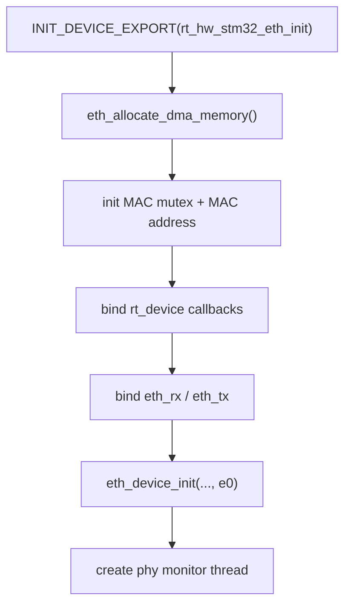
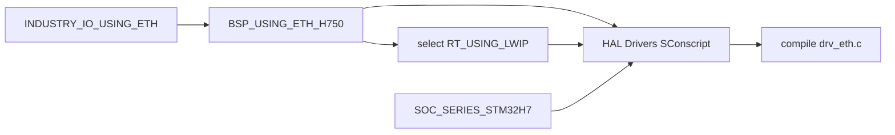
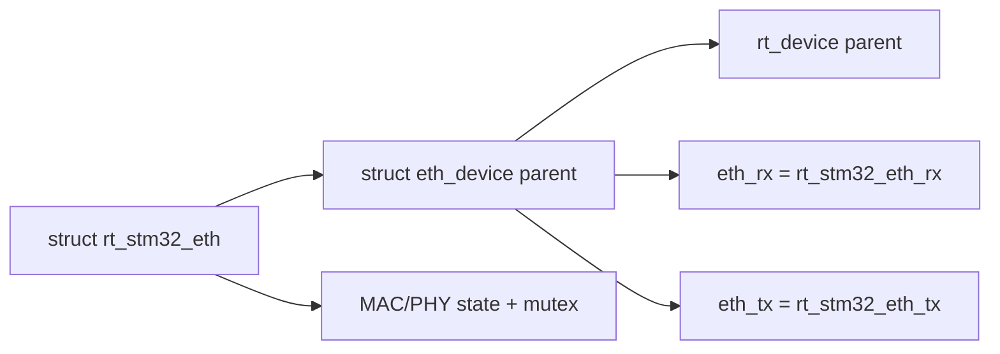
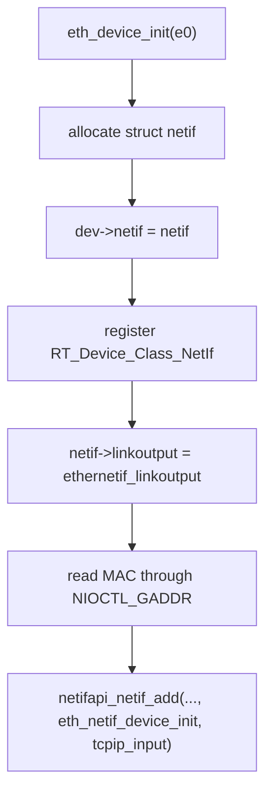
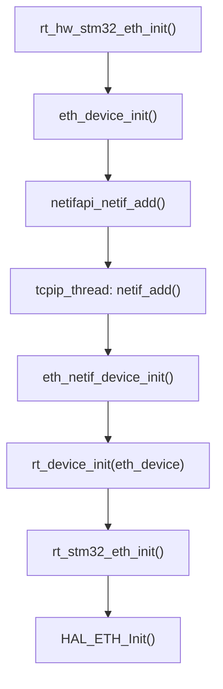
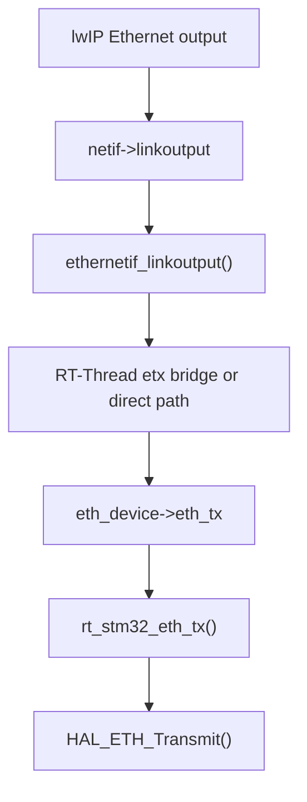
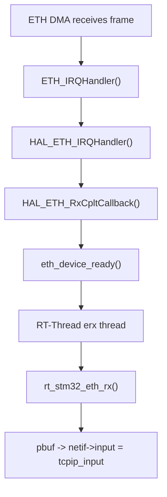
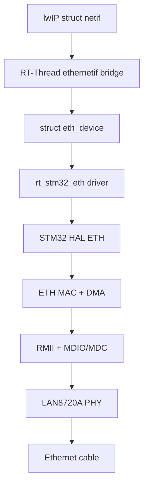

<meta name="referrer" content="no-referrer" />

# 教程 42：从 `rt_hw_stm32_eth_init()` 到 `tcpip_input()`——STM32H750 + RT-Thread + lwIP Ethernet Port

> 摘要：以 STM32H750 Art-Pi 为真实案例，从设备初始化入口追到 HAL ETH、eth_device、lwIP netif 与 tcpip_input，建立 MCU Ethernet Port 的完整落地链路。

[TOC]

Stage 38 已经建立 lwIP 的通用 Port Contract，Stage 39 又确认 RT-Thread 用 `sys_arch.c` 与 `ethernetif.c` 把这个 contract 接进 RTOS。Stage 42 再向下走一层：**一个真正的 STM32 Ethernet Driver 怎样把 MAC、PHY、DMA、RT-Thread `eth_device` 与 lwIP `struct netif` 接成可运行链路。**

本文固定使用 RT-Thread commit `dc8aaa73f2dbea255325ec058a083aeeb5381d0a`（2026-09-28）的 **STM32H750 Art-Pi + LAN8720A + STM32 HAL ETH 新接口**作为案例。[S1](#source-s1)[S2](#source-s2) 该版本的 `drv_eth.c` 在 2026-08-30 合并了 H750 适配并切到新的 HAL ETH API，因此本文所有函数名、buffer callback 与 descriptor 接口都以这一 revision 为准。[S2](#source-s2)

Stage 42 只回答“硬件 Driver 怎样接到 lwIP”。DMA descriptor ownership、D-Cache coherency、RX copy 与 zero-copy 取舍会在 Stage 43 单独展开；PHY Link Up/Down 与 DHCP 恢复则留到 Stage 44。

## 1. 从真实设备入口 `rt_hw_stm32_eth_init()` 开始

STM32 Ethernet driver 的运行时入口不是 `HAL_ETH_Init()`，而是 RT-Thread driver 文件尾部的：

```c
INIT_DEVICE_EXPORT(rt_hw_stm32_eth_init);
```

这表示 `rt_hw_stm32_eth_init()` 被注册到 RT-Thread device initialization 阶段。[S2](#source-s2) 文章从这里开始，因为后面的 `eth_device`、HAL handle、PHY monitor thread 都由这个入口建立。

`rt_hw_stm32_eth_init()` 当前执行顺序可以整理为：



其中最关键的绑定不是 HAL，而是下面两组函数指针：[S2](#source-s2)

```text
RT-Thread Device side
  parent.parent.init    -> rt_stm32_eth_init
  parent.parent.control -> rt_stm32_eth_control

Ethernet data side
  parent.eth_rx         -> rt_stm32_eth_rx
  parent.eth_tx         -> rt_stm32_eth_tx
```

这一步把“通用 RT-Thread Ethernet Port”与“具体 STM32 driver”连接起来。Stage 39 里的 `ethernetif.c` 并不知道 STM32 HAL；它只知道 `struct eth_device` 中存在 `eth_rx()`、`eth_tx()` 等 contract。[S3](#source-s3)

## 2. Kconfig 怎样把 Art-Pi Ethernet 与 lwIP 一起打开，SConscript 又怎样选中 `drv_eth.c`

Art-Pi 的工业扩展板 Ethernet 选项会选择 `BSP_USING_ETH`、`PHY_USING_LAN8720A` 与 `BSP_USING_ETH_H750`；其中板级 `BSP_USING_ETH_H750` 本身又 `select RT_USING_LWIP`。[S1](#source-s1) 因而对这个 BSP 来说，“启用 H750 Ethernet”已经同时把 lwIP 依赖带进配置。

真正把通用 STM32 Ethernet driver 加入编译的仍是 HAL Drivers `SConscript`。当前条件要求：[S4](#source-s4)

```text
SOC_SERIES_STM32F4 / F7 / H7
        +
RT_USING_LWIP
        +
BSP_USING_ETH 或 BSP_USING_ETH_H750
```

因此 Kconfig 负责建立板级功能依赖，SConscript 再消费这些已确定的配置来选择 `drv_eth.c`。当前 driver 也不是脱离 lwIP 独立构建的通用 `rt_device` Ethernet class 实现，而是明确进入 RT-Thread 的 lwIP Ethernet integration。



这也解释了为什么 Stage 42 不应脱离 Stage 39 单独理解：`drv_eth.c` 的上游调用者就是 RT-Thread 的 lwIP `ethernetif` bridge。

## 3. `eth_allocate_dma_memory()` 先准备硬件共享内存

`rt_hw_stm32_eth_init()` 第一个重要子调用是 `eth_allocate_dma_memory()`。[S2](#source-s2)

在普通 STM32 配置下，当前 driver 可以动态分配：

```text
Rx descriptors
Tx descriptors
Rx data buffers
```

而 Art-Pi 的 `BSP_USING_ETH_H750` 分支走的是静态 storage：

```text
DMARxDscrTab_Storage
DMATxDscrTab_Storage
Rx_Buff_Storage
```

并分别放到：

```text
.RxDecripSection
.TxDecripSection
.RxArraySection
```

GNU linker script 又把这些 section 映射到 0x30040000 开始的一段 D2 SRAM。[S5](#source-s5)

这里先只建立一个结论：**descriptor 与 RX DMA buffer 必须放在 Ethernet DMA 能访问、并且 CPU/DMA 一致性策略明确的 RAM 中。** Art-Pi 具体为什么还把这段区域配置成 non-cacheable，会在 Stage 43 解释。

## 4. 返回 `rt_hw_stm32_eth_init()`：建立 `struct eth_device`

DMA memory 准备好以后，`rt_hw_stm32_eth_init()` 初始化 MAC mutex、默认 speed/duplex 和 MAC address，然后把 `stm32_eth_device` 填成一个真正的 RT-Thread `struct eth_device`。[S2](#source-s2)

对象关系是：



这里最值得记住的是继承关系：

```text
rt_stm32_eth
  contains eth_device
      contains rt_device
```

所以同一个 `stm32_eth_device` 同时承担三种角色：

- 对 STM32 driver：保存 HAL/MAC/PHY 相关状态；
- 对 RT-Thread Device Framework：表现成一个 `RT_Device_Class_NetIf` device；
- 对 lwIP Ethernet Port：提供 `eth_rx()` / `eth_tx()`。

完整 RT-Thread Device Framework 的 object/open/close 机制不在 lwIP 系列继续展开，只保留当前调用链需要的这层关系。

## 5. 进入 `eth_device_init()`：具体 driver 第一次进入 RT-Thread lwIP Port

`rt_hw_stm32_eth_init()` 接下来调用：

```text
eth_device_init(&stm32_eth_device.parent, "e0")
```

这里从 `bsp/stm32/.../drv_eth.c` 切换到：

```text
components/net/lwip/port/ethernetif.c
```

Stage 39 已经完整读过 `eth_device_init()`，Stage 42 只恢复与 STM32 Port 有关的最小上下文。[S3](#source-s3)

`eth_device_init()` 最终进入 `eth_device_init_with_flag()`，建立以下绑定：



到这里，两个世界已经第一次真正接上：

```text
STM32 driver object
    stm32_eth_device.parent
             ↕
RT-Thread eth_device
             ↕
lwIP struct netif
```

`netifapi_netif_add()` 通过 `tcpip_thread` 安全地执行 `netif_add()`，这一点已经在 Stage 39 讲过，因此本篇不重复展开 lwIP Core 内部线程桥接。

## 6. `eth_netif_device_init()` 为什么反过来调用 STM32 的 `rt_stm32_eth_init()`

`netifapi_netif_add()` 进入 lwIP `netif_add()` 后，会执行前面传入的 init callback：

```text
eth_netif_device_init(netif)
```

这个 callback 取回 `netif->state` 中保存的 `eth_device`，然后调用 RT-Thread device init/open。[S3](#source-s3)

因此硬件初始化的真实桥接顺序不是：

```text
HAL_ETH_Init -> eth_device_init
```

而是：



这个顺序非常重要：**RT-Thread 先把 device 与 lwIP `netif` 绑定，再由 `netif` 的 init callback 触发具体 STM32 hardware init。**

这样 `ethernetif.c` 保持平台无关，而具体硬件初始化仍属于 driver。

## 7. 进入 `rt_stm32_eth_init()`：填好 HAL handle 再调用 `HAL_ETH_Init()`

下面进入 driver 的硬件初始化函数 `rt_stm32_eth_init()`。[S2](#source-s2)

它先完成：

```text
H750 D2 SRAM3 clock enable
PHY hardware reset
EthHandle.Instance = ETH
MAC address pointer
MediaInterface = RMII
TxDesc / RxDesc address
Rx buffer length
```

然后调用：

```text
HAL_ETH_DeInit()
HAL_ETH_Init()
```

这里 `EthHandle.Init` 才是 STM32 HAL 真正看到的硬件配置 contract。

当前案例明确选择：

```text
HAL_ETH_RMII_MODE
```

因此 CPU 内部 ETH MAC 与外部 LAN8720A 之间使用 RMII，而不是 MII。[S2](#source-s2)[S6](#source-s6)

## 8. `HAL_ETH_Init()` 再进入板级 `HAL_ETH_MspInit()`：时钟、GPIO 与 IRQ 在这里落地

ST HAL 的 `HAL_ETH_Init()` 在 handle 第一次从 RESET 状态进入时，会调用 `HAL_ETH_MspInit()` 配置底层硬件资源。[S7](#source-s7)

Art-Pi 的 CubeMX-generated MSP 文件提供真实实现：[S6](#source-s6)

```text
Enable ETH1MAC / ETH1TX / ETH1RX clocks
        ↓
Enable GPIOG / GPIOC / GPIOA clocks
        ↓
configure AF11 Ethernet pins
        ↓
configure ETH_IRQn
```

当前 Art-Pi RMII pin mapping 是：[S6](#source-s6)

| 信号 | STM32H750 Pin |
| --- | --- |
| `ETH_TX_EN` | PG11 |
| `ETH_TXD1` | PG14 |
| `ETH_TXD0` | PG13 |
| `ETH_MDC` | PC1 |
| `ETH_MDIO` | PA2 |
| `ETH_REF_CLK` | PA1 |
| `ETH_CRS_DV` | PA7 |
| `ETH_RXD0` | PC4 |
| `ETH_RXD1` | PC5 |

这张表同时解释了两个通路：

```text
RMII data/control
    TX_EN / TXD[1:0] / CRS_DV / RXD[1:0] / REF_CLK

PHY management
    MDC / MDIO
```

MDC/MDIO 不承载 Ethernet frame 数据，它们用于 MAC 与 PHY 之间的寄存器管理。真正的 frame bit stream 走 RMII。

## 9. `HAL_ETH_Init()` 初始化的是 MAC + DMA，不等于网络已经 Link Up

ST HAL 在 `HAL_ETH_Init()` 内部完成 MAC/DMA reset、RMII/MII interface selection、Rx buffer size、Tx/Rx descriptor list 初始化和 MAC address 等基础配置。[S7](#source-s7)

STM32H750 reference manual也明确把 Ethernet peripheral 分成 MAC、MTL 与 DMA，并由 DMA 通过 descriptor 在系统内存与 MAC 队列之间搬运 frame。[S8](#source-s8)

但此刻外部 PHY 仍是独立对象，所以 driver 返回 `HAL_ETH_Init()` 后还继续：

```text
HAL_ETH_SetMDIOClockRange()
    ↓
phy_find()
    ↓
phy_start_auto_negotiation()
    ↓
HAL_NVIC_EnableIRQ(ETH_IRQn)
```

Stage 42 只关心“PHY 存在并能进入协商”；Link status 如何持续监控、MAC speed/duplex 如何跟着 PHY 改变，会在 Stage 44 专门追 `phy_monitor_thread_entry()` 与 `phy_linkchange()`。

## 10. 为什么 `rt_hw_stm32_eth_init()` 还创建 PHY monitor thread

设备注册入口最后创建名为 `phy` 的 RT-Thread thread，入口是：

```text
phy_monitor_thread_entry()
```

默认非 PHY interrupt mode 下，它周期调用 `phy_linkchange()`；interrupt mode 下则由 PHY GPIO IRQ 释放 semaphore，再执行同一 `phy_linkchange()`。[S2](#source-s2)

此处只需要建立控制关系：


也就是说，STM32 driver 不直接调用 DHCP 或 MQTT。它只把 **物理链路状态**上报给通用 `eth_device` / lwIP `netif` 链路。更高层恢复逻辑由后续网络栈和应用层处理。

## 11. 一帧 TX 怎样从 lwIP 到 `rt_stm32_eth_tx()`

初始化完成以后，`netif->linkoutput` 已经在 `eth_device_init_with_flag()` 中绑定为 `ethernetif_linkoutput()`。[S3](#source-s3)

因此 Ethernet frame 的下行主线是：



当前 driver 在 `rt_hw_stm32_eth_init()` 中已经把：

```text
eth_device->eth_tx = rt_stm32_eth_tx
```

所以通用 Port 不需要知道 STM32 HAL 的存在。[S2](#source-s2)[S3](#source-s3)

`rt_stm32_eth_tx()` 会把 lwIP `pbuf` chain 转换成 HAL `ETH_BufferTypeDef` chain，再交给 `HAL_ETH_Transmit()`。这个转换是否发生 data copy、cache 为什么必须 clean、descriptor OWN 何时交给 DMA，都留到 Stage 43。

## 12. 一帧 RX 怎样从 ETH IRQ 回到 `tcpip_input()`

RX 方向真正体现了 driver/RTOS/lwIP 的边界。

硬件收到 frame 后，STM32 ETH DMA/MAC 产生 interrupt；入口是：

```text
ETH_IRQHandler()
```

driver 调用 `HAL_ETH_IRQHandler()`，HAL 在完成 Rx interrupt 处理后回调 `HAL_ETH_RxCpltCallback()`。[S2](#source-s2)[S7](#source-s7)

RT-Thread driver 的 callback 不在 ISR 里读取/解析整个 frame，而只调用：

```text
eth_device_ready(&stm32_eth_device.parent)
```

后者通知 Stage 39 已建立的 Ethernet RX thread。[S2](#source-s2)[S3](#source-s3)



这条链解释了为什么 driver 没有在 Ethernet ISR 里直接进入 lwIP Core：ISR 只完成事件通知，真正的 buffer 获取与 pbuf 构造放到 `erx` thread context。

## 13. `rt_stm32_eth_rx()` 返回的对象必须满足 `eth_device` contract

`erx` thread 不知道 HAL Rx descriptor，也不认识 STM32 DMA。它只执行：[S3](#source-s3)

```text
device->eth_rx(&device->parent)
```

对于本案例，这个函数指针进入 `rt_stm32_eth_rx()`。[S2](#source-s2)

该函数最终必须满足一个非常简单的 contract：

```text
有完整 frame
    -> 返回 struct pbuf *

当前没有可交付 frame / 出错
    -> 返回 NULL
```

然后 `erx` thread 调用：

```text
device->netif->input(p, device->netif)
```

Stage 39 已确认该 `input` 在注册时就是 `tcpip_input`，因此 frame 最终进入 lwIP TCPIP core mailbox/thread。[S3](#source-s3)

这正是 Stage 38 所说 Network Port Contract 在真实 MCU 上的最终落点：

```text
hardware frame
    -> driver returns pbuf
    -> netif->input()
    -> lwIP Core
```

## 14. 这里其实存在三种完全不同的“初始化”

沿调用链走完后，可以把容易混淆的 init 分开：

| 初始化 | 入口 | 建立什么 |
| --- | --- | --- |
| RT-Thread driver 注册 | `rt_hw_stm32_eth_init()` | `eth_device`、driver callbacks、PHY monitor thread |
| lwIP netif 绑定 | `eth_device_init()` / `eth_netif_device_init()` | `struct netif`、`linkoutput`、`tcpip_input`、DHCP/default netif |
| STM32 peripheral init | `rt_stm32_eth_init()` / `HAL_ETH_Init()` | MAC/DMA handle、descriptor list、RMII、GPIO/clock/IRQ、PHY discovery |

把这三层混成一句“初始化网卡”会掩盖最关键的 Port 边界。

## 15. Stage 42 最终形成的软硬件分层

现在可以把前面出现过的对象重新放回整体路径：



各层职责可以压缩成：

```text
lwIP netif
    只关心 packet input/output contract

RT-Thread ethernetif / eth_device
    负责 RTOS thread/device bridge

STM32 drv_eth
    负责把 eth_rx/eth_tx 映射到 STM32 HAL

STM32 HAL + MAC/DMA
    负责寄存器、descriptor 与硬件搬运

PHY
    负责物理链路、编码、电气收发与协商
```

这条分层正是后面换 MCU、换 PHY 或换 RTOS 时判断“应该改哪一层”的依据。

## 16. 为什么 Stage 42 不继续展开 Descriptor 与 Cache

此时 `rt_stm32_eth_tx()` 已经出现 `eth_clean_cache()`，`rt_stm32_eth_rx()` 又出现 `eth_invalidate_cache()`，H750 还专门把 descriptor/RX buffer 放到 non-cacheable D2 SRAM。[S2](#source-s2)[S5](#source-s5)[S9](#source-s9)

这些不是“STM32 初始化细节”，而是另一套完整的数据一致性问题：

```text
CPU cache
    ↕
SRAM
    ↕
Ethernet DMA
```

同时还有 descriptor OWN、ring、RX buffer callback、pbuf copy/ownership 等对象生命周期。如果继续塞在 Stage 42，文章会从“Port 怎么接上”突然变成“DMA memory model”。因此 Stage 43 单独从真正的 RX/TX 数据面继续追踪。

## 资料来源

<a id="source-s1"></a>
### [S1] RT-Thread STM32H750 Art-Pi Kconfig
- 类型：RT-Thread 官方仓库源码
- 版本：commit `dc8aaa73f2dbea255325ec058a083aeeb5381d0a`，2026-09-28
- 定位：`bsp/stm32/stm32h750-artpi/board/Kconfig`：`INDUSTRY_IO_USING_ETH`、`BSP_USING_ETH_H750`、`PHY_USING_LAN8720A`
- URL/文档：[Art-Pi board Kconfig](https://github.com/RT-Thread/rt-thread/blob/dc8aaa73f2dbea255325ec058a083aeeb5381d0a/bsp/stm32/stm32h750-artpi/board/Kconfig)
- 使用位置：“案例平台与 build feature 入口”
- 支撑内容：证明本文固定的 H750 + LAN8720A board configuration 及 D-Cache 默认启用背景

<a id="source-s2"></a>
### [S2] RT-Thread STM32 HAL Ethernet Driver
- 类型：RT-Thread 官方仓库源码
- 版本：同上
- 定位：`bsp/stm32/libraries/HAL_Drivers/drivers/drv_eth.c`：`rt_hw_stm32_eth_init()`、`rt_stm32_eth_init()`、`rt_stm32_eth_tx()`、`rt_stm32_eth_rx()`、`ETH_IRQHandler()`、`HAL_ETH_RxCpltCallback()`、PHY monitor
- URL/文档：[RT-Thread drv_eth.c](https://github.com/RT-Thread/rt-thread/blob/dc8aaa73f2dbea255325ec058a083aeeb5381d0a/bsp/stm32/libraries/HAL_Drivers/drivers/drv_eth.c)
- 使用位置：Stage 42 主调用链
- 支撑内容：具体 STM32 driver 如何建立 `eth_device` callbacks、初始化 HAL/PHY 并连接 RX/TX 数据路径

<a id="source-s3"></a>
### [S3] RT-Thread lwIP Ethernet Port
- 类型：RT-Thread 官方仓库源码
- 版本：同上
- 定位：`components/net/lwip/port/ethernetif.c`：`eth_device_init()`、`eth_device_init_with_flag()`、`eth_netif_device_init()`、`ethernetif_linkoutput()`、`eth_rx_thread_entry()`、`eth_device_ready()`
- URL/文档：[RT-Thread ethernetif.c](https://github.com/RT-Thread/rt-thread/blob/dc8aaa73f2dbea255325ec058a083aeeb5381d0a/components/net/lwip/port/ethernetif.c)
- 使用位置：“eth_device → netif”“RX/TX thread bridge”“tcpip_input”
- 支撑内容：证明具体 STM32 driver 与通用 RT-Thread/lwIP Port 的接口边界

<a id="source-s4"></a>
### [S4] RT-Thread STM32 HAL Drivers SConscript
- 类型：RT-Thread 官方构建脚本
- 版本：同上
- 定位：`bsp/stm32/libraries/HAL_Drivers/drivers/SConscript`：`eth_new_hal_soc` 与 `drv_eth.c` source selection
- URL/文档：[HAL Drivers SConscript](https://github.com/RT-Thread/rt-thread/blob/dc8aaa73f2dbea255325ec058a083aeeb5381d0a/bsp/stm32/libraries/HAL_Drivers/drivers/SConscript)
- 使用位置：“`drv_eth.c` 的实际编译条件”
- 支撑内容：说明当前 STM32 Ethernet driver 需要支持的新 HAL SoC、lwIP 与 BSP ETH feature 同时满足

<a id="source-s5"></a>
### [S5] Art-Pi linker script 与 MPU configuration
- 类型：RT-Thread 官方板级源码
- 版本：同上
- 定位：`board/linker_scripts/link.lds` 的 `.RxDecripSection/.TxDecripSection/.RxArraySection`；`board/port/drv_mpu.c` 的 Ethernet DMA region
- URL/文档：[Art-Pi link.lds](https://github.com/RT-Thread/rt-thread/blob/dc8aaa73f2dbea255325ec058a083aeeb5381d0a/bsp/stm32/stm32h750-artpi/board/linker_scripts/link.lds)、[Art-Pi drv_mpu.c](https://github.com/RT-Thread/rt-thread/blob/dc8aaa73f2dbea255325ec058a083aeeb5381d0a/bsp/stm32/stm32h750-artpi/board/port/drv_mpu.c)
- 使用位置：“DMA memory allocation”“Stage 43 的 cache 边界预告”
- 支撑内容：证明 H750 Art-Pi 把 ETH descriptor/RX buffer 固定到 0x30040000 起的 D2 SRAM 区并配置为 non-cacheable/shareable

<a id="source-s6"></a>
### [S6] Art-Pi CubeMX ETH MSP configuration
- 类型：RT-Thread 官方板级 CubeMX 生成源码
- 版本：同上
- 定位：`board/CubeMX_Config/Core/Src/stm32h7xx_hal_msp.c`：`HAL_ETH_MspInit()`
- URL/文档：[Art-Pi stm32h7xx_hal_msp.c](https://github.com/RT-Thread/rt-thread/blob/dc8aaa73f2dbea255325ec058a083aeeb5381d0a/bsp/stm32/stm32h750-artpi/board/CubeMX_Config/Core/Src/stm32h7xx_hal_msp.c)
- 使用位置：“RMII clocks/GPIO/NVIC”
- 支撑内容：证明当前 Art-Pi 实际使用的 ETH pins、RMII signals 与 interrupt 初始化

<a id="source-s7"></a>
### [S7] STMicroelectronics STM32H7 HAL ETH Driver
- 类型：ST 官方 HAL 源码
- 版本：commit `7e541d92019e18f98d211fc4ab9197ec8e8105f6`，2026-09-29
- 定位：`Src/stm32h7xx_hal_eth.c`：`HAL_ETH_Init()`、`HAL_ETH_Start_IT()`、`HAL_ETH_ReadData()`、`HAL_ETH_Transmit()`
- URL/文档：[STM32H7 HAL ETH source](https://github.com/STMicroelectronics/stm32h7xx-hal-driver/blob/7e541d92019e18f98d211fc4ab9197ec8e8105f6/Src/stm32h7xx_hal_eth.c)
- 使用位置：“HAL 初始化职责”“IRQ/RX callback contract”“TX API 位置”
- 支撑内容：解释 RT-Thread driver 调用的 HAL API 在 MAC/DMA lifecycle 中承担什么职责

<a id="source-s8"></a>
### [S8] STM32H742/H743/H750 Reference Manual RM0433
- 类型：ST 官方参考手册
- 版本：RM0433 Rev 8
- URL/文档：[RM0433](https://www.st.com/resource/en/reference_manual/rm0433-stm32h742-stm32h743753-and-stm32h750-value-line-advanced-armbased-32bit-mcus-stmicroelectronics.pdf)
- 使用位置：“STM32 Ethernet MAC/DMA/RMII 硬件边界”
- 支撑内容：说明 ETH peripheral 的 MAC、DMA、MII/RMII 以及 descriptor-driven DMA 模型

<a id="source-s9"></a>
### [S9] ST AN4839 — Level 1 cache on STM32F7/H7
- 类型：ST 官方 Application Note
- 版本：AN4839 Rev 2
- URL/文档：[AN4839](https://www.st.com/resource/en/application_note/an4839-level-1-cache-on-stm32f7-series-and-stm32h7-series-stmicroelectronics.pdf)
- 使用位置：“为什么 DMA shared memory 必须显式处理 cache coherency”
- 支撑内容：说明 Cortex-M7 CPU cache 与 DMA 共享 cacheable SRAM 时存在一致性问题，并给出 non-cacheable/clean/invalidate 等处理方向
