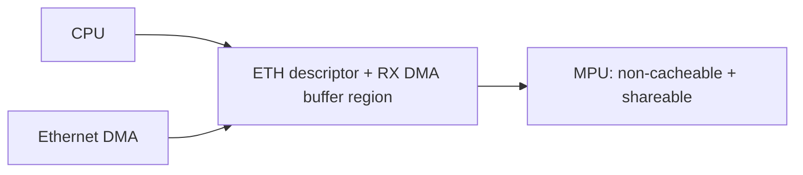
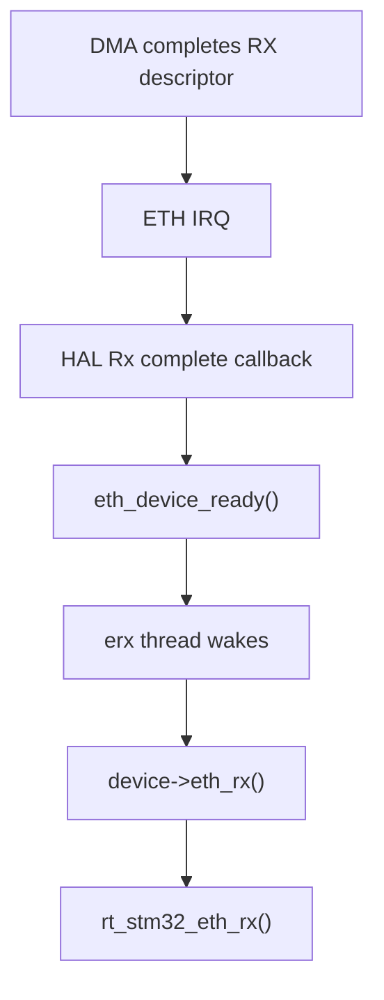
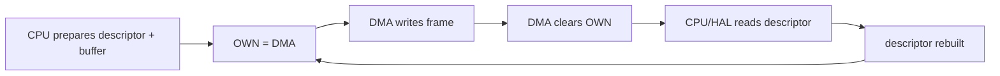
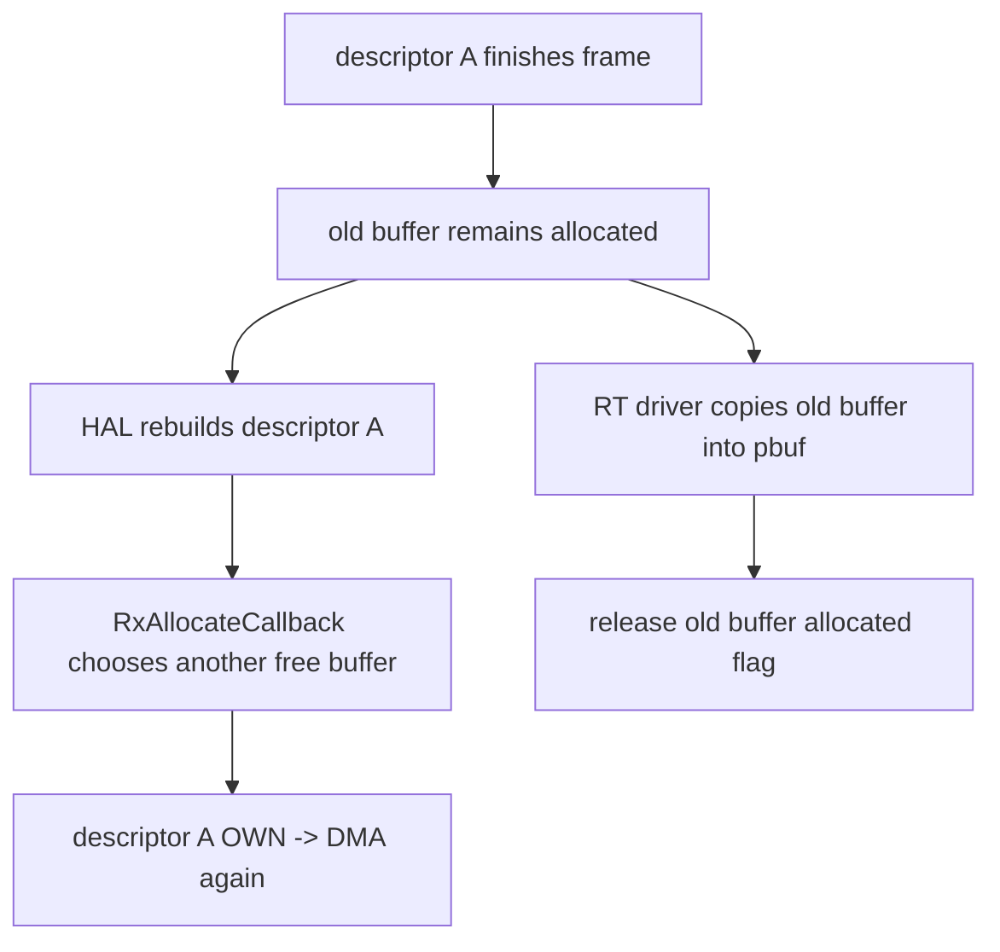
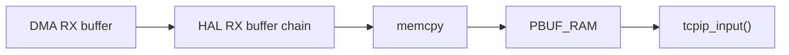
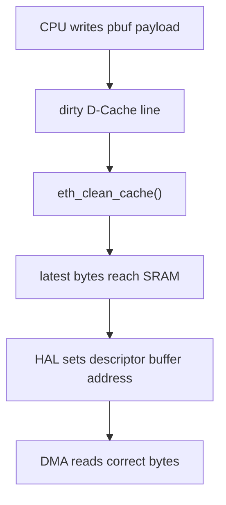
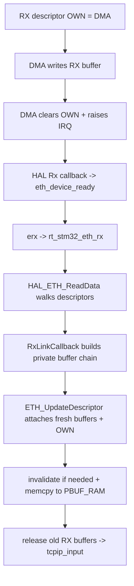
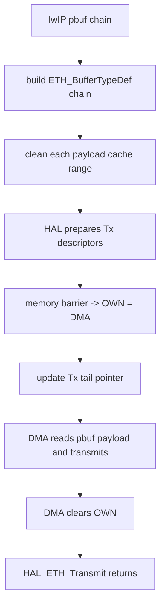

<meta name="referrer" content="no-referrer" />

# 教程 43：从 `ETH_IRQHandler()` 到 `HAL_ETH_Transmit()`——STM32H7 Ethernet DMA、Descriptor、Cache 与 Zero-copy 边界

> 摘要：沿 STM32H750 Ethernet RX/TX 数据面追踪 DMA descriptor 所有权、D-Cache 一致性、pbuf copy 与当前 zero-copy 边界。

[TOC]

Stage 42 已经把初始化链走通：`rt_hw_stm32_eth_init()` 建立 STM32 `eth_device`，`eth_device_init()` 把它绑定到 lwIP `netif`，最终 `HAL_ETH_Init()` 配好 MAC、DMA、RMII 与 descriptor list。Stage 43 不再讨论“怎么初始化”，而是只跟一帧数据：**DMA 什么时候拥有 descriptor、CPU 什么时候可以读写 buffer、为什么 TX 要 clean D-Cache、RX 为什么要 invalidate，以及当前 RT-Thread driver 到底是不是 zero-copy。**

源码平台继续固定为 RT-Thread commit `dc8aaa73f2dbea255325ec058a083aeeb5381d0a`（2026-09-28）的 STM32H750 Art-Pi；HAL 行为使用 ST 官方 `stm32h7xx-hal-driver` commit `7e541d92019e18f98d211fc4ab9197ec8e8105f6`（2026-09-29）交叉核对。[S1](#source-s1)[S4](#source-s4)

## 1. 先抓住最重要的对象：Descriptor 不是 Packet Buffer

STM32H7 Ethernet DMA 不是直接“拿一个 pbuf 就开始收发”。DMA 通过 descriptor ring 获取 buffer address、长度、状态和 ownership。[S4](#source-s4)[S5](#source-s5)

因此 Stage 43 同时存在三类对象：

```text
DMA descriptor
    -> 告诉 DMA buffer 在哪里、当前谁拥有它

DMA data buffer
    -> 真正保存 Ethernet frame bytes

lwIP pbuf
    -> lwIP 协议栈看到的数据对象
```

这三者不能混为一谈。

当前 RT-Thread STM32 driver 还额外维护：

```text
struct rt_stm32_eth_rx_buffer Rx_Buff_Info[]
```

它不是 DMA descriptor，也不是 `pbuf`；它用于记录 RX buffer 是否已分配、该片长度以及一个 frame 跨多个 buffer 时的链表关系。[S1](#source-s1)

## 2. H750 Art-Pi 先用 MPU 解决 Descriptor/RX Buffer 的一部分 Cache 问题

Stage 42 已经看到 Art-Pi linker script 把：

```text
Rx descriptor
Tx descriptor
Rx data buffer array
```

放到 `0x30040000` 开始的 D2 SRAM 区域。[S2](#source-s2)

`drv_mpu.c` 又把从 `0x30040000` 开始的 32 KB region 配成：

```text
not cacheable
shareable
```

同时 Art-Pi 默认可以开启 Cortex-M7 D-Cache。[S2](#source-s2)

因此这个 board 的策略是：



这解决的是 **固定 DMA-owned memory** 的 coherency。

但 TX 数据来自 lwIP `pbuf->payload`，这些 payload 并不必然位于这个 non-cacheable region，所以 TX 路径仍必须考虑 D-Cache clean。[S1](#source-s1)[S6](#source-s6)

## 3. 为什么 Cache Coherency 只在“CPU 与 DMA 同时访问内存”时变成问题

Cortex-M7 D-Cache 位于 CPU 与系统 SRAM 之间，而 Ethernet DMA 是另一个 bus master。DMA 不会自动读取 CPU cache 里的 dirty line，也不会自动让 CPU cache 中的旧 line 失效。[S6](#source-s6)

两个方向的风险正好相反：

| 方向 | 最新数据在哪里 | 风险 | 软件动作 |
| --- | --- | --- | --- |
| TX：CPU 写，DMA 读 | 可能只在 D-Cache | DMA 从 SRAM 读到旧数据 | DMA 启动前 `Clean` |
| RX：DMA 写，CPU 读 | SRAM 已更新，Cache 可能仍旧 | CPU 读到 stale cache line | CPU 读前 `Invalidate` |

ST AN4839 给出的通用处理方向也是：DMA 共享区域要么配置成 non-cacheable/shared，要么在 cacheable region 上通过 clean/invalidate 软件维护一致性。[S6](#source-s6)

所以不能把：

```text
Clean = 清空缓存
Invalidate = 把数据写回 SRAM
```

这样记。更准确的是：

```text
Clean
    把 dirty cache line 写回下一层存储

Invalidate
    丢弃对应 cache line，使后续 CPU load 重新从内存层取数据
```

## 4. 当前 driver 为什么把 cache address 对齐到 32 字节

`drv_eth.c` 的 `eth_clean_cache()` 与 `eth_invalidate_cache()` 都先把起始地址向下对齐、结束地址向上对齐到：

```text
ETH_CACHE_LINE_SIZE = 32
```

然后才调用 CMSIS：

```text
SCB_CleanDCache_by_Addr()
SCB_InvalidateDCache_by_Addr()
```

并且只有检测到 D-Cache 实际开启时才执行。[S1](#source-s1)

这样做的原因不是 Ethernet frame 以 32 字节为单位，而是 Cortex-M7 cache maintenance 以 cache line 为基本作用范围。对任意 payload 子区间做维护时，必须覆盖它所落入的完整 line。[S6](#source-s6)

由此产生一个重要的工程边界：如果一个 cache line 同时混放 DMA buffer 与 CPU 私有数据，按 line invalidate 可能把同 line 中 CPU 尚未写回的其他数据一起丢掉。固定 DMA buffer 通常需要独立对齐/区域规划，而不能只把任意小对象随意交给 DMA。

## 5. RX 从哪里开始：不是 `rt_stm32_eth_rx()`，而是 DMA 完成中断

一帧 RX 的真实触发源是 Ethernet DMA/MAC 完成接收并产生中断。

Stage 42 已确认 ISR 入口：

```text
ETH_IRQHandler()
    -> HAL_ETH_IRQHandler()
    -> HAL_ETH_RxCpltCallback()
```

RT-Thread driver 的 `HAL_ETH_RxCpltCallback()` 不读取 frame，只调用：

```text
eth_device_ready()
```

把设备投递给 RT-Thread `erx` thread。[S1](#source-s1)[S3](#source-s3)[S4](#source-s4)



这一步把硬中断与 buffer processing 分开：ISR 只通知，复杂的 descriptor walk、pbuf allocation 和 memcpy 在 thread context 完成。

## 6. RX Descriptor 的核心状态只有一个问题：OWN 在谁手里

STM32H7 reference manual 对 RX DMA 的基本流程是：应用准备 descriptor/buffer 并把 OWN 交给 DMA；DMA 收到 frame 后写 buffer 和 descriptor status，最后清除 OWN，把 descriptor 归还 CPU。[S5](#source-s5)

可以简化成：



因此 CPU 判断“能不能处理这个 RX descriptor”的关键，不是“IRQ 是否发生过”，而是 descriptor ownership 已经从 DMA 回到 CPU。

## 7. `rt_stm32_eth_rx()` 进入 `HAL_ETH_ReadData()`：HAL 开始回收 CPU-owned descriptors

`erx` thread 调用 driver 的 `rt_stm32_eth_rx()` 后，函数先锁住 MAC，再调用：[S1](#source-s1)

```text
HAL_ETH_ReadData(&EthHandle, &rx_buffer)
```

ST HAL 的 `HAL_ETH_ReadData()` 从当前 Rx descriptor 开始，只处理 OWN 已清除的 descriptor；它读取 FD/LD、packet length 等 status，并通过 Rx Link Callback 把每一段 buffer 组织成 application-visible packet chain。[S4](#source-s4)

当一个 frame 跨多个 descriptor 时，这个过程不会假设“一帧一定只有一个 buffer”。

## 8. `HAL_ETH_RxLinkCallback()` 为什么不直接返回 `pbuf`

当前 RT-Thread driver 实现了 HAL 的 weak callback：

```text
HAL_ETH_RxLinkCallback(pStart, pEnd, buff, length)
```

但它没有创建 lwIP `pbuf`。它只找到 `buff` 对应的 `Rx_Buff_Info[index]`，记录长度，然后用 `next` 把同一 frame 的多个 RX buffer 串起来。[S1](#source-s1)

因此 `HAL_ETH_ReadData()` 返回给 driver 的 `rx_buffer` 本质上是：

```text
RT-Thread driver private RX-buffer metadata chain
```

而不是：

```text
lwIP pbuf chain
```

这层中间对象是后续 RX copy 的关键。

## 9. 为什么 `ETH_RX_BUFFER_CNT = ETH_RX_DESC_CNT * 2`

当前 driver 定义：[S1](#source-s1)

```text
RX buffer count = 2 × RX descriptor count
```

这个设计与 HAL 的 descriptor rebuild 时序直接相关。

`HAL_ETH_ReadData()` 把已经收到数据的 buffer 通过 Link Callback 交给 application chain 后，会清掉 descriptor 对旧 buffer 的 backup pointer；随后 `ETH_UpdateDescriptor()` 需要为这些 descriptor 重新申请 buffer，并重新把 OWN 交还 DMA。[S4](#source-s4)

但旧 RX buffer 此时还没有被 RT-Thread copy 完，所以 `HAL_ETH_RxAllocateCallback()` 不能立刻把同一个 buffer 再交给 DMA。

当前 driver 用 `allocated` flag 与双倍 buffer pool 实现：



这样 descriptor ring 可以尽快补充新的 DMA destination，而 CPU 仍安全持有刚接收的旧 buffer 内容。

这不是协议要求，而是当前 RT-Thread driver 的 buffer-lifetime 实现策略。

## 10. `ETH_UpdateDescriptor()` 是 RX Ring 重新转起来的关键

ST HAL 在 `HAL_ETH_ReadData()` 消费 descriptor 后调用 `ETH_UpdateDescriptor()`。[S4](#source-s4)

该函数会：

1. 为缺少 data buffer 的 descriptor 调用 `HAL_ETH_RxAllocateCallback()`；
2. 写入新的 buffer address；
3. 设置 buffer-valid 与 OWN；
4. 前移 descriptor index；
5. 更新 Receive Descriptor Tail Pointer。

最后一步非常关键。RM0433 的 DMA reception flow 明确说明：Rx DMA 没有可用 descriptor 时会进入 suspend；application 补充 descriptor 并更新 tail pointer 后，DMA 才能继续寻找新的 receive descriptor。[S5](#source-s5)

所以“RX buffer pool 耗尽”的结果不仅是当前 frame 处理失败，还可能直接造成 DMA ring 暂时无法补充。

## 11. `HAL_ETH_ErrorCallback()` 为什么也会调用 `eth_device_ready()`

当前 RT-Thread driver 专门处理 RX Buffer Unavailable DMA error。[S1](#source-s1)

当 DMA 报告没有 RX buffer 时，Error Callback 不在中断里直接 rebuild ring，而是再次调用：

```text
eth_device_ready()
```

让 `erx` thread 后续进入 `rt_stm32_eth_rx()` / `HAL_ETH_ReadData()`。driver 注释明确指出，`HAL_ETH_ReadData()` 会补 descriptor 并恢复 Rx DMA。[S1](#source-s1)

这和前面的线程边界保持一致：

```text
ISR / HAL callback
    -> notify

RT erx thread
    -> read/rebuild/allocate/copy
```

## 12. 返回 `rt_stm32_eth_rx()`：为什么先 Invalidate 再复制

`HAL_ETH_ReadData()` 成功后，driver 遍历刚刚链接出的 RX buffer chain，累计 frame length，并对每段 buffer 调用：

```text
eth_invalidate_cache(buffer, length)
```

然后才读取这些 bytes。[S1](#source-s1)

对于通用 cacheable memory，这是标准 RX coherency 顺序：

```text
DMA writes SRAM
    ↓
CPU cache may still hold old line
    ↓
Invalidate D-Cache lines
    ↓
CPU reads fresh SRAM data
```

不过本文固定的 Art-Pi H750 已经把 descriptor/RX buffer region 配成 non-cacheable，所以这块 RX memory 本身不依赖 D-Cache invalidate 才能获得新数据。[S2](#source-s2) 当前 `drv_eth.c` 仍保留统一的 `eth_invalidate_cache()`，因为同一 driver 也服务于其他 F4/F7/H7 BSP；其他板卡是否需要该维护，必须结合各自 linker/MPU/memory placement 判断，不能从 Art-Pi 直接泛化。

## 13. 当前 RX 明确不是 Zero-copy：这里发生一次完整 frame copy

拿到完整 `frame_length` 后，当前 driver 执行：

```text
pbuf_alloc(PBUF_RAW, frame_length, PBUF_RAM)
```

然后 `eth_rx_copy()` 把 driver RX buffer chain 的全部 bytes 拷贝进新分配的 lwIP pbuf chain，最后 `eth_rx_release_buffers()` 才释放旧 DMA RX buffers。[S1](#source-s1)

所以当前 RX 数据路径是：



这条路径的性质很明确：

```text
RX = copy path
```

它的代价是一次 frame memory copy；收益是 ownership 非常清楚：HAL/DMA buffer 可以在 copy 后立即回收到自己的 pool，而 lwIP 得到完全独立的 `PBUF_RAM`。

## 14. 真正的 RX Zero-copy 会额外引入什么生命周期问题

如果要做 RX zero-copy，方向通常不是删除 `memcpy` 就结束，而是让 `pbuf` 直接引用 DMA RX buffer：

```text
DMA buffer
    ↓
custom/external pbuf payload
    ↓
lwIP
```

这会立刻产生新的 ownership contract：

```text
DMA 什么时候可以重新拿回这个 buffer？
```

如果 lwIP 上层还持有 pbuf，driver 就不能把该 buffer 重新挂回 descriptor。通常需要 custom pbuf free callback、独立 buffer pool 与严格的引用计数/归还路径。

当前 RT-Thread driver没有实现这套 lifecycle；它选择 copy 后尽快释放 RX DMA buffer。[S1](#source-s1) 因此 Stage 20 中学习的 zero-copy 原理不能直接等同于“当前 STM32 driver 已经 zero-copy”。

## 15. TX 从 lwIP `pbuf` chain 开始：当前 driver 没有做 payload memcpy

TX 路径从 Stage 42 已确认的：

```text
netif->linkoutput
    -> ethernetif_linkoutput()
    -> eth_device->eth_tx
    -> rt_stm32_eth_tx()
```

进入具体 driver 后，`rt_stm32_eth_tx()` 遍历 lwIP `pbuf` chain，为每一个 pbuf segment 填一个 HAL `ETH_BufferTypeDef` entry：[S1](#source-s1)

```text
ETH_BufferTypeDef.buffer = q->payload
ETH_BufferTypeDef.len    = q->len
```

也就是说当前 TX 并没有先申请一个连续 Ethernet DMA buffer 再 memcpy：


从 **driver/HAL 边界**看，这是 payload copy-free 的发送路径。

但“整个协议栈绝对零拷贝”仍是过强表述，因为 pbuf 在更高层怎样创建、应用数据是否早已发生过 copy，取决于调用路径和 pbuf 类型。准确说法是：**当前 STM32 Ethernet TX driver 直接把 pbuf payload 地址交给 HAL/DMA，没有额外做 frame payload memcpy。**

## 16. TX 为什么必须在 Descriptor 交给 DMA 前 Clean D-Cache

在填写 `ETH_BufferTypeDef` 时，driver 对每段 `q->payload` 先调用：

```text
eth_clean_cache(q->payload, q->len)
```

原因是 TX payload 可能处于 cacheable RAM。[S1](#source-s1)[S6](#source-s6)



如果省略 clean，CPU 看见的 `pbuf->payload` 可能正确，但 DMA 从 SRAM 读到旧值，从而表现成偶发 frame corruption、协议 checksum 异常或完全不可重复的网络错误。

## 17. `HAL_ETH_Transmit()` 怎样把 buffer 地址变成 DMA descriptor

driver 最终设置 `TxConfig.Length` 与 `TxConfig.TxBuffer`，然后调用 blocking API：

```text
HAL_ETH_Transmit(..., timeout = 1000)
```

ST HAL 的 `HAL_ETH_Transmit()` 先调用 `ETH_Prepare_Tx_Descriptors()`。[S4](#source-s4)

`ETH_Prepare_Tx_Descriptors()` 会检查当前 descriptor 是否仍被 DMA OWN，然后把 `ETH_BufferTypeDef` 中的 buffer address/length 写进 descriptor，设置 frame/control 字段，并在 descriptor 内容准备完成后设置 OWN。[S4](#source-s4)

这条顺序有一个非常重要的同步语义：

```text
CPU writes descriptor fields
    ↓
memory barrier
    ↓
set OWN
    ↓
DMA may consume descriptor
```

不能先把 OWN 交给 DMA，再继续修改 descriptor 的其他字段。

## 18. TX Tail Pointer 负责真正“踢”DMA 开始工作

descriptor 准备完成后，`HAL_ETH_Transmit()` 更新 Tx current index，并向 DMA Channel Transmit Descriptor Tail Pointer 写入下一个空闲 descriptor 地址。[S4](#source-s4)[S5](#source-s5)

因此 TX 并不是：

```text
写 buffer -> DMA 自动猜到有数据
```

而是：

```text
prepare descriptor
    -> OWN = DMA
    -> update tail pointer
    -> DMA fetch descriptor/data
```

这与 Stage 21 的 descriptor ring/backpressure 原理在真实 STM32H7 上对上了。

## 19. 当前 TX 为什么可以直接引用栈上的 `ETH_BufferTypeDef` 与现有 pbuf

`rt_stm32_eth_tx()` 在栈上创建临时 `ETH_BufferTypeDef tx_buffer[]`，而它里面保存的是 `pbuf->payload` pointer。[S1](#source-s1)

如果传输是完全异步的，函数返回后栈对象失效、pbuf 又可能被释放，这会立即引入 lifetime 问题。

当前 driver 使用的却是：

```text
HAL_ETH_Transmit()
```

而不是 `HAL_ETH_Transmit_IT()`。ST HAL 将前者定义为 blocking transmit：启动 DMA 后等待当前 Tx descriptor OWN 被硬件清除或 timeout 才返回。[S4](#source-s4)

因此当前调用链保持：

```text
rt_stm32_eth_tx() still active
    + pbuf still owned by caller
    + tx_buffer[] still valid
          ↓
DMA finishes
          ↓
HAL_ETH_Transmit() returns
          ↓
rt_stm32_eth_tx() returns
```

这也是当前 TX copy-free 设计能够保持简单 lifetime 的重要条件。

如果未来改成 `HAL_ETH_Transmit_IT()`，就必须重新设计 pbuf ref/free 与 Tx completion callback，不能只替换函数名。

## 20. `ETH_TX_DESC_CNT` 不只是 HAL 参数，它也限制当前 pbuf chain

当前 `rt_stm32_eth_tx()` 为 HAL buffer chain 创建固定数组：

```text
ETH_BufferTypeDef tx_buffer[ETH_TX_DESC_CNT]
```

遍历 pbuf 时，一旦 segment 数达到 `ETH_TX_DESC_CNT` 就直接返回 `ERR_IF`。[S1](#source-s1)

因此一个 frame 的：

```text
总字节数 <= MTU
```

并不自动保证 driver 一定能发送；pbuf chain 的碎片数量同样受当前 driver 构造逻辑约束。

这是“pbuf 结构”与“DMA descriptor 资源”第一次在真实驱动层直接相遇。

## 21. 为什么 Descriptor 本身比 Payload 更怕错误的 Cache 策略

payload 错误常表现为“frame 内容不对”；descriptor coherency 错误则可能表现得更混乱：

```text
DMA 看不到新的 buffer address
CPU 看不到 DMA 更新后的 OWN/status
ring 卡住
错误重复使用 descriptor
Rx/Tx suspend
```

所以 Art-Pi 把 Rx/Tx descriptors 一起放进 non-cacheable MPU region，是一个非常明确的 board-level coherency contract。[S2](#source-s2)[S6](#source-s6)

当前通用 `drv_eth.c` 对 payload 有显式 clean/invalidate helper，但没有对 descriptor storage 做同等粒度的软件 cache maintenance。[S1](#source-s1) 因此对其他 STM32F7/H7 BSP，不能看到“用了同一个 `drv_eth.c`”就假设 descriptor memory placement 自动正确；必须检查对应 board linker/MPU 与 HAL memory placement。

这是一个基于源码边界得到的工程判断，不应泛化成“所有其他 BSP 都有问题”。

## 22. 一次完整 RX 生命周期现在可以闭环

把所有已经出现过的对象按实际顺序重新串起来：



这里同时存在两条并行生命周期：

```text
Descriptor lifecycle
    CPU <-> DMA OWN handoff

Frame lifecycle
    DMA buffer -> private RX chain -> copied pbuf -> lwIP
```

理解这两个 lifecycle，才不会把“descriptor 已经还给 DMA”和“旧 frame buffer 已经可以复用”错误地当成同一时刻。

## 23. 一次完整 TX 生命周期也可以闭环



当前 TX 的关键属性是：

```text
payload copy:      no extra driver memcpy
cache maintenance: yes when D-Cache enabled
HAL call:          blocking
pbuf lifetime:     held until blocking call returns
```

而当前 RX 是：

```text
payload copy:      DMA buffer -> PBUF_RAM memcpy
cache maintenance: generic invalidate helper
DMA buffers:       private driver pool
pbuf lifetime:     independent after copy
```

这两个方向并不对称。

## 24. Stage 43 与前面 DMA/Zero-copy 原理篇的对应关系

Stage 20～21 已经从抽象层讨论过 DMA、zero-copy、descriptor ring 与 backpressure。STM32H750 真实源码现在把那些抽象名词落成了具体对象：

| 原理对象 | STM32H750 / RT-Thread 实现 |
| --- | --- |
| descriptor ring | `ETH_DMADescTypeDef` Rx/Tx tables |
| DMA ownership | descriptor `OWN` bit |
| RX refill | `ETH_UpdateDescriptor()` + `HAL_ETH_RxAllocateCallback()` |
| RX software pool | `Rx_Buff_Info[]` + `Rx_Buff` |
| RX backpressure / unavailable | Rx Buffer Unavailable error + refill path |
| cache clean | `eth_clean_cache()` |
| cache invalidate | `eth_invalidate_cache()` |
| RX zero-copy | 当前未实现，copy 到 `PBUF_RAM` |
| TX copy avoidance | DMA 直接读 `pbuf->payload` |

因此“zero-copy”不能作为一个开关理解。它取决于 **buffer ownership、DMA 可访问内存、cache coherency、descriptor lifetime 与上层对象释放时机**是否同时闭环。

Stage 44 将从另一个方向继续：descriptor 与 packet path 已经清楚后，再追 LAN8720A 的 MDIO 状态、auto-negotiation、`phy_linkchange()`、`eth_device_linkchange()`、lwIP Link Up/Down 与 DHCP/连接恢复生命周期。

## 资料来源

<a id="source-s1"></a>
### [S1] RT-Thread STM32 HAL Ethernet Driver
- 类型：RT-Thread 官方仓库源码
- 版本：commit `dc8aaa73f2dbea255325ec058a083aeeb5381d0a`，2026-09-28
- 定位：`bsp/stm32/libraries/HAL_Drivers/drivers/drv_eth.c`：RX buffer pool、cache helpers、`rt_stm32_eth_rx()`、`rt_stm32_eth_tx()`、IRQ callbacks、DMA memory allocation
- URL/文档：[RT-Thread drv_eth.c](https://github.com/RT-Thread/rt-thread/blob/dc8aaa73f2dbea255325ec058a083aeeb5381d0a/bsp/stm32/libraries/HAL_Drivers/drivers/drv_eth.c)
- 使用位置：Stage 43 RX/TX 数据面主线
- 支撑内容：证明当前 driver 的 buffer ownership、RX copy、TX direct payload、cache maintenance 与 error recovery 方式

<a id="source-s2"></a>
### [S2] STM32H750 Art-Pi linker/MPU/Kconfig
- 类型：RT-Thread 官方板级源码
- 版本：同上
- 定位：`board/linker_scripts/link.lds`、`board/port/drv_mpu.c`、`board/Kconfig`
- URL/文档：[Art-Pi link.lds](https://github.com/RT-Thread/rt-thread/blob/dc8aaa73f2dbea255325ec058a083aeeb5381d0a/bsp/stm32/stm32h750-artpi/board/linker_scripts/link.lds)、[Art-Pi drv_mpu.c](https://github.com/RT-Thread/rt-thread/blob/dc8aaa73f2dbea255325ec058a083aeeb5381d0a/bsp/stm32/stm32h750-artpi/board/port/drv_mpu.c)、[Art-Pi Kconfig](https://github.com/RT-Thread/rt-thread/blob/dc8aaa73f2dbea255325ec058a083aeeb5381d0a/bsp/stm32/stm32h750-artpi/board/Kconfig)
- 使用位置：“DMA memory placement”“D-Cache 与 non-cacheable region”
- 支撑内容：证明 descriptor/RX buffer 的固定地址、MPU 属性和 Art-Pi D-Cache 配置背景

<a id="source-s3"></a>
### [S3] RT-Thread lwIP Ethernet Port
- 类型：RT-Thread 官方仓库源码
- 版本：同上
- 定位：`components/net/lwip/port/ethernetif.c`：`eth_device_ready()`、`eth_rx_thread_entry()`、`ethernetif_linkoutput()`、TX thread bridge
- URL/文档：[RT-Thread ethernetif.c](https://github.com/RT-Thread/rt-thread/blob/dc8aaa73f2dbea255325ec058a083aeeb5381d0a/components/net/lwip/port/ethernetif.c)
- 使用位置：“ISR 到 erx”“TX pbuf lifetime bridge”“pbuf 进入 tcpip_input”
- 支撑内容：说明具体 STM32 DMA driver 与 lwIP pbuf 数据路径之间的 RTOS bridge

<a id="source-s4"></a>
### [S4] ST STM32H7 HAL Ethernet Driver
- 类型：ST 官方 HAL 源码
- 版本：commit `7e541d92019e18f98d211fc4ab9197ec8e8105f6`，2026-09-29
- 定位：`Src/stm32h7xx_hal_eth.c`：`HAL_ETH_ReadData()`、`ETH_UpdateDescriptor()`、`HAL_ETH_Transmit()`、`ETH_Prepare_Tx_Descriptors()`、Rx allocate/link callbacks
- URL/文档：[STM32H7 HAL ETH source](https://github.com/STMicroelectronics/stm32h7xx-hal-driver/blob/7e541d92019e18f98d211fc4ab9197ec8e8105f6/Src/stm32h7xx_hal_eth.c)
- 使用位置：“RX descriptor 回收/重建”“TX descriptor OWN 与 blocking transmit”
- 支撑内容：证明 HAL 怎样读取 CPU-owned RX descriptors、补 buffer、更新 tail pointer，以及怎样准备 TX descriptors 并等待 DMA 释放 OWN

<a id="source-s5"></a>
### [S5] STM32H742/H743/H750 Reference Manual RM0433
- 类型：ST 官方参考手册
- 版本：RM0433 Rev 8
- URL/文档：[RM0433](https://www.st.com/resource/en/reference_manual/rm0433-stm32h742-stm32h743753-and-stm32h750-value-line-advanced-armbased-32bit-mcus-stmicroelectronics.pdf)
- 使用位置：“DMA descriptor/OWN/tail pointer 的硬件语义”
- 支撑内容：说明 RX/TX DMA、descriptor ring、ownership、buffer address 与 tail pointer 驱动模型

<a id="source-s6"></a>
### [S6] ST AN4839 — Level 1 cache on STM32F7/H7
- 类型：ST 官方 Application Note
- 版本：AN4839 Rev 2
- URL/文档：[AN4839](https://www.st.com/resource/en/application_note/an4839-level-1-cache-on-stm32f7-series-and-stm32h7-series-stmicroelectronics.pdf)
- 使用位置：“CPU/DMA cache coherency”“Clean/Invalidate 与 non-cacheable MPU 方案”
- 支撑内容：说明 Cortex-M7 cache 与 DMA 共享 SRAM 时的数据一致性风险，以及软件 cache maintenance/MPU memory attribute 的处理方式
