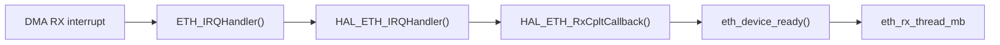
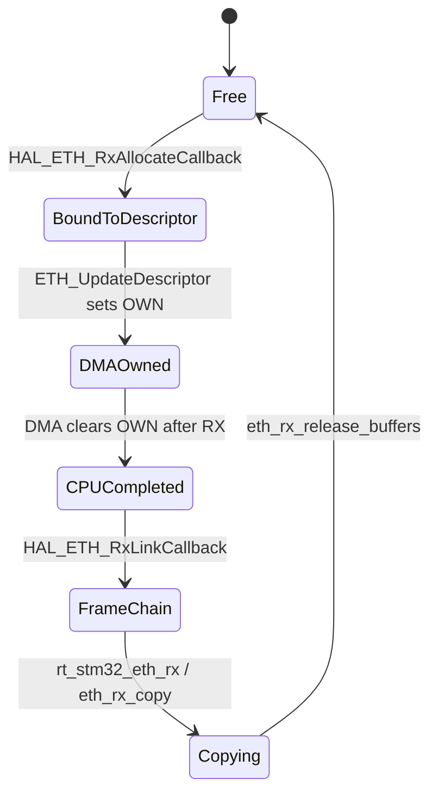
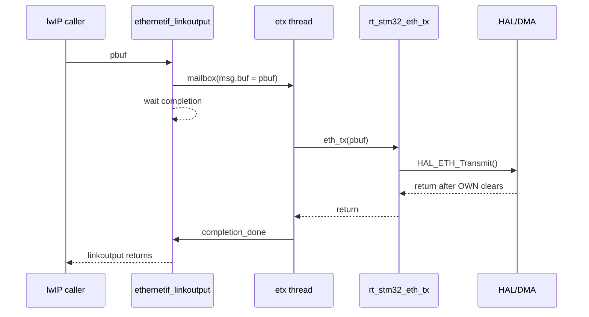
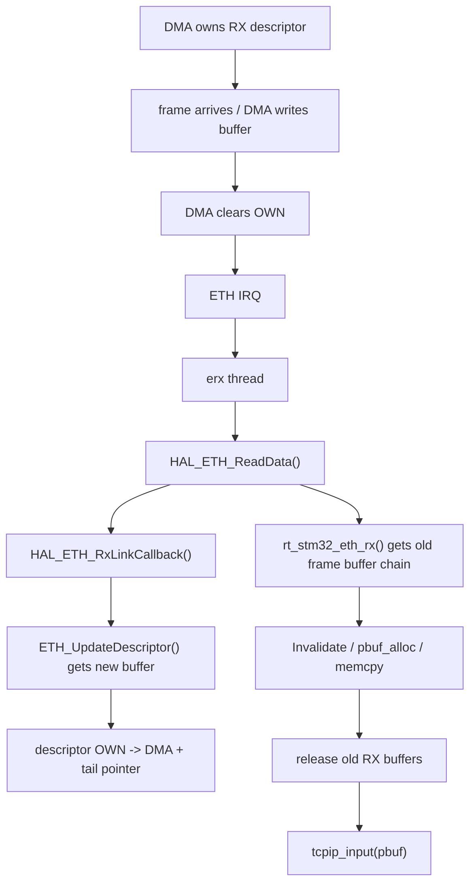
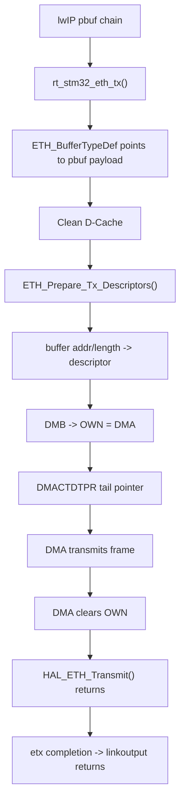

<meta name="referrer" content="no-referrer" />

# 教程 43：从 `ETH_IRQHandler()` 到 `HAL_ETH_Transmit()`——STM32H7 Ethernet DMA、Descriptor、Cache 与 Zero-copy 边界

> 摘要：沿 STM32H750 Ethernet RX/TX 真实源码追踪 descriptor OWN、buffer 生命周期、D-Cache maintenance、pbuf copy 与当前 TX zero-copy 边界。

[TOC]

DMA（Direct Memory Access，直接内存访问）允许 STM32 Ethernet 外设在不经过 CPU 逐字节搬运的情况下直接读写 SRAM。**Descriptor（DMA 描述符）** 是 DMA 使用的控制记录，保存 buffer 地址、长度和状态；本文反复出现的 **OWN bit** 表示某个 descriptor 当前由 DMA 还是 CPU 处理。STM32H7 的 Cortex-M7 又带有 **D-Cache（数据缓存）**，因此当 CPU 和 DMA 访问同一块 cacheable 内存时必须处理 **cache coherency（缓存一致性）**。所谓 **zero-copy（零拷贝）** 也不是“源码里没有 `memcpy()`”这么简单，而是 buffer 的所有权与生命周期能否在 lwIP、Driver 与 DMA 之间安全移交。[S4](#source-s4)[S5](#source-s5)[S6](#source-s6)

Stage 20/21 已经建立通用 DMA/zero-copy 与 descriptor ring 模型；Stage 43 只回答当前 STM32H750 Art-Pi 具体实现：**RX frame 如何从 DMA descriptor 进入 `pbuf`，TX `pbuf` 又如何直接成为 DMA source，以及 D-Cache 与 ownership 在这两条路径上分别在哪里处理。**

## 阅读源码前：建议提前阅读

1. [STM32H742/H743/H750 Reference Manual RM0433](https://www.st.com/resource/en/reference_manual/rm0433-stm32h742-stm32h743753-and-stm32h750-value-line-advanced-armbased-32bit-mcus-stmicroelectronics.pdf)
   - 用途：查 Ethernet DMA descriptor、OWN、buffer address 与 tail pointer（用于通知 DMA 环中可继续处理位置的尾指针/寄存器语义）。[S5](#source-s5)
2. [ST AN4839 — Level 1 cache on STM32F7/H7](https://www.st.com/resource/en/application_note/an4839-level-1-cache-on-stm32f7-series-and-stm32h7-series-stmicroelectronics.pdf)
   - 用途：理解 Cortex-M7 D-Cache 与 DMA 共享内存时为什么需要 Clean（把 cache 中已修改数据写回内存）、Invalidate（丢弃 cache 中可能过期的副本），或使用 MPU（Memory Protection Unit，内存保护单元）把 DMA 区域设成 non-cacheable。[S6](#source-s6)
3. [ST UM2217 — STM32H7 HAL and Low-Layer Drivers](https://www.st.com/resource/en/user_manual/um2217-stm32cubeh7-stm32cube-embedded-software-package-for-stm32h7-series-stmicroelectronics.pdf)
   - 用途：把 HAL ETH API contract 与 RT-Thread 当前 buffer/线程策略区分开。[S7](#source-s7)
4. [RT-Thread `drv_eth.c`（固定 commit）](https://github.com/RT-Thread/rt-thread/blob/dc8aaa73f2dbea255325ec058a083aeeb5381d0a/bsp/stm32/libraries/HAL_Drivers/drivers/drv_eth.c)
   - 用途：本文真正使用的 RX buffer pool、cache helper、`rt_stm32_eth_rx()` 与 `rt_stm32_eth_tx()` 实现。[S1](#source-s1)

## 进入 RX/TX 源码前：先认清三个对象和两个方向

| 对象 | 谁主要使用 | 作用 | 什么时候会改变 ownership |
| --- | --- | --- | --- |
| DMA descriptor | CPU + Ethernet DMA | 保存 buffer 地址、长度、状态/OWN | CPU 准备完交给 DMA；DMA 完成后交回 CPU |
| DMA buffer | Ethernet DMA + Driver | 承载真实 Ethernet frame bytes | RX/TX 生命周期中跟随 descriptor 被复用 |
| lwIP `pbuf` | lwIP + RT-Thread Port/Driver | 承载协议栈 packet view 与引用计数 | 是否能直接交给 DMA 取决于当前 TX/RX 策略 |

当前 Art-Pi 的 RX 与 TX 并不是对称的：RX 会把 DMA frame copy 到新分配的 `pbuf`；TX 则把 `pbuf` payload 地址直接交给 HAL/DMA，但 `HAL_ETH_Transmit()` 会阻塞到 descriptor OWN 清零后才返回，因此它不是异步 ownership-transfer 型 zero-copy。[S1](#source-s1)[S4](#source-s4)


这张图只建立 ownership 心智模型。下面仍从真实 RX interrupt 入口开始逐函数追踪；到 TX 部分再从 lwIP `pbuf` 的发送入口进入，不会用这张图替代源码链。

## 1. RX 的真实入口：`ETH_IRQHandler()` 只把执行权交给 HAL

Stage 42 已经建立初始化链。进入运行期后，一帧 Ethernet frame 被 MAC/DMA 收下并产生 RX interrupt，CPU 首先进入具体 STM32 ISR：[S1](#source-s1)

```c
void ETH_IRQHandler(void)
{
    rt_interrupt_enter();
    HAL_ETH_IRQHandler(&EthHandle);
    rt_interrupt_leave();
}
```

这个 ISR 不碰 pbuf，也不遍历 descriptor；它只建立 RT-Thread interrupt context，然后调用 ST HAL 的 `HAL_ETH_IRQHandler()`。

进入 `HAL_ETH_IRQHandler()` 后，RX interrupt 分支检查 `RI` 与 RX interrupt enable，清 pending bits，再调用 RX complete callback：[S4](#source-s4)

```c
  /* Packet received */
  if (((dma_flag & ETH_DMACSR_RI) != 0U) && ((dma_itsource & ETH_DMACIER_RIE) != 0U))
  {
    /* Clear the Eth DMA Rx IT pending bits */
    __HAL_ETH_DMA_CLEAR_IT(heth, ETH_DMACSR_RI | ETH_DMACSR_NIS);

#if (USE_HAL_ETH_REGISTER_CALLBACKS == 1)
    /*Call registered Receive complete callback*/
    heth->RxCpltCallback(heth);
#else
    /* Receive complete callback */
    HAL_ETH_RxCpltCallback(heth);
#endif  /* USE_HAL_ETH_REGISTER_CALLBACKS */
  }
```

当前 RT-Thread driver 使用 weak callback 方式，因此下一站是 `HAL_ETH_RxCpltCallback()`。

## 2. `HAL_ETH_RxCpltCallback()` 不读数据，只把工作从 ISR 交给 `erx` thread

RT-Thread 实现的 callback 只调用 `eth_device_ready()`：[S1](#source-s1)

```c
void HAL_ETH_RxCpltCallback(ETH_HandleTypeDef *heth)
{
    rt_err_t result;

    RT_UNUSED(heth);
    result = eth_device_ready(&(stm32_eth_device.parent));
    if (result != RT_EOK)
    {
        LOG_I("RxCpltCallback err = %d", result);
    }
}
```

进入 RT-Thread `ethernetif.c` 后，`eth_device_ready()` 用 `rx_notice` 避免在已有 pending RX notification 时反复向 mailbox 塞同一 device：[S3](#source-s3)

```c
rt_err_t eth_device_ready(struct eth_device* dev)
{
    if (dev->netif)
    {
        if(dev->rx_notice == RT_FALSE)
        {
            dev->rx_notice = RT_TRUE;
            return rt_mb_send(&eth_rx_thread_mb, (rt_ubase_t)dev);
        }
        else
            return RT_EOK;
        /* post message to Ethernet thread */
    }
    else
        return -RT_ERROR; /* netif is not initialized yet, just return. */
}
```

于是 RX 上半部到此结束：



这条异步边界非常重要：**descriptor walk、buffer allocation、cache maintenance、pbuf allocation 和 memcpy 全部发生在线程上下文，不在 ETH ISR 中。**

## 3. `eth_rx_thread_entry()` 才真正调用 `rt_stm32_eth_rx()`

`erx` thread 收到 `eth_device *` 后，会清掉 `rx_notice`，然后循环调用 `device->eth_rx()`，直到 driver 返回 `NULL`。[S3](#source-s3)

继续阅读 `eth_rx_thread_entry()` 的接收循环：

```c
            /* receive all of buffer */
            while (1)
            {
                if(device->eth_rx == RT_NULL) break;

                p = device->eth_rx(&(device->parent));
                if (p != RT_NULL)
                {
                    /* notify to upper layer */
                    if( device->netif->input(p, device->netif) != ERR_OK )
                    {
                        LWIP_DEBUGF(NETIF_DEBUG, ("ethernetif_input: Input error\n"));
                        pbuf_free(p);
                        p = NULL;
                    }
                }
                else break;
            }
```

Stage 42 已经证明 `device->eth_rx = rt_stm32_eth_rx`，而 `device->netif->input = tcpip_input`。因此现在可以把注意力完全放到中间这一步：**`rt_stm32_eth_rx()` 怎样把 DMA buffers 变成 lwIP pbuf。**

## 4. 进入 `rt_stm32_eth_rx()`：第一步不是分配 pbuf，而是 `HAL_ETH_ReadData()`

函数先取得 MAC mutex，确认 MAC 已启动，然后调用 HAL 读取已经完成的 RX descriptors：[S1](#source-s1)

```c
struct pbuf *rt_stm32_eth_rx(rt_device_t dev)
{
    HAL_StatusTypeDef state;
    rt_uint32_t frame_length = 0;
    struct pbuf *p = RT_NULL;
    struct rt_stm32_eth_rx_buffer *rx_buffer = RT_NULL;
    struct rt_stm32_eth_rx_buffer *current;

    RT_UNUSED(dev);

    if (rt_mutex_take(&stm32_eth_device.mac_lock, RT_WAITING_FOREVER) != RT_EOK)
    {
        return RT_NULL;
    }

    if (!stm32_eth_device.mac_started)
    {
        rt_mutex_release(&stm32_eth_device.mac_lock);
        return RT_NULL;
    }

    state = HAL_ETH_ReadData(&EthHandle, (void **)&rx_buffer);
    rt_mutex_release(&stm32_eth_device.mac_lock);

    if (state != HAL_OK)
    {
        return RT_NULL;
    }
```

这里第一次遇到 descriptor ownership。STM32H7 RX descriptor 中的 `OWN` bit 表示 descriptor 当前归 DMA 还是 CPU/HAL：DMA 拥有时 CPU 不能把它当成已完成 packet；DMA 收完 frame 后清除 OWN，HAL 才开始消费。[S4](#source-s4)[S5](#source-s5)

## 5. `HAL_ETH_ReadData()`：只处理 OWN 已经回到 CPU 的 RX descriptor

进入 `HAL_ETH_ReadData()` 后，HAL 从 `RxDescIdx` 取得当前 descriptor，并计算本轮最多能处理多少已完成 descriptor：[S4](#source-s4)

```c
  descidx = heth->RxDescList.RxDescIdx;
  dmarxdesc = (ETH_DMADescTypeDef *)heth->RxDescList.RxDesc[descidx];
  desccntmax = ETH_RX_DESC_CNT - heth->RxDescList.RxBuildDescCnt;

  /* Initialize timestamp to an invalid value before checking received descriptors */
  heth->RxDescList.TimeStamp.TimeStampHigh = UINT32_MAX;
  heth->RxDescList.TimeStamp.TimeStampLow  = UINT32_MAX;

  /* Check if descriptor is not owned by DMA */
  while ((READ_BIT(dmarxdesc->DESC3, ETH_DMARXNDESCWBF_OWN) == (uint32_t)RESET) && (desccnt < desccntmax)
         && (rxdataready == 0U))
  {
```

这段条件直接给出 RX 的核心所有权规则：

```text
OWN = 1  -> DMA 仍拥有 descriptor
OWN = 0  -> CPU/HAL 可以读取 descriptor write-back status
```

进入循环后，HAL 用 `FD`/`LD` 识别 frame first/last descriptor，计算当前 buffer 对应的 frame 片段长度。当 descriptor 对应 packet data 时，它调用 Rx Link Callback，把 DMA buffer 交给上层组织成一个 packet chain：[S4](#source-s4)

```c
      /* Link data */
#if (USE_HAL_ETH_REGISTER_CALLBACKS == 1)
      /*Call registered Link callback*/
      heth->rxLinkCallback(&heth->RxDescList.pRxStart, &heth->RxDescList.pRxEnd,
                           (uint8_t *)dmarxdesc->BackupAddr0, bufflength);
#else
      /* Link callback */
      HAL_ETH_RxLinkCallback(&heth->RxDescList.pRxStart, &heth->RxDescList.pRxEnd,
                             (uint8_t *)dmarxdesc->BackupAddr0, (uint16_t) bufflength);
#endif  /* USE_HAL_ETH_REGISTER_CALLBACKS */
      heth->RxDescList.RxDescCnt++;
      heth->RxDescList.RxDataLength += bufflength;

      /* Clear buffer pointer */
      dmarxdesc->BackupAddr0 = 0;
```

这里 `BackupAddr0` 被清零很关键：**这个 descriptor 原来使用的 RX buffer 已经被移交给当前 packet chain，descriptor 接下来必须拿到另一个可用 buffer 才能重新交给 DMA。**

继续阅读 `HAL_ETH_ReadData()`：HAL 随后推进 descriptor index，并累计需要 rebuild 的 descriptor 数量：[S4](#source-s4)

```c
    /* Increment current rx descriptor index */
    INCR_RX_DESC_INDEX(descidx, 1U);
    /* Get current descriptor address */
    dmarxdesc = (ETH_DMADescTypeDef *)heth->RxDescList.RxDesc[descidx];
    desccnt++;
  }

  heth->RxDescList.RxBuildDescCnt += desccnt;
  if ((heth->RxDescList.RxBuildDescCnt) != 0U)
  {
    /* Update Descriptors */
    ETH_UpdateDescriptor(heth);
  }
```

这就是接下来必须进入 `ETH_UpdateDescriptor()` 的直接 call site。

## 6. `HAL_ETH_RxLinkCallback()` 把 DMA buffer 串起来，但还没有创建 pbuf

在进入 descriptor rebuild 前，先看刚才同步调用的 `HAL_ETH_RxLinkCallback()`。RT-Thread driver 没有在这里分配 pbuf，而是把 `buff` 映射回自己的 `Rx_Buff_Info[index]`：[S1](#source-s1)

```c
void HAL_ETH_RxLinkCallback(void **pStart, void **pEnd, uint8_t *buff, uint16_t length)
{
    struct rt_stm32_eth_rx_buffer *rx_buffer = RT_NULL;
    rt_uint32_t index;

    for (index = 0; index < ETH_RX_BUFFER_CNT; index++)
    {
        if (buff == eth_rx_buffer_at(index))
        {
            rx_buffer = &Rx_Buff_Info[index];
            break;
        }
    }

    if (rx_buffer == RT_NULL)
    {
        return;
    }

    rx_buffer->length = length;
    rx_buffer->next = RT_NULL;
```

继续阅读 `HAL_ETH_RxLinkCallback()` 的后半段，它把一个 frame 的多个 DMA buffer metadata 串成链：[S1](#source-s1)

```c
    if (*pStart == RT_NULL)
    {
        *pStart = rx_buffer;
    }
    else
    {
        ((struct rt_stm32_eth_rx_buffer *)(*pEnd))->next = rx_buffer;
    }

    *pEnd = rx_buffer;
}
```

因此此时存在三类不同对象：

| 对象 | 保存什么 | 当前 owner/使用者 |
| --- | --- | --- |
| DMA descriptor | buffer address、status、OWN | HAL/DMA ring |
| `Rx_Buff_Storage[]` | 真正 Ethernet frame bytes | 已完成 frame 暂时占用 |
| `Rx_Buff_Info[]` | `allocated/length/next` metadata | RT-Thread driver |

**`Rx_Buff_Info` 不是 descriptor，也不是 lwIP pbuf。** 它只是 driver 在 HAL callback 和最终 pbuf copy 之间建立的一层软件 ownership metadata。

## 7. 为什么 RX buffer pool 是 descriptor 数量的两倍

当前 driver 定义：[S1](#source-s1)

```c
#define ETH_RX_BUFFER_CNT   (ETH_RX_DESC_CNT * 2U)
#define ETH_CACHE_LINE_SIZE 32U
```

并为每个 RX buffer 保存 `allocated` 状态：[S1](#source-s1)

```c
struct rt_stm32_eth_rx_buffer
{
    rt_uint16_t length;
    rt_bool_t allocated;
    struct rt_stm32_eth_rx_buffer *next;
};

static struct rt_stm32_eth_rx_buffer Rx_Buff_Info[ETH_RX_BUFFER_CNT];
```

把这个数量关系放回 `ETH_UpdateDescriptor()` 的运行时路径，可以确定它产生的直接效果：HAL 在 `HAL_ETH_ReadData()` 返回给 `rt_stm32_eth_rx()` 之前，就尝试重新给刚消费的 descriptors 补 buffer 并把 OWN 交回 DMA；但当前 frame 占用的旧 buffers 还要等 driver 完成 invalidate/copy 才能释放。因此额外的 free slots 允许“旧 frame 仍被 CPU 使用”和“RX ring 获得替换 buffer”发生重叠。

源码没有单独注释 `* 2U` 的设计理由，因此这里不把该倍数写成协议要求或作者明确声明的设计意图；能够由当前实现直接确认的是上述生命周期效果。[S1](#source-s1)[S4](#source-s4)

## 8. 进入 `ETH_UpdateDescriptor()`：重新分配 buffer，再把 OWN 交回 DMA

`HAL_ETH_ReadData()` 在退出 descriptor scan 前调用 `ETH_UpdateDescriptor()`。函数从 `RxBuildDescIdx` 开始，为需要 rebuild 的 descriptor 请求新 buffer：[S4](#source-s4)

```c
  while ((desccount > 0U) && (allocStatus != 0U))
  {
    /* Check if a buffer's attached the descriptor */
    if (READ_REG(dmarxdesc->BackupAddr0) == 0U)
    {
      /* Get a new buffer. */
#if (USE_HAL_ETH_REGISTER_CALLBACKS == 1)
      /*Call registered Allocate callback*/
      heth->rxAllocateCallback(&buff);
#else
      /* Allocate callback */
      HAL_ETH_RxAllocateCallback(&buff);
#endif  /* USE_HAL_ETH_REGISTER_CALLBACKS */
      if (buff == NULL)
      {
        allocStatus = 0U;
      }
      else
      {
        WRITE_REG(dmarxdesc->BackupAddr0, (uint32_t)buff);
        WRITE_REG(dmarxdesc->DESC0, (uint32_t)buff);
      }
    }
```

当前 callback `HAL_ETH_RxAllocateCallback()` 在 `Rx_Buff_Info[]` 中找 `allocated == RT_FALSE` 的 slot，标记占用并返回真实 DMA buffer 地址：[S1](#source-s1)

```c
void HAL_ETH_RxAllocateCallback(uint8_t **buff)
{
    rt_uint32_t index;

    *buff = RT_NULL;

    for (index = 0; index < ETH_RX_BUFFER_CNT; index++)
    {
        rt_uint32_t current = (rx_alloc_index + index) % ETH_RX_BUFFER_CNT;

        if (Rx_Buff_Info[current].allocated == RT_FALSE)
        {
            Rx_Buff_Info[current].allocated = RT_TRUE;
            Rx_Buff_Info[current].length = 0;
            Rx_Buff_Info[current].next = RT_NULL;
            rx_alloc_index = (current + 1U) % ETH_RX_BUFFER_CNT;
            *buff = eth_rx_buffer_at(current);
            break;
        }
    }
}
```

回到 `ETH_UpdateDescriptor()`。拿到 buffer 后，当前 HAL 实现先把地址写进 `BackupAddr0/DESC0`，随后才写 `DESC3` 的 OWN/BUF1V。这个先后顺序可以直接从当前源码确认；源码本身没有在这里单独注释其设计理由，因此这里只把它作为当前实现的 ownership handoff 顺序来解释：[S4](#source-s4)

```c
    if (allocStatus != 0U)
    {

      if (heth->RxDescList.ItMode != 0U)
      {
        WRITE_REG(dmarxdesc->DESC3, ETH_DMARXNDESCRF_OWN | ETH_DMARXNDESCRF_BUF1V | ETH_DMARXNDESCRF_IOC);
      }
      else
      {
        WRITE_REG(dmarxdesc->DESC3, ETH_DMARXNDESCRF_OWN | ETH_DMARXNDESCRF_BUF1V);
      }

      /* Increment current rx descriptor index */
      INCR_RX_DESC_INDEX(descidx, 1U);
      /* Get current descriptor address */
      dmarxdesc = (ETH_DMADescTypeDef *)heth->RxDescList.RxDesc[descidx];
      desccount--;
    }
  }
```

只要本轮至少 rebuild 一个 descriptor，HAL 还会先执行 `__DMB()`，再更新 RX tail pointer：[S4](#source-s4)

```c
  if (heth->RxDescList.RxBuildDescCnt != desccount)
  {
    /* Set the tail pointer index */
    tailidx = (ETH_RX_DESC_CNT + descidx - 1U) % ETH_RX_DESC_CNT;

    /* DMB instruction to avoid race condition */
    __DMB();

    /* Set the Tail pointer address */
    WRITE_REG(heth->Instance->DMACRDTPR, ((uint32_t)(heth->Init.RxDesc + (tailidx))));

    heth->RxDescList.RxBuildDescIdx = descidx;
    heth->RxDescList.RxBuildDescCnt = desccount;
  }
```

到这里，刚才被 CPU 消费的 RX descriptor 已经获得新 buffer 并重新进入 DMA 可用 ring；而旧 frame buffers 仍由 `rx_buffer` metadata chain 暂时持有。

## 9. `HAL_ETH_ReadData()` 返回 packet chain 后，driver 才处理 Cache 与 pbuf

descriptor rebuild 完成后，`HAL_ETH_ReadData()` 把 `pRxStart` 返回给调用者，然后清空该 pointer：[S4](#source-s4)

```c
  if (rxdataready == 1U)
  {
    /* Return received packet */
    *pAppBuff = heth->RxDescList.pRxStart;
    /* Reset first element */
    heth->RxDescList.pRxStart = NULL;

    return HAL_OK;
  }

  /* Packet not ready */
  return HAL_ERROR;
```

执行回到 `rt_stm32_eth_rx()`。此时 `rx_buffer` 指向的是 RT-Thread metadata chain。driver 先统计总 frame length，同时对每一段真实 DMA buffer 调用 `eth_invalidate_cache()`：[S1](#source-s1)

```c
    for (current = rx_buffer; current != RT_NULL; current = current->next)
    {
        rt_uint32_t index = (rt_uint32_t)(current - Rx_Buff_Info);

        frame_length += current->length;
        eth_invalidate_cache(eth_rx_buffer_at(index), current->length);
    }
```

Cache coherency 在这里第一次真正参与 RX 数据面：DMA 已经把新 frame 写到内存，CPU 在读取这些 bytes 之前不能继续使用可能存在的 stale cache line。当前 generic helper 会把维护范围扩到完整 32-byte cache line，并在 D-Cache 实际开启时调用 CMSIS invalidate：[S1](#source-s1)

```c
static void eth_invalidate_cache(const void *buffer, rt_size_t length)
{
#if defined(__DCACHE_PRESENT) && (__DCACHE_PRESENT == 1U)
    rt_uintptr_t start;
    rt_uintptr_t end;

    if ((SCB->CCR & SCB_CCR_DC_Msk) == 0U)
    {
        return;
    }

    start = RT_ALIGN_DOWN((rt_uintptr_t)buffer, ETH_CACHE_LINE_SIZE);
    end = RT_ALIGN((rt_uintptr_t)buffer + length, ETH_CACHE_LINE_SIZE);
    SCB_InvalidateDCache_by_Addr((uint32_t *)start, (int32_t)(end - start));
#else
    RT_UNUSED(buffer);
    RT_UNUSED(length);
#endif
}
```

Art-Pi 当前把 descriptor 与 `Rx_Buff_Storage` 所在 `0x30040000` region 配成 non-cacheable/shareable，所以这块固定 DMA memory 的一致性主要由 MPU memory attribute 保证；driver 仍保留通用 cache helper，使同一 driver 代码能覆盖其他 cache policy。[S2](#source-s2)[S6](#source-s6) 不能把这一板级策略泛化成所有 STM32H7 Ethernet Port 都必须使用同样地址或 MPU region。

## 10. 当前 RX 不是 zero-copy：`pbuf_alloc()` 后发生一次完整 frame copy

继续阅读 `rt_stm32_eth_rx()`。获得总长度后，driver 分配新的 `PBUF_RAM`，再调用 `eth_rx_copy()`：[S1](#source-s1)

```c
    p = pbuf_alloc(PBUF_RAW, frame_length, PBUF_RAM);
    if ((p != RT_NULL) && (eth_rx_copy(p, rx_buffer) != RT_EOK))
    {
        pbuf_free(p);
        p = RT_NULL;
    }

    eth_rx_release_buffers(rx_buffer);
    return p;
}
```

`eth_rx_copy()` 同时遍历 DMA buffer metadata chain 和 lwIP pbuf chain，用 `rt_memcpy()` 把 bytes 搬过去：[S1](#source-s1)

```c
static rt_err_t eth_rx_copy(struct pbuf *p, struct rt_stm32_eth_rx_buffer *rx_buffer)
{
    struct pbuf *q = p;
    rt_size_t q_offset = 0;

    while (rx_buffer != RT_NULL)
    {
        rt_uint32_t index = (rt_uint32_t)(rx_buffer - Rx_Buff_Info);
        rt_size_t rx_offset = 0;

        while (rx_offset < rx_buffer->length)
        {
            rt_size_t copy_length;
            rt_size_t rx_remaining;
            rt_size_t q_remaining;

            while ((q != RT_NULL) && (q_offset == q->len))
            {
                q = q->next;
                q_offset = 0;
            }

            if (q == RT_NULL)
            {
                return -RT_ERROR;
            }
```

继续阅读同一个 `eth_rx_copy()`，真正的 copy 发生在这里：[S1](#source-s1)

```c
            rx_remaining = (rt_size_t)rx_buffer->length - rx_offset;
            q_remaining = (rt_size_t)q->len - q_offset;
            copy_length = rx_remaining < q_remaining ? rx_remaining : q_remaining;
            rt_memcpy((rt_uint8_t *)q->payload + q_offset,
                      eth_rx_buffer_at(index) + rx_offset, copy_length);
            rx_offset += copy_length;
            q_offset += copy_length;
        }

        rx_buffer = rx_buffer->next;
    }

    return RT_EOK;
}
```

因此当前 RX 明确是：


这里不能称为 RX zero-copy。

## 11. `eth_rx_release_buffers()` 才把旧 DMA buffers 重新放回软件 free pool

pbuf copy 完成以后，driver 才释放本 frame 使用过的 `Rx_Buff_Info` slots：[S1](#source-s1)

```c
static void eth_rx_release_buffers(struct rt_stm32_eth_rx_buffer *rx_buffer)
{
    while (rx_buffer != RT_NULL)
    {
        struct rt_stm32_eth_rx_buffer *next = rx_buffer->next;

        rx_buffer->length = 0;
        rx_buffer->next = RT_NULL;
        rx_buffer->allocated = RT_FALSE;
        rx_buffer = next;
    }
}
```

注意这个“释放”不是 `free()` DMA memory；它只是把固定 buffer pool 中的 slot 重新标成可分配。下一次 `HAL_ETH_RxAllocateCallback()` 才可能重新把这些 buffers 绑定到 descriptors。

所以一块 RX buffer 的完整软件生命周期是：



这张图才解释了为什么“descriptor 已经重新给 DMA”与“旧 frame buffer 仍被 CPU 使用”可以同时成立：rebuild 时 descriptor 获得的是另一个 free buffer。

## 12. RX zero-copy 的真正变化是 buffer ownership

当前 `PBUF_RAM + memcpy` 把 DMA buffer 与 lwIP pbuf 生命周期彻底解耦。若移除 `eth_rx_copy()`，必须改成 custom pbuf/free callback 或等价机制，让 **pbuf 最后一个引用释放之后** 才把 DMA buffer 归还 pool，并保证 descriptor 不会提前重新绑定同一 buffer；多 descriptor frame、cache-line alignment 与 invalidate 也必须纳入同一个 ownership contract。Stage 20 已经建立这些通用原则，这里不再重复展开。

## 13. RX Buffer Unavailable 为什么也会唤醒 `erx`

RX ring 可能因为没有可用 buffer/descriptor 而出现 `ETH_DMA_RX_BUFFER_UNAVAILABLE_FLAG`。当前 `HAL_ETH_ErrorCallback()` 对这个条件不直接 reset MAC，而是再次调用 `eth_device_ready()`：[S1](#source-s1)

```c
void HAL_ETH_ErrorCallback(ETH_HandleTypeDef *heth)
{
    uint32_t error = HAL_ETH_GetError(heth);
    uint32_t dma_error = HAL_ETH_GetDMAError(heth);
    uint32_t mac_error = HAL_ETH_GetMACError(heth);

    if ((dma_error & ETH_DMA_RX_BUFFER_UNAVAILABLE_FLAG) != 0U)
    {
        /* HAL_ETH_ReadData() replenishes the descriptors and resumes Rx DMA. */
        (void)eth_device_ready(&(stm32_eth_device.parent));
        dma_error &= ~(ETH_DMA_RX_BUFFER_UNAVAILABLE_FLAG | ETH_DMA_ABNORMAL_SUMMARY_FLAG);
    }
```

注释已经说明当前恢复策略：让 `erx` 再次进入 `HAL_ETH_ReadData()`，由其 `ETH_UpdateDescriptor()` 尝试 replenish descriptor 并更新 tail pointer。这里再次体现 ISR/error callback 只负责通知，复杂恢复仍放到 thread context。

## 14. TX 从 `pbuf` chain 开始：driver 直接把 payload 地址交给 HAL

现在切换到 TX。Stage 42 已经证明：

```text
lwIP netif->linkoutput
  -> ethernetif_linkoutput()
  -> eth_tx_thread_entry()
  -> rt_stm32_eth_tx()
```

进入 `rt_stm32_eth_tx()` 后，driver 在栈上建立 `ETH_BufferTypeDef tx_buffer[ETH_TX_DESC_CNT]`，然后遍历 lwIP pbuf chain。每个 element 直接保存 `q->payload` 地址与 `q->len`，没有先 memcpy 到独立 TX DMA buffer：[S1](#source-s1)

```c
rt_err_t rt_stm32_eth_tx(rt_device_t dev, struct pbuf *p)
{
    HAL_StatusTypeDef state;
    ETH_BufferTypeDef tx_buffer[ETH_TX_DESC_CNT];
    struct pbuf *q;
    rt_uint32_t index = 0;
    rt_uint32_t frame_length = 0;

    RT_UNUSED(dev);

    if (!stm32_eth_device.parent.link_status)
    {
        LOG_D("skip transmit: link down");
        return ERR_IF;
    }

    rt_memset(tx_buffer, 0, sizeof(tx_buffer));

    for (q = p; q != RT_NULL; q = q->next)
    {
        if (index >= ETH_TX_DESC_CNT)
        {
            return ERR_IF;
        }

        tx_buffer[index].buffer = q->payload;
        tx_buffer[index].len = q->len;
        frame_length += q->len;
```

因此当前 TX 的第一层 boundary 是：

```text
lwIP pbuf payload
    -> ETH_BufferTypeDef.buffer
    -> HAL TX descriptor buffer address
    -> DMA reads payload directly
```

这意味着 payload 本身没有发生 driver-side copy。

## 15. TX 为什么必须在交给 DMA 前 `Clean` D-Cache

继续阅读 `rt_stm32_eth_tx()` 的同一个 pbuf loop。每个 payload 地址填入 HAL buffer chain 后立即执行 `eth_clean_cache()`：[S1](#source-s1)

```c
        if (index > 0U)
        {
            tx_buffer[index - 1U].next = &tx_buffer[index];
        }

        eth_clean_cache(q->payload, q->len);
        index++;
    }
```

RX 固定 buffers 位于 Art-Pi non-cacheable region，但 TX `q->payload` 来自 lwIP 内存体系，不保证位于那个 region。CPU 可能已经修改 payload，而最新 bytes 只存在 dirty D-Cache line 中；DMA 直接读 SRAM 就可能拿到旧数据。因此当前 driver 在 DMA 使用 payload 前做 clean。[S1](#source-s1)[S6](#source-s6)

`eth_clean_cache()` 与 RX invalidate 使用同一 32-byte 对齐策略：[S1](#source-s1)

```c
static void eth_clean_cache(const void *buffer, rt_size_t length)
{
#if defined(__DCACHE_PRESENT) && (__DCACHE_PRESENT == 1U)
    rt_uintptr_t start;
    rt_uintptr_t end;

    if ((SCB->CCR & SCB_CCR_DC_Msk) == 0U)
    {
        return;
    }

    start = RT_ALIGN_DOWN((rt_uintptr_t)buffer, ETH_CACHE_LINE_SIZE);
    end = RT_ALIGN((rt_uintptr_t)buffer + length, ETH_CACHE_LINE_SIZE);
    SCB_CleanDCache_by_Addr((uint32_t *)start, (int32_t)(end - start));
#else
    RT_UNUSED(buffer);
    RT_UNUSED(length);
#endif
}
```

Clean 与 Invalidate 的方向不能记反：

| 方向 | 谁产生最新数据 | CPU cache 风险 | 当前动作 |
| --- | --- | --- | --- |
| TX | CPU | dirty line 尚未写回 SRAM | Clean，先让 DMA 能读到最新 bytes |
| RX | DMA | CPU 可能持有旧 line | Invalidate，CPU 随后重新从内存读取 |

当前 helper 对起止地址做 cache-line 扩展，也意味着 DMA buffer/payload 与其他可写对象混在同一 cache line 时要谨慎；cache maintenance 的粒度不是 Ethernet frame 字节，而是 cache line。[S6](#source-s6)

## 16. 回到 `rt_stm32_eth_tx()`：`HAL_ETH_Transmit()` 前还有 link/MAC 状态门槛

pbuf chain 转成 HAL buffer chain 后，driver 获取 MAC mutex，并再次检查 link 与 `mac_started`，避免 Link 状态在准备 TX 过程中改变：[S1](#source-s1)

```c
    if (rt_mutex_take(&stm32_eth_device.mac_lock, RT_WAITING_FOREVER) != RT_EOK)
    {
        return ERR_IF;
    }

    if (!stm32_eth_device.parent.link_status || !stm32_eth_device.mac_started)
    {
        rt_mutex_release(&stm32_eth_device.mac_lock);
        return ERR_IF;
    }

    TxConfig.Length = frame_length;
    TxConfig.TxBuffer = tx_buffer;
    state = HAL_ETH_Transmit(&EthHandle, &TxConfig, 1000);
    rt_mutex_release(&stm32_eth_device.mac_lock);
```

现在进入 ST HAL 的 blocking transmit path。

## 17. `HAL_ETH_Transmit()` 先调用 `ETH_Prepare_Tx_Descriptors()`

`HAL_ETH_Transmit()` 要求 HAL state 已经 STARTED；然后把 `TxConfig` 交给 `ETH_Prepare_Tx_Descriptors()`：[S4](#source-s4)

```c
  if (heth->gState == HAL_ETH_STATE_STARTED)
  {
    /* Config DMA Tx descriptor by Tx Packet info */
    if (ETH_Prepare_Tx_Descriptors(heth, pTxConfig, 0) != HAL_ETH_ERROR_NONE)
    {
      /* Set the ETH error code */
      heth->ErrorCode |= HAL_ETH_ERROR_BUSY;
      return HAL_ERROR;
    }

    /* Ensure completion of descriptor preparation before transmission start */
    __DSB();
```

进入 `ETH_Prepare_Tx_Descriptors()` 后，HAL 首先检查当前 descriptor 是否仍由 DMA 拥有，或者 software 仍记录 packet address；任一成立都不能复用这个 descriptor：[S4](#source-s4)

```c
  /* Current Tx Descriptor Owned by DMA: cannot be used by the application  */
  if ((READ_BIT(dmatxdesc->DESC3, ETH_DMATXNDESCWBF_OWN) == ETH_DMATXNDESCWBF_OWN)
      || (dmatxdesclist->PacketAddress[descidx] != NULL))
  {
    return HAL_ETH_ERROR_BUSY;
  }
```

这就是 TX 的 ownership gate：CPU/HAL 只有在 descriptor 不归 DMA 时才能重新填写。

## 18. `ETH_Prepare_Tx_Descriptors()` 把 `q->payload` 地址写入 descriptor，再设置 OWN

当前 `TxConfig` 只启用 CRC/PAD，并可能启用 checksum offload，不使用 VLAN/TSO context descriptor。因此主线进入 normal descriptor configuration。HAL 把 `txbuffer->buffer` 和 length 直接写进 descriptor：[S4](#source-s4)

```c
  /* Set header or buffer 1 address */
  WRITE_REG(dmatxdesc->DESC0, (uint32_t)txbuffer->buffer);
  /* Set header or buffer 1 Length */
  MODIFY_REG(dmatxdesc->DESC2, ETH_DMATXNDESCRF_B1L, txbuffer->len);

  if (txbuffer->next != NULL)
  {
    txbuffer = txbuffer->next;
    /* Set buffer 2 address */
    WRITE_REG(dmatxdesc->DESC1, (uint32_t)txbuffer->buffer);
    /* Set buffer 2 Length */
    MODIFY_REG(dmatxdesc->DESC2, ETH_DMATXNDESCRF_B2L, (txbuffer->len << 16));
  }
  else
  {
    WRITE_REG(dmatxdesc->DESC1, 0x0U);
    /* Set buffer 2 Length */
    MODIFY_REG(dmatxdesc->DESC2, ETH_DMATXNDESCRF_B2L, 0x0U);
  }
```

函数继续设置 frame length/checksum/CRC policy，再标记 first descriptor。最关键的顺序是：**先写完 descriptor 内容，执行 `__DMB()`，最后才设置 OWN。**[S4](#source-s4)

```c
  /* Mark it as First Descriptor */
  SET_BIT(dmatxdesc->DESC3, ETH_DMATXNDESCRF_FD);
  /* Mark it as NORMAL descriptor */
  CLEAR_BIT(dmatxdesc->DESC3, ETH_DMATXNDESCRF_CTXT);
  /* Ensure rest of descriptor is written to RAM before the OWN bit */
  __DMB();
  /* set OWN bit of FIRST descriptor */
  SET_BIT(dmatxdesc->DESC3, ETH_DMATXNDESCRF_OWN);
```

这个 barrier/OWN 顺序是硬件 ownership handoff 的核心：DMA 看到 OWN 之前，descriptor 中用于本次 packet 的 buffer address、length 和 control fields 必须已经对系统可见。[S4](#source-s4)[S5](#source-s5)

对于更长的 buffer chain，函数会推进 descriptor index、检查下一个 descriptor 仍不属于 DMA，然后继续把后续 buffer 地址写入 ring；最后一个 descriptor 被标记 `LD`，并更新 `CurTxDesc`。[S4](#source-s4)

## 19. 回到 `HAL_ETH_Transmit()`：Tail Pointer 真正通知 DMA，然后阻塞等待 OWN 清零

`ETH_Prepare_Tx_Descriptors()` 返回成功以后，`HAL_ETH_Transmit()` 取得当前 packet 的最后 descriptor，推进软件 index，然后写 `DMACTDTPR`：[S4](#source-s4)

```c
    dmatxdesc = (ETH_DMADescTypeDef *)(&heth->TxDescList)->TxDesc[heth->TxDescList.CurTxDesc];

    /* Incr current tx desc index */
    INCR_TX_DESC_INDEX(heth->TxDescList.CurTxDesc, 1U);

    /* Start transmission */
    /* issue a poll command to Tx DMA by writing address of next immediate free descriptor */
    WRITE_REG(heth->Instance->DMACTDTPR, (uint32_t)(heth->TxDescList.TxDesc[heth->TxDescList.CurTxDesc]));
```

继续阅读 `HAL_ETH_Transmit()`：这个 API 不是立即返回，而是轮询 `dmatxdesc->DESC3 & OWN`，直到 DMA 释放 descriptor 或出现 DMA error/timeout：[S4](#source-s4)

```c
    /* Wait for data to be transmitted or timeout occurred */
    while ((dmatxdesc->DESC3 & ETH_DMATXNDESCWBF_OWN) != (uint32_t)RESET)
    {
      if ((heth->Instance->DMACSR & ETH_DMACSR_FBE) != (uint32_t)RESET)
      {
        heth->ErrorCode |= HAL_ETH_ERROR_DMA;
        heth->DMAErrorCode = heth->Instance->DMACSR;
        /* Return function status */
        return HAL_ERROR;
      }

      /* Check for the Timeout */
      if (Timeout != HAL_MAX_DELAY)
      {
        if (((HAL_GetTick() - tickstart) > Timeout) || (Timeout == 0U))
        {
          heth->ErrorCode |= HAL_ETH_ERROR_TIMEOUT;
          /* Clear TX descriptor so that we can proceed */
          dmatxdesc->DESC3 = (ETH_DMATXNDESCWBF_FD | ETH_DMATXNDESCWBF_LD);
          return HAL_ERROR;
        }
      }
    }
```

这解释了当前 driver 为什么可以让 `ETH_BufferTypeDef tx_buffer[]` 放在 `rt_stm32_eth_tx()` 栈上，也解释了 pbuf payload 的 lifetime：HAL 已经把 buffer 地址复制进 DMA descriptors，而且 `HAL_ETH_Transmit()` 在 DMA 清 OWN 前不会正常返回。

## 20. 当前 TX 是“payload 不复制”，但不是异步 ownership-transfer zero-copy

从 lwIP 到 DMA 的 payload path 是：


因此当前 driver 没有像 RX 那样做 `pbuf -> DMA TX buffer` memcpy，可以称为 **TX payload no-copy / zero-copy at the driver payload boundary**。

但它不是一个完全异步的 ownership-transfer 模型。RT-Thread `ethernetif_linkoutput()` 把 pbuf pointer 发给 TX thread后等待 completion，TX thread 又要等 `rt_stm32_eth_tx()` 返回才 `rt_completion_done()`；而 `rt_stm32_eth_tx()` 内部的 `HAL_ETH_Transmit()` 本身阻塞到 DMA 清掉 OWN。于是原 pbuf 生命周期被同步调用链自然 pin 住：[S1](#source-s1)[S3](#source-s3)[S4](#source-s4)



如果未来换成完全异步 `HAL_ETH_Transmit_IT()` 并立即返回，就必须新增 pbuf ref/pin 与 TxComplete 后释放的 ownership contract，不能直接照搬当前 stack-local `tx_buffer[]` 与同步 completion 设计。

## 21. Art-Pi 为什么把 descriptor/RX buffer 放进 non-cacheable region

当前 H750 driver 为 descriptor 和 RX buffers 使用专门 section；Art-Pi `mpu_init()` 把 `0x30040000` 起 32 KB region 设置为 non-cacheable、shareable：[S1](#source-s1)[S2](#source-s2)

```c
#ifdef BSP_USING_ETH_H750
    /* Configure the MPU attributes as Device not cacheable
       for ETH DMA descriptors and RX Buffers*/
    MPU_InitStruct.Enable = MPU_REGION_ENABLE;
    MPU_InitStruct.BaseAddress = 0x30040000;
    MPU_InitStruct.Size = MPU_REGION_SIZE_32KB;
    MPU_InitStruct.AccessPermission = MPU_REGION_FULL_ACCESS;
    MPU_InitStruct.IsBufferable = MPU_ACCESS_NOT_BUFFERABLE;
    MPU_InitStruct.IsCacheable = MPU_ACCESS_NOT_CACHEABLE;
    MPU_InitStruct.IsShareable = MPU_ACCESS_SHAREABLE;
    MPU_InitStruct.Number = MPU_REGION_NUMBER2;
    MPU_InitStruct.TypeExtField = MPU_TEX_LEVEL1;
    MPU_InitStruct.SubRegionDisable = 0x00;
    MPU_InitStruct.DisableExec = MPU_INSTRUCTION_ACCESS_ENABLE;

    HAL_MPU_ConfigRegion(&MPU_InitStruct);
#endif
```

这是一项明确的 board memory-policy 选择：固定 descriptor/RX-buffer 区域通过 MPU 设为 non-cacheable，避免 CPU/DMA 对 OWN、地址和 RX 数据产生 cache alias；普通 lwIP TX payload 不享有该 MPU 属性，所以 Driver 仍必须在 DMA 读取前显式 clean cache。[S2](#source-s2)[S5](#source-s5)[S6](#source-s6)

## 22. RX 与 TX 两条生命周期现在可以完整闭环

RX：



TX：



这两条链把 Stage 20/21 的抽象边界落到真实 STM32H750 Port：descriptor 管 ownership/status，buffer 承载 DMA 数据，pbuf 承载 lwIP packet。zero-copy 是否成立最终取决于 buffer 生命周期能否跨 DMA 与协议栈安全移交，而不是只看有没有 `memcpy()`。

## 资料来源

<a id="source-s1"></a>
### [S1] RT-Thread STM32 HAL Ethernet Driver
- 类型：RT-Thread 官方仓库源码
- 版本：commit `dc8aaa73f2dbea255325ec058a083aeeb5381d0a`，2026-09-28
- 定位：`bsp/stm32/libraries/HAL_Drivers/drivers/drv_eth.c`：RX buffer pool、cache helpers、`rt_stm32_eth_rx()`、`rt_stm32_eth_tx()`、IRQ callbacks、DMA memory allocation
- URL/文档：[RT-Thread drv_eth.c](https://github.com/RT-Thread/rt-thread/blob/dc8aaa73f2dbea255325ec058a083aeeb5381d0a/bsp/stm32/libraries/HAL_Drivers/drivers/drv_eth.c)
- 使用位置：Stage 43 RX/TX 数据面主线
- 支撑内容：证明当前 driver 的 buffer ownership、RX copy、TX direct payload、cache maintenance 与 error recovery 方式

<a id="source-s2"></a>
### [S2] STM32H750 Art-Pi linker/MPU/Kconfig
- 类型：RT-Thread 官方板级源码
- 版本：同上
- 定位：`board/linker_scripts/link.lds`、`board/port/drv_mpu.c`、`board/Kconfig`
- URL/文档：[Art-Pi link.lds](https://github.com/RT-Thread/rt-thread/blob/dc8aaa73f2dbea255325ec058a083aeeb5381d0a/bsp/stm32/stm32h750-artpi/board/linker_scripts/link.lds)、[Art-Pi drv_mpu.c](https://github.com/RT-Thread/rt-thread/blob/dc8aaa73f2dbea255325ec058a083aeeb5381d0a/bsp/stm32/stm32h750-artpi/board/port/drv_mpu.c)、[Art-Pi Kconfig](https://github.com/RT-Thread/rt-thread/blob/dc8aaa73f2dbea255325ec058a083aeeb5381d0a/bsp/stm32/stm32h750-artpi/board/Kconfig)
- 使用位置：“DMA memory placement”“D-Cache 与 non-cacheable region”
- 支撑内容：证明 descriptor/RX buffer 的固定地址、MPU 属性和 Art-Pi D-Cache 配置背景

<a id="source-s3"></a>
### [S3] RT-Thread lwIP Ethernet Port
- 类型：RT-Thread 官方仓库源码
- 版本：同上
- 定位：`components/net/lwip/port/ethernetif.c`：`eth_device_ready()`、`eth_rx_thread_entry()`、`ethernetif_linkoutput()`、`eth_tx_thread_entry()`
- URL/文档：[RT-Thread ethernetif.c](https://github.com/RT-Thread/rt-thread/blob/dc8aaa73f2dbea255325ec058a083aeeb5381d0a/components/net/lwip/port/ethernetif.c)
- 使用位置：“ISR 到 erx”“TX pbuf lifetime bridge”“pbuf 进入 tcpip_input”
- 支撑内容：说明具体 STM32 DMA driver 与 lwIP pbuf 数据路径之间的 RTOS bridge

<a id="source-s4"></a>
### [S4] ST STM32H7 HAL Ethernet Driver
- 类型：ST 官方 HAL 源码
- 版本：commit `7e541d92019e18f98d211fc4ab9197ec8e8105f6`，2026-09-29
- 定位：`Src/stm32h7xx_hal_eth.c`：`HAL_ETH_IRQHandler()`、`HAL_ETH_ReadData()`、`ETH_UpdateDescriptor()`、`HAL_ETH_Transmit()`、`ETH_Prepare_Tx_Descriptors()`
- URL/文档：[STM32H7 HAL ETH source](https://github.com/STMicroelectronics/stm32h7xx-hal-driver/blob/7e541d92019e18f98d211fc4ab9197ec8e8105f6/Src/stm32h7xx_hal_eth.c)
- 使用位置：“RX descriptor 回收/重建”“TX descriptor OWN 与 blocking transmit”
- 支撑内容：证明 HAL 怎样读取 CPU-owned RX descriptors、补 buffer、更新 tail pointer，以及怎样准备 TX descriptors 并等待 DMA 释放 OWN

<a id="source-s5"></a>
### [S5] STM32H742/H743/H750 Reference Manual RM0433
- 类型：ST 官方参考手册
- 版本：RM0433 Rev 8
- URL/文档：[RM0433](https://www.st.com/resource/en/reference_manual/rm0433-stm32h742-stm32h743753-and-stm32h750-value-line-advanced-armbased-32bit-mcus-stmicroelectronics.pdf)
- 使用位置：“DMA descriptor/OWN/tail pointer 的硬件语义”
- 支撑内容：说明 RX/TX DMA、descriptor ring、ownership、buffer address 与 tail pointer 驱动模型

<a id="source-s6"></a>
### [S6] ST AN4839 — Level 1 cache on STM32F7/H7
- 类型：ST 官方 Application Note
- 版本：AN4839 Rev 2
- URL/文档：[AN4839](https://www.st.com/resource/en/application_note/an4839-level-1-cache-on-stm32f7-series-and-stm32h7-series-stmicroelectronics.pdf)
- 使用位置：“CPU/DMA cache coherency”“Clean/Invalidate 与 non-cacheable MPU 方案”
- 支撑内容：说明 Cortex-M7 cache 与 DMA 共享 SRAM 时的数据一致性风险，以及软件 cache maintenance/MPU memory attribute 的处理方式

<a id="source-s7"></a>
### [S7] ST UM2217 — STM32H7 HAL and Low-Layer Drivers
- 类型：芯片厂商官方 HAL 用户手册
- 版本：UM2217 Rev 6，访问日期 2026-10-03
- URL/文档：[Description of STM32H7 HAL and low-layer drivers](https://www.st.com/resource/en/user_manual/um2217-stm32cubeh7-stm32cube-embedded-software-package-for-stm32h7-series-stmicroelectronics.pdf)
- 使用位置：开篇 HAL ETH contract、RX/TX HAL API 边界
- 支撑内容：定义 `HAL_ETH_Start[_IT]`、Ethernet MAC/DMA 配置以及 HAL ETH 收发接口，用于区分 ST HAL API contract 与当前 RT-Thread Driver 的具体 buffer/线程策略
