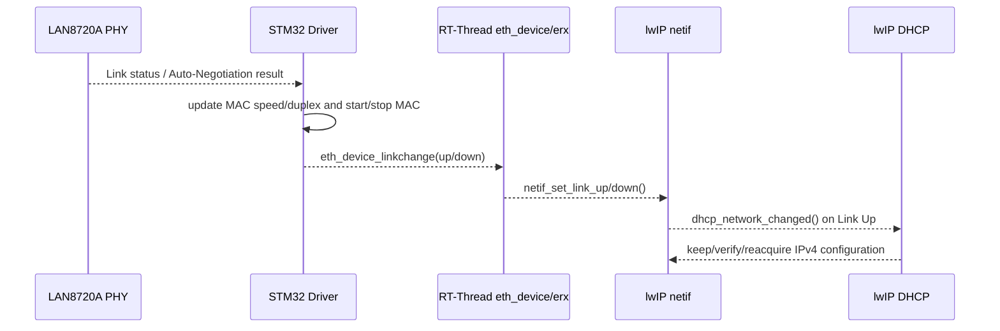
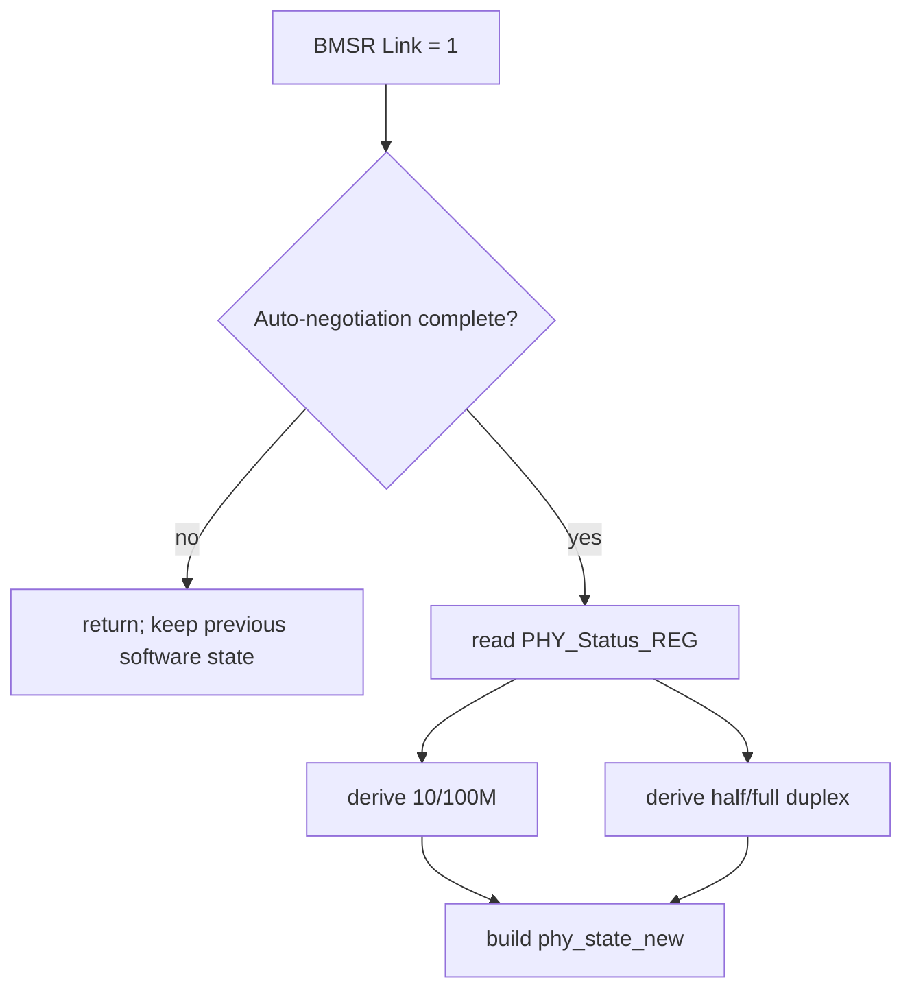
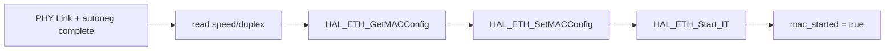
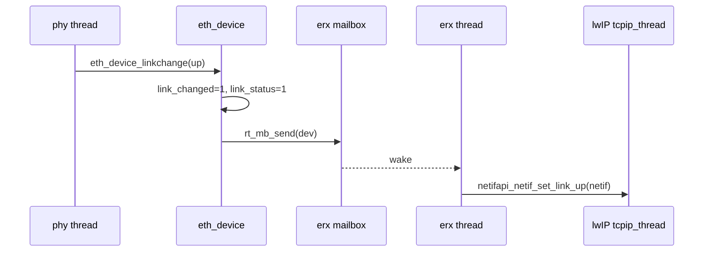
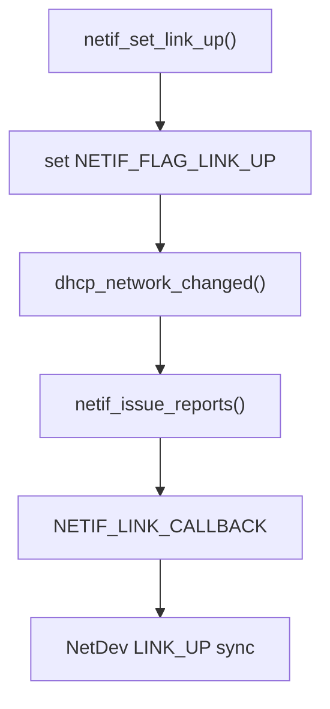
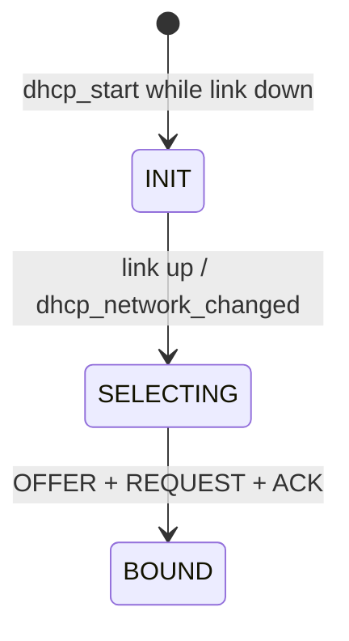
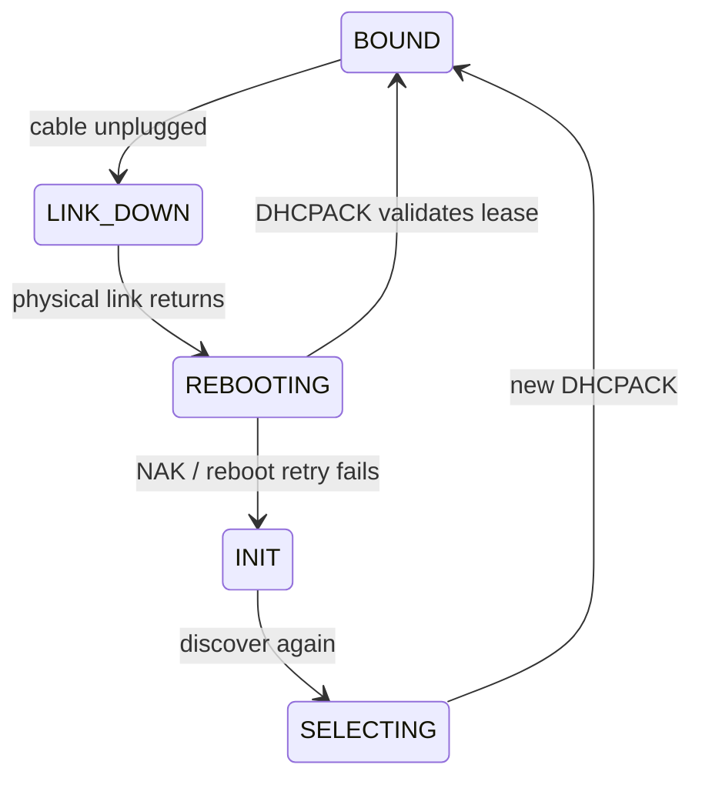
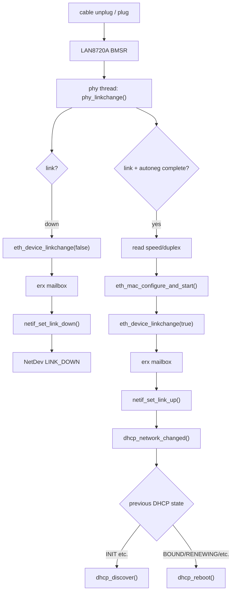

<meta name="referrer" content="no-referrer" />

# 教程 44：从 `phy_monitor_thread_entry()` 到 `dhcp_network_changed()`——STM32H750 PHY Link、Auto-negotiation 与 DHCP 恢复

> 摘要：沿 STM32H750 Art-Pi 的 PHY 监测、MAC 重配置、RT-Thread eth_device、lwIP Link 状态与 DHCP 重启路径，建立网线插拔后的完整网络恢复生命周期。

[TOC]

PHY（Physical Layer Transceiver，物理层收发器）负责检测网线侧物理连接并完成 10/100M、半双工/全双工等链路能力协商。**Auto-Negotiation（自动协商）** 是链路两端交换能力并得到共同工作模式的过程；LAN8720A 的 **BMSR（Basic Mode Status Register，基本模式状态寄存器）** 暴露 Link Status 与 Auto-Negotiation Complete 等状态。lwIP 中的 `NETIF_FLAG_LINK_UP` 则是软件层的 Link 标志，它不等于 `NETIF_FLAG_UP`，更不等于已经获得 IP 地址。DHCP（Dynamic Host Configuration Protocol，动态主机配置协议）要在 Link 恢复后继续完成地址获取或旧租约验证，才可能真正达到 IP Ready。[S3](#source-s3)[S4](#source-s4)[S6](#source-s6)[S7](#source-s7)

Stage 22 已经建立 PHY/Auto-Negotiation 通用模型，Stage 13 已经讲过 DHCP 协议主线。Stage 44 只追当前 STM32H750 Art-Pi 的具体恢复链：**PHY 状态变化如何经过 STM32 Driver、RT-Thread `eth_device`、`erx` 与 lwIP `netif`，最后触发 `dhcp_network_changed()`。**

## 阅读源码前：建议提前阅读

1. [LAN8720A/LAN8720Ai Data Sheet](https://ww1.microchip.com/downloads/en/DeviceDoc/00002165B.pdf)
   - 用途：重点看 BMSR Link Status、Auto-Negotiation Complete，以及 Link Status 的 latch-low（曾经变低后会锁存低状态，直到软件读取清除历史状态）语义。[S6](#source-s6)
2. [RFC 2131 — Dynamic Host Configuration Protocol](https://www.rfc-editor.org/rfc/rfc2131.html)
   - 用途：理解 Link 恢复后为什么客户端可能先验证已有地址，而不是机械地重新走一遍完整地址发现流程。[S7](#source-s7)
3. [RT-Thread Network Framework](https://rt-thread.github.io/rt-thread/page_component_network.html)
   - 用途：先把 `eth_device`、`erx`（RT-Thread Ethernet RX 接收线程）、lwIP 与 NetDev 放到同一网络框架中。[S9](#source-s9)
4. [RT-Thread `drv_eth.c`（固定 commit）](https://github.com/RT-Thread/rt-thread/blob/dc8aaa73f2dbea255325ec058a083aeeb5381d0a/bsp/stm32/libraries/HAL_Drivers/drivers/drv_eth.c)
   - 用途：本文当前板级 `phy_monitor_thread_entry()`、`phy_linkchange()`、MAC stop/start 与 Link event 的直接源码证据。[S1](#source-s1)

## 先看完整恢复流程：物理 Link 与 IP Ready 中间隔着多层状态

当前 Art-Pi 没有启用 `PHY_USING_INTERRUPT_MODE`，所以 PHY monitor thread 每 1 秒轮询一次；这个 1 秒只是当前 Driver 的软件策略，不是 Ethernet/LAN8720A 协议规定的检测周期。[S1](#source-s1)[S5](#source-s5)



这张图里有三个不能混成一个布尔量的状态：

- **PHY Link**：网线侧是否已经建立物理连接；
- **lwIP Link Up**：协议栈是否认为该接口的数据链路当前可用；
- **IP Ready**：DHCP 或静态配置是否已经提供可用 IP/netmask/gateway。

Stage 44 的源码会从最左侧 `phy_monitor_thread_entry()` 开始，把这三个状态如何逐层推进讲完整。业务层 DNS/TLS/MQTT 如何在 IP Ready 之后恢复，留给 Stage 45。

## 1. PHY 监测入口来自 Stage 42 已经创建的 `phy` 线程

Stage 42 的 `rt_hw_stm32_eth_init()` 在 `eth_device_init()` 完成后创建：

```c
    tid = rt_thread_create("phy",
                           phy_monitor_thread_entry,
                           RT_NULL,
                           1024,
                           RT_THREAD_PRIORITY_MAX - 2,
                           2);
    if (tid == RT_NULL)
    {
        return -RT_ERROR;
    }

    rt_thread_startup(tid);
```

这段代码属于 `rt_hw_stm32_eth_init()`，线程入口绑定为 `phy_monitor_thread_entry()`。[S1](#source-s1)

Art-Pi 当前构建没有定义 `PHY_USING_INTERRUPT_MODE`，所以进入 `phy_monitor_thread_entry()` 的 polling 分支。继续阅读该函数中的轮询循环：[S1](#source-s1)

```c
#else
    while (1)
    {
        phy_linkchange();
        rt_thread_mdelay(1000);
    }
#endif /* PHY_USING_INTERRUPT_MODE */
```

因此当前 board 的物理链路检测节拍很直接：


这 1 秒是 **软件轮询周期**，不是 Ethernet 或 LAN8720A 协议本身规定的 Link detection 时间。若改用 driver 支持的 PHY interrupt 模式，触发源会变成 PHY INT GPIO + semaphore，但后续仍汇合到同一个 `phy_linkchange()`。[S1](#source-s1)

## 2. `phy_linkchange()` 为什么连续读两次 Basic Status Register

`phy_linkchange()` 首先确认 PHY 地址已经由初始化阶段的 `phy_find()` 找到，然后连续两次读取 Basic Status Register（BMSR）：[S1](#source-s1)

```c
    /* Read twice because the link bit in BMSR can be latched low. */
    (void)HAL_ETH_ReadPHYRegister(&EthHandle, phy_addr, PHY_BASIC_STATUS_REG, &status);
    if (HAL_ETH_ReadPHYRegister(&EthHandle, phy_addr, PHY_BASIC_STATUS_REG, &status) != HAL_OK)
    {
        return;
    }
```

LAN8720A 的 BMSR bit 2 是 Link Status，数据手册把它定义为 `RO/LL`：**Read Only / Latch Low**。也就是说发生过 Link Down 后，该位可以保持 latched-low，直到软件读寄存器把历史状态消费掉；第二次读取才更接近当前实时 Link 状态。[S6](#source-s6)

所以这里的“双读”不是随手的冗余访问，而是在补 PHY 寄存器的 latch 语义：


这类寄存器行为如果只看 `PHY_LINKED_STATUS_MASK` 宏很容易遗漏，必须把 driver comment 与 PHY datasheet 一起看。[S1](#source-s1)[S6](#source-s6)

## 3. Link Up 还不够：当前 driver 必须等 Auto-negotiation 完成

第二次 BMSR 读取后，`phy_linkchange()` 先检查 Link Status；Link 为 1 时还会继续检查 Auto-Negotiation Complete bit：[S1](#source-s1)

```c
    if ((status & PHY_LINKED_STATUS_MASK) != 0U)
    {
        uint32_t phy_status = 0;

        if ((status & PHY_AUTONEGO_COMPLETE_MASK) == 0U)
        {
            return;
        }

        if (HAL_ETH_ReadPHYRegister(&EthHandle, phy_addr, PHY_Status_REG, &phy_status) != HAL_OK)
        {
            return;
        }
```

LAN8720A BMSR bit 5 表示 Auto-Negotiate Complete。[S6](#source-s6) 当前 driver 不会在“刚检测到载波但协商尚未结束”时立即把 netif 标成 Link Up，而是先等待 PHY 已经得到确定的速率/双工结果。

LAN8720A 分支的 `PHY_Status_REG` 被定义为 `0x1F`，driver 再从该寄存器提取：

```text
100M / 10M
Full Duplex / Half Duplex
```

并编码到内部 `phy_state_new`：[S1](#source-s1)[S6](#source-s6)



这里第一次出现两个不同的“Link”：PHY 寄存器的 Link 表示线侧物理连接；RT-Thread `eth_device.link_status` 与 lwIP `NETIF_FLAG_LINK_UP` 则是软件层状态。Stage 44 后面的任务就是解释前者怎样传播成后者。

## 4. `phy_state_new` 让无变化轮询直接结束

当前 driver 用三个 bit 表示已经归一化后的 PHY state：[S1](#source-s1)

```c
enum
{
    PHY_LINK        = (1 << 0),
    PHY_100M        = (1 << 1),
    PHY_FULL_DUPLEX = (1 << 2),
};
```

当新状态和 `stm32_eth_device.phy_state` 完全相同时，`phy_linkchange()` 直接返回：[S1](#source-s1)

```c
    if (stm32_eth_device.phy_state == phy_state_new)
    {
        return;
    }
```

所以 1 秒轮询并不意味着每秒都会重新启动 MAC 或通知 lwIP。只有 Link、speed 或 duplex 发生变化时，才进入后续状态转换。

## 5. Link Up：先把协商结果写回 MAC，再启动 DMA/IRQ 数据面

当 `PHY_LINK` 被置位，`phy_linkchange()` 根据 `PHY_100M` 与 `PHY_FULL_DUPLEX` 生成 STM32 HAL 所需的 `speed` / `duplex`，随后调用：

```text
eth_mac_configure_and_start(speed, duplex)
```

进入 `eth_mac_configure_and_start()` 后，当前实现先拿 `mac_lock`。如果 MAC 已经运行，会先 `HAL_ETH_Stop_IT()`；然后读取现有 MAC config、覆盖 speed/duplex，最后重新 `HAL_ETH_Start_IT()`。[S1](#source-s1)

关键连续逻辑为：

```c
    if (HAL_ETH_GetMACConfig(&EthHandle, &mac_config) != HAL_OK)
    {
        goto __exit;
    }

    mac_config.Speed = speed;
    mac_config.DuplexMode = duplex;
    if (HAL_ETH_SetMACConfig(&EthHandle, &mac_config) != HAL_OK)
    {
        goto __exit;
    }

    if (HAL_ETH_Start_IT(&EthHandle) != HAL_OK)
    {
        goto __exit;
    }

    stm32_eth_device.mac_started = RT_TRUE;
    result = RT_EOK;
```

这一步回答了一个常见但容易混淆的问题：**PHY 协商出 100M/full-duplex 后，还必须把结果同步给 MCU 内部 MAC。** PHY 和 MAC 是两个设备边界；线侧协商完成并不会自动重写 STM32 MAC 的 speed/duplex 配置。[S1](#source-s1)[S6](#source-s6)

当前 Link Up 顺序因此是：



只有 `eth_mac_configure_and_start()` 成功，driver 才继续向 RT-Thread/lwIP 报 Link Up。

## 6. `eth_device_linkchange()` 不直接进 lwIP Core，而是先跨到 `erx` 线程

回到 `phy_linkchange()` 的 Link Up 分支，MAC 成功启动后会保存 speed、duplex、`phy_state`，然后在软件 Link 尚未为 up 时调用：[S1](#source-s1)

```c
        if (!stm32_eth_device.parent.link_status)
        {
            eth_device_linkchange(&stm32_eth_device.parent, RT_TRUE);
        }
```

现在从 STM32 driver 切换到 RT-Thread `components/net/lwip/port/ethernetif.c`。

默认 `LWIP_NO_RX_THREAD=n`，所以当前路径使用 `erx` Ethernet RX thread。[S5](#source-s5) `eth_device_linkchange()` 不在 PHY thread 里直接调用 lwIP，而是先更新 `eth_device` 的共享状态，再投递 mailbox：[S2](#source-s2)

```c
    level = rt_spin_lock_irqsave(&(dev->spinlock));
    dev->link_changed = 0x01;
    if (up == RT_TRUE)
        dev->link_status = 0x01;
    else
        dev->link_status = 0x00;
    rt_spin_unlock_irqrestore(&(dev->spinlock), level);

    return rt_mb_send(&eth_rx_thread_mb, (rt_ubase_t)dev);
```

因此线程边界是：



`spinlock` 保护 `link_changed/link_status` 在异步线程之间的一致读取，mailbox 负责把真正的 lwIP link-state 操作移到 Ethernet thread 再通过 Netif API 进入 Core。[S2](#source-s2)

## 7. `eth_rx_thread_entry()` 把 RT-Thread Link 状态转换成 lwIP Link 状态

`erx` 收到 device 消息后，先处理 `link_changed`：[S2](#source-s2)

```c
            if (device->link_changed)
            {
                int status;

                level = rt_spin_lock_irqsave(&(device->spinlock));
                status = device->link_status;
                device->link_changed = 0x00;
                rt_spin_unlock_irqrestore(&(device->spinlock), level);

                if (status)
                    netifapi_netif_set_link_up(device->netif);
                else
                    netifapi_netif_set_link_down(device->netif);
            }
```

`netifapi_netif_set_link_up()` 是 RT-Thread `ethernetif.c` 中对 `netifapi_netif_common()` 的封装，最终让 `netif_set_link_up()` 在 lwIP Core context 中执行。[S2](#source-s2)

到此为止，状态已经完成三次语义转换：

```text
LAN8720A register state
        ↓
rt_stm32_eth.phy_state / eth_device.link_status
        ↓
lwIP NETIF_FLAG_LINK_UP
```

这三层不能只用一个 `link_up` 名字概括，否则排查时很难判断故障到底停在哪一层。

## 8. `netif_set_link_up()` 才是 DHCP 恢复真正的协议栈触发点

RT-Thread vendored lwIP 2.1.2 的 `netif_set_link_up()` 先确认 flag 之前没有置位，然后设置 `NETIF_FLAG_LINK_UP`。当前启用 DHCP 时，紧接着调用：[S3](#source-s3)

```c
#if LWIP_DHCP
    dhcp_network_changed(netif);
#endif /* LWIP_DHCP */
```

后面还会执行 IPv4/IPv6 reports、ND6 restart、link callback，并在 RT-Thread 修改分支中同步 NetDev 的 link status：[S3](#source-s3)



所以 DHCP 恢复不是 STM32 driver 自己做的，也不是 `phy_linkchange()` 直接调用 `dhcp_start()`。driver 只负责把“物理网络已经重新可用”可靠地传给 `netif_set_link_up()`；DHCP client 根据自身状态决定下一步。[S1](#source-s1)[S3](#source-s3)[S4](#source-s4)

## 9. 第一次上电时没有 Link：`dhcp_start()` 会停在 INIT 等待

Stage 39 已经看到 `eth_netif_device_init()` 在 `LWIP_DHCP` 打开时调用 `dhcp_start(netif)`。[S2](#source-s2)

`dhcp_start()` 会先创建/重置 DHCP client，再检查物理 Link：[S4](#source-s4)

```c
  if (!netif_is_link_up(netif)) {
    /* set state INIT and wait for dhcp_network_changed() to call dhcp_discover() */
    dhcp_set_state(dhcp, DHCP_STATE_INIT);
    return ERR_OK;
  }
```

这意味着板子可以在“网线没插”的情况下完成 netif 和 DHCP client 初始化：

```text
DHCP client exists
DHCP state = INIT
no DHCPDISCOVER yet
```

等 PHY thread 后面第一次检测到 Link Up，`netif_set_link_up()` → `dhcp_network_changed()` 才真正触发 `dhcp_discover()`。[S4](#source-s4)



因此“DHCP 没拿到地址”排查时必须先区分：DHCP client 没启动，还是已经启动但正在合理等待物理 Link。

## 10. 已经拿到租约后再插拔网线：lwIP 不会机械地重新 DISCOVER

更有价值的是运行中的 Link flap。

如果 DHCP client 原本处于 `BOUND`、`RENEWING`、`REBINDING` 或 `REBOOTING`，`dhcp_network_changed()` 不走全新 Discover，而是把 `tries` 清零后进入 `dhcp_reboot(netif)`：[S4](#source-s4)

```c
    case DHCP_STATE_REBINDING:
    case DHCP_STATE_RENEWING:
    case DHCP_STATE_BOUND:
    case DHCP_STATE_REBOOTING:
      dhcp->tries = 0;
      dhcp_reboot(netif);
      break;
```

lwIP 源码注释把这个行为定义为：网络配置可能变化时进入 REBOOTING，验证当前已经绑定的地址是否仍然有效。[S4](#source-s4) RFC 2131 也要求客户端在从本地网络断开后重新获取或验证网络参数；INIT-REBOOT 使用已知地址发 DHCPREQUEST 验证缓存配置。[S7](#source-s7)

因此一次“拔网线再插回同一网络”的主路径更接近：



这比简单记成“Link Up 就重新 DHCP”更准确。

## 11. Link Down 时 lwIP 做了什么，又没有做什么

现在反向看拔网线。

`phy_linkchange()` 构造出的 `phy_state_new` 没有 `PHY_LINK` 时，当前顺序是先向上报告 Link Down，然后停止 MAC：[S1](#source-s1)

```c
        if (stm32_eth_device.parent.link_status)
        {
            eth_device_linkchange(&stm32_eth_device.parent, RT_FALSE);
        }

        if (eth_mac_stop() != RT_EOK)
        {
            stm32_eth_device.phy_state = PHY_STATE_UNKNOWN;
            LOG_E("stop MAC failed");
            return;
        }
```

`eth_device_linkchange(false)` 仍经 `erx` 转换成 `netifapi_netif_set_link_down()`，最终进入 `netif_set_link_down()`。[S2](#source-s2)[S3](#source-s3)

当前 lwIP `netif_set_link_down()` 的核心动作是：

```text
clear NETIF_FLAG_LINK_UP
invoke link callback / ext callback
RT-Thread: synchronize NetDev LINK_DOWN
```

它**不会在这个函数里调用 `dhcp_stop()`，也不会在这里主动清空 IPv4 地址，更不会遍历 TCP PCB 强制 abort 全部连接**。[S3](#source-s3)

这个边界非常重要：

```text
Physical Link Down
    !=
DHCP client object destroyed
    !=
IP address immediately erased
    !=
all TCP/MQTT connections synchronously closed
```

真正的 TCP/MQTT 失败会随后通过发送错误、TCP timeout、MQTT keepalive/server watchdog 等机制暴露。Stage 45 会把“底层 Link 已恢复”和“云连接已经恢复”明确拆成两个状态。

## 12. NetDev 只是同步 Link 状态，不重新检测 PHY

RT-Thread vendored `netif_set_link_up/down()` 会调用 `netdev_low_level_set_link_status()`，NetDev 据此维护 `NETDEV_FLAG_LINK_UP` 并触发 `NETDEV_CB_STATUS_LINK_UP/DOWN`；Link Down 还会清 `NETDEV_FLAG_INTERNET_UP`。[S3](#source-s3)[S8](#source-s8) RT-Thread 官方 Network Framework 将 NetDev/SAL 放在协议栈与应用之间的统一抽象层，[S9](#source-s9) 因而这里的 NetDev 是状态镜像与应用观察入口，不是第二个 PHY detector。


## 13. Link Up、Netif Up、IP Ready 是三个不同条件

到这里可以把网络恢复时最容易混淆的三个条件拆开：

| 条件 | 表示什么 | 当前主要来源 |
| --- | --- | --- |
| Link Up | PHY/MAC 数据链路已经可工作 | `phy_linkchange()` → `NETIF_FLAG_LINK_UP` |
| Netif Up | 接口在软件管理上被启用 | `netif_set_up()` / `NETIF_FLAG_UP` |
| IP Ready | 已经存在可用 IP 配置 | DHCP/static → `netif->ip_addr` |

在 RT-Thread Ethernet 初始化里，`eth_netif_device_init()` 很早就会 `netif_set_up()`；这并不意味着网线已经插好，更不意味着 DHCP 已经完成。[S2](#source-s2)

因此应用若只检测“interface up”就启动 TLS/MQTT，时序上是不充分的。至少还要区分 Link 与 IP readiness；Stage 45 会继续增加 DNS、Time、TLS、MQTT readiness。

## 14. 当前 Art-Pi 从拔线到恢复的完整源码闭环

把 Stage 44 的真实路径合在一起：



这里的异步边界有两个：

1. PHY monitor thread 不直接改 lwIP Core，而是经 `eth_device_linkchange()` + `erx`；
2. `erx` 再用 Netif API 把操作提交给 lwIP Core context。

这正是 RTOS port 把硬件事件安全送进单线程协议栈核心的典型方式。

## 15. 为什么 Link 恢复不能等价成“业务恢复”

Stage 44 到这里已经完成 Link/DHCP 层闭环，但它故意不把 MQTT 当成同一状态。

当 Link Up 后：

```text
PHY/MAC 已恢复
    ↓
DHCP 可能仍在 REBOOTING / SELECTING
    ↓
DNS 结果可能需要重新获得
    ↓
系统时间可能尚未可信
    ↓
TLS 还没握手
    ↓
MQTT 还没收到 CONNACK
```

所以一个可靠 MCU 网络产品不应该只有 `network_connected = true/false` 一个布尔量。Stage 45 将把前面已经学过的 DHCP、DNS、SNTP、TLS、MQTT 和当前 Link 生命周期重新组合成 **产品级 Cloud Lifecycle**，并明确哪些步骤由 lwIP/RT-Thread 自动完成，哪些必须由应用状态机负责。

## 资料来源

<a id="source-s1"></a>
### [S1] RT-Thread STM32 HAL Ethernet Driver
- 类型：RT-Thread 官方仓库源码
- 版本：commit `dc8aaa73f2dbea255325ec058a083aeeb5381d0a`，2026-09-28
- 定位：`bsp/stm32/libraries/HAL_Drivers/drivers/drv_eth.c`：`rt_hw_stm32_eth_init()`、`phy_monitor_thread_entry()`、`phy_linkchange()`、`eth_mac_configure_and_start()`、`eth_mac_stop()`
- URL/文档：[RT-Thread drv_eth.c](https://github.com/RT-Thread/rt-thread/blob/dc8aaa73f2dbea255325ec058a083aeeb5381d0a/bsp/stm32/libraries/HAL_Drivers/drivers/drv_eth.c)
- 使用位置：PHY monitor、Link Up/Down、MAC speed/duplex 重配置主线
- 支撑内容：证明当前 Art-Pi/STM32 driver 的 Link detection、auto-negotiation gate、MAC start/stop 与 `eth_device_linkchange()` 调用顺序

<a id="source-s2"></a>
### [S2] RT-Thread lwIP Ethernet Port
- 类型：RT-Thread 官方仓库源码
- 版本：同上
- 定位：`components/net/lwip/port/ethernetif.c`：`eth_device_linkchange()`、`eth_rx_thread_entry()`、`eth_netif_device_init()`
- URL/文档：[RT-Thread ethernetif.c](https://github.com/RT-Thread/rt-thread/blob/dc8aaa73f2dbea255325ec058a083aeeb5381d0a/components/net/lwip/port/ethernetif.c)
- 使用位置：“eth_device 到 erx”“Netif API bridge”“DHCP 初始启动来源”
- 支撑内容：证明 Link event 如何跨 mailbox/thread 进入 lwIP，以及 netif 初始化时 DHCP client 如何启动

<a id="source-s3"></a>
### [S3] RT-Thread vendored lwIP 2.1.2 `netif.c`
- 类型：RT-Thread 官方仓库内置 lwIP 源码
- 版本：同上
- 定位：`components/net/lwip/lwip-2.1.2/src/core/netif.c`：`netif_set_link_up()`、`netif_set_link_down()`、NetDev status sync
- URL/文档：[RT-Thread lwIP netif.c](https://github.com/RT-Thread/rt-thread/blob/dc8aaa73f2dbea255325ec058a083aeeb5381d0a/components/net/lwip/lwip-2.1.2/src/core/netif.c)
- 使用位置：“lwIP Link flag”“DHCP trigger”“Link Down 边界”“NetDev 同步”
- 支撑内容：证明 Link Up 会调用 `dhcp_network_changed()`，Link Down 本身不会停止 DHCP、清 IP 或批量关闭 TCP PCB

<a id="source-s4"></a>
### [S4] RT-Thread vendored lwIP 2.1.2 DHCP Client
- 类型：RT-Thread 官方仓库内置 lwIP 源码
- 版本：同上
- 定位：`components/net/lwip/lwip-2.1.2/src/core/ipv4/dhcp.c`：`dhcp_start()`、`dhcp_network_changed()`、`dhcp_discover()`、`dhcp_reboot()`
- URL/文档：[RT-Thread lwIP dhcp.c](https://github.com/RT-Thread/rt-thread/blob/dc8aaa73f2dbea255325ec058a083aeeb5381d0a/components/net/lwip/lwip-2.1.2/src/core/ipv4/dhcp.c)
- 使用位置：“无 Link 时 DHCP INIT”“Link 恢复后的 DISCOVER/REBOOTING 分支”
- 支撑内容：证明 DHCP client 根据已有 state 决定新发现还是验证旧租约

<a id="source-s5"></a>
### [S5] RT-Thread lwIP / Art-Pi Kconfig
- 类型：RT-Thread 官方配置源码
- 版本：同上
- 定位：`components/net/lwip/Kconfig` 的 `LWIP_NO_RX_THREAD` / `RT_LWIP_DHCP`，`bsp/stm32/stm32h750-artpi/board/Kconfig` 的 PHY 配置
- URL/文档：[lwIP Kconfig](https://github.com/RT-Thread/rt-thread/blob/dc8aaa73f2dbea255325ec058a083aeeb5381d0a/components/net/lwip/Kconfig)、[Art-Pi Kconfig](https://github.com/RT-Thread/rt-thread/blob/dc8aaa73f2dbea255325ec058a083aeeb5381d0a/bsp/stm32/stm32h750-artpi/board/Kconfig)
- 使用位置：“默认 erx 路径”“当前 Art-Pi PHY polling 路径”
- 支撑内容：确认 RX thread 与 DHCP 默认配置，并确认 Art-Pi 未选择 PHY interrupt mode

<a id="source-s6"></a>
### [S6] Microchip LAN8720A/LAN8720Ai Data Sheet
- 类型：PHY 厂商数据手册
- 版本：DS00002165B
- URL/文档：[LAN8720A/LAN8720Ai Data Sheet](https://ww1.microchip.com/downloads/en/DeviceDoc/00002165B.pdf)
- 使用位置：“BMSR 双读”“Link Status”“Auto-Negotiation Complete”“RMII PHY 行为”
- 支撑内容：确认 BMSR bit 2 Link Status 为 RO/LL（latched low）、bit 5 为 Auto-Negotiate Complete，以及 LAN8720A 为 10/100 RMII PHY

<a id="source-s7"></a>
### [S7] RFC 2131 — Dynamic Host Configuration Protocol
- 类型：IETF 标准
- 版本：RFC 2131，1997-03
- URL/文档：[RFC 2131](https://www.rfc-editor.org/rfc/rfc2131.html)
- 使用位置：“断网后验证地址”“INIT-REBOOT / DHCPREQUEST”
- 支撑内容：规定客户端在本地网络参数可能变化时重新获取或验证配置，并定义 INIT-REBOOT 使用已知地址进行验证的行为

<a id="source-s8"></a>
### [S8] RT-Thread NetDev
- 类型：RT-Thread 官方仓库源码
- 版本：commit `dc8aaa73f2dbea255325ec058a083aeeb5381d0a`
- 定位：`components/net/netdev/include/netdev.h`、`components/net/netdev/src/netdev.c`：`NETDEV_CB_STATUS_LINK_UP/DOWN`、`netdev_low_level_set_link_status()`
- URL/文档：[NetDev header](https://github.com/RT-Thread/rt-thread/blob/dc8aaa73f2dbea255325ec058a083aeeb5381d0a/components/net/netdev/include/netdev.h)、[NetDev source](https://github.com/RT-Thread/rt-thread/blob/dc8aaa73f2dbea255325ec058a083aeeb5381d0a/components/net/netdev/src/netdev.c)
- 使用位置：“NetDev Link 状态同步”“应用层可观察事件”
- 支撑内容：证明 lwIP Link 状态如何同步到 NetDev flag/callback，以及 Link Down 会清除 NetDev internet-up flag

<a id="source-s9"></a>
### [S9] RT-Thread 官方 Network Framework
- 类型：RT-Thread 官方框架文档
- 版本：在线文档，访问日期 2026-10-03
- URL/文档：[RT-Thread Network Framework](https://rt-thread.github.io/rt-thread/page_component_network.html)
- 使用位置：开篇框架边界、NetDev 状态同步与 `erx`/协议栈关系
- 支撑内容：给出 RT-Thread 网络框架分层，并说明 Ethernet 接收通过 `erx` 线程进入协议栈；用于区分框架职责与本篇目标 commit 的具体 PHY/Link 实现
