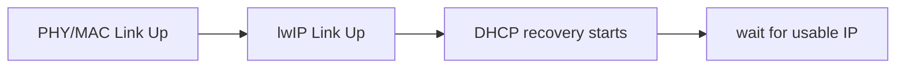
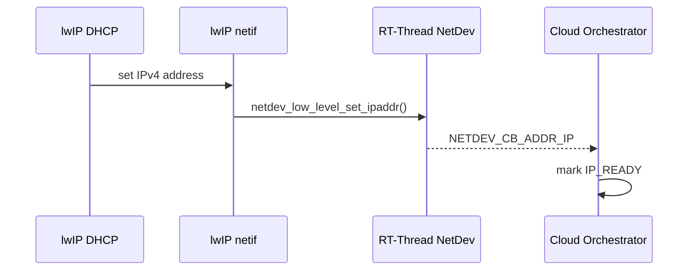
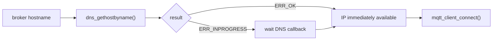
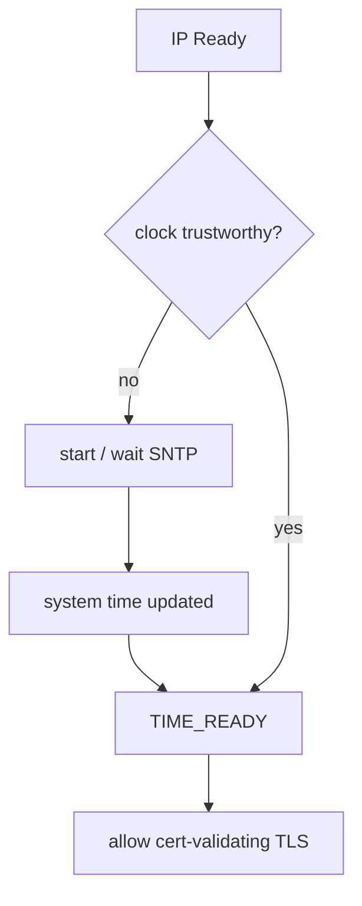
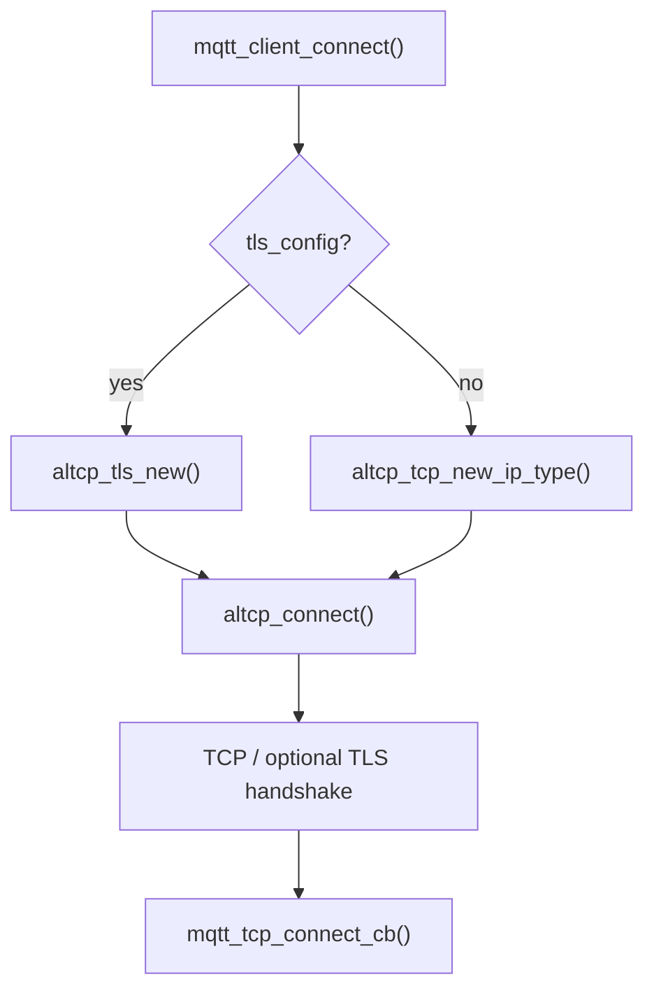
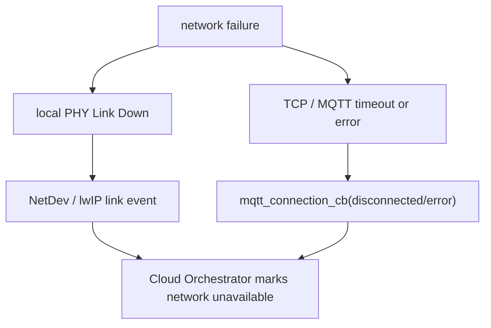
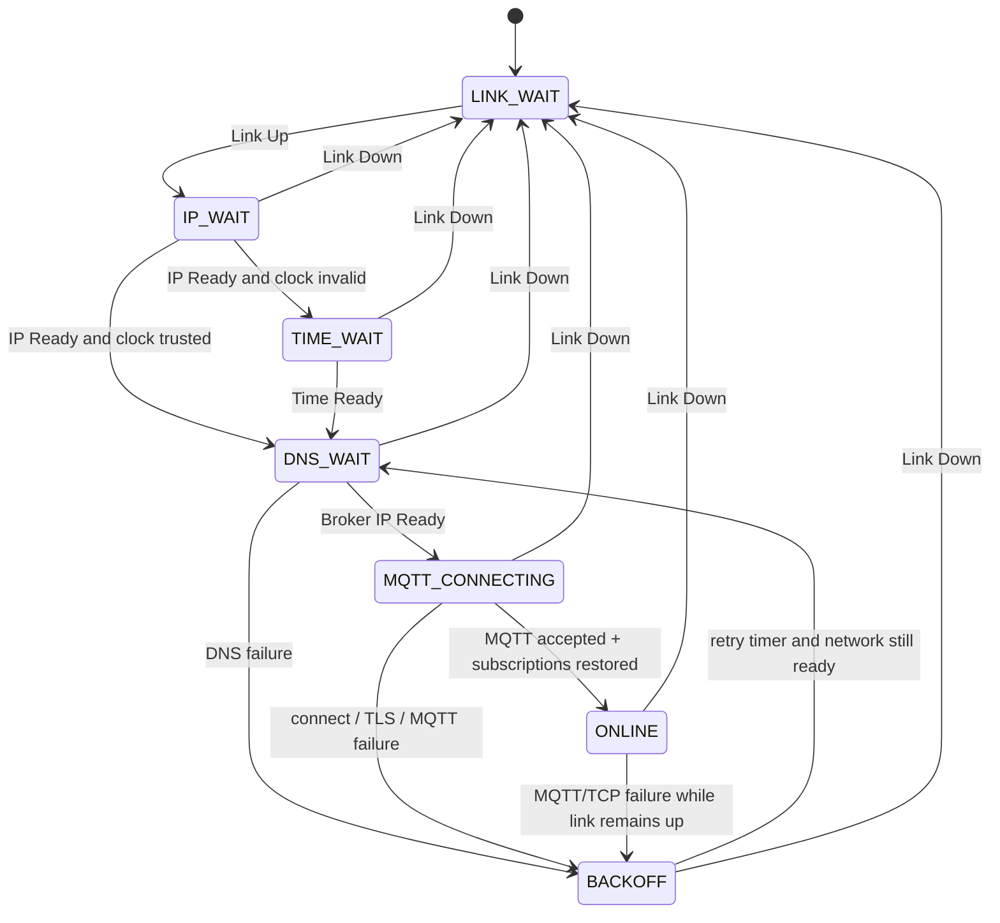
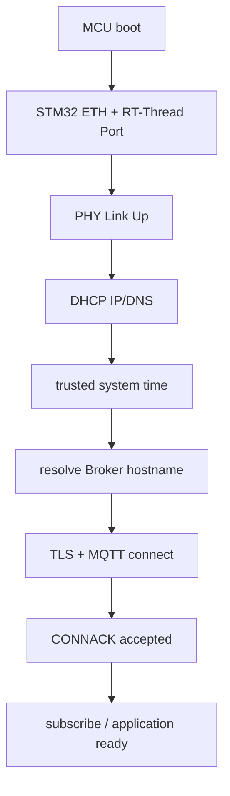
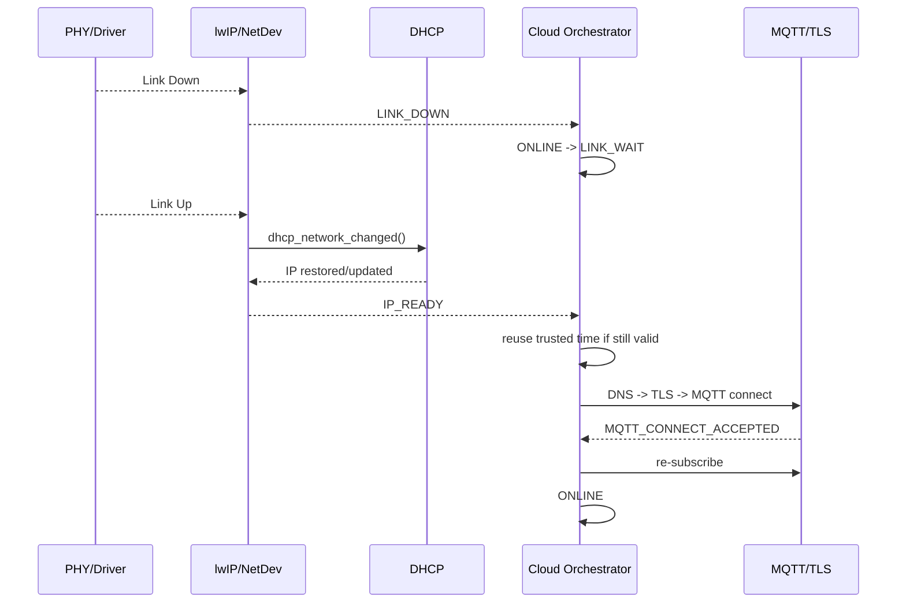
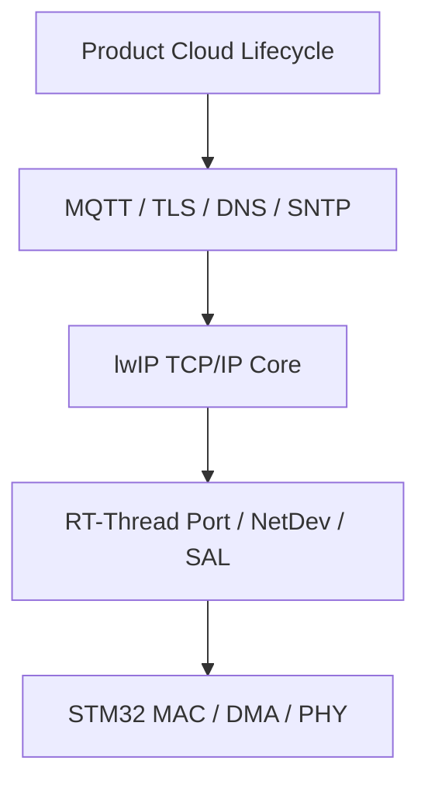

<meta name="referrer" content="no-referrer" />

# 教程 45：从 Link Up 到 MQTT Reconnect——STM32 + RT-Thread + lwIP MCU Cloud Lifecycle

> 摘要：把 PHY、DHCP、DNS、SNTP、TLS 与 MQTT 串成 MCU 上云生命周期，区分协议栈自动恢复与应用必须负责的重连、退避和重订阅。

[TOC]

MCU Cloud Lifecycle 不是 lwIP 中的某个单独模块，而是产品把多个已经独立工作的网络机制组织成一条长期运行的状态链：物理链路可用之后取得 IP，解析云端域名，建立可信时间，再完成 TLS 与 MQTT 会话；链路中断后，还要按正确依赖顺序重新恢复。它位于“网络协议栈能力”与“产品业务状态机”之间，因此真正困难的部分不是再学习一个协议，而是判断 **哪些动作由 driver/lwIP 自动完成，哪些必须由应用层编排**。[S1](#source-s1)[S2](#source-s2)[S4](#source-s4)

本文继续使用 Stage 42～44 的 STM32H750 Art-Pi + LAN8720A + RT-Thread 环境。RT-Thread 固定到 commit `dc8aaa73f2dbea255325ec058a083aeeb5381d0a`，lwIP 固定到 commit `d08f4773edd0182b7910fc8f046eed82ffcd67c9`。Stage 44 已经证明 PHY Link Up 能够沿 `eth_device`、`erx`、`netif_set_link_up()` 推进 DHCP；Stage 45 不重复这些底层细节，而是从完整产品生命周期重新组织前面已经验证过的协议能力。[S1](#source-s1)[S2](#source-s2)

## 1. 上云不是一个“Connected”状态，而是一组有依赖关系的 readiness

一个 Ethernet MCU 即使网线已经插好，也不代表已经可以访问 MQTT Broker。至少需要区分下面几种 readiness：

| Readiness | 代表什么 | 当前系统中的主要证据 |
| --- | --- | --- |
| Link Ready | PHY/MAC 数据面已经可用 | `NETIF_FLAG_LINK_UP` / NetDev Link Up |
| IP Ready | 已经有可用 IP、netmask、gateway | DHCP lease 或静态配置 |
| Name Ready | 能把 Broker hostname 解析成 IP | DNS client + DNS server |
| Time Ready | 系统拥有满足证书校验要求的可信 wall clock | SNTP / RTC / 其他可信时间源 |
| Secure Transport Ready | TLS handshake 已经完成 | altcp TLS / mbedTLS |
| MQTT Ready | Broker 已接受 MQTT CONNECT | `MQTT_CONNECT_ACCEPTED` |
| Application Ready | 订阅、业务状态、待恢复任务已经重建 | 应用自己的状态 |

这些状态不是同义词。例如 Stage 44 的 Link Up 只是说明 Ethernet 链路恢复；DHCP 尚未完成时，Broker DNS lookup 仍然可能失败。MQTT `CONNACK` 已接受，也不代表此前的 subscription 已自动恢复——当前 lwIP MQTT client 强制使用 Clean Session，因此应用仍要在 reconnect 后重新订阅。[S4](#source-s4)[S5](#source-s5)[S7](#source-s7)

把依赖关系压缩成一条主线：


图中的顺序是本文采用的产品启动策略，而不是说 DNS 与 SNTP 在协议上绝对只能按这个先后执行。实际产品可以并行 DNS 和 SNTP；关键约束是：进入依赖某项能力的下一阶段之前，该能力必须已经满足。

## 2. 第一层自动恢复：PHY Link Up 会重新驱动 DHCP

Stage 44 已经沿源码证明当前 STM32H750 driver 在 PHY 检测到 Link Up 并完成 Auto-negotiation 后，会先重配置并启动 MAC，然后调用 `eth_device_linkchange(..., RT_TRUE)`。RT-Thread 的 `erx` 线程最终通过 Netif API 进入 `netif_set_link_up()`。[S1](#source-s1)

当前 RT-Thread vendored lwIP 2.1.2 的 `netif_set_link_up()` 会在 `LWIP_DHCP` 打开时调用 `dhcp_network_changed(netif)`：[S1](#source-s1)[S2](#source-s2)

```c
#if LWIP_DHCP
    dhcp_network_changed(netif);
#endif
```

这意味着“网线重新插回后重新推动 DHCP”并不需要产品再手工调用一次 `dhcp_start()` 才能发生。具体行为取决于 DHCP 当前状态：已经处于 `BOUND/RENEWING/REBINDING/REBOOTING` 时，`dhcp_network_changed()` 进入 reboot 路径；其他活动状态会重新 discover。[S2](#source-s2)[S8](#source-s8)

因此产品状态机不应该把 Link Up 直接解释成 Cloud Ready，而应把它解释成：



这也是第一条重要边界：**Link recovery 是底层触发，IP readiness 是后续异步结果。**

## 3. 应用需要一个明确的“IP Ready”事件

如果应用只轮询 `netif_is_link_up()`，就无法知道 DHCP 什么时候真正得到新地址。RT-Thread NetDev 已经提供 status/address callback：`netdev_set_status_callback()` 和 `netdev_set_addr_callback()`；callback 类型中既包含 `NETDEV_CB_STATUS_LINK_UP/DOWN`，也包含 `NETDEV_CB_ADDR_IP`。[S1](#source-s1)

当前 RT-Thread 对 lwIP `netif` 地址变化做了 NetDev 同步：当 `netif_set_ipaddr()` 更新地址时，会调用 `netdev_low_level_set_ipaddr()`，后者在地址发生变化时触发 `addr_callback(..., NETDEV_CB_ADDR_IP)`。[S1](#source-s1)

因此应用编排层可以只消费“状态事件”，而不直接深入 lwIP 内部 DHCP state：



工程上还应检查地址不是 `0.0.0.0`，并根据产品是否依赖默认 gateway/DNS 决定何时真正把 IP 层标为 ready。`NETDEV_CB_ADDR_IP` 是一个很好的触发源，但产品 readiness 仍然属于应用定义，而不是 NetDev 自动替产品完成的状态机。

## 4. MQTT API 不负责 DNS：Broker hostname 必须在应用侧解析

Stage 34/35 已经使用过 lwIP MQTT client；现在从接口契约看一个容易被隐藏的问题。当前 `mqtt_client_connect()` 的服务器参数是：

```c
const ip_addr_t *ip_addr
```

它接收已经解析好的 IP 地址，而不是 hostname。[S4](#source-s4) `mqtt_example_init()` 同样直接把 `mqtt_ip` 传入 `mqtt_client_connect()`，example 中没有把 DNS 封装进 MQTT client。[S5](#source-s5)

所以真实产品若配置的是：

```text
mqtt.example.com
```

必须先走 DNS：



`dns_gethostbyname()` 可能直接命中 cache 并返回 `ERR_OK`，也可能返回 `ERR_INPROGRESS`，随后通过 `dns_found_callback` 异步给出结果。[S3](#source-s3) 因而 Cloud Orchestrator 不能假设 DNS 是同步函数，更不能在 `ERR_INPROGRESS` 时立即拿尚未完成的地址发起 MQTT connect。

网络断开再恢复后是否必须重新 DNS lookup，属于产品策略。比较稳妥的模型是把 hostname 作为持久配置，把解析出的 IP 视为可失效缓存：跨网络、DHCP gateway/DNS server 变化或较长离线后重新解析，避免把上一次网络环境得到的地址永久当成真值。

## 5. Time Ready 是 TLS 的前置条件之一，但不等于“每次重连都重新 SNTP”

Stage 36 已经证明 lwIP SNTP client 的入口 `sntp_init()` 会建立 UDP PCB、注册接收 callback 并发送时间请求；响应最终由 `sntp_process()` 转换并通过 `SNTP_SET_SYSTEM_TIME_NTP()` 写入平台系统时间。[S6](#source-s6)

这里要把“网络时间同步”和“TLS 每次建立连接”解耦。

Mbed TLS 官方文档说明，当 `MBEDTLS_HAVE_TIME_DATE` 启用时，X.509 模块会使用绝对时间检查证书有效期；也就是说执行这种证书有效期校验时，设备必须拥有可信的当前日期时间。[S9](#source-s9) 但 TLS session cache、ticket 等只依赖相对时间的机制与证书日期校验不是同一个问题。

因此比较准确的产品模型是：



“clock trustworthy” 可以来自本次 SNTP，也可以来自掉电保持 RTC、可信持久化时间或其他产品时间源。只要设备在短暂网线 flap 后仍保持正确时间，就没有必要机械地在每一次 MQTT reconnect 前重新等待完整 SNTP 过程。

反过来，上电时 RTC 无效、时间回到 epoch，而 TLS 配置又要求检查证书有效期，此时应先建立 Time Ready，再进行云连接。否则会把“证书时间校验失败”错误归类为 Broker/TCP 连接问题。

## 6. TLS 在当前 MQTT client 中是 transport 层的一部分

当前 lwIP MQTT client 并没有暴露独立的 `mqtt_tls_connect()` API。`mqtt_client_connect()` 检查 `client_info->tls_config`：有 TLS config 时创建 `altcp_tls_new()`，没有时创建普通 TCP `altcp_tcp_new_ip_type()`，随后统一调用 `altcp_connect()`。[S4](#source-s4)

所以调用关系更接近：



`altcp_tls_create_config_client()` 可以从 CA certificate 建立 TLS client config；mbedTLS backend 会建立 client-side SSL config，并按 `ALTCP_MBEDTLS_AUTHMODE` 配置证书认证模式。[S4](#source-s4) 实际产品还需要按安全策略确认 CA、hostname verification、SNI、entropy、client certificate 等配置是否完整；“用了 TLS allocator”本身不能替代完整身份认证策略。

当底层 transport connect 成功，`mqtt_tcp_connect_cb()` 才设置 MQTT receive/sent/poll callback、启动 cyclic timer，并把已经构造的 CONNECT packet 从 output ring buffer 发出。[S4](#source-s4) 因而应用层通常看不到一个单独的 “TLS Ready” MQTT callback，而是在最终 `mqtt_connection_cb()` 收到 MQTT `CONNACK` 结果时知道整条 TCP/TLS/MQTT 建链已经走到协议会话层。

## 7. MQTT Ready 的判据是 `MQTT_CONNECT_ACCEPTED`，不是 TCP connect 成功

TCP 建立只表示传输层已经连接到远端。MQTT 还必须发送 CONNECT，并收到 Broker 返回的 CONNACK。当前 upstream example 的 `mqtt_connection_cb()` 只有在 `status == MQTT_CONNECT_ACCEPTED` 时才继续 subscribe。[S5](#source-s5)

```c
if (status == MQTT_CONNECT_ACCEPTED) {
    /* application subscribes required topics */
}
```

因此产品状态机需要把：

```text
TCP/TLS connected
```

和：

```text
MQTT session accepted
```

分开。用户名/密码错误、Broker policy 拒绝、protocol level 不匹配等情况，都可能在 transport 已经可达时仍无法得到 MQTT Ready。

## 8. 为什么当前 lwIP reconnect 后必须重新订阅

MQTT 3.1.1 的 Clean Session 决定会话状态是否跨 Network Connection 保留。规范规定 Clean Session=1 时，Client 与 Server 丢弃之前 session，并建立只在当前 Network Connection 生命周期内存在的新 session。[S7](#source-s7)

当前 lwIP `mqtt_client_connect()` 在构造 CONNECT flags 时直接执行：

```c
flags |= MQTT_CONNECT_FLAG_CLEAN_SESSION;
```

即当前实现固定使用 Clean Session。[S4](#source-s4)

这带来一个非常具体的产品责任：


upstream `mqtt_example.c` 本身就采用这种模式：每次 connection callback 得到 `MQTT_CONNECT_ACCEPTED` 都重新调用 `mqtt_sub_unsub()`。[S5](#source-s5)

所以 Stage 35 中“reconnect/resubscribe 属于应用层”的结论，在完整生命周期里可以进一步精确为：**lwIP 会报告 connection status，但不会替产品决定何时重连；当前 Clean Session 行为又意味着成功重连后应用必须重建订阅。**

## 9. Keep Alive 能发现失联，但它不是最及时的 Link Down detector

MQTT 3.1.1 Keep Alive 要求 Client 在没有其他控制报文时发送 PINGREQ，Server 用 PINGRESP 等机制证明连接仍然活跃。[S7](#source-s7) 当前 lwIP `mqtt_cyclic_timer()` 负责：

- connect timeout；
- pending request timeout；
- Keep Alive 到期时生成 PINGREQ；
- server watchdog 超时后关闭 MQTT connection。[S4](#source-s4)

如果 TCP 层先报告错误，`mqtt_tcp_err_cb()` 会把 `client->conn` 置空并进入 `mqtt_close()`；`mqtt_close()` 清 pending request、停止 cyclic timer、把状态设为 disconnected，并通过 application connection callback 通知上层。[S4](#source-s4)

因此网络异常至少有两条检测路径：



本地拔网线时，PHY Link Down 通常比 MQTT keepalive timeout 更早出现。应用既然已经能获得低层 Link event，就没有必要故意等待 MQTT watchdog 才知道网络已经不可用。但“收到 Link Down 后立即以什么 API 主动关闭 MQTT、是否保留待发送业务、何时重试”属于产品策略，不能写成 lwIP 自动行为。

## 10. lwIP 自动做什么，应用必须做什么

前 44 个 Stage 讲过很多模块，最容易在整合阶段产生的误解就是“既然各模块都有 timeout/callback，应该可以自己恢复”。实际边界如下。

| 行为 | 当前实现主要责任方 | 是否自动 |
| --- | --- | --- |
| PHY Link 检测 | STM32/RT-Thread Ethernet driver | 是，poll/interrupt 后产生 link event |
| MAC speed/duplex 重配置 | STM32 Ethernet driver | 是 |
| lwIP Link flag 更新 | RT-Thread Ethernet Port + lwIP | 是 |
| Link Up 后推动 DHCP 恢复 | lwIP DHCP | 是，前提是 DHCP 已启用 |
| 判断产品何时 IP Ready | 应用/NetDev callback orchestration | 否 |
| Broker hostname DNS lookup | 应用调用 lwIP DNS | 否 |
| SNTP request/retry/update timer | lwIP SNTP client | 初始化后由模块运行 |
| 判断系统时间是否“可信可用于 TLS” | 产品 | 否 |
| TLS handshake | altcp TLS + mbedTLS | 调用 connect 后自动推进 |
| MQTT CONNECT / protocol timer / Keep Alive | lwIP MQTT | connect 后自动推进 |
| 网络断开后的 reconnect timing/backoff | 产品 | 否 |
| reconnect 后重新 subscribe | 产品 | 否 |
| 业务消息补发/去重 | 产品 | 否 |

这张表实际上就是系列后半段的接口边界图：lwIP 提供协议状态机，RT-Thread 提供 OS/网络抽象，STM32 driver 提供硬件事件，但“设备什么时候允许进入 Cloud Online”仍然必须由产品层定义。

## 11. 用一个小状态机承接这些异步事件

如果没有统一状态机，项目很容易出现多个线程分别做“检测到网络好了就 connect”，最终形成 DNS、SNTP、MQTT 重连互相竞争。下面的状态不是 lwIP 自带 enum，而是一种基于前述契约构造的 **产品编排模型**。



它体现了几个关键原则：

1. **Link Down 是硬前提失效。** 一旦物理链路消失，DNS/TLS/MQTT 重试都应停止继续向前推进，等待网络基础恢复。
2. **IP Ready 必须重新确认。** Link Up 后 DHCP 可能进行 INIT-REBOOT 或重新 discover；不能拿旧地址状态直接假设网络已经恢复。[S2](#source-s2)[S8](#source-s8)
3. **Time Ready 可以跨短暂 Link flap 保持。** 只要 wall clock 仍可信，不必每次 reconnect 都回到 SNTP。
4. **DNS 结果属于网络依赖数据。** 重连策略可以重新解析 hostname，而不是永久绑定首次解析出的 Broker IP。
5. **MQTT accepted 还不是 Application Ready。** 当前 Clean Session 下还需重订阅关键 topic。

## 12. RT-Thread callback 只负责投递事件，不应在 callback 里跑整条上云流程

NetDev callback 很适合作为状态机输入，但 callback 本身不适合直接执行一连串 DNS、SNTP、TLS、MQTT 动作。更清晰的组织方式是让 callback 只把事件交给一个 Cloud worker/thread：

```text
NetDev / MQTT callback
        ↓
post CLOUD_EVENT_xxx
        ↓
Cloud worker owns state transitions
        ↓
DNS / SNTP / mqtt_client_connect / subscribe
```

下面是 **产品编排伪代码**，不是 RT-Thread 或 lwIP upstream 源码：

```c
on_net_event(event)
{
    post_to_cloud_worker(event);
}

cloud_worker()
{
    for (;;) {
        event = wait_event();

        switch (state) {
        case LINK_WAIT:
            if (event == LINK_UP)
                state = IP_WAIT;
            break;

        case IP_WAIT:
            if (event == IP_READY)
                state = clock_is_trusted() ? DNS_WAIT : TIME_WAIT;
            if (event == LINK_DOWN)
                state = LINK_WAIT;
            break;

        case TIME_WAIT:
            if (event == TIME_READY)
                state = DNS_WAIT;
            if (event == LINK_DOWN)
                state = LINK_WAIT;
            break;

        case DNS_WAIT:
            if (event == LINK_DOWN)
                state = LINK_WAIT;
            else if (event == DNS_OK)
                state = MQTT_CONNECTING;
            else if (event == DNS_FAILED) {
                schedule_backoff();
                state = BACKOFF;
            }
            break;

        case MQTT_CONNECTING:
            if (event == LINK_DOWN)
                state = LINK_WAIT;
            else if (event == MQTT_ACCEPTED)
                restore_subscriptions();
            else if (event == SUBSCRIPTIONS_READY)
                state = ONLINE;
            else if (event == CONNECT_FAILED) {
                schedule_backoff();
                state = BACKOFF;
            }
            break;

        case ONLINE:
            if (event == LINK_DOWN)
                state = LINK_WAIT;
            else if (event == MQTT_DISCONNECTED) {
                schedule_backoff();
                state = BACKOFF;
            }
            break;

        case BACKOFF:
            if (event == LINK_DOWN)
                state = LINK_WAIT;
            else if (event == RETRY_TIMEOUT)
                state = DNS_WAIT;
            break;
        }
    }
}
```

这种结构的价值不是代码形式本身，而是把 **所有重连决策集中到一个 owner**。NetDev callback、DNS callback、SNTP completion、MQTT connection callback 都只是事件源，避免不同 callback 各自直接创建连接、重复订阅或修改全局状态。

## 13. 不同失败应回到不同层，不应全部“重启 MQTT”

完整生命周期中，失败位置决定恢复入口。

| 失败位置 | 已经成立的下层条件 | 合理的恢复入口 |
| --- | --- | --- |
| PHY Link Down | 无 | 回 `LINK_WAIT` |
| DHCP 尚未得到地址 | Link | 留在 `IP_WAIT` |
| DNS timeout/failure | Link + IP | DNS retry/backoff |
| 时间无效 / SNTP 未完成 | Link + IP | `TIME_WAIT` |
| TLS handshake/certificate failure | Link + IP + DNS + Time（若需要） | 检查 TLS 配置/时间/证书，不能只盲目重试 |
| MQTT CONNACK rejected | Transport 已可达 | 根据 status 处理认证/协议/策略问题 |
| MQTT keepalive/TCP disconnect | 基础网络可能仍存在 | backoff 后重新 DNS/connect；同时监听 Link 状态 |
| reconnect 后 subscription 未恢复 | MQTT 已 accepted | 重订阅，不需要重新 DHCP/TLS |

这叫“从失败层恢复”，而不是“任何错误都从头重启网络”。例如 Broker 返回认证拒绝时，反复重做 DHCP 和 SNTP 没有意义；而 PHY Link Down 时继续高频 DNS/MQTT retry 只会制造无效工作。

## 14. Backoff 属于产品策略，不属于 lwIP MQTT client

当前 `mqtt_cyclic_timer()` 会处理单次 connect timeout、pending request timeout 和 Keep Alive watchdog，但源码里没有看到“连接失败后等待 N 秒并再次调用 `mqtt_client_connect()`”的自动 reconnect state machine。[S4](#source-s4)

因此 reconnect backoff 必须由产品定义。一个典型策略可以考虑：

- 连续失败增加等待时间；
- 设置最大等待上限；
- Link Down 时停止 backoff timer 的“立即重连”意义，等待 Link/IP 恢复；
- 成功稳定 ONLINE 一段时间后重置失败计数；
- 对“网络不可达”和“认证配置错误”使用不同重试策略。

这里不把固定的指数、最大秒数写成通用推荐，因为它们取决于设备功耗、Broker 限流、云平台策略和产品 SLA。lwIP 当前源码能证明的是“自动 reconnect 不在 MQTT client 内”，而不是哪组 backoff 参数最优。[S4](#source-s4)

## 15. 消息可靠性不能仅靠 MQTT reconnect

连接恢复后还有一个比“重新连上”更上层的问题：离线期间业务消息怎么办？这不属于 lwIP 的网络恢复职责。

当前 lwIP `mqtt_close()` 会清除 pending request queue。[S4](#source-s4) Clean Session 又意味着 session 不跨连接保留。[S4](#source-s4)[S7](#source-s7) 因此如果产品要求“传感器告警断网期间不能丢”，需要独立的 application queue / Flash journal / message id / 去重策略；不能把 `mqtt_publish()` 的 pending request 当作掉线持久化队列。

完整产品通常至少区分：

```text
network delivery state
≠
business data durability
```

前者由 TCP/TLS/MQTT 解决，后者由产品存储和业务协议决定。这是 Cloud Lifecycle 到业务层的最后一个边界。

## 16. 把完整启动与恢复流程合起来

到这里可以把整个 Stage 00～45 后半段真正串成产品运行时模型。

### 16.1 冷启动



DNS 与 SNTP 在真实产品中可以并行；图按依赖关系展开，是为了明确每一层的完成判据，而不是规定唯一调度顺序。

### 16.2 运行中拔网线再插回



这条链正是 Stage 44 与 Stage 45 的分工：Stage 44 解释 Link 如何真实地传播到 DHCP；Stage 45 解释产品如何从恢复后的 IP 再走回 Cloud Online。

## 17. 系列到这里形成了三个清晰边界

从工程角度，Stage 00～45 最终可以归纳成三个边界，而不是 46 个孤立专题。

第一层是 **lwIP Core / Protocol Contract**：pbuf、netif、ARP/IP/TCP/UDP、DHCP、DNS、SNTP、altcp/TLS、MQTT 都属于协议和网络能力。

第二层是 **RTOS / Network Port Contract**：`sys_arch`、`eth_device`、`erx/etx`、SAL、NetDev 把协议栈放进 RT-Thread 的线程、设备和 Socket 环境。

第三层是 **Hardware + Product Lifecycle**：STM32 ETH MAC/DMA/PHY 负责把 frame 送到真实网线；Cloud Orchestrator 再把 Link、IP、Time、DNS、TLS、MQTT 等异步结果组织成长期可靠的产品状态。



理解到这一层以后，后续再学习某个新 MCU、RTOS 或云 SDK，真正需要替换的通常只是其中一两个边界，而不是重新学习完整 TCP/IP 网络体系。

## 资料来源

<a id="source-s1"></a>
### [S1] RT-Thread Ethernet Port、NetDev 与 STM32 Ethernet Driver
- 类型：目标版本源码
- 版本：RT-Thread commit `dc8aaa73f2dbea255325ec058a083aeeb5381d0a`
- 定位：`bsp/stm32/libraries/HAL_Drivers/drivers/drv_eth.c`；`components/net/lwip/port/ethernetif.c`；`components/net/netdev/include/netdev.h`；`components/net/netdev/src/netdev.c`
- URL：[RT-Thread source tree](https://github.com/RT-Thread/rt-thread/tree/dc8aaa73f2dbea255325ec058a083aeeb5381d0a)
- 使用位置：Link/IP readiness、NetDev callback、PHY 到 lwIP 状态传播
- 支撑内容：Link event、NetDev status/address callback、lwIP 地址与 Link 状态向 NetDev 同步的具体实现

<a id="source-s2"></a>
### [S2] RT-Thread vendored lwIP DHCP 与 netif
- 类型：目标版本源码
- 版本：随 RT-Thread commit `dc8aaa73f2dbea255325ec058a083aeeb5381d0a` 的 lwIP 2.1.2
- 定位：`components/net/lwip/lwip-2.1.2/src/core/netif.c`：`netif_set_link_up()` / `netif_set_link_down()`；`src/core/ipv4/dhcp.c`：`dhcp_start()` / `dhcp_network_changed()`
- URL：[RT-Thread lwIP 2.1.2](https://github.com/RT-Thread/rt-thread/tree/dc8aaa73f2dbea255325ec058a083aeeb5381d0a/components/net/lwip/lwip-2.1.2)
- 使用位置：“第一层自动恢复”“IP Ready”“状态机”
- 支撑内容：Link Up 触发 DHCP 网络变化处理，以及 DHCP 在 Link Down/Up 前后的恢复行为

<a id="source-s3"></a>
### [S3] lwIP DNS client
- 类型：upstream 源码
- 版本：lwIP commit `d08f4773edd0182b7910fc8f046eed82ffcd67c9`
- 定位：`src/core/dns.c`：`dns_gethostbyname()` / `dns_gethostbyname_addrtype()`
- URL：[lwIP dns.c](https://github.com/lwip-tcpip/lwip/blob/d08f4773edd0182b7910fc8f046eed82ffcd67c9/src/core/dns.c)
- 使用位置：“MQTT API 不负责 DNS”
- 支撑内容：DNS cache immediate result 与 `ERR_INPROGRESS` + callback 的异步契约

<a id="source-s4"></a>
### [S4] lwIP MQTT 与 altcp TLS 实现
- 类型：upstream 源码
- 版本：lwIP commit `d08f4773edd0182b7910fc8f046eed82ffcd67c9`
- 定位：`src/apps/mqtt/mqtt.c`：`mqtt_client_connect()`、`mqtt_tcp_connect_cb()`、`mqtt_cyclic_timer()`、`mqtt_tcp_err_cb()`、`mqtt_close()`；`src/include/lwip/altcp_tls.h`；`src/apps/altcp_tls/altcp_tls_mbedtls.c`
- URL：[lwIP mqtt.c](https://github.com/lwip-tcpip/lwip/blob/d08f4773edd0182b7910fc8f046eed82ffcd67c9/src/apps/mqtt/mqtt.c)、[lwIP altcp TLS](https://github.com/lwip-tcpip/lwip/tree/d08f4773edd0182b7910fc8f046eed82ffcd67c9/src/apps/altcp_tls)
- 使用位置：TLS transport、MQTT accepted、Clean Session、Keep Alive、disconnect/reconnect 边界
- 支撑内容：TLS/Plain TCP 分支、强制 Clean Session、cyclic timer、断线 callback，以及没有自动 reconnect state machine 的实现边界

<a id="source-s5"></a>
### [S5] lwIP upstream MQTT example
- 类型：upstream 示例源码
- 版本：lwIP commit `d08f4773edd0182b7910fc8f046eed82ffcd67c9`
- 定位：`contrib/examples/mqtt/mqtt_example.c`：`mqtt_example_init()`、`mqtt_connection_cb()`
- URL：[lwIP MQTT example](https://github.com/lwip-tcpip/lwip/blob/d08f4773edd0182b7910fc8f046eed82ffcd67c9/contrib/examples/mqtt/mqtt_example.c)
- 使用位置：“MQTT API 不负责 DNS”“MQTT Ready”“重新订阅”
- 支撑内容：example 直接传入 IP，并在每次 `MQTT_CONNECT_ACCEPTED` 后重新 subscribe

<a id="source-s6"></a>
### [S6] lwIP SNTP client
- 类型：upstream 源码
- 版本：lwIP commit `d08f4773edd0182b7910fc8f046eed82ffcd67c9`
- 定位：`src/apps/sntp/sntp.c`：`sntp_init()`、`sntp_process()`；`contrib/examples/sntp/sntp_example.c`
- URL：[lwIP SNTP implementation](https://github.com/lwip-tcpip/lwip/blob/d08f4773edd0182b7910fc8f046eed82ffcd67c9/src/apps/sntp/sntp.c)
- 使用位置：“Time Ready”
- 支撑内容：SNTP UDP client 初始化、timer/request 与系统时间更新 Port

<a id="source-s7"></a>
### [S7] OASIS MQTT Version 3.1.1
- 类型：协议规范
- 版本：MQTT 3.1.1
- URL：[OASIS MQTT Version 3.1.1](https://docs.oasis-open.org/mqtt/mqtt/v3.1.1/mqtt-v3.1.1.html)
- 使用位置：“Clean Session”“Keep Alive”
- 支撑内容：Clean Session=1 的 session 生命周期与 Keep Alive / PINGREQ 行为

<a id="source-s8"></a>
### [S8] RFC 2131 — Dynamic Host Configuration Protocol
- 类型：标准规范
- 版本：RFC 2131
- URL：[RFC 2131](https://www.rfc-editor.org/rfc/rfc2131.html)
- 使用位置：Link 恢复后的 DHCP 地址验证
- 支撑内容：客户端重新接入网络时的 INIT-REBOOT / 地址重新确认语义

<a id="source-s9"></a>
### [S9] Mbed TLS — External dependencies / time functions
- 类型：官方实现文档
- 版本：Mbed TLS documentation，访问日期 2026-10-02
- URL：[The external dependencies Mbed TLS relies on](https://mbed-tls.readthedocs.io/en/latest/kb/development/what-external-dependencies-does-mbedtls-rely-on/)
- 使用位置：“Time Ready 是 TLS 的前置条件之一”
- 支撑内容：`MBEDTLS_HAVE_TIME_DATE` 打开时 X.509 使用绝对时间检查证书有效期，以及嵌入式平台可替换时间函数
