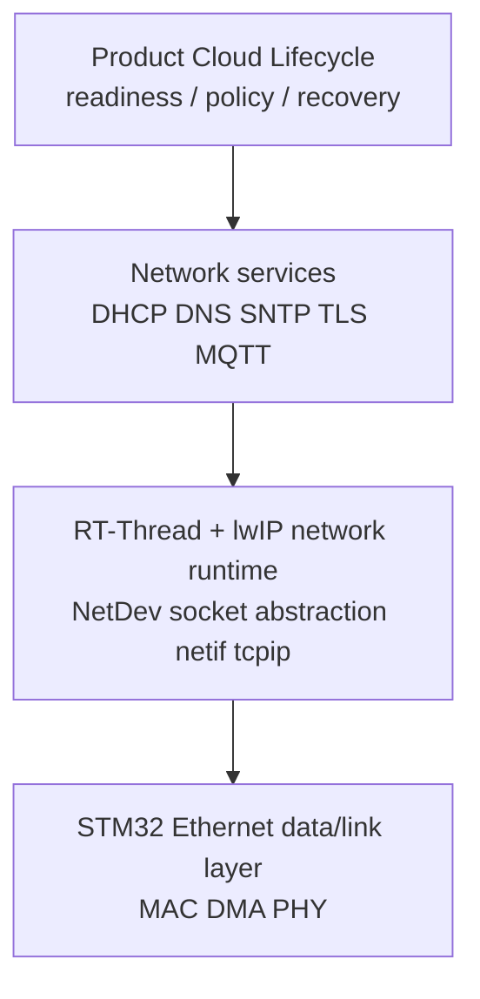
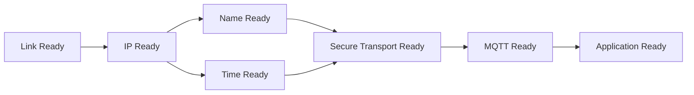
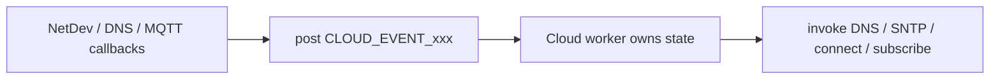
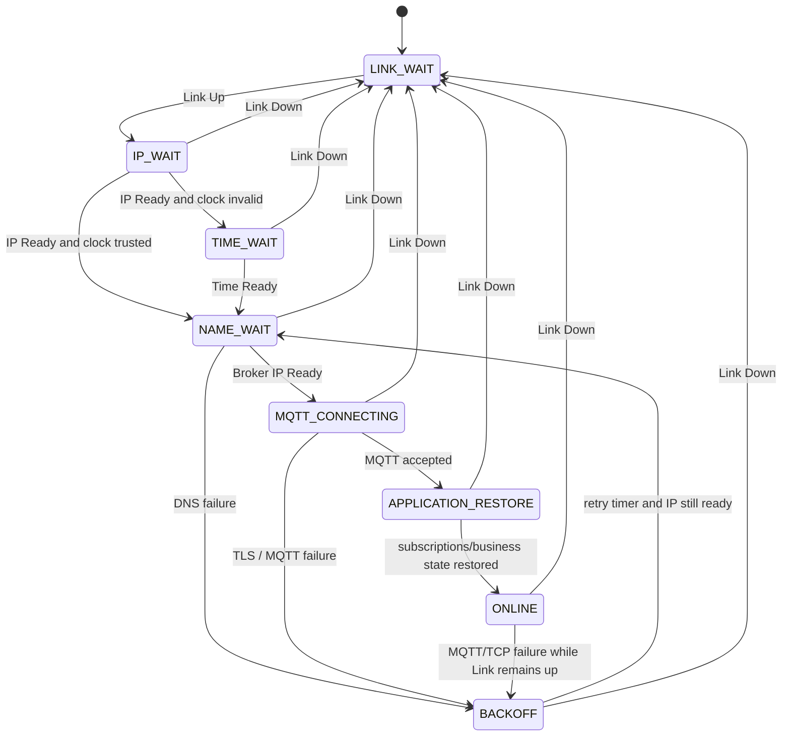
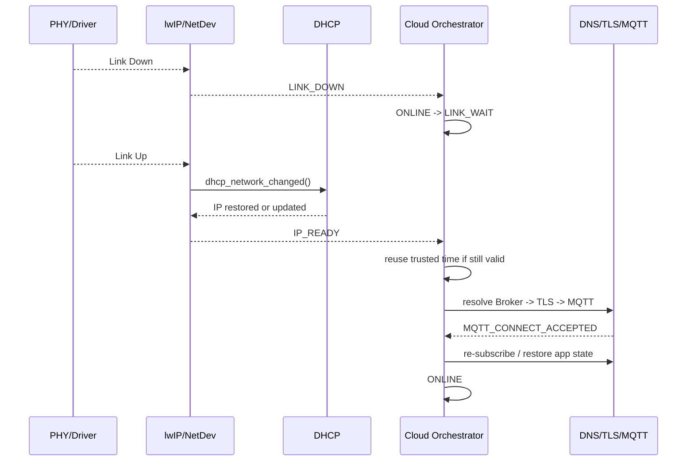
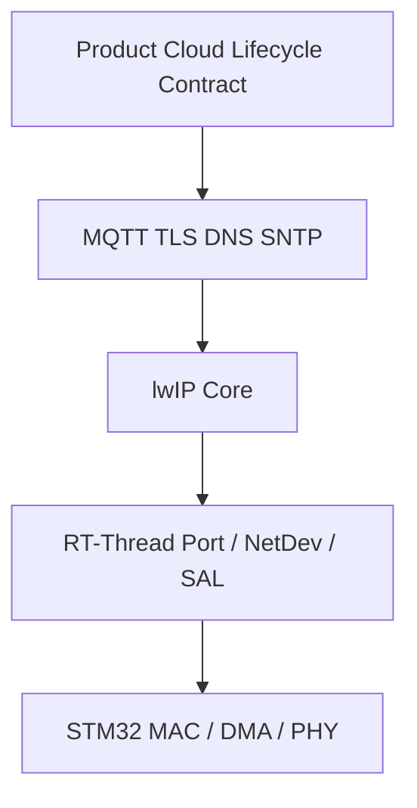

<meta name="referrer" content="no-referrer" />

# 教程 45：从 Link Up 到 MQTT Reconnect——STM32 + RT-Thread + lwIP MCU Cloud Lifecycle

> 摘要：以 readiness、事件所有权和恢复边界重构 MCU 上云生命周期，说明 Link/IP/Time/DNS/TLS/MQTT 如何组合成长期可恢复的产品状态机。

[TOC]

MCU Cloud Lifecycle 不是 lwIP 中的某个 API，也不是 MQTT 的另一个状态机。这里的 MQTT（Message Queuing Telemetry Transport，消息队列遥测传输）是设备与 Broker 之间的应用层消息协议；TLS（Transport Layer Security，传输层安全协议）负责为其建立安全传输。产品层需要把 **PHY/Link、IP 配置、名字解析、可信时间、安全传输、MQTT 会话和业务恢复** 组合成长期运行系统的编排问题。Stage 42～44 已经把 STM32 Ethernet Port、DMA 数据面与 Link/DHCP 恢复落到具体源码；Stage 45 不再重复这些底层调用链，而是回答更上层的问题：**哪些条件必须先成立、哪些模块只负责产生事件、失败后应该从哪一层恢复，以及谁拥有最终的 Cloud Online 状态。**[S1](#source-s1)[S2](#source-s2)[S4](#source-s4)

本文继续使用 Stage 42～44 的 STM32H750 Art-Pi + LAN8720A + RT-Thread 环境。RT-Thread 固定到 commit `dc8aaa73f2dbea255325ec058a083aeeb5381d0a`，lwIP 固定到 commit `d08f4773edd0182b7910fc8f046eed82ffcd67c9`。文中的 Cloud Orchestrator 是产品层架构模型，不是 RT-Thread 或 lwIP 已经提供的现成模块。

## 阅读本文前：建议提前阅读

1. [RT-Thread Network Framework](https://rt-thread.github.io/rt-thread/page_component_network.html)
   - 用途：先理解 Socket、SAL（Socket Abstraction Layer，套接字抽象层）、协议栈、NetDev 与底层网络设备的分层，避免把产品编排逻辑误放进 Driver 或协议栈。[S10](#source-s10)
2. [OASIS MQTT Version 3.1.1](https://docs.oasis-open.org/mqtt/mqtt/v3.1.1/mqtt-v3.1.1.html)
   - 用途：重点关注 CONNECT（Client 请求建立 MQTT 会话）、CONNACK（Broker 对 CONNECT 的确认）、Clean Session（断开后不保留旧会话状态）与 Keep Alive（MQTT 层活性检测）；Stage 45 只使用这些会影响恢复边界的 MQTT 语义。[S7](#source-s7)
3. [The external dependencies Mbed TLS relies on](https://mbed-tls.readthedocs.io/en/latest/kb/development/what-external-dependencies-does-mbedtls-rely-on/)
   - 用途：理解 X.509 证书有效期校验为什么可能依赖可信 wall clock（绝对日期/时间），以及嵌入式平台如何提供时间函数。[S9](#source-s9)
4. [RFC 2131 — Dynamic Host Configuration Protocol](https://www.rfc-editor.org/rfc/rfc2131.html)
   - 用途：理解 Link 恢复后 DHCP 可能验证旧地址而不是固定重新 Discover 的原因。[S8](#source-s8)

这些资料是深入入口，不是继续阅读正文的强制前置条件。

## 1. 先确定系统边界：Cloud Lifecycle 位于协议栈之上

从产品角度看，可以把整个系统分成三层责任域：



最下面两层负责“能力是否存在、协议状态机如何运行”；最上层负责“这些能力何时已经足够让产品进入 ONLINE，以及失败后下一步做什么”。换句话说，Driver 可以报告 Link，lwIP 可以维护 DHCP/MQTT 状态，但 **Cloud Online 是产品状态，不属于任一单个协议模块。**

## 2. 上云不是一个 Connected，而是一组有依赖关系的 readiness

这里的 **readiness** 指“某一层已经满足后续步骤所需前提”。一个 Ethernet MCU 即使已经 Link Up，也可能还没有 IP、没有可用 DNS、没有可信时间，更没有完成 TLS/MQTT。

| Readiness | 表示什么 | 当前系统中可观察的主要证据 | 后续主要依赖 |
| --- | --- | --- | --- |
| Link Ready | PHY/MAC 数据链路可用 | `NETIF_FLAG_LINK_UP` / NetDev Link Up | DHCP/静态 IP 才有网络基础 |
| IP Ready | 已有可用 IP/netmask/gateway | DHCP lease 或静态配置 | DNS、SNTP、TCP/TLS |
| Name Ready | Broker hostname 已解析为当前可用 IP | DNS result/callback | 后续连接目标 |
| Time Ready | wall clock 已足够可信 | SNTP、RTC 或其他可信时间源 | 需要日期校验的 X.509/TLS |
| Secure Transport Ready | TCP/TLS transport 已建立 | altcp TLS / mbedTLS connect result | MQTT CONNECT |
| MQTT Ready | Broker 接受 MQTT CONNECT | `MQTT_CONNECT_ACCEPTED` | 订阅与业务状态恢复 |
| Application Ready | 必要订阅/业务上下文已恢复 | 产品自己的状态 | 正常业务发送/接收 |

这些 readiness 之间存在依赖，但不是所有阶段都必须严格串行。例如 DNS 与 SNTP 在产品实现中可以并发；真正的约束是：**进入依赖某项能力的下一步之前，必须确认该 readiness 已成立。**



## 3. 再区分三类 owner：状态 owner、事件源和执行者

Cloud Lifecycle 最容易失控的原因，是每个 callback 都试图自己“把网络修好”。更清晰的模型是把角色拆开：

| 角色 | 负责什么 | 当前例子 |
| --- | --- | --- |
| 状态 owner | 决定产品当前处于哪个 readiness / recovery state | Cloud Orchestrator / Cloud worker |
| 事件源 | 报告某件事刚发生，不拥有整个恢复流程 | NetDev link/address callback、DNS callback、MQTT connection callback |
| 执行者 | 执行某个局部动作并维护局部协议状态 | Driver、DHCP、DNS、SNTP、TLS、MQTT |

RT-Thread NetDev callback 很适合报告 Link/IP 变化，但 callback 本身不应直接串行执行 DNS → SNTP → TLS → MQTT → subscribe。把这些动作集中到一个 Cloud worker，可以避免多个 callback 竞争全局状态或重复发起连接。[S1](#source-s1)



## 4. 从冷启动走一遍：每一层只推进自己负责的 readiness

### 4.1 Link Ready：只说明 Ethernet 数据链路已经回来

Stage 44 已经证明，当前 STM32H750 Driver 检测到 Link Up 后会重配置 MAC，并经 `eth_device_linkchange()` / `erx` 推进到 `netif_set_link_up()`；启用 DHCP 时，lwIP 随后调用 `dhcp_network_changed()`。[S1](#source-s1)[S2](#source-s2)

这一步只能把产品从“没有物理网络基础”推进到“可以等待 IP”。它不能直接把 Cloud 状态标成 Ready。

### 4.2 IP Ready：由产品判定地址是否真的可用

RT-Thread NetDev 可以把 lwIP 地址变化同步成 callback，因此 `NETDEV_CB_ADDR_IP` 可以成为 Cloud Orchestrator 的输入事件。[S1](#source-s1) 但事件到来不等于产品必须无条件进入下一状态：产品仍应定义“可用 IP”的判据，并按需要确认 gateway/DNS 配置是否满足当前网络场景。

这样做的意义是让应用只依赖稳定的 readiness contract，而不是读取 lwIP DHCP 内部 state。

### 4.3 Name Ready：MQTT API 不替产品做 hostname resolution

当前 `mqtt_client_connect()` 接收 `const ip_addr_t *ip_addr`，upstream example 也直接传入已经得到的 IP，因此保存 hostname 的产品必须先经过 lwIP DNS。[S4](#source-s4)[S5](#source-s5)

`dns_gethostbyname()` 既可能命中 cache 后同步返回 `ERR_OK`，也可能返回 `ERR_INPROGRESS` 并稍后通过 callback 给出结果。[S3](#source-s3) 所以 Name Ready 本质上是一个异步条件，而不是 `mqtt_client_connect()` 内部隐含步骤。

### 4.4 Time Ready：可信时间是条件，不是每次重连固定重做的动作

当 Mbed TLS 启用基于日期的 X.509 validity checking 时，证书校验依赖可信 wall clock。[S6](#source-s6)[S9](#source-s9) 因此冷启动且 RTC 无效时可能需要先通过 SNTP 建立可信时间；但短暂 Link flap 后，如果 RTC/系统时间仍然可信，就没有必要机械地重新跑完整 SNTP。

这说明 Time Ready 应被建模成“条件是否仍成立”，而不是“每次网络恢复都必须执行一次 SNTP”。

### 4.5 Secure Transport Ready：TLS 只解决安全 transport

`mqtt_client_connect()` 根据 `client_info->tls_config` 选择 TLS `altcp` 或普通 TCP `altcp`，随后统一进入 `altcp_connect()`。[S4](#source-s4) TLS 成功只说明安全 transport 可用；它不代表 Broker 已经接受 MQTT 会话，更不代表订阅已经恢复。

### 4.6 MQTT Ready 与 Application Ready 必须分开

TCP/TLS connect 成功后仍要等待 Broker 返回 CONNACK。upstream example 只有在 connection callback 得到 `MQTT_CONNECT_ACCEPTED` 后才继续 subscribe。[S5](#source-s5)

当前目标版本的 lwIP MQTT client 固定设置 Clean Session，因此 MQTT reconnect 成功后旧 subscription 不会自动跨连接恢复；应用仍需重新订阅，必要时还要重建更高层业务状态。[S4](#source-s4)[S5](#source-s5)[S7](#source-s7)

因此：

```text
TLS connected
    != MQTT Ready
MQTT_CONNECT_ACCEPTED
    != Application Ready
Application Ready
    = MQTT accepted + required subscriptions/business state restored
```

## 5. 不同失败属于不同 failure domain，恢复入口也必须不同

所谓 **failure domain（失败域）**，是“哪个前提失效了”。恢复策略应从最靠近失败的位置重新建立条件，而不是任何错误都重启整个网络。

| 失败位置 | 仍然成立的下层条件 | 合理恢复入口 |
| --- | --- | --- |
| PHY Link Down | 无 | 回到 `LINK_WAIT` |
| DHCP 未得到可用地址 | Link | 留在 `IP_WAIT` |
| DNS timeout/failure | Link + IP | DNS retry/backoff |
| 时间无效 / SNTP 未完成 | Link + IP | `TIME_WAIT` |
| TLS handshake/certificate failure | Link + IP + Name，且可能已有 Time | 检查时间/证书/配置，再决定是否重试 |
| MQTT CONNACK rejected | Transport 已可达 | 按认证/协议/策略错误处理 |
| MQTT/TCP disconnect，但 Link/IP 仍在 | 基础网络仍可能可用 | backoff 后重新解析/连接 |
| reconnect 后 subscription 未恢复 | MQTT 已 accepted | 只重建订阅/业务状态 |

这个表把“恢复”从单一 reconnect 行为改成分层恢复。Broker 认证失败时重做 DHCP 没有意义；PHY Link Down 时高频 DNS/MQTT retry 也没有意义。

## 6. Cloud Orchestrator 用状态机把 readiness 和 failure domain 收敛到一个 owner

下面的状态不是 lwIP/RT-Thread 自带 enum，而是基于前述契约构造的产品编排模型：



这张图刻意没有把 DHCP、DNS、TLS、MQTT 的内部状态机复制进产品状态机。Cloud Orchestrator 只消费它们提供的结果：Link/IP/Name/Time/MQTT 等 readiness 是否成立。

产品编排伪代码可以保持非常薄，重点是单一 owner，而不是某种固定代码风格：

```c
/* 产品编排伪代码，不是 RT-Thread/lwIP upstream 源码 */
cloud_worker()
{
    for (;;) {
        event = wait_event();

        switch (state) {
        case LINK_WAIT:
            if (event == LINK_UP)
                state = IP_WAIT;
            break;

        case IP_WAIT:
            if (event == LINK_DOWN)
                state = LINK_WAIT;
            else if (event == IP_READY)
                state = clock_is_trusted() ? NAME_WAIT : TIME_WAIT;
            break;

        case TIME_WAIT:
            if (event == LINK_DOWN)
                state = LINK_WAIT;
            else if (event == TIME_READY)
                state = NAME_WAIT;
            break;

        case NAME_WAIT:
            if (event == LINK_DOWN)
                state = LINK_WAIT;
            else if (event == DNS_OK)
                state = MQTT_CONNECTING;
            else if (event == DNS_FAILED)
                state = BACKOFF;
            break;

        case MQTT_CONNECTING:
            if (event == LINK_DOWN)
                state = LINK_WAIT;
            else if (event == MQTT_ACCEPTED)
                state = APPLICATION_RESTORE;
            else if (event == CONNECT_FAILED)
                state = BACKOFF;
            break;

        case APPLICATION_RESTORE:
            if (event == LINK_DOWN)
                state = LINK_WAIT;
            else if (event == APPLICATION_READY)
                state = ONLINE;
            break;

        case ONLINE:
            if (event == LINK_DOWN)
                state = LINK_WAIT;
            else if (event == MQTT_DISCONNECTED)
                state = BACKOFF;
            break;

        case BACKOFF:
            if (event == LINK_DOWN)
                state = LINK_WAIT;
            else if (event == RETRY_TIMEOUT)
                state = NAME_WAIT;
            break;
        }
    }
}
```

## 7. Backoff、Keep Alive 与 Link event 分别解决不同问题

**Backoff** 是产品在连续失败后控制下一次重试时间的策略。当前 lwIP MQTT client 有 connect timeout、pending request timeout、Keep Alive watchdog，但源码没有提供“连接失败后等待 N 秒再自动调用 `mqtt_client_connect()`”的完整 reconnect state machine，因此 backoff 属于产品层。[S4](#source-s4)

**MQTT Keep Alive** 用 PINGREQ/PINGRESP 等机制检测远端会话活性；它不等价于本地 PHY Link detector。[S4](#source-s4)[S7](#source-s7) 拔网线时 NetDev Link Down 是更直接的事件；远端 Broker、路由或互联网故障则可能只有 TCP/MQTT timeout 才暴露。

因此产品应同时消费底层 Link event 与上层 transport/session failure，而不是让其中一种机制替代另一种。

## 8. 消息可靠性属于业务数据持久性，不属于网络重连本身

Cloud Lifecycle 解决的是“连接和业务状态怎样恢复”，并不自动保证离线期间业务数据不丢。当前 lwIP `mqtt_close()` 会清除 pending request queue，Clean Session 又意味着 session 不跨连接保留。[S4](#source-s4)[S7](#source-s7)

如果产品要求离线告警、遥测或命令状态必须可靠保存，还需要独立的 application queue、Flash journal、业务 message id 或去重机制。必须明确区分：

```text
network/session recovery
    != business data durability
```

前者由 Link/IP/TLS/MQTT 生命周期解决，后者由产品存储与业务协议解决。

## 9. 网线拔插时，正确恢复路径是一条跨层事件链

把 Stage 44 与 Stage 45 合并成一次运行时场景：



这条链里每一层只拥有自己的一段：Stage 44 负责从 PHY Link 传播到 DHCP；Stage 45 负责从恢复后的 IP/readiness 再走回 Application Ready。

## 10. 哪些行为自动发生，哪些必须由产品明确负责

| 行为 | 当前主要责任方 | 自动程度 |
| --- | --- | --- |
| PHY Link 检测 | STM32/RT-Thread Ethernet Driver | 当前配置下自动轮询并产生 Link event |
| MAC speed/duplex 重配置 | STM32 Ethernet Driver | 自动 |
| lwIP Link flag 更新 | RT-Thread Ethernet Port + lwIP | 自动桥接 |
| Link Up 后推动 DHCP 恢复 | lwIP DHCP | DHCP 已启用时自动 |
| 判断产品何时 IP Ready | 产品/NetDev callback orchestration | 产品定义 |
| Broker hostname DNS lookup | 产品调用 lwIP DNS | 产品发起，DNS 模块异步执行 |
| SNTP request/retry/update | lwIP SNTP | 初始化后模块运行 |
| 判断系统时间是否足够可信 | 产品 | 产品定义 |
| TLS handshake | altcp TLS + Mbed TLS | connect 后协议栈推进 |
| MQTT CONNECT/Keep Alive/request timeout | lwIP MQTT | connect 后协议栈推进 |
| reconnect timing/backoff | 产品 | 产品定义 |
| reconnect 后重新 subscribe | 产品 | 产品负责 |
| 离线消息持久化/去重 | 产品 | 产品负责 |

这张表就是本系列最后的责任边界：**协议栈负责局部协议正确性，产品层负责跨协议的 readiness、policy 与 recovery。**

## 11. 从迁移角度看，三个 contract 可以独立变化

Stage 00～45 最终不是 46 个孤立专题，而是三个可迁移的 contract：

1. **Hardware / Driver Contract**：STM32 MAC、DMA、PHY 与具体 Port；更换 MCU/PHY 时主要变化在这里。
2. **RTOS / Network Port Contract**：`sys_arch`、`eth_device`、NetDev、SAL 与 lwIP 运行时；更换 RTOS 或网络框架时主要变化在这里。
3. **Product Cloud Lifecycle Contract**：Link/IP/Time/Name/TLS/MQTT readiness、backoff、resubscribe 与业务恢复；更换云平台或业务协议时主要变化在这里。



这个分层使迁移工作可以限定在真正改变的边界，而不需要每次更换一个组件就重新理解整个网络栈。

## 资料来源

<a id="source-s1"></a>
### [S1] RT-Thread Ethernet Port、NetDev 与 STM32 Ethernet Driver
- 类型：目标版本源码
- 版本：RT-Thread commit `dc8aaa73f2dbea255325ec058a083aeeb5381d0a`
- 定位：`bsp/stm32/libraries/HAL_Drivers/drivers/drv_eth.c`；`components/net/lwip/port/ethernetif.c`；`components/net/netdev/include/netdev.h`；`components/net/netdev/src/netdev.c`
- URL：[RT-Thread source tree](https://github.com/RT-Thread/rt-thread/tree/dc8aaa73f2dbea255325ec058a083aeeb5381d0a)
- 使用位置：Link/IP readiness、NetDev callback、PHY 到 lwIP 状态传播
- 支撑内容：Link event、NetDev status/address callback、lwIP 地址与 Link 状态向 NetDev 同步的具体实现

<a id="source-s2"></a>
### [S2] RT-Thread vendored lwIP DHCP 与 netif
- 类型：目标版本源码
- 版本：随 RT-Thread commit `dc8aaa73f2dbea255325ec058a083aeeb5381d0a` 的 lwIP 2.1.2
- 定位：`components/net/lwip/lwip-2.1.2/src/core/netif.c`：`netif_set_link_up()` / `netif_set_link_down()`；`src/core/ipv4/dhcp.c`：`dhcp_start()` / `dhcp_network_changed()`
- URL：[RT-Thread lwIP 2.1.2](https://github.com/RT-Thread/rt-thread/tree/dc8aaa73f2dbea255325ec058a083aeeb5381d0a/components/net/lwip/lwip-2.1.2)
- 使用位置：“第一层自动恢复”“IP Ready”“状态机”
- 支撑内容：Link Up 触发 DHCP 网络变化处理，以及 DHCP 在 Link Down/Up 前后的恢复行为

<a id="source-s3"></a>
### [S3] lwIP DNS client
- 类型：upstream 源码
- 版本：lwIP commit `d08f4773edd0182b7910fc8f046eed82ffcd67c9`
- 定位：`src/core/dns.c`：`dns_gethostbyname()` / `dns_gethostbyname_addrtype()`
- URL：[lwIP dns.c](https://github.com/lwip-tcpip/lwip/blob/d08f4773edd0182b7910fc8f046eed82ffcd67c9/src/core/dns.c)
- 使用位置：“MQTT API 不负责 DNS”
- 支撑内容：DNS cache immediate result 与 `ERR_INPROGRESS` + callback 的异步契约

<a id="source-s4"></a>
### [S4] lwIP MQTT 与 altcp TLS 实现
- 类型：upstream 源码
- 版本：lwIP commit `d08f4773edd0182b7910fc8f046eed82ffcd67c9`
- 定位：`src/apps/mqtt/mqtt.c`：`mqtt_client_connect()`、`mqtt_tcp_connect_cb()`、`mqtt_cyclic_timer()`、`mqtt_tcp_err_cb()`、`mqtt_close()`；`src/include/lwip/altcp_tls.h`；`src/apps/altcp_tls/altcp_tls_mbedtls.c`
- URL：[lwIP mqtt.c](https://github.com/lwip-tcpip/lwip/blob/d08f4773edd0182b7910fc8f046eed82ffcd67c9/src/apps/mqtt/mqtt.c)、[lwIP altcp TLS](https://github.com/lwip-tcpip/lwip/tree/d08f4773edd0182b7910fc8f046eed82ffcd67c9/src/apps/altcp_tls)
- 使用位置：TLS transport、MQTT accepted、Clean Session、Keep Alive、disconnect/reconnect 边界
- 支撑内容：TLS/Plain TCP 分支、强制 Clean Session、cyclic timer、断线 callback，以及没有自动 reconnect state machine 的实现边界

<a id="source-s5"></a>
### [S5] lwIP upstream MQTT example
- 类型：upstream 示例源码
- 版本：lwIP commit `d08f4773edd0182b7910fc8f046eed82ffcd67c9`
- 定位：`contrib/examples/mqtt/mqtt_example.c`：`mqtt_example_init()`、`mqtt_connection_cb()`
- URL：[lwIP MQTT example](https://github.com/lwip-tcpip/lwip/blob/d08f4773edd0182b7910fc8f046eed82ffcd67c9/contrib/examples/mqtt/mqtt_example.c)
- 使用位置：“MQTT API 不负责 DNS”“MQTT Ready”“重新订阅”
- 支撑内容：example 直接传入 IP，并在每次 `MQTT_CONNECT_ACCEPTED` 后重新 subscribe

<a id="source-s6"></a>
### [S6] lwIP SNTP client
- 类型：upstream 源码
- 版本：lwIP commit `d08f4773edd0182b7910fc8f046eed82ffcd67c9`
- 定位：`src/apps/sntp/sntp.c`：`sntp_init()`、`sntp_process()`；`contrib/examples/sntp/sntp_example.c`
- URL：[lwIP SNTP implementation](https://github.com/lwip-tcpip/lwip/blob/d08f4773edd0182b7910fc8f046eed82ffcd67c9/src/apps/sntp/sntp.c)
- 使用位置：“Time Ready”
- 支撑内容：SNTP UDP client 初始化、timer/request 与系统时间更新 Port

<a id="source-s7"></a>
### [S7] OASIS MQTT Version 3.1.1
- 类型：协议规范
- 版本：MQTT 3.1.1
- URL：[OASIS MQTT Version 3.1.1](https://docs.oasis-open.org/mqtt/mqtt/v3.1.1/mqtt-v3.1.1.html)
- 使用位置：“Clean Session”“Keep Alive”
- 支撑内容：Clean Session=1 的 session 生命周期与 Keep Alive / PINGREQ 行为

<a id="source-s8"></a>
### [S8] RFC 2131 — Dynamic Host Configuration Protocol
- 类型：标准规范
- 版本：RFC 2131
- URL：[RFC 2131](https://www.rfc-editor.org/rfc/rfc2131.html)
- 使用位置：Link 恢复后的 DHCP 地址验证
- 支撑内容：客户端重新接入网络时的 INIT-REBOOT / 地址重新确认语义

<a id="source-s9"></a>
### [S9] Mbed TLS — External dependencies / time functions
- 类型：官方实现文档
- 版本：Mbed TLS documentation，访问日期 2026-10-02
- URL：[The external dependencies Mbed TLS relies on](https://mbed-tls.readthedocs.io/en/latest/kb/development/what-external-dependencies-does-mbedtls-rely-on/)
- 使用位置：“Time Ready 是 TLS 的前置条件之一”
- 支撑内容：`MBEDTLS_HAVE_TIME_DATE` 打开时 X.509 使用绝对时间检查证书有效期，以及嵌入式平台可替换时间函数

<a id="source-s10"></a>
### [S10] RT-Thread 官方 Network Framework
- 类型：RT-Thread 官方框架文档
- 版本：在线文档，访问日期 2026-10-03
- URL/文档：[RT-Thread Network Framework](https://rt-thread.github.io/rt-thread/page_component_network.html)
- 使用位置：开篇系统分层、系列最终 RTOS/Network Port boundary
- 支撑内容：给出 Socket/SAL/协议栈/网络设备的 RT-Thread 网络框架分层，用于把目标源码事实放回产品生命周期的系统位置
